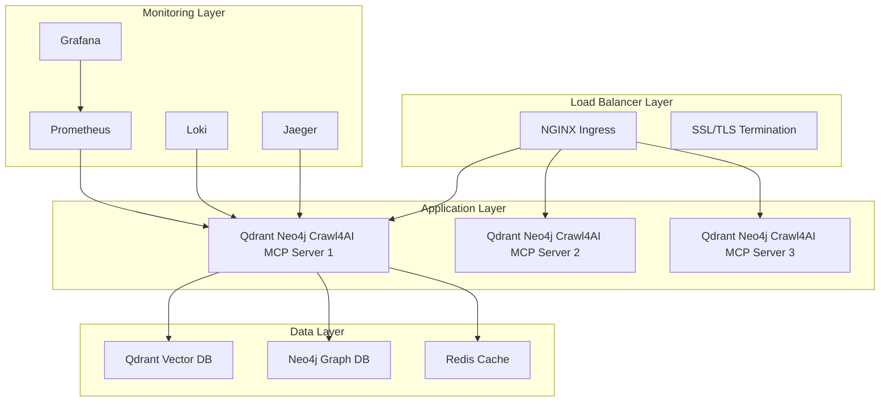
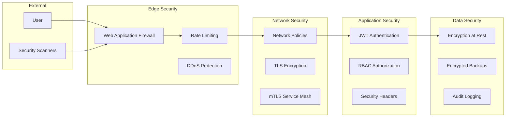

# Qdrant Neo4j Crawl4AI MCP Server - Deployment Guide

## 🚀 Production-Ready Deployment Infrastructure

This deployment infrastructure provides enterprise-grade DevOps patterns for the Qdrant Neo4j Crawl4AI MCP Server, demonstrating modern container orchestration, CI/CD pipelines, monitoring, and security best practices.

## 📋 Overview

### Architecture Components

- **Container Orchestration**: Docker Compose for development, Kubernetes for production
- **CI/CD Pipeline**: GitHub Actions with security scanning and quality gates
- **Monitoring Stack**: Prometheus, Grafana, Loki, Promtail, Jaeger
- **Security**: Multi-layer security scanning, secret management, network policies
- **Scalability**: Horizontal Pod Autoscaling, load balancing, clustering
- **Observability**: Comprehensive logging, metrics, and distributed tracing

### Three-Tier Deployment Strategy

| Tier | Environment | Cost Estimate | Features |
|------|-------------|--------------|----------|
| **Development** | Local/Docker | $0-5/month | Full monitoring stack, debug features |
| **Professional** | Railway/Fly.io | $15-30/month | Auto-scaling, basic monitoring |
| **Production** | Kubernetes | $50-100/month | Full enterprise features, HA, backup |

## 🏗️ Infrastructure Components

### Core Services



### Security Architecture



## 🛠️ Quick Start

### Prerequisites

- Docker & Docker Compose
- Kubernetes cluster (for production)
- kubectl configured
- Helm 3.x (optional)
- GitHub account (for CI/CD)

### Development Deployment

```bash
# Clone repository
git clone <repository-url>
cd qdrant-neo4j-crawl4ai-mcp

# Start development environment
docker-compose up -d

# Verify services
curl http://localhost:8000/health
```

### Production Deployment

```bash
# Deploy to Kubernetes
./scripts/deploy.sh --environment production --tag v1.0.0

# Or deploy to cloud platforms
# Railway
railway up

# Fly.io
fly deploy
```

## 📁 File Structure

```text
.
├── docker-compose.yml              # Development environment
├── docker-compose.prod.yml         # Production environment
├── Dockerfile                      # Multi-stage container build
├── .github/workflows/
│   ├── ci-cd.yml                   # Complete CI/CD pipeline
│   └── security.yml                # Security scanning workflow
├── deployment/
│   ├── railway.json                # Railway.app configuration
│   └── fly.toml                    # Fly.io configuration
├── k8s/manifests/
│   ├── namespace.yaml              # Kubernetes namespace & policies
│   ├── qdrant-neo4j-crawl4ai-mcp.yaml   # Main application deployment
│   ├── qdrant.yaml                 # Vector database
│   ├── secrets.yaml                # Secret management
│   ├── configmap.yaml              # Configuration management
│   └── ingress.yaml                # Load balancer & SSL
├── monitoring/
│   ├── prometheus/
│   │   ├── prometheus.yml          # Metrics collection (dev)
│   │   └── prometheus.prod.yml     # Metrics collection (prod)
│   ├── grafana/
│   │   ├── grafana.ini             # Dashboard configuration
│   │   ├── datasources.yml         # Data source setup
│   │   └── dashboards/             # Pre-built dashboards
│   ├── loki/
│   │   ├── loki.yml                # Log aggregation (dev)
│   │   └── loki.prod.yml           # Log aggregation (prod)
│   └── promtail/
│       ├── promtail.yml            # Log shipping (dev)
│       └── promtail.prod.yml       # Log shipping (prod)
└── scripts/
    └── deploy.sh                   # Production deployment script
```

## 🐳 Container Strategy

### Multi-Stage Docker Build

The Dockerfile implements security best practices:

- **Base Image**: Python 3.11 slim for minimal attack surface
- **Non-root User**: Application runs as user ID 1000
- **Security Scanning**: Integrated with Trivy, Snyk, and Docker Scout
- **Health Checks**: Built-in health monitoring
- **Optimized Layers**: Efficient caching and minimal image size

### Image Management

```bash
# Build and tag
docker build -t qdrant-neo4j-crawl4ai-mcp:v1.0.0 .

# Security scan
trivy image qdrant-neo4j-crawl4ai-mcp:v1.0.0

# Push to registry
docker push ghcr.io/username/qdrant-neo4j-crawl4ai-mcp:v1.0.0
```

## ⚙️ CI/CD Pipeline

### GitHub Actions Workflow

The CI/CD pipeline provides comprehensive automation:

1. **Code Quality**: Linting, formatting, type checking
2. **Testing**: Unit tests, integration tests, security tests
3. **Security**: SAST, DAST, dependency scanning, secrets detection
4. **Build**: Multi-architecture container builds
5. **Deploy**: Automated deployment with rollback capability

### Security Scanning

- **SAST**: Bandit, Semgrep, CodeQL
- **Container**: Trivy, Docker Scout, Snyk
- **Dependencies**: Safety, OWASP Dependency Check
- **Secrets**: TruffleHog, GitLeaks
- **Infrastructure**: Checkov, Kubernetes security policies

### Quality Gates

```yaml
Quality Gates:
  - Code Coverage: >80%
  - Security Scan: No critical/high severity issues
  - Performance Tests: <2s response time
  - Dependency Scan: No known vulnerabilities
  - License Compliance: Approved licenses only
```

## 📊 Monitoring & Observability

### Metrics (Prometheus)

- **Application Metrics**: Request rates, response times, error rates
- **Business Metrics**: Vector operations, graph queries, cache hits
- **Infrastructure Metrics**: CPU, memory, disk, network usage
- **Database Metrics**: Qdrant performance, Neo4j stats, Redis metrics

### Logging (Loki + Promtail)

- **Structured Logging**: JSON format with correlation IDs
- **Log Aggregation**: Centralized log collection and storage
- **Log Analysis**: Pattern detection and alerting
- **Retention**: Configurable retention policies

### Tracing (Jaeger)

- **Distributed Tracing**: End-to-end request tracking
- **Performance Analysis**: Bottleneck identification
- **Error Tracking**: Exception propagation analysis
- **Service Dependencies**: Interaction mapping

### Dashboards (Grafana)

Pre-built dashboards for:

- Application Overview
- Database Performance
- Infrastructure Health
- Security Events
- Business KPIs

## 🔒 Security Implementation

### Authentication & Authorization

- **JWT Tokens**: Secure stateless authentication
- **RBAC**: Role-based access control
- **API Keys**: Service-to-service authentication
- **Rate Limiting**: Request throttling and DDoS protection

### Network Security

- **TLS Encryption**: All traffic encrypted in transit
- **Network Policies**: Kubernetes network segmentation
- **Firewall Rules**: Ingress/egress traffic control
- **WAF Integration**: Web application firewall

### Data Protection

- **Encryption at Rest**: Database and backup encryption
- **Secret Management**: Kubernetes secrets + external providers
- **Audit Logging**: Complete access trail
- **Data Masking**: Sensitive data protection

## 📈 Scaling & Performance

### Horizontal Scaling

- **Auto-scaling**: CPU/memory-based scaling
- **Load Balancing**: Traffic distribution
- **Database Clustering**: High availability setup
- **Cache Optimization**: Redis cluster configuration

### Performance Optimization

- **Connection Pooling**: Database connection management
- **Caching Strategies**: Multi-level caching
- **Async Processing**: Background task queues
- **Resource Limits**: Kubernetes resource management

## 🎯 Platform Deployments

### Railway.app

```bash
# Deploy to Railway
railway login
railway link
railway up
```

Features:

- Automatic HTTPS
- Built-in monitoring
- Auto-scaling
- Database add-ons

### Fly.io

```bash
# Deploy to Fly.io
fly auth login
fly launch
fly deploy
```

Features:

- Global edge deployment
- Auto-scaling
- Built-in load balancing
- Persistent volumes

### Kubernetes

```bash
# Deploy to Kubernetes
./scripts/deploy.sh --environment production
```

Features:

- Full enterprise features
- Custom scaling policies
- Advanced networking
- Comprehensive monitoring

## 🔧 Configuration Management

### Environment Variables

Core configuration through environment variables:

```env
# Application
ENVIRONMENT=production
LOG_LEVEL=INFO
WORKERS=4

# Databases
QDRANT_URL=http://qdrant:6333
NEO4J_URI=bolt://neo4j:7687
REDIS_URL=redis://redis:6379

# Security
JWT_SECRET_KEY=<secret>
ENABLE_CORS=true

# Monitoring
ENABLE_PROMETHEUS=true
JAEGER_AGENT_HOST=jaeger
```

### ConfigMaps & Secrets

Kubernetes-native configuration management:

- **ConfigMaps**: Non-sensitive configuration
- **Secrets**: Sensitive data (passwords, API keys)
- **External Secrets**: Integration with vault systems

## 🚨 Alerting & Incidents

### Alert Rules

Pre-configured alerts for:

- High error rates (>5%)
- Slow response times (>2s)
- Resource exhaustion (>80% usage)
- Database connectivity issues
- Security events

### Notification Channels

- **Slack**: Real-time team notifications
- **Email**: Detailed incident reports
- **PagerDuty**: On-call escalation
- **Webhook**: Custom integrations

### Incident Response

1. **Detection**: Automated monitoring alerts
2. **Notification**: Multi-channel alerting
3. **Investigation**: Centralized logging and metrics
4. **Resolution**: Automated rollback capabilities
5. **Post-mortem**: Incident analysis and improvements

## 📝 Maintenance & Operations

### Backup Strategy

- **Automated Backups**: Daily database snapshots
- **Cross-Region Storage**: Geographic redundancy
- **Encryption**: All backups encrypted
- **Retention**: Configurable retention policies

### Update Procedures

1. **Rolling Updates**: Zero-downtime deployments
2. **Blue-Green**: Full environment swapping
3. **Canary**: Gradual traffic shifting
4. **Rollback**: Automatic failure recovery

### Health Monitoring

- **Health Checks**: Application readiness probes
- **Service Monitoring**: Dependency health tracking
- **Performance Tracking**: SLA compliance monitoring
- **Capacity Planning**: Resource usage trending

## 🤝 Contributing

### Development Workflow

1. **Local Development**: Docker Compose environment
2. **Testing**: Comprehensive test suite
3. **Code Review**: Automated quality checks
4. **Security Review**: Integrated security scanning
5. **Deployment**: Automated CI/CD pipeline

### Infrastructure Changes

1. **Infrastructure as Code**: All changes versioned
2. **Testing**: Validation in staging environment
3. **Documentation**: Updated deployment guides
4. **Monitoring**: Metrics and alerting validation

## 📚 Additional Resources

### Documentation

- [API Documentation](docs/api.md)
- [Architecture Guide](docs/architecture.md)
- [Security Guide](docs/security.md)
- [Monitoring Guide](docs/monitoring.md)

### External Links

- [Kubernetes Documentation](https://kubernetes.io/docs/)
- [Prometheus Documentation](https://prometheus.io/docs/)
- [Grafana Documentation](https://grafana.com/docs/)
- [Docker Best Practices](https://docs.docker.com/develop/dev-best-practices/)

### Support

- **GitHub Issues**: Bug reports and features
- **Discussion**: Community Q&A
- **Security**: <security@company.com>
- **Operations**: <ops@company.com>

---

**Note**: This deployment infrastructure demonstrates enterprise-grade DevOps practices suitable for production environments. All security configurations should be reviewed and customized for your specific requirements before production deployment.
