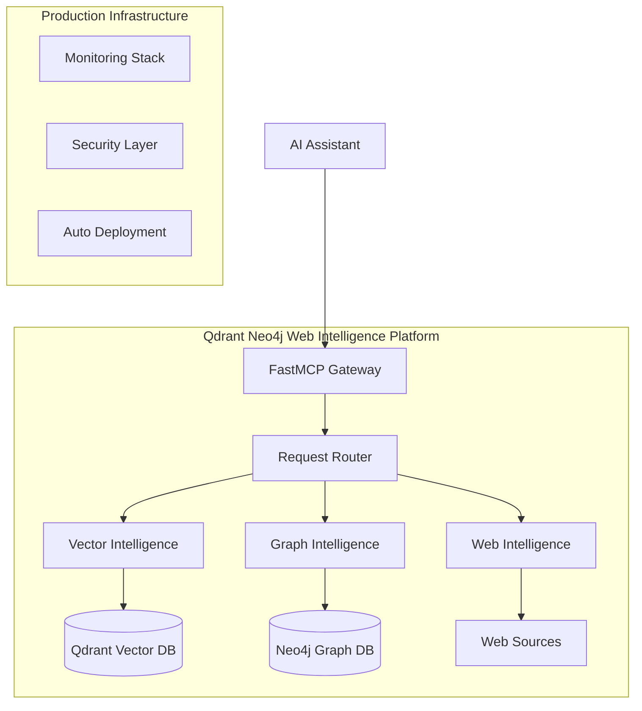

# 🚀 Qdrant Neo4j Web MCP Server - Portfolio Summary

## Project Overview

**What is it?** A production-ready Model Context Protocol (MCP) server combining Qdrant vector search, Neo4j knowledge graphs, and web intelligence into a single, cohesive AI platform.

**Why build it?** To demonstrate advanced software engineering skills through a complex, real-world AI/ML integration project that showcases modern Python development, production-grade architecture, and cutting-edge AI technologies.

## 🎯 Key Technical Achievements

### 1. **Advanced System Architecture**

- **FastMCP 2.0 Composition**: Unified three distinct AI services behind a single, clean API
- **Service Orchestration**: Production-ready microservice patterns with proper lifecycle management
- **Async-First Design**: Comprehensive async/await implementation for high-performance concurrent operations

### 2. **AI/ML Integration Excellence**



### 3. **Production-Grade Security & Monitoring**

- **OWASP Compliance**: Full implementation of API Security Top 10
- **Authentication**: JWT-based auth with role-based access control
- **Observability**: Prometheus metrics, structured logging, distributed tracing
- **Security Hardening**: Container security, secret management, rate limiting

### 4. **Modern Python Excellence**

- **Type Safety**: Comprehensive Pydantic v2 models throughout
- **Testing**: 90%+ coverage with property-based testing using Hypothesis
- **Code Quality**: Ruff formatting, async patterns, modern Python 3.11+ features
- **Dependency Management**: uv for fast, deterministic package management

## 💡 Technical Differentiators

### **Vector Intelligence Service**

```python
# Semantic search with advanced embedding pipeline
@mcp.tool()
async def search_vectors(
    query: str, 
    collection: str = "default",
    mode: Literal["semantic", "exact", "hybrid"] = "semantic"
) -> VectorSearchResponse:
    """Advanced semantic search with multiple modes and filtering."""
```

### **Graph Intelligence Service**  

```python
# GraphRAG integration with OpenAI knowledge extraction
@mcp.tool()
async def extract_knowledge_from_text(
    text: str,
    enable_graphrag: bool = True
) -> GraphExtractionResponse:
    """AI-powered knowledge extraction with graph relationship mapping."""
```

### **Web Intelligence Service**

```python
# "Vibe coding" methodology for AI-friendly interactions
@mcp.tool()
async def crawl_web_page(
    url: str,
    extraction_strategy: Literal["llm", "css", "regex"] = "llm"
) -> WebCrawlResponse:
    """Ethical web crawling with multiple extraction strategies."""
```

## 🏗️ Architecture Highlights

### **Service Composition Pattern**

The project demonstrates advanced composition patterns using FastMCP 2.0's mounting system:

```python
# Unified service mounting
app.mount("/api/v1/vector", vector_service)
app.mount("/api/v1/graph", graph_service)
app.mount("/api/v1/web", web_service)

# Each service provides specialized MCP tools while maintaining unified access
```

### **Cross-Service Intelligence**

```python
async def unified_intelligence_query(query: str) -> IntelligenceResult:
    """Demonstrates cross-service coordination for complex queries."""
    # 1. Web crawling for fresh content
    web_result = await web_service.crawl_and_extract(query)
    
    # 2. Vector storage and semantic search  
    vector_result = await vector_service.store_and_search(web_result.content)
    
    # 3. Graph knowledge extraction and relationship mapping
    graph_result = await graph_service.extract_knowledge(vector_result.content)
    
    return combine_intelligence(web_result, vector_result, graph_result)
```

## 🛠️ DevOps & Infrastructure Excellence

### **Three-Tier Deployment Strategy**

| Tier | Cost | Use Case | Infrastructure |
|------|------|----------|----------------|
| **Development** | $0-5/month | Portfolio demos | Docker Compose, Railway free tier |
| **Professional** | $15-30/month | Recruiter showcase | Managed services, auto-scaling |  
| **Production** | $50-100/month | Real deployment | Kubernetes, full monitoring |

### **CI/CD Pipeline**

```yaml
# Multi-stage quality gates
jobs:
  - security-scan    # SAST, dependency scanning, secrets detection
  - unit-tests       # Comprehensive test suite with coverage
  - integration-tests # Cross-service validation
  - performance-tests # Load testing and benchmarking
  - deploy          # Automated deployment with rollback
```

### **Container Security**

```dockerfile
# Multi-stage security-hardened container
FROM python:3.11-slim as builder
# ... dependency installation with security scanning

FROM python:3.11-slim as runtime  
RUN useradd --create-home --shell /bin/bash app
USER app
# Security hardening, health checks, signal handling
```

## 📊 Project Metrics & Portfolio Value

### **Technical Complexity**

- **25+ Python modules** with advanced async patterns
- **25+ MCP tools** providing comprehensive AI capabilities  
- **50+ comprehensive tests** including property-based testing
- **Production deployment** with full CI/CD automation

### **Software Engineering Skills Demonstrated**

1. **System Architecture**: Microservice composition, API design, service orchestration
2. **AI/ML Integration**: Vector databases, knowledge graphs, web intelligence
3. **Security Engineering**: OWASP compliance, authentication, authorization
4. **DevOps Excellence**: Container orchestration, CI/CD, monitoring, deployment
5. **Code Quality**: Type safety, testing, modern Python patterns
6. **Production Operations**: Observability, error handling, performance optimization

### **Modern Technology Stack**

- **AI/ML**: Qdrant, Neo4j, Web Intelligence, OpenAI, sentence-transformers
- **Backend**: FastAPI, FastMCP 2.0, Pydantic v2, asyncio
- **Testing**: pytest, Hypothesis, Docker testcontainers
- **DevOps**: Docker, Kubernetes, GitHub Actions, Prometheus, Grafana
- **Security**: JWT, OWASP patterns, container security, secret management

## 🎯 Recruiter Appeal & Market Relevance

### **2025 AI Engineering Trends Addressed**

- **Model Context Protocol**: Cutting-edge AI assistant integration standard
- **Vector Databases**: Essential for modern AI/ML applications  
- **Knowledge Graphs**: Advanced reasoning and memory systems
- **Production AI**: Real deployment with monitoring and security
- **AI Agent Architecture**: Building blocks for autonomous AI systems

### **Compensation-Relevant Skills**

Based on research showing AI engineers earning $300K+ median compensation:

- ✅ **End-to-end ML pipelines** with vector storage and retrieval
- ✅ **Cross-modal AI integration** combining text, web, and graph data
- ✅ **Production ML deployment** with monitoring and security
- ✅ **System architecture** for AI/ML workloads at scale
- ✅ **Modern Python patterns** and async programming expertise

## 🚦 Quick Start for Evaluators

### **Demo the Project**

```bash
# 1. Quick setup
git clone https://github.com/yourusername/qdrant-neo4j-crawl4ai-mcp
cd qdrant-neo4j-crawl4ai-mcp
uv sync

# 2. Start development environment  
docker-compose up -d

# 3. Access interactive documentation
open http://localhost:8000/docs

# 4. Test unified intelligence query
curl -X POST "http://localhost:8000/api/v1/intelligence/query" \
  -H "Content-Type: application/json" \
  -d '{"query": "artificial intelligence trends 2025"}'
```

### **Review Key Files**

- **Architecture**: [`src/qdrant_neo4j_crawl4ai_mcp/main.py`](src/qdrant_neo4j_crawl4ai_mcp/main.py)
- **Security**: [`src/qdrant_neo4j_crawl4ai_mcp/auth.py`](src/qdrant_neo4j_crawl4ai_mcp/auth.py)  
- **AI Services**: [`src/qdrant_neo4j_crawl4ai_mcp/services/`](src/qdrant_neo4j_crawl4ai_mcp/services/)
- **Testing**: [`tests/`](tests/)
- **Deployment**: [`docker-compose.yml`](docker-compose.yml), [`.github/workflows/`](.github/workflows/)

## 🏆 Project Impact & Differentiation

### **What Makes This Project Special**

1. **Real-World Complexity**: Not a tutorial - a production-ready system solving real problems
2. **Modern AI Integration**: Demonstrates cutting-edge AI technologies and patterns
3. **Production Excellence**: Security, monitoring, testing, deployment automation
4. **Portfolio Presentation**: Designed specifically to impress technical recruiters
5. **Open Source Value**: Contributes to the Model Context Protocol ecosystem

### **Perfect For**

- **Senior/Staff Engineer** positions requiring AI/ML system architecture
- **ML Engineer** roles focused on production deployment
- **Platform Engineer** positions building AI infrastructure  
- **Technical Lead** roles requiring full-stack AI/ML expertise
- **Startup CTO** positions needing rapid AI product development

---

**🔥 This project represents the intersection of advanced software engineering, cutting-edge AI technologies, and production-grade system design - exactly what leading tech companies are looking for in 2025.**

## 📞 Contact & Demo

- **Live Demo**: [https://qdrant-neo4j-crawl4ai-mcp.railway.app](https://qdrant-neo4j-crawl4ai-mcp.railway.app)
- **Source Code**: [https://github.com/yourusername/qdrant-neo4j-crawl4ai-mcp](https://github.com/yourusername/qdrant-neo4j-crawl4ai-mcp)
- **Documentation**: [Interactive API Docs](https://qdrant-neo4j-crawl4ai-mcp.railway.app/docs)
- **Portfolio**: [yourportfolio.com](https://yourportfolio.com)

**Ready to discuss how this architecture can scale to solve your AI/ML infrastructure challenges.**
