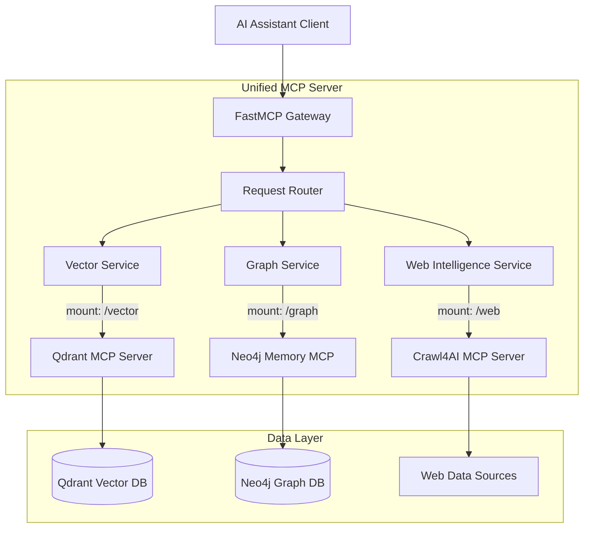

# Unified MCP Intelligence Server

A production-ready Model Context Protocol (MCP) server that abstracts Qdrant vector search, Neo4j knowledge graphs, and Crawl4AI web intelligence into a cohesive platform for AI assistant interactions.

## ✨ Features

- **Vector Intelligence**: Semantic search and embedding storage via Qdrant
- **Graph Intelligence**: Knowledge graphs and memory systems via Neo4j  
- **Web Intelligence**: Smart web crawling and content extraction via Crawl4AI
- **Unified API**: Single FastMCP 2.0 server with clean service abstractions
- **Production-Ready**: Enterprise security, monitoring, and deployment patterns
- **One-Day Development**: Optimized for rapid deployment and maintainability

## 🏗️ Architecture



## ⚡ Technology Stack

- **FastMCP 2.0**: Server composition and MCP protocol handling
- **Python 3.11+**: Modern async patterns and type safety
- **Qdrant**: Vector database for semantic search
- **Neo4j**: Graph database for knowledge representation
- **Crawl4AI**: Web intelligence and content extraction
- **Docker**: Containerized deployment with health checks

## 🚀 Quick Start

### Prerequisites

- Python 3.11+
- uv (recommended) or pip
- Docker & Docker Compose

### Installation

```bash
# Clone the repository
git clone https://github.com/yourusername/mcp-unified-intelligence.git
cd mcp-unified-intelligence

# Install dependencies
uv sync

# Set up environment
cp .env.example .env
# Edit .env with your configuration

# Run with Docker
docker-compose up -d

# Or run locally
uv run python -m unified_mcp_server
```

### Configuration

Key environment variables:

```env
# Server Configuration
MCP_SERVER_HOST=localhost
MCP_SERVER_PORT=8000
JWT_SECRET_KEY=your-secure-secret-key

# Database Configuration  
QDRANT_URL=http://localhost:6333
NEO4J_URI=bolt://localhost:7687
NEO4J_USER=neo4j
NEO4J_PASSWORD=password

# Security
RATE_LIMIT_PER_MINUTE=100
CORS_ORIGINS=https://your-domain.com
```

## 💻 Development

### Testing

```bash
# Run all tests
uv run pytest

# Run with coverage
uv run pytest --cov=unified_mcp_server --cov-report=html

# Run specific test suite
uv run pytest tests/integration/
```

### Code Quality

```bash
# Format code
uv run ruff format .

# Lint code
uv run ruff check . --fix

# Type checking
uv run mypy .
```

## 📚 API Documentation

Once running, access the interactive API documentation at:

- **Swagger UI**: <http://localhost:8000/docs>
- **ReDoc**: <http://localhost:8000/redoc>

### Example Usage

```python
import asyncio
from unified_mcp_client import UnifiedMCPClient

async def main():
    client = UnifiedMCPClient("http://localhost:8000")
    
    # Vector search
    results = await client.vector_search("artificial intelligence")
    
    # Graph query
    memories = await client.graph_query("MATCH (n:Memory) RETURN n LIMIT 10")
    
    # Web crawling
    content = await client.web_crawl("https://example.com")

asyncio.run(main())
```

## 📦 Deployment

### Docker Deployment

```bash
# Production build
docker build -t mcp-unified-server .
docker run -p 8000:8000 mcp-unified-server
```

### Cloud Deployment

- **Railway**: One-click deployment via railway.app
- **Fly.io**: Global edge deployment
- **AWS**: ECS/Lambda deployment with CDK

See `/docs/deployment.md` for detailed deployment guides.

## 🔒 Security

- **JWT Authentication**: Secure token-based authentication
- **Rate Limiting**: Configurable request throttling
- **OWASP Compliance**: Following API security best practices
- **Input Validation**: Comprehensive request sanitization
- **Audit Logging**: Security event tracking

## 📊 Monitoring

- **Health Checks**: `/health` endpoint for service monitoring
- **Structured Logging**: JSON logs for observability
- **Metrics**: Performance and usage analytics
- **Error Tracking**: Integration with Sentry

## 🤝 Contributing

1. Fork the repository
2. Create a feature branch: `git checkout -b feature/amazing-feature`
3. Commit changes: `git commit -m 'Add amazing feature'`
4. Push to branch: `git push origin feature/amazing-feature`
5. Open a Pull Request

### Development Setup

```bash
# Install development dependencies
uv sync --dev

# Install pre-commit hooks
uv run pre-commit install

# Run tests before committing
uv run pytest
```

## 📄 License

This project is licensed under the MIT License - see the [LICENSE](LICENSE) file for details.

## 🎯 Project Goals

This project demonstrates:

- **Modern Python Patterns**: Async programming, type safety, and current ecosystem tools
- **AI/ML Integration**: Vector databases, knowledge graphs, and web intelligence
- **Production Engineering**: Security, monitoring, testing, and deployment automation
- **Clean Architecture**: Composable services with clear abstractions
- **DevOps Excellence**: Container orchestration, CI/CD, and infrastructure as code

## 📧 Contact

- **Author**: [Your Name]
- **Email**: [your.email@example.com]
- **LinkedIn**: [linkedin.com/in/yourprofile]
- **Portfolio**: [yourportfolio.com]

---

Built with ❤️ using FastMCP 2.0, Qdrant, Neo4j, and Crawl4AI
