# Architecture Documentation: Agentic RAG MCP Server

## Table of Contents

1. [System Architecture Overview](#system-architecture-overview)
2. [Service Architecture](#service-architecture)
3. [Data Flow Architecture](#data-flow-architecture)
4. [Agentic Intelligence Layer](#agentic-intelligence-layer)
5. [Security Architecture](#security-architecture)
6. [Deployment Architecture](#deployment-architecture)
7. [Performance Architecture](#performance-architecture)
8. [Integration Patterns](#integration-patterns)

---

## System Architecture Overview

The Agentic RAG MCP Server implements a sophisticated multi-modal intelligence platform that combines vector search, knowledge graphs, and web intelligence through an agentic orchestration layer. The architecture is designed for production scalability while maintaining development simplicity.

### High-Level System Architecture

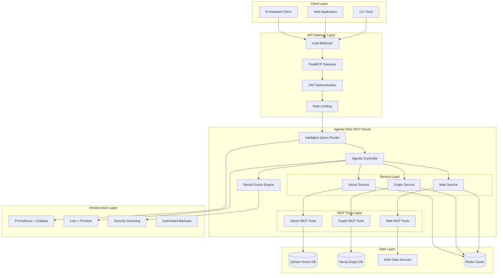
```mermaid
graph TB
    subgraph "Client Layer"
        AI[AI Assistant Client]
        App[Web Application]
        CLI[CLI Tools]
    end
    
    subgraph "API Gateway Layer"
        LB[Load Balancer]
        Gateway[FastMCP Gateway]
        Auth[JWT Authentication]
        Rate[Rate Limiting]
    end
    
    subgraph "Agentic RAG MCP Server"
        Router[Intelligent Query Router]
        Agent[Agentic Controller]
        Fusion[Result Fusion Engine]
        
        subgraph "Service Layer"
            Vector[Vector Service]
            Graph[Graph Service]
            Web[Web Service]
        end
        
        subgraph "MCP Tools Layer"
            VectorTools[Vector MCP Tools]
            GraphTools[Graph MCP Tools]
            WebTools[Web MCP Tools]
        end
    end
    
    subgraph "Data Layer"
        Qdrant[(Qdrant Vector DB)]
        Neo4j[(Neo4j Graph DB)]
        WebSources[Web Data Sources]
        Cache[(Redis Cache)]
    end
    
    subgraph "Infrastructure Layer"
        Monitoring[Prometheus + Grafana]
        Logging[Loki + Promtail]
        Security[Security Scanning]
        Backup[Automated Backups]
    end
    
    AI --> LB
    App --> LB
    CLI --> LB
    
    LB --> Gateway
    Gateway --> Auth
    Auth --> Rate
    Rate --> Router
    
    Router --> Agent
    Agent --> Fusion
    Agent --> Vector
    Agent --> Graph
    Agent --> Web
    
    Vector --> VectorTools
    Graph --> GraphTools
    Web --> WebTools
    
    VectorTools --> Qdrant
    GraphTools --> Neo4j
    WebTools --> WebSources
    
    Vector --> Cache
    Graph --> Cache
    Web --> Cache
    
    Router --> Monitoring
    Agent --> Logging
    Fusion --> Security
```

### Key Architectural Principles

1. **Microservices with Service Composition**: Individual services composed into unified interface
2. **Agentic Intelligence**: Autonomous query routing and result fusion
3. **Async-First Design**: Non-blocking operations throughout the stack
4. **Horizontal Scalability**: Stateless services with external state management
5. **Production Security**: Authentication, authorization, and audit logging
6. **Observability**: Comprehensive metrics, logging, and tracing

---

## Service Architecture

### FastMCP Service Composition Pattern

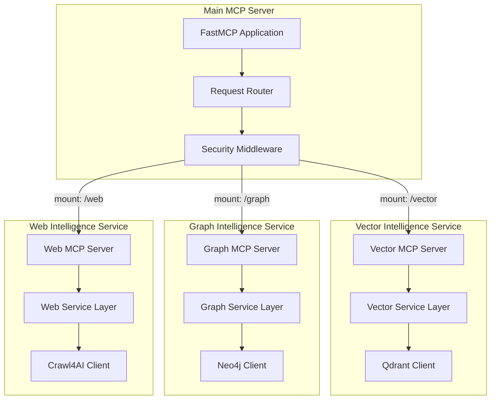
```mermaid
graph TB
    subgraph "Main MCP Server"
        MainApp[FastMCP Application]
        Router[Request Router]
        Middleware[Security Middleware]
    end
    
    subgraph "Vector Intelligence Service"
        VectorMCP[Vector MCP Server]
        VectorService[Vector Service Layer]
        QdrantClient[Qdrant Client]
    end
    
    subgraph "Graph Intelligence Service"
        GraphMCP[Graph MCP Server]
        GraphService[Graph Service Layer]
        Neo4jClient[Neo4j Client]
    end
    
    subgraph "Web Intelligence Service"
        WebMCP[Web MCP Server]
        WebService[Web Service Layer]
        Crawl4AI[Crawl4AI Client]
    end
    
    MainApp --> Router
    Router --> Middleware
    
    Middleware --> |mount: /vector| VectorMCP
    Middleware --> |mount: /graph| GraphMCP
    Middleware --> |mount: /web| WebMCP
    
    VectorMCP --> VectorService
    VectorService --> QdrantClient
    
    GraphMCP --> GraphService
    GraphService --> Neo4jClient
    
    WebMCP --> WebService
    WebService --> Crawl4AI
```

### Service Layer Implementation

#### Vector Intelligence Service

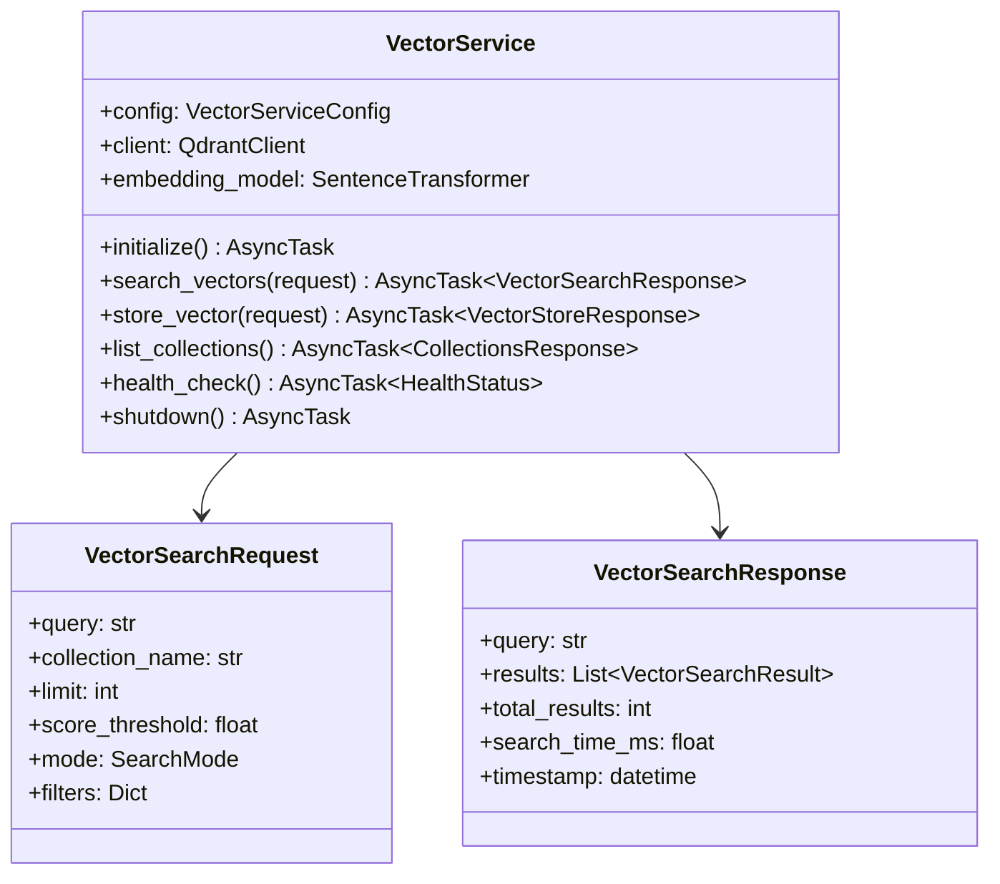
```mermaid
classDiagram
    class VectorService {
        +config: VectorServiceConfig
        +client: QdrantClient
        +embedding_model: SentenceTransformer
        +initialize() AsyncTask
        +search_vectors(request) AsyncTask~VectorSearchResponse~
        +store_vector(request) AsyncTask~VectorStoreResponse~
        +list_collections() AsyncTask~CollectionsResponse~
        +health_check() AsyncTask~HealthStatus~
        +shutdown() AsyncTask
    }
    
    class VectorSearchRequest {
        +query: str
        +collection_name: str
        +limit: int
        +score_threshold: float
        +mode: SearchMode
        +filters: Dict
    }
    
    class VectorSearchResponse {
        +query: str
        +results: List~VectorSearchResult~
        +total_results: int
        +search_time_ms: float
        +timestamp: datetime
    }
    
    VectorService --> VectorSearchRequest
    VectorService --> VectorSearchResponse
```

#### Graph Intelligence Service

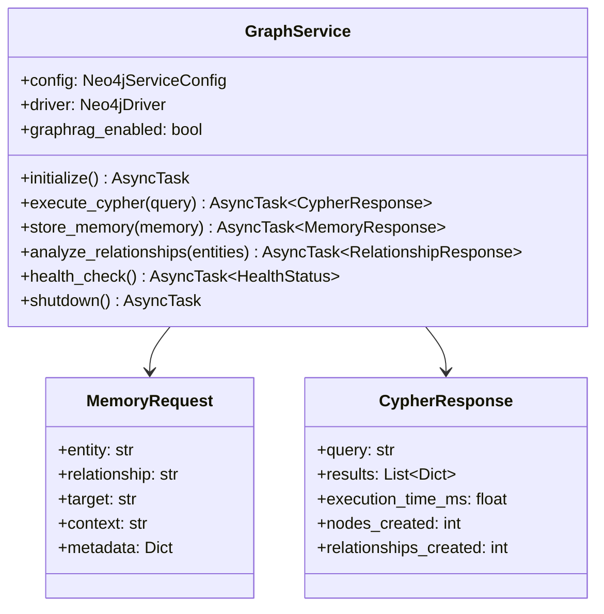
```mermaid
classDiagram
    class GraphService {
        +config: Neo4jServiceConfig
        +driver: Neo4jDriver
        +graphrag_enabled: bool
        +initialize() AsyncTask
        +execute_cypher(query) AsyncTask~CypherResponse~
        +store_memory(memory) AsyncTask~MemoryResponse~
        +analyze_relationships(entities) AsyncTask~RelationshipResponse~
        +health_check() AsyncTask~HealthStatus~
        +shutdown() AsyncTask
    }
    
    class MemoryRequest {
        +entity: str
        +relationship: str
        +target: str
        +context: str
        +metadata: Dict
    }
    
    class CypherResponse {
        +query: str
        +results: List~Dict~
        +execution_time_ms: float
        +nodes_created: int
        +relationships_created: int
    }
    
    GraphService --> MemoryRequest
    GraphService --> CypherResponse
```

#### Web Intelligence Service

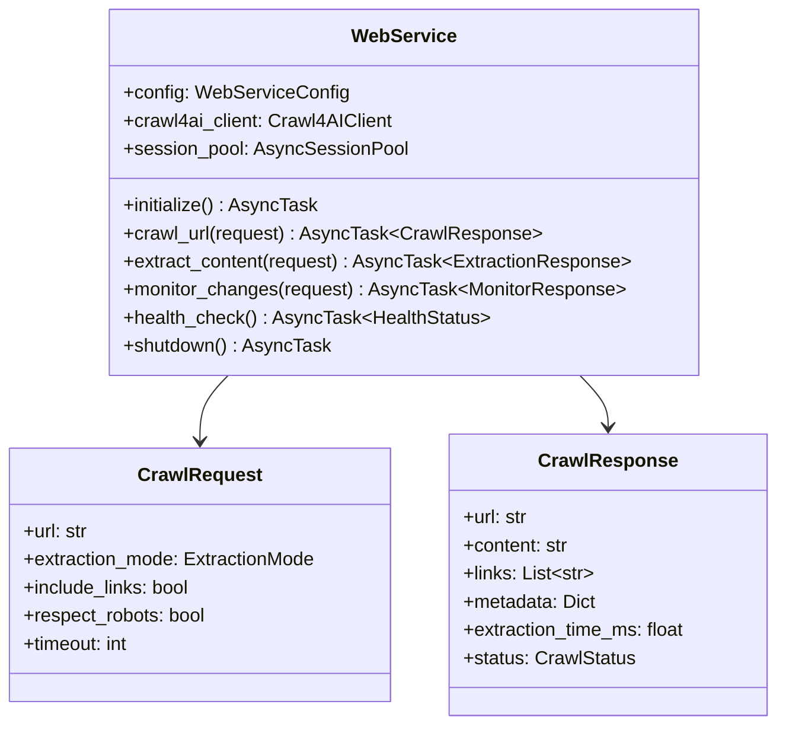
```mermaid
classDiagram
    class WebService {
        +config: WebServiceConfig
        +crawl4ai_client: Crawl4AIClient
        +session_pool: AsyncSessionPool
        +initialize() AsyncTask
        +crawl_url(request) AsyncTask~CrawlResponse~
        +extract_content(request) AsyncTask~ExtractionResponse~
        +monitor_changes(request) AsyncTask~MonitorResponse~
        +health_check() AsyncTask~HealthStatus~
        +shutdown() AsyncTask
    }
    
    class CrawlRequest {
        +url: str
        +extraction_mode: ExtractionMode
        +include_links: bool
        +respect_robots: bool
        +timeout: int
    }
    
    class CrawlResponse {
        +url: str
        +content: str
        +links: List~str~
        +metadata: Dict
        +extraction_time_ms: float
        +status: CrawlStatus
    }
    
    WebService --> CrawlRequest
    WebService --> CrawlResponse
```

---

## Data Flow Architecture

### Request Processing Flow

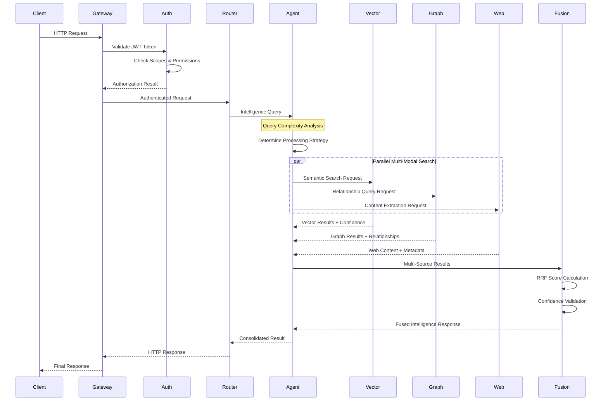
```mermaid
sequenceDiagram
    participant Client
    participant Gateway
    participant Auth
    participant Router
    participant Agent
    participant Vector
    participant Graph
    participant Web
    participant Fusion

    Client->>Gateway: HTTP Request
    Gateway->>Auth: Validate JWT Token
    Auth->>Auth: Check Scopes & Permissions
    Auth-->>Gateway: Authorization Result
    
    Gateway->>Router: Authenticated Request
    Router->>Agent: Intelligence Query
    
    Note over Agent: Query Complexity Analysis
    Agent->>Agent: Determine Processing Strategy
    
    par Parallel Multi-Modal Search
        Agent->>Vector: Semantic Search Request
        Agent->>Graph: Relationship Query Request
        Agent->>Web: Content Extraction Request
    end
    
    Vector-->>Agent: Vector Results + Confidence
    Graph-->>Agent: Graph Results + Relationships
    Web-->>Agent: Web Content + Metadata
    
    Agent->>Fusion: Multi-Source Results
    Fusion->>Fusion: RRF Score Calculation
    Fusion->>Fusion: Confidence Validation
    Fusion-->>Agent: Fused Intelligence Response
    
    Agent-->>Router: Consolidated Result
    Router-->>Gateway: HTTP Response
    Gateway-->>Client: Final Response
```

### Data Storage and Retrieval

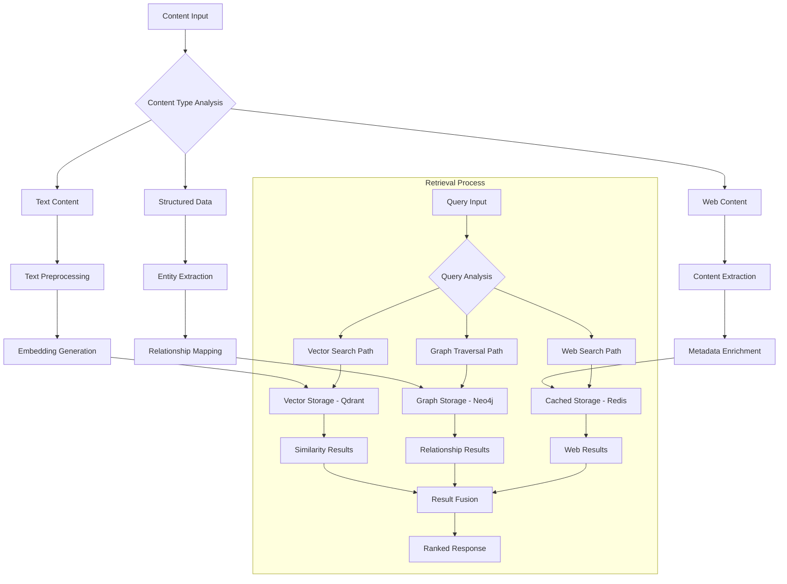
```mermaid
flowchart TD
    A[Content Input] --> B{Content Type Analysis}
    
    B --> C[Text Content]
    B --> D[Structured Data]
    B --> E[Web Content]
    
    C --> F[Text Preprocessing]
    F --> G[Embedding Generation]
    G --> H[Vector Storage - Qdrant]
    
    D --> I[Entity Extraction]
    I --> J[Relationship Mapping]
    J --> K[Graph Storage - Neo4j]
    
    E --> L[Content Extraction]
    L --> M[Metadata Enrichment]
    M --> N[Cached Storage - Redis]
    
    subgraph "Retrieval Process"
        O[Query Input] --> P{Query Analysis}
        P --> Q[Vector Search Path]
        P --> R[Graph Traversal Path]
        P --> S[Web Search Path]
        
        Q --> H
        R --> K
        S --> N
        
        H --> T[Similarity Results]
        K --> U[Relationship Results]
        N --> V[Web Results]
        
        T --> W[Result Fusion]
        U --> W
        V --> W
        
        W --> X[Ranked Response]
    end
```

### Embedding Pipeline Architecture

```mermaid
flowchart LR
    subgraph "Input Processing"
        A[Raw Text] --> B[Text Cleaning]
        B --> C[Chunking Strategy]
        C --> D[Overlap Management]
    end
    
    subgraph "Embedding Generation"
        D --> E[Sentence Transformer]
        E --> F[Vector Normalization]
        F --> G[Dimension Validation]
    end
    
    subgraph "Storage Optimization"
        G --> H[Batch Processing]
        H --> I[Compression Strategy]
        I --> J[Index Optimization]
    end
    
    subgraph "Retrieval Optimization"
        J --> K[HNSW Index]
        K --> L[Distance Calculation]
        L --> M[Score Threshold]
        M --> N[Result Ranking]
    end
```

---

## Agentic Intelligence Layer

### Agentic Query Processing

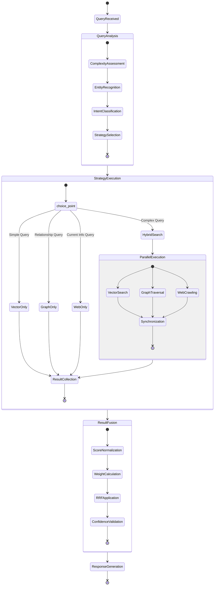
```mermaid
stateDiagram-v2
    [*] --> QueryReceived
    QueryReceived --> QueryAnalysis
    
    state QueryAnalysis {
        [*] --> ComplexityAssessment
        ComplexityAssessment --> EntityRecognition
        EntityRecognition --> IntentClassification
        IntentClassification --> StrategySelection
        StrategySelection --> [*]
    }
    
    QueryAnalysis --> StrategyExecution
    
    state StrategyExecution {
        [*] --> choice_point
        choice_point --> VectorOnly: Simple Query
        choice_point --> GraphOnly: Relationship Query
        choice_point --> WebOnly: Current Info Query
        choice_point --> HybridSearch: Complex Query
        
        VectorOnly --> ResultCollection
        GraphOnly --> ResultCollection
        WebOnly --> ResultCollection
        HybridSearch --> ParallelExecution
        
        state ParallelExecution {
            [*] --> VectorSearch
            [*] --> GraphTraversal
            [*] --> WebCrawling
            VectorSearch --> Synchronization
            GraphTraversal --> Synchronization
            WebCrawling --> Synchronization
            Synchronization --> [*]
        }
        
        ParallelExecution --> ResultCollection
        ResultCollection --> [*]
    }
    
    StrategyExecution --> ResultFusion
    
    state ResultFusion {
        [*] --> ScoreNormalization
        ScoreNormalization --> WeightCalculation
        WeightCalculation --> RRFApplication
        RRFApplication --> ConfidenceValidation
        ConfidenceValidation --> [*]
    }
    
    ResultFusion --> ResponseGeneration
    ResponseGeneration --> [*]
```

### Intelligent Query Router

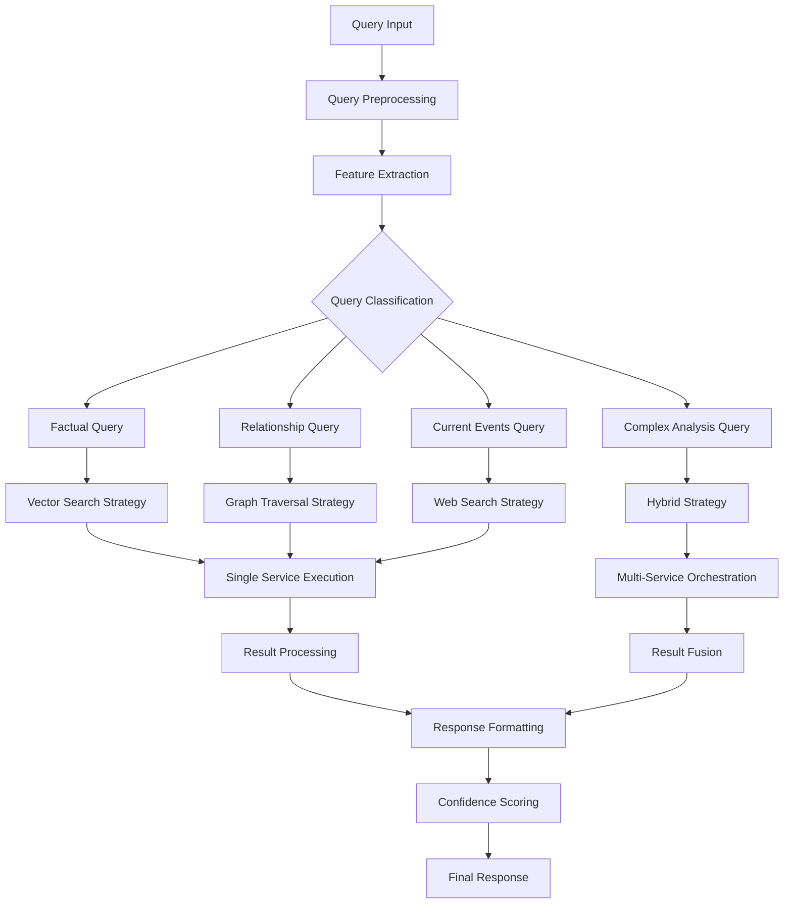
```mermaid
flowchart TD
    A[Query Input] --> B[Query Preprocessing]
    B --> C[Feature Extraction]
    
    C --> D{Query Classification}
    
    D --> E[Factual Query]
    D --> F[Relationship Query]
    D --> G[Current Events Query]
    D --> H[Complex Analysis Query]
    
    E --> I[Vector Search Strategy]
    F --> J[Graph Traversal Strategy]
    G --> K[Web Search Strategy]
    H --> L[Hybrid Strategy]
    
    I --> M[Single Service Execution]
    J --> M
    K --> M
    L --> N[Multi-Service Orchestration]
    
    M --> O[Result Processing]
    N --> P[Result Fusion]
    
    O --> Q[Response Formatting]
    P --> Q
    
    Q --> R[Confidence Scoring]
    R --> S[Final Response]
```

### Result Fusion Engine

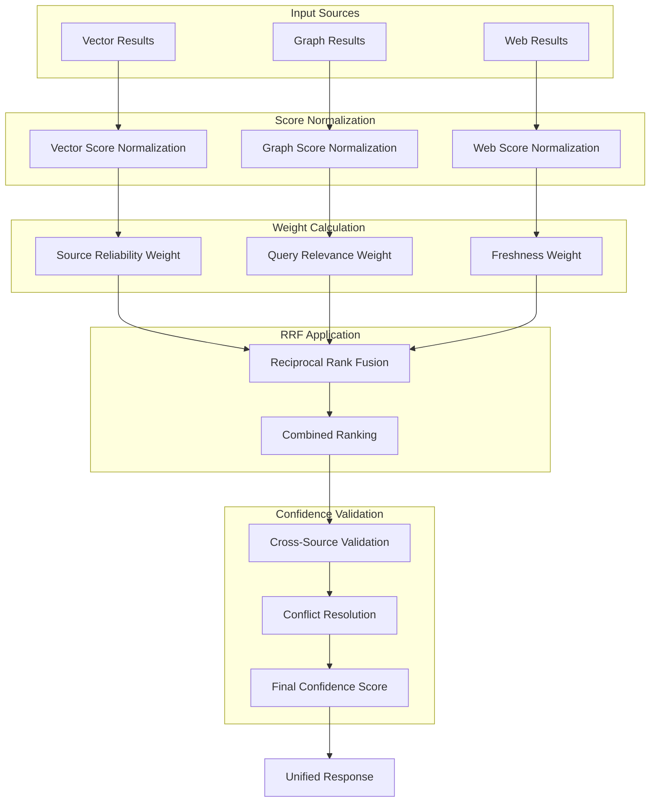
```mermaid
flowchart TD
    subgraph "Input Sources"
        A[Vector Results]
        B[Graph Results]
        C[Web Results]
    end
    
    subgraph "Score Normalization"
        A --> D[Vector Score Normalization]
        B --> E[Graph Score Normalization]
        C --> F[Web Score Normalization]
    end
    
    subgraph "Weight Calculation"
        D --> G[Source Reliability Weight]
        E --> H[Query Relevance Weight]
        F --> I[Freshness Weight]
    end
    
    subgraph "RRF Application"
        G --> J[Reciprocal Rank Fusion]
        H --> J
        I --> J
        J --> K[Combined Ranking]
    end
    
    subgraph "Confidence Validation"
        K --> L[Cross-Source Validation]
        L --> M[Conflict Resolution]
        M --> N[Final Confidence Score]
    end
    
    N --> O[Unified Response]
```

---

## Security Architecture

### Authentication and Authorization Flow

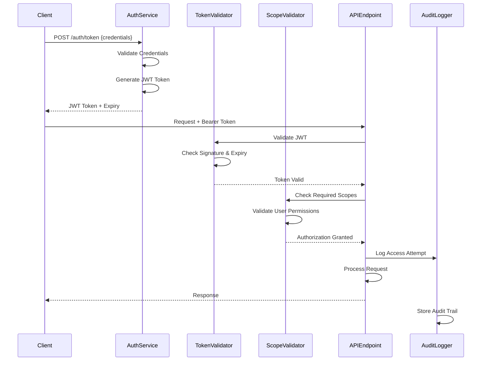
```mermaid
sequenceDiagram
    participant Client
    participant AuthService
    participant TokenValidator
    participant ScopeValidator
    participant APIEndpoint
    participant AuditLogger

    Client->>AuthService: POST /auth/token {credentials}
    AuthService->>AuthService: Validate Credentials
    AuthService->>AuthService: Generate JWT Token
    AuthService-->>Client: JWT Token + Expiry
    
    Client->>APIEndpoint: Request + Bearer Token
    APIEndpoint->>TokenValidator: Validate JWT
    TokenValidator->>TokenValidator: Check Signature & Expiry
    TokenValidator-->>APIEndpoint: Token Valid
    
    APIEndpoint->>ScopeValidator: Check Required Scopes
    ScopeValidator->>ScopeValidator: Validate User Permissions
    ScopeValidator-->>APIEndpoint: Authorization Granted
    
    APIEndpoint->>AuditLogger: Log Access Attempt
    APIEndpoint->>APIEndpoint: Process Request
    APIEndpoint-->>Client: Response
    
    AuditLogger->>AuditLogger: Store Audit Trail
```

### Security Layers

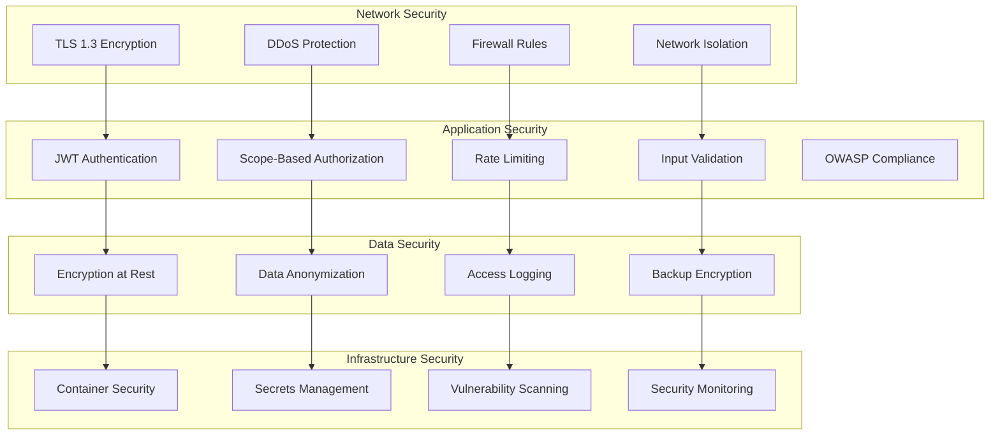
```mermaid
graph TB
    subgraph "Network Security"
        A[TLS 1.3 Encryption]
        B[DDoS Protection]
        C[Firewall Rules]
        D[Network Isolation]
    end
    
    subgraph "Application Security"
        E[JWT Authentication]
        F[Scope-Based Authorization]
        G[Rate Limiting]
        H[Input Validation]
        I[OWASP Compliance]
    end
    
    subgraph "Data Security"
        J[Encryption at Rest]
        K[Data Anonymization]
        L[Access Logging]
        M[Backup Encryption]
    end
    
    subgraph "Infrastructure Security"
        N[Container Security]
        O[Secrets Management]
        P[Vulnerability Scanning]
        Q[Security Monitoring]
    end
    
    A --> E
    B --> F
    C --> G
    D --> H
    
    E --> J
    F --> K
    G --> L
    H --> M
    
    J --> N
    K --> O
    L --> P
    M --> Q
```

### OWASP API Security Implementation

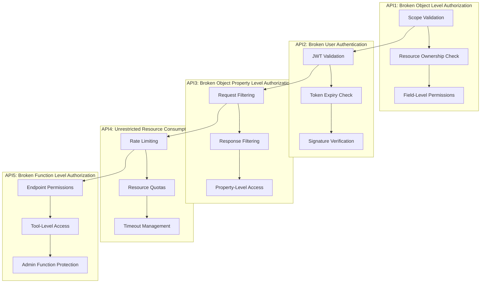
```mermaid
flowchart TD
    subgraph "API1: Broken Object Level Authorization"
        A[Scope Validation] --> B[Resource Ownership Check]
        B --> C[Field-Level Permissions]
    end
    
    subgraph "API2: Broken User Authentication"
        D[JWT Validation] --> E[Token Expiry Check]
        E --> F[Signature Verification]
    end
    
    subgraph "API3: Broken Object Property Level Authorization"
        G[Request Filtering] --> H[Response Filtering]
        H --> I[Property-Level Access]
    end
    
    subgraph "API4: Unrestricted Resource Consumption"
        J[Rate Limiting] --> K[Resource Quotas]
        K --> L[Timeout Management]
    end
    
    subgraph "API5: Broken Function Level Authorization"
        M[Endpoint Permissions] --> N[Tool-Level Access]
        N --> O[Admin Function Protection]
    end
    
    A --> D
    D --> G
    G --> J
    J --> M
```

---

## Deployment Architecture

### Kubernetes Deployment Architecture

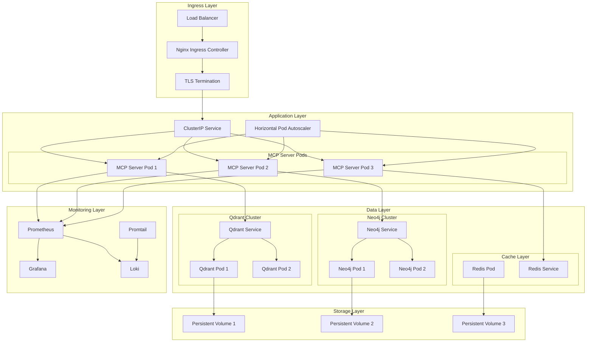
```mermaid
graph TB
    subgraph "Ingress Layer"
        Ingress[Nginx Ingress Controller]
        TLS[TLS Termination]
        LB[Load Balancer]
    end
    
    subgraph "Application Layer"
        subgraph "MCP Server Pods"
            Pod1[MCP Server Pod 1]
            Pod2[MCP Server Pod 2]
            Pod3[MCP Server Pod 3]
        end
        
        Service[ClusterIP Service]
        HPA[Horizontal Pod Autoscaler]
    end
    
    subgraph "Data Layer"
        subgraph "Qdrant Cluster"
            Qdrant1[Qdrant Pod 1]
            Qdrant2[Qdrant Pod 2]
            QdrantService[Qdrant Service]
        end
        
        subgraph "Neo4j Cluster"
            Neo4j1[Neo4j Pod 1]
            Neo4j2[Neo4j Pod 2]
            Neo4jService[Neo4j Service]
        end
        
        subgraph "Cache Layer"
            Redis[Redis Pod]
            RedisService[Redis Service]
        end
    end
    
    subgraph "Storage Layer"
        PV1[Persistent Volume 1]
        PV2[Persistent Volume 2]
        PV3[Persistent Volume 3]
    end
    
    subgraph "Monitoring Layer"
        Prometheus[Prometheus]
        Grafana[Grafana]
        Loki[Loki]
        Promtail[Promtail]
    end
    
    LB --> Ingress
    Ingress --> TLS
    TLS --> Service
    Service --> Pod1
    Service --> Pod2
    Service --> Pod3
    
    HPA --> Pod1
    HPA --> Pod2
    HPA --> Pod3
    
    Pod1 --> QdrantService
    Pod2 --> Neo4jService
    Pod3 --> RedisService
    
    QdrantService --> Qdrant1
    QdrantService --> Qdrant2
    Neo4jService --> Neo4j1
    Neo4jService --> Neo4j2
    
    Qdrant1 --> PV1
    Neo4j1 --> PV2
    Redis --> PV3
    
    Pod1 --> Prometheus
    Pod2 --> Prometheus
    Pod3 --> Prometheus
    
    Prometheus --> Grafana
    Prometheus --> Loki
    Promtail --> Loki
```

### Container Architecture

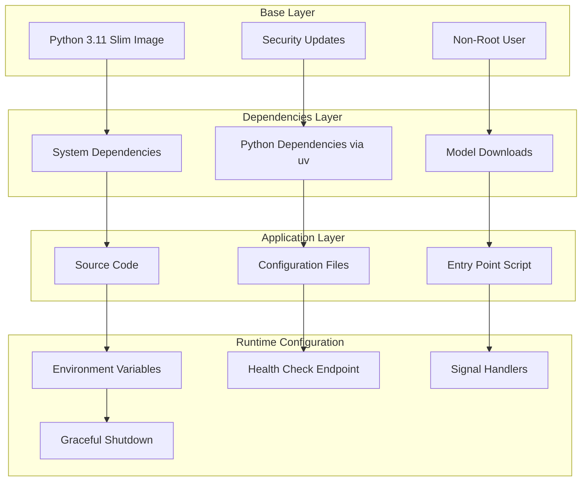
```mermaid
flowchart TD
    subgraph "Base Layer"
        A[Python 3.11 Slim Image]
        B[Security Updates]
        C[Non-Root User]
    end
    
    subgraph "Dependencies Layer"
        D[System Dependencies]
        E[Python Dependencies via uv]
        F[Model Downloads]
    end
    
    subgraph "Application Layer"
        G[Source Code]
        H[Configuration Files]
        I[Entry Point Script]
    end
    
    subgraph "Runtime Configuration"
        J[Environment Variables]
        K[Health Check Endpoint]
        L[Signal Handlers]
        M[Graceful Shutdown]
    end
    
    A --> D
    B --> E
    C --> F
    
    D --> G
    E --> H
    F --> I
    
    G --> J
    H --> K
    I --> L
    J --> M
```

### Multi-Environment Deployment

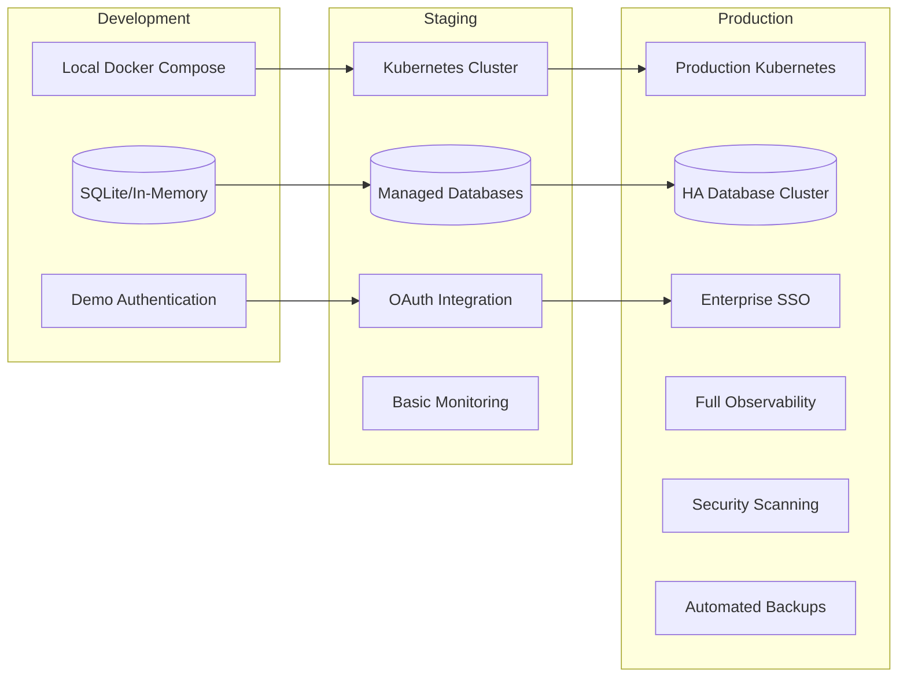
```mermaid
graph LR
    subgraph "Development"
        DevLocal[Local Docker Compose]
        DevDB[(SQLite/In-Memory)]
        DevAuth[Demo Authentication]
    end
    
    subgraph "Staging"
        StagingK8s[Kubernetes Cluster]
        StagingDB[(Managed Databases)]
        StagingAuth[OAuth Integration]
        StagingMonitoring[Basic Monitoring]
    end
    
    subgraph "Production"
        ProdK8s[Production Kubernetes]
        ProdDB[(HA Database Cluster)]
        ProdAuth[Enterprise SSO]
        ProdMonitoring[Full Observability]
        ProdSecurity[Security Scanning]
        ProdBackup[Automated Backups]
    end
    
    DevLocal --> StagingK8s
    StagingK8s --> ProdK8s
    
    DevDB --> StagingDB
    StagingDB --> ProdDB
    
    DevAuth --> StagingAuth
    StagingAuth --> ProdAuth
```

---

## Performance Architecture

### Caching Strategy

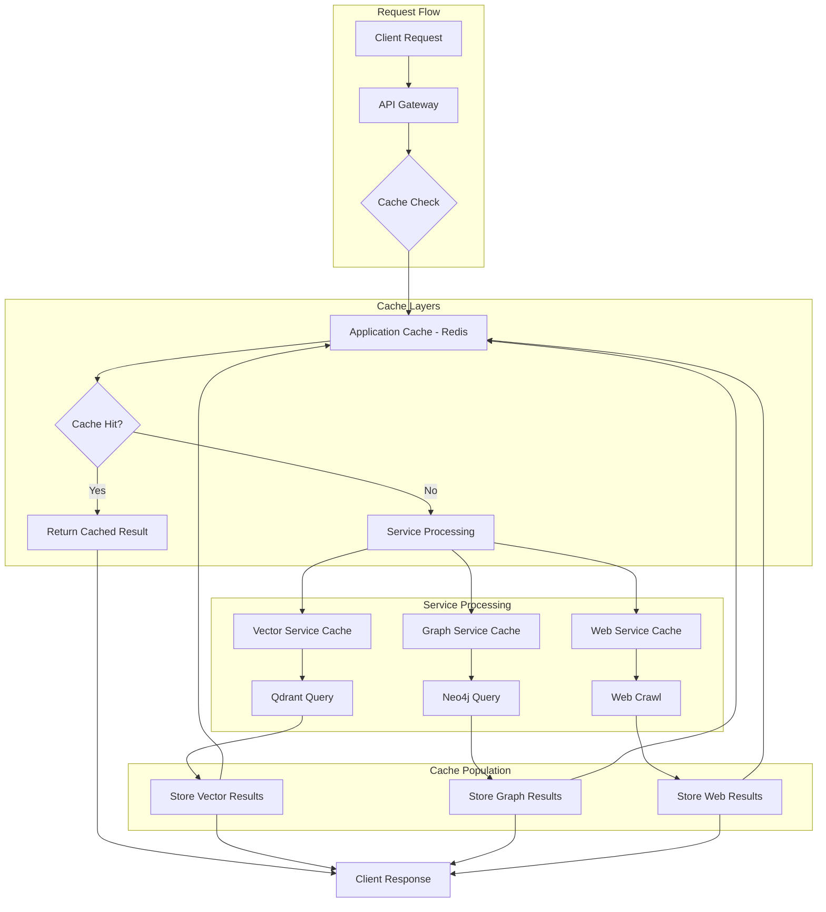
```mermaid
flowchart TD
    subgraph "Request Flow"
        A[Client Request] --> B[API Gateway]
        B --> C{Cache Check}
    end
    
    subgraph "Cache Layers"
        C --> D[Application Cache - Redis]
        D --> E{Cache Hit?}
        E -->|Yes| F[Return Cached Result]
        E -->|No| G[Service Processing]
    end
    
    subgraph "Service Processing"
        G --> H[Vector Service Cache]
        G --> I[Graph Service Cache]
        G --> J[Web Service Cache]
        
        H --> K[Qdrant Query]
        I --> L[Neo4j Query]
        J --> M[Web Crawl]
    end
    
    subgraph "Cache Population"
        K --> N[Store Vector Results]
        L --> O[Store Graph Results]
        M --> P[Store Web Results]
        
        N --> D
        O --> D
        P --> D
    end
    
    F --> Q[Client Response]
    N --> Q
    O --> Q
    P --> Q
```

### Connection Pooling Architecture

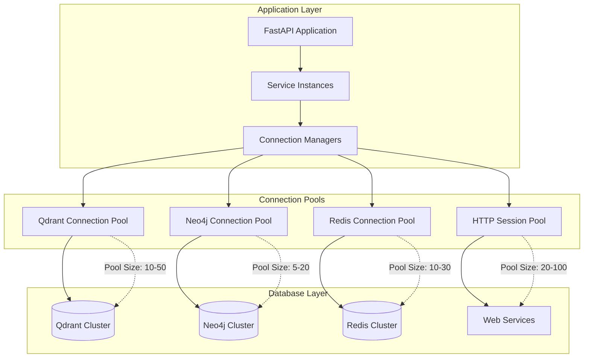
```mermaid
graph TB
    subgraph "Application Layer"
        A[FastAPI Application]
        B[Service Instances]
        C[Connection Managers]
    end
    
    subgraph "Connection Pools"
        D[Qdrant Connection Pool]
        E[Neo4j Connection Pool]
        F[Redis Connection Pool]
        G[HTTP Session Pool]
    end
    
    subgraph "Database Layer"
        H[(Qdrant Cluster)]
        I[(Neo4j Cluster)]
        J[(Redis Cluster)]
        K[Web Services]
    end
    
    A --> B
    B --> C
    
    C --> D
    C --> E
    C --> F
    C --> G
    
    D --> H
    E --> I
    F --> J
    G --> K
    
    D -.->|Pool Size: 10-50| H
    E -.->|Pool Size: 5-20| I
    F -.->|Pool Size: 10-30| J
    G -.->|Pool Size: 20-100| K
```

### Async Processing Pipeline

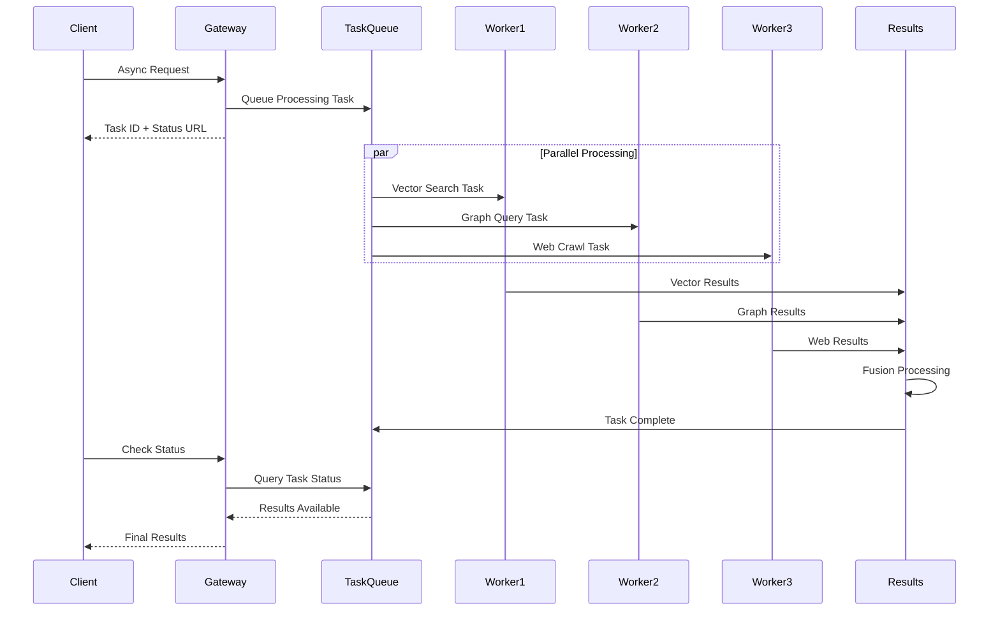
```mermaid
sequenceDiagram
    participant Client
    participant Gateway
    participant TaskQueue
    participant Worker1
    participant Worker2
    participant Worker3
    participant Results

    Client->>Gateway: Async Request
    Gateway->>TaskQueue: Queue Processing Task
    Gateway-->>Client: Task ID + Status URL
    
    par Parallel Processing
        TaskQueue->>Worker1: Vector Search Task
        TaskQueue->>Worker2: Graph Query Task
        TaskQueue->>Worker3: Web Crawl Task
    end
    
    Worker1->>Results: Vector Results
    Worker2->>Results: Graph Results
    Worker3->>Results: Web Results
    
    Results->>Results: Fusion Processing
    Results->>TaskQueue: Task Complete
    
    Client->>Gateway: Check Status
    Gateway->>TaskQueue: Query Task Status
    TaskQueue-->>Gateway: Results Available
    Gateway-->>Client: Final Results
```

---

## Integration Patterns

### MCP Protocol Integration

```mermaid
sequenceDiagram
    participant MCPClient as MCP Client
    participant Server as MCP Server
    participant VectorService as Vector Service
    participant GraphService as Graph Service
    participant WebService as Web Service

    MCPClient->>Server: Initialize Connection
    Server->>Server: Load Tool Definitions
    Server-->>MCPClient: Available Tools List
    
    MCPClient->>Server: Call vector_search Tool
    Server->>VectorService: Execute Search
    VectorService->>VectorService: Process Query
    VectorService-->>Server: Search Results
    Server-->>MCPClient: Tool Response
    
    MCPClient->>Server: Call graph_query Tool
    Server->>GraphService: Execute Cypher
    GraphService->>GraphService: Process Query
    GraphService-->>Server: Graph Results
    Server-->>MCPClient: Tool Response
    
    MCPClient->>Server: Call web_crawl Tool
    Server->>WebService: Extract Content
    WebService->>WebService: Process URL
    WebService-->>Server: Web Content
    Server-->>MCPClient: Tool Response
```

### External API Integration

```mermaid
graph TB
    subgraph "External Services"
        A[OpenAI API]
        B[Anthropic API]
        C[Google APIs]
        D[Custom Web APIs]
    end
    
    subgraph "Integration Layer"
        E[API Client Factory]
        F[Authentication Manager]
        G[Rate Limit Manager]
        H[Retry Logic]
        I[Error Handler]
    end
    
    subgraph "Service Layer"
        J[Vector Service]
        K[Graph Service]
        L[Web Service]
    end
    
    A --> E
    B --> F
    C --> G
    D --> H
    
    E --> J
    F --> K
    G --> L
    H --> I
    
    I --> J
    I --> K
    I --> L
```

### Event-Driven Architecture

```mermaid
flowchart TD
    subgraph "Event Sources"
        A[User Requests]
        B[Scheduled Tasks]
        C[External Webhooks]
        D[System Events]
    end
    
    subgraph "Event Bus"
        E[Event Router]
        F[Event Queue]
        G[Event Store]
    end
    
    subgraph "Event Processors"
        H[Search Processor]
        I[Index Processor]
        J[Notification Processor]
        K[Analytics Processor]
    end
    
    subgraph "Event Handlers"
        L[Vector Index Update]
        M[Graph Relationship Update]
        N[Cache Invalidation]
        O[Metric Collection]
    end
    
    A --> E
    B --> E
    C --> E
    D --> E
    
    E --> F
    F --> G
    
    F --> H
    F --> I
    F --> J
    F --> K
    
    H --> L
    I --> M
    J --> N
    K --> O
```

---

## Architecture Decision Records (ADRs)

### ADR-001: FastMCP Service Composition

**Status**: Accepted  
**Date**: 2025-06-27  
**Decision**: Use FastMCP 2.0 service composition pattern for unified server architecture  

**Context**: Need to combine multiple AI services (Qdrant, Neo4j, Crawl4AI) into single MCP server while maintaining modularity and testability.

**Decision**: Implement FastMCP service mounting pattern with individual service abstractions.

**Consequences**:

- ✅ Clean separation of concerns
- ✅ Individual service testability
- ✅ Simplified deployment (single container)
- ✅ Unified API surface
- ❌ Single point of failure
- ❌ More complex error handling

### ADR-002: Agentic Intelligence Layer

**Status**: Accepted  
**Date**: 2025-06-27  
**Decision**: Implement autonomous query routing and result fusion  

**Context**: Need intelligent coordination between multiple search modalities to provide optimal results.

**Decision**: Build agentic layer with query complexity analysis, strategy selection, and RRF fusion.

**Consequences**:

- ✅ Improved result quality
- ✅ Autonomous operation
- ✅ Adaptive query handling
- ✅ Confidence-driven validation
- ❌ Increased complexity
- ❌ Additional latency for analysis

### ADR-003: Async-First Architecture

**Status**: Accepted  
**Date**: 2025-06-27  
**Decision**: Use async/await throughout the application stack  

**Context**: Need high concurrency and non-blocking operations for production scalability.

**Decision**: Implement async patterns for all I/O operations, database connections, and service calls.

**Consequences**:

- ✅ High concurrency support
- ✅ Better resource utilization
- ✅ Scalable performance
- ✅ Non-blocking operations
- ❌ Increased debugging complexity
- ❌ Learning curve for developers

This architecture documentation provides a comprehensive view of the Agentic RAG MCP Server's design, from high-level system architecture to detailed implementation patterns. The architecture is designed for production scalability while maintaining development simplicity and operational excellence.
