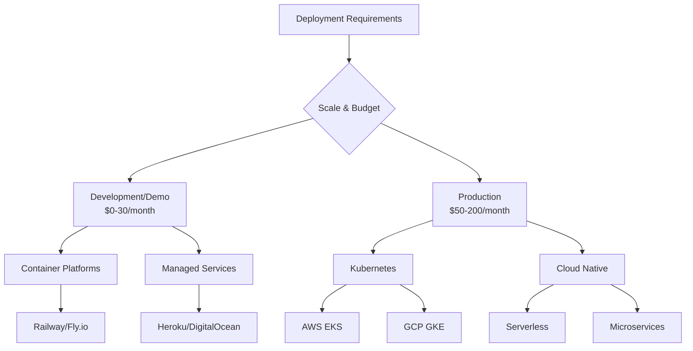

# Deployment & Operations Guide: Agentic RAG MCP Server

## Table of Contents

1. [Deployment Overview](#deployment-overview)
2. [Local Development](#local-development)
3. [Docker Deployment](#docker-deployment)
4. [Kubernetes Deployment](#kubernetes-deployment)
5. [Cloud Platform Deployments](#cloud-platform-deployments)
6. [Infrastructure as Code](#infrastructure-as-code)
7. [Monitoring & Observability](#monitoring--observability)
8. [Backup & Recovery](#backup--recovery)
9. [Security Operations](#security-operations)
10. [Troubleshooting](#troubleshooting)

---

## Deployment Overview

The Agentic RAG MCP Server supports multiple deployment strategies optimized for different environments and scale requirements. The architecture is designed for both rapid development iteration and production scalability.

### Deployment Tiers

#### Tier 1: Development & Portfolio ($0-5/month)

- **Platforms**: Railway free tier, Fly.io free tier, local development
- **Storage**: In-memory databases, SQLite, Docker volumes
- **Monitoring**: Basic health checks and console logging
- **Purpose**: Rapid prototyping, portfolio demonstration, local development

#### Tier 2: Professional Demo ($15-30/month)

- **Platforms**: Railway Pro, Fly.io paid plans, DigitalOcean Apps
- **Storage**: Managed database services (Cloud Qdrant, Neo4j Aura)
- **Monitoring**: Basic metrics with Prometheus and Grafana
- **Purpose**: Client demonstrations, staging environments, small production

#### Tier 3: Production Scale ($50-200/month)

- **Platforms**: AWS ECS/EKS, Google GKE, Azure AKS
- **Storage**: High-availability database clusters with backups
- **Monitoring**: Full observability stack with alerting
- **Purpose**: Production deployments, enterprise use, high availability

### Architecture Decision Matrix



---

## Local Development

### Quick Start with Docker Compose

1. **Clone and Configure**

```bash
git clone <repository-url>
cd qdrant-neo4j-crawl4ai-mcp
cp .env.example .env
# Edit .env with your configuration
```

2. **Start Services**

```bash
# Start all services
docker-compose up -d

# Start specific services
docker-compose up -d qdrant neo4j redis

# View logs
docker-compose logs -f mcp-server
```

3. **Verify Deployment**

```bash
# Health check
curl http://localhost:8000/health

# Interactive documentation
open http://localhost:8000/docs
```

### Development Docker Compose

```yaml
# docker-compose.yml
version: '3.8'

services:
  mcp-server:
    build: .
    ports:
      - "8000:8000"
    environment:
      - ENVIRONMENT=development
      - DEBUG=true
      - LOG_LEVEL=DEBUG
      - QDRANT_URL=http://qdrant:6333
      - NEO4J_URI=bolt://neo4j:7687
      - REDIS_URL=redis://redis:6379
    depends_on:
      - qdrant
      - neo4j
      - redis
    volumes:
      - ./src:/app/src:ro
      - ./logs:/app/logs
    restart: unless-stopped

  qdrant:
    image: qdrant/qdrant:v1.7.4
    ports:
      - "6333:6333"
      - "6334:6334"
    volumes:
      - qdrant_data:/qdrant/storage
    environment:
      - QDRANT__SERVICE__HTTP_PORT=6333
      - QDRANT__SERVICE__GRPC_PORT=6334

  neo4j:
    image: neo4j:5.15-community
    ports:
      - "7474:7474"
      - "7687:7687"
    environment:
      - NEO4J_AUTH=neo4j/password
      - NEO4J_PLUGINS=["apoc", "graph-data-science"]
      - NEO4J_dbms_security_procedures_unrestricted=apoc.*,gds.*
    volumes:
      - neo4j_data:/data
      - neo4j_logs:/logs

  redis:
    image: redis:7-alpine
    ports:
      - "6379:6379"
    volumes:
      - redis_data:/data
    command: redis-server --appendonly yes

volumes:
  qdrant_data:
  neo4j_data:
  neo4j_logs:
  redis_data:
```

### Native Development Setup

```bash
# Install dependencies
uv sync

# Set up environment
export ENVIRONMENT=development
export DEBUG=true
export QDRANT_URL=http://localhost:6333
export NEO4J_URI=bolt://localhost:7687

# Start development server
uv run python -m qdrant_neo4j_crawl4ai_mcp.main

# Alternative: Use uvicorn directly
uv run uvicorn qdrant_neo4j_crawl4ai_mcp.main:create_app --reload --host 0.0.0.0 --port 8000
```

---

## Docker Deployment

### Production Dockerfile

```dockerfile
# Multi-stage production build
FROM python:3.11-slim as builder

# Install system dependencies
RUN apt-get update && apt-get install -y \
    build-essential \
    curl \
    && rm -rf /var/lib/apt/lists/*

# Install uv
RUN pip install uv

# Copy dependency files
WORKDIR /app
COPY pyproject.toml uv.lock ./

# Install dependencies
RUN uv sync --frozen --no-dev

FROM python:3.11-slim as runtime

# Create non-root user
RUN groupadd -r appuser && useradd -r -g appuser appuser

# Install runtime dependencies
RUN apt-get update && apt-get install -y \
    ca-certificates \
    && rm -rf /var/lib/apt/lists/*

# Copy virtual environment
COPY --from=builder /app/.venv /app/.venv

# Copy application code
WORKDIR /app
COPY src/ ./src/
COPY README.md ./

# Set up environment
ENV PATH="/app/.venv/bin:$PATH"
ENV PYTHONPATH="/app/src"
ENV PYTHONUNBUFFERED=1

# Create directories
RUN mkdir -p /app/logs /app/data && \
    chown -R appuser:appuser /app

# Security hardening
USER appuser

# Health check
HEALTHCHECK --interval=30s --timeout=30s --start-period=5s --retries=3 \
  CMD curl -f http://localhost:8000/health || exit 1

# Expose port
EXPOSE 8000

# Start application
CMD ["python", "-m", "qdrant_neo4j_crawl4ai_mcp.main"]
```

### Production Docker Compose

```yaml
# docker-compose.prod.yml
version: '3.8'

services:
  mcp-server:
    image: qdrant-neo4j-crawl4ai-mcp:latest
    ports:
      - "8000:8000"
    environment:
      - ENVIRONMENT=production
      - LOG_LEVEL=INFO
      - QDRANT_URL=http://qdrant:6333
      - NEO4J_URI=bolt://neo4j:7687
      - REDIS_URL=redis://redis:6379
      - JWT_SECRET_KEY=${JWT_SECRET_KEY}
      - OPENAI_API_KEY=${OPENAI_API_KEY}
    secrets:
      - jwt_secret
      - openai_key
    deploy:
      replicas: 2
      resources:
        limits:
          memory: 1G
          cpus: '0.5'
        reservations:
          memory: 512M
          cpus: '0.25'
      restart_policy:
        condition: on-failure
        delay: 5s
        max_attempts: 3
    depends_on:
      - qdrant
      - neo4j
      - redis
    networks:
      - app_network

  qdrant:
    image: qdrant/qdrant:v1.7.4
    environment:
      - QDRANT__SERVICE__HTTP_PORT=6333
      - QDRANT__SERVICE__GRPC_PORT=6334
      - QDRANT__STORAGE__PERFORMANCE_MAX_SEARCH_THREADS=4
    volumes:
      - qdrant_data:/qdrant/storage
    deploy:
      resources:
        limits:
          memory: 2G
          cpus: '1.0'
    networks:
      - app_network

  neo4j:
    image: neo4j:5.15-enterprise
    environment:
      - NEO4J_AUTH=neo4j/${NEO4J_PASSWORD}
      - NEO4J_ACCEPT_LICENSE_AGREEMENT=yes
      - NEO4J_PLUGINS=["apoc", "graph-data-science"]
      - NEO4J_dbms_memory_heap_initial__size=512m
      - NEO4J_dbms_memory_heap_max__size=2G
      - NEO4J_dbms_memory_pagecache_size=1G
    volumes:
      - neo4j_data:/data
      - neo4j_logs:/logs
      - neo4j_import:/var/lib/neo4j/import
    deploy:
      resources:
        limits:
          memory: 4G
          cpus: '2.0'
    networks:
      - app_network

  redis:
    image: redis:7-alpine
    command: redis-server --appendonly yes --maxmemory 256mb --maxmemory-policy allkeys-lru
    volumes:
      - redis_data:/data
    deploy:
      resources:
        limits:
          memory: 512M
          cpus: '0.25'
    networks:
      - app_network

  nginx:
    image: nginx:alpine
    ports:
      - "80:80"
      - "443:443"
    volumes:
      - ./nginx.conf:/etc/nginx/nginx.conf:ro
      - ./ssl:/etc/nginx/ssl:ro
    depends_on:
      - mcp-server
    networks:
      - app_network

secrets:
  jwt_secret:
    external: true
  openai_key:
    external: true

volumes:
  qdrant_data:
  neo4j_data:
  neo4j_logs:
  neo4j_import:
  redis_data:

networks:
  app_network:
    driver: bridge
```

### Build and Deploy

```bash
# Build production image
docker build -t qdrant-neo4j-crawl4ai-mcp:latest .

# Tag for registry
docker tag qdrant-neo4j-crawl4ai-mcp:latest your-registry.com/mcp-server:v1.0.0

# Push to registry
docker push your-registry.com/mcp-server:v1.0.0

# Deploy with production compose
docker-compose -f docker-compose.prod.yml up -d

# Scale services
docker-compose -f docker-compose.prod.yml up -d --scale mcp-server=3
```

---

## Kubernetes Deployment

### Namespace and ConfigMap

```yaml
# k8s/manifests/namespace.yaml
apiVersion: v1
kind: Namespace
metadata:
  name: qdrant-neo4j-crawl4ai-mcp
  labels:
    app: mcp-server
    environment: production

---
# k8s/manifests/configmap.yaml
apiVersion: v1
kind: ConfigMap
metadata:
  name: mcp-server-config
  namespace: qdrant-neo4j-crawl4ai-mcp
data:
  ENVIRONMENT: "production"
  LOG_LEVEL: "INFO"
  HOST: "0.0.0.0"
  PORT: "8000"
  QDRANT_URL: "http://qdrant-service:6333"
  NEO4J_URI: "bolt://neo4j-service:7687"
  REDIS_URL: "redis://redis-service:6379"
  DEFAULT_COLLECTION: "knowledge_base"
  WORKERS: "4"
```

### Secrets Management

```yaml
# k8s/manifests/secrets.yaml
apiVersion: v1
kind: Secret
metadata:
  name: mcp-server-secrets
  namespace: qdrant-neo4j-crawl4ai-mcp
type: Opaque
data:
  JWT_SECRET_KEY: <base64-encoded-secret>
  NEO4J_PASSWORD: <base64-encoded-password>
  OPENAI_API_KEY: <base64-encoded-api-key>
```

### Main Application Deployment

```yaml
# k8s/manifests/qdrant-neo4j-crawl4ai-mcp.yaml
apiVersion: apps/v1
kind: Deployment
metadata:
  name: mcp-server
  namespace: qdrant-neo4j-crawl4ai-mcp
  labels:
    app: mcp-server
    version: v1.0.0
spec:
  replicas: 3
  selector:
    matchLabels:
      app: mcp-server
  template:
    metadata:
      labels:
        app: mcp-server
        version: v1.0.0
    spec:
      containers:
      - name: mcp-server
        image: your-registry.com/mcp-server:v1.0.0
        ports:
        - containerPort: 8000
          name: http
        envFrom:
        - configMapRef:
            name: mcp-server-config
        - secretRef:
            name: mcp-server-secrets
        resources:
          requests:
            memory: "512Mi"
            cpu: "250m"
          limits:
            memory: "1Gi"
            cpu: "500m"
        livenessProbe:
          httpGet:
            path: /health
            port: 8000
          initialDelaySeconds: 30
          periodSeconds: 10
          timeoutSeconds: 5
          failureThreshold: 3
        readinessProbe:
          httpGet:
            path: /ready
            port: 8000
          initialDelaySeconds: 10
          periodSeconds: 5
          timeoutSeconds: 3
          failureThreshold: 3
        securityContext:
          runAsNonRoot: true
          runAsUser: 1000
          allowPrivilegeEscalation: false
          readOnlyRootFilesystem: true
        volumeMounts:
        - name: tmp
          mountPath: /tmp
        - name: logs
          mountPath: /app/logs
      volumes:
      - name: tmp
        emptyDir: {}
      - name: logs
        emptyDir: {}

---
apiVersion: v1
kind: Service
metadata:
  name: mcp-server-service
  namespace: qdrant-neo4j-crawl4ai-mcp
  labels:
    app: mcp-server
spec:
  selector:
    app: mcp-server
  ports:
  - name: http
    port: 80
    targetPort: 8000
    protocol: TCP
  type: ClusterIP

---
apiVersion: autoscaling/v2
kind: HorizontalPodAutoscaler
metadata:
  name: mcp-server-hpa
  namespace: qdrant-neo4j-crawl4ai-mcp
spec:
  scaleTargetRef:
    apiVersion: apps/v1
    kind: Deployment
    name: mcp-server
  minReplicas: 2
  maxReplicas: 10
  metrics:
  - type: Resource
    resource:
      name: cpu
      target:
        type: Utilization
        averageUtilization: 70
  - type: Resource
    resource:
      name: memory
      target:
        type: Utilization
        averageUtilization: 80
```

### Qdrant Deployment

```yaml
# k8s/manifests/qdrant.yaml
apiVersion: apps/v1
kind: StatefulSet
metadata:
  name: qdrant
  namespace: qdrant-neo4j-crawl4ai-mcp
spec:
  serviceName: qdrant-service
  replicas: 2
  selector:
    matchLabels:
      app: qdrant
  template:
    metadata:
      labels:
        app: qdrant
    spec:
      containers:
      - name: qdrant
        image: qdrant/qdrant:v1.7.4
        ports:
        - containerPort: 6333
          name: http
        - containerPort: 6334
          name: grpc
        env:
        - name: QDRANT__SERVICE__HTTP_PORT
          value: "6333"
        - name: QDRANT__SERVICE__GRPC_PORT
          value: "6334"
        - name: QDRANT__CLUSTER__ENABLED
          value: "true"
        resources:
          requests:
            memory: "1Gi"
            cpu: "500m"
          limits:
            memory: "4Gi"
            cpu: "2000m"
        volumeMounts:
        - name: qdrant-storage
          mountPath: /qdrant/storage
        livenessProbe:
          httpGet:
            path: /healthz
            port: 6333
          initialDelaySeconds: 30
          periodSeconds: 10
        readinessProbe:
          httpGet:
            path: /readyz
            port: 6333
          initialDelaySeconds: 10
          periodSeconds: 5
  volumeClaimTemplates:
  - metadata:
      name: qdrant-storage
    spec:
      accessModes: ["ReadWriteOnce"]
      resources:
        requests:
          storage: 20Gi

---
apiVersion: v1
kind: Service
metadata:
  name: qdrant-service
  namespace: qdrant-neo4j-crawl4ai-mcp
spec:
  selector:
    app: qdrant
  ports:
  - name: http
    port: 6333
    targetPort: 6333
  - name: grpc
    port: 6334
    targetPort: 6334
  clusterIP: None
```

### Ingress Configuration

```yaml
# k8s/manifests/ingress.yaml
apiVersion: networking.k8s.io/v1
kind: Ingress
metadata:
  name: mcp-server-ingress
  namespace: qdrant-neo4j-crawl4ai-mcp
  annotations:
    nginx.ingress.kubernetes.io/rewrite-target: /
    nginx.ingress.kubernetes.io/ssl-redirect: "true"
    nginx.ingress.kubernetes.io/force-ssl-redirect: "true"
    cert-manager.io/cluster-issuer: "letsencrypt-prod"
    nginx.ingress.kubernetes.io/rate-limit: "100"
    nginx.ingress.kubernetes.io/rate-limit-window: "1m"
spec:
  tls:
  - hosts:
    - api.yourdomain.com
    secretName: mcp-server-tls
  rules:
  - host: api.yourdomain.com
    http:
      paths:
      - path: /
        pathType: Prefix
        backend:
          service:
            name: mcp-server-service
            port:
              number: 80
```

### Deployment Commands

```bash
# Create namespace and apply manifests
kubectl apply -f k8s/manifests/namespace.yaml
kubectl apply -f k8s/manifests/configmap.yaml
kubectl apply -f k8s/manifests/secrets.yaml

# Deploy databases
kubectl apply -f k8s/manifests/qdrant.yaml
kubectl apply -f k8s/manifests/neo4j.yaml

# Deploy application
kubectl apply -f k8s/manifests/qdrant-neo4j-crawl4ai-mcp.yaml

# Configure ingress
kubectl apply -f k8s/manifests/ingress.yaml

# Check deployment status
kubectl get pods -n qdrant-neo4j-crawl4ai-mcp
kubectl get services -n qdrant-neo4j-crawl4ai-mcp
kubectl logs -f deployment/mcp-server -n qdrant-neo4j-crawl4ai-mcp
```

---

## Cloud Platform Deployments

### Railway Deployment

```yaml
# railway.toml
[build]
builder = "DOCKERFILE"
dockerfilePath = "Dockerfile"

[deploy]
startCommand = "python -m qdrant_neo4j_crawl4ai_mcp.main"
healthcheckPath = "/health"
healthcheckTimeout = 300
restartPolicyType = "ON_FAILURE"
restartPolicyMaxRetries = 3

[env]
ENVIRONMENT = "production"
LOG_LEVEL = "INFO"
PORT = "8000"
```

**Deployment Steps:**

```bash
# Install Railway CLI
npm install -g @railway/cli

# Login and deploy
railway login
railway up

# Configure environment variables
railway variables set JWT_SECRET_KEY="your-secret-key"
railway variables set OPENAI_API_KEY="your-api-key"

# Add databases
railway add qdrant
railway add neo4j
```

### Fly.io Deployment

```toml
# fly.toml
app = "mcp-server"
primary_region = "sjc"

[build]
  dockerfile = "Dockerfile"

[env]
  ENVIRONMENT = "production"
  LOG_LEVEL = "INFO"
  PORT = "8000"

[http_service]
  internal_port = 8000
  force_https = true
  auto_stop_machines = true
  auto_start_machines = true
  min_machines_running = 1

  [http_service.concurrency]
    type = "requests"
    hard_limit = 1000
    soft_limit = 800

[[services]]
  protocol = "tcp"
  internal_port = 8000

  [[services.ports]]
    handlers = ["http"]
    port = 80

  [[services.ports]]
    handlers = ["tls", "http"]
    port = 443

  [services.concurrency]
    type = "requests"
    hard_limit = 1000
    soft_limit = 800

  [[services.tcp_checks]]
    grace_period = "10s"
    interval = "30s"
    restart_limit = 0
    timeout = "5s"

  [[services.http_checks]]
    grace_period = "10s"
    interval = "30s"
    method = "GET"
    path = "/health"
    protocol = "http"
    restart_limit = 0
    timeout = "5s"

[vm]
  cpu_kind = "shared"
  cpus = 1
  memory_mb = 1024
```

**Deployment Steps:**

```bash
# Install Fly CLI
curl -L https://fly.io/install.sh | sh

# Initialize and deploy
fly launch
fly deploy

# Set secrets
fly secrets set JWT_SECRET_KEY="your-secret-key"
fly secrets set OPENAI_API_KEY="your-api-key"

# Scale if needed
fly scale count 2
fly scale memory 2048
```

### AWS ECS Deployment

```json
{
  "family": "mcp-server",
  "networkMode": "awsvpc",
  "requiresCompatibilities": ["FARGATE"],
  "cpu": "512",
  "memory": "1024",
  "executionRoleArn": "arn:aws:iam::account:role/ecsTaskExecutionRole",
  "taskRoleArn": "arn:aws:iam::account:role/ecsTaskRole",
  "containerDefinitions": [
    {
      "name": "mcp-server",
      "image": "your-account.dkr.ecr.region.amazonaws.com/mcp-server:latest",
      "portMappings": [
        {
          "containerPort": 8000,
          "protocol": "tcp"
        }
      ],
      "environment": [
        {"name": "ENVIRONMENT", "value": "production"},
        {"name": "LOG_LEVEL", "value": "INFO"},
        {"name": "PORT", "value": "8000"}
      ],
      "secrets": [
        {
          "name": "JWT_SECRET_KEY",
          "valueFrom": "arn:aws:secretsmanager:region:account:secret:mcp-secrets:JWT_SECRET_KEY::"
        }
      ],
      "logConfiguration": {
        "logDriver": "awslogs",
        "options": {
          "awslogs-group": "/ecs/mcp-server",
          "awslogs-region": "us-west-2",
          "awslogs-stream-prefix": "ecs"
        }
      },
      "healthCheck": {
        "command": ["CMD-SHELL", "curl -f http://localhost:8000/health || exit 1"],
        "interval": 30,
        "timeout": 5,
        "retries": 3,
        "startPeriod": 60
      }
    }
  ]
}
```

---

## Infrastructure as Code

### AWS CDK Implementation

```python
# infrastructure/mcp_stack.py
from aws_cdk import (
    Stack,
    aws_ecs as ecs,
    aws_ecs_patterns as ecs_patterns,
    aws_ec2 as ec2,
    aws_logs as logs,
    aws_secretsmanager as secrets,
    aws_rds as rds,
    Duration,
)
from constructs import Construct

class MCPStack(Stack):
    def __init__(self, scope: Construct, construct_id: str, **kwargs) -> None:
        super().__init__(scope, construct_id, **kwargs)
        
        # VPC for isolated networking
        vpc = ec2.Vpc(
            self, "MCPVpc",
            max_azs=2,
            nat_gateways=1
        )
        
        # ECS Cluster
        cluster = ecs.Cluster(
            self, "MCPCluster",
            vpc=vpc,
            container_insights=True
        )
        
        # Secrets for sensitive data
        secrets_manager = secrets.Secret(
            self, "MCPSecrets",
            secret_name="mcp-server-secrets",
            generate_secret_string=secrets.SecretStringGenerator(
                secret_string_template='{"username": "admin"}',
                generate_string_key="password",
                password_length=32,
                exclude_characters='"@/\\'
            )
        )
        
        # Fargate service with ALB
        fargate_service = ecs_patterns.ApplicationLoadBalancedFargateService(
            self, "MCPService",
            cluster=cluster,
            task_image_options=ecs_patterns.ApplicationLoadBalancedTaskImageOptions(
                image=ecs.ContainerImage.from_registry("your-account.dkr.ecr.region.amazonaws.com/mcp-server:latest"),
                container_port=8000,
                environment={
                    "ENVIRONMENT": "production",
                    "LOG_LEVEL": "INFO",
                    "PORT": "8000"
                },
                secrets={
                    "JWT_SECRET_KEY": ecs.Secret.from_secrets_manager(secrets_manager, "password")
                },
                log_driver=ecs.LogDrivers.aws_logs(
                    stream_prefix="mcp-server",
                    log_retention=logs.RetentionDays.ONE_WEEK
                )
            ),
            memory_limit_mib=1024,
            cpu=512,
            desired_count=2,
            public_load_balancer=True,
            protocol=ecs_patterns.ApplicationProtocol.HTTPS,
            domain_name="api.yourdomain.com",
            domain_zone=None  # Use existing hosted zone
        )
        
        # Health check configuration
        fargate_service.target_group.configure_health_check(
            path="/health",
            healthy_threshold_count=2,
            unhealthy_threshold_count=3,
            timeout=Duration.seconds(10),
            interval=Duration.seconds(30)
        )
        
        # Auto-scaling
        scaling = fargate_service.service.auto_scale_task_count(
            min_capacity=2,
            max_capacity=10
        )
        
        scaling.scale_on_cpu_utilization(
            "CpuScaling",
            target_utilization_percent=70
        )
        
        scaling.scale_on_memory_utilization(
            "MemoryScaling",
            target_utilization_percent=80
        )

# Deploy stack
if __name__ == "__main__":
    import aws_cdk as cdk
    
    app = cdk.App()
    MCPStack(app, "MCPStack", env=cdk.Environment(
        account="123456789012",
        region="us-west-2"
    ))
    app.synth()
```

### Terraform Configuration

```hcl
# terraform/main.tf
terraform {
  required_providers {
    aws = {
      source  = "hashicorp/aws"
      version = "~> 5.0"
    }
  }
}

provider "aws" {
  region = var.aws_region
}

# VPC and Networking
module "vpc" {
  source = "terraform-aws-modules/vpc/aws"
  
  name = "mcp-vpc"
  cidr = "10.0.0.0/16"
  
  azs             = ["${var.aws_region}a", "${var.aws_region}b"]
  private_subnets = ["10.0.1.0/24", "10.0.2.0/24"]
  public_subnets  = ["10.0.101.0/24", "10.0.102.0/24"]
  
  enable_nat_gateway = true
  enable_vpn_gateway = true
  
  tags = {
    Environment = var.environment
    Project     = "mcp-server"
  }
}

# ECS Cluster
resource "aws_ecs_cluster" "mcp_cluster" {
  name = "mcp-cluster"
  
  setting {
    name  = "containerInsights"
    value = "enabled"
  }
  
  tags = {
    Environment = var.environment
    Project     = "mcp-server"
  }
}

# Application Load Balancer
resource "aws_lb" "mcp_alb" {
  name               = "mcp-alb"
  internal           = false
  load_balancer_type = "application"
  security_groups    = [aws_security_group.alb.id]
  subnets            = module.vpc.public_subnets
  
  enable_deletion_protection = false
  
  tags = {
    Environment = var.environment
    Project     = "mcp-server"
  }
}

# ECS Task Definition
resource "aws_ecs_task_definition" "mcp_task" {
  family                   = "mcp-server"
  network_mode             = "awsvpc"
  requires_compatibilities = ["FARGATE"]
  cpu                      = "512"
  memory                   = "1024"
  execution_role_arn       = aws_iam_role.ecs_execution_role.arn
  task_role_arn           = aws_iam_role.ecs_task_role.arn
  
  container_definitions = jsonencode([
    {
      name  = "mcp-server"
      image = "${var.ecr_repository_url}:latest"
      
      portMappings = [
        {
          containerPort = 8000
          protocol      = "tcp"
        }
      ]
      
      environment = [
        {
          name  = "ENVIRONMENT"
          value = var.environment
        },
        {
          name  = "LOG_LEVEL"
          value = "INFO"
        },
        {
          name  = "PORT"
          value = "8000"
        }
      ]
      
      secrets = [
        {
          name      = "JWT_SECRET_KEY"
          valueFrom = aws_secretsmanager_secret.mcp_secrets.arn
        }
      ]
      
      logConfiguration = {
        logDriver = "awslogs"
        options = {
          awslogs-group         = aws_cloudwatch_log_group.mcp_logs.name
          awslogs-region        = var.aws_region
          awslogs-stream-prefix = "ecs"
        }
      }
      
      healthCheck = {
        command     = ["CMD-SHELL", "curl -f http://localhost:8000/health || exit 1"]
        interval    = 30
        timeout     = 5
        retries     = 3
        startPeriod = 60
      }
    }
  ])
  
  tags = {
    Environment = var.environment
    Project     = "mcp-server"
  }
}

# ECS Service
resource "aws_ecs_service" "mcp_service" {
  name            = "mcp-service"
  cluster         = aws_ecs_cluster.mcp_cluster.id
  task_definition = aws_ecs_task_definition.mcp_task.arn
  desired_count   = 2
  launch_type     = "FARGATE"
  
  network_configuration {
    security_groups  = [aws_security_group.ecs_tasks.id]
    subnets          = module.vpc.private_subnets
    assign_public_ip = false
  }
  
  load_balancer {
    target_group_arn = aws_lb_target_group.mcp_tg.arn
    container_name   = "mcp-server"
    container_port   = 8000
  }
  
  depends_on = [
    aws_lb_listener.mcp_listener,
    aws_iam_role_policy_attachment.ecs_execution_role_policy
  ]
  
  tags = {
    Environment = var.environment
    Project     = "mcp-server"
  }
}

# Auto Scaling
resource "aws_appautoscaling_target" "mcp_target" {
  max_capacity       = 10
  min_capacity       = 2
  resource_id        = "service/${aws_ecs_cluster.mcp_cluster.name}/${aws_ecs_service.mcp_service.name}"
  scalable_dimension = "ecs:service:DesiredCount"
  service_namespace  = "ecs"
}

resource "aws_appautoscaling_policy" "mcp_up" {
  name               = "mcp-scale-up"
  policy_type        = "TargetTrackingScaling"
  resource_id        = aws_appautoscaling_target.mcp_target.resource_id
  scalable_dimension = aws_appautoscaling_target.mcp_target.scalable_dimension
  service_namespace  = aws_appautoscaling_target.mcp_target.service_namespace
  
  target_tracking_scaling_policy_configuration {
    predefined_metric_specification {
      predefined_metric_type = "ECSServiceAverageCPUUtilization"
    }
    target_value = 70.0
  }
}

# Variables
variable "aws_region" {
  description = "AWS region"
  type        = string
  default     = "us-west-2"
}

variable "environment" {
  description = "Environment name"
  type        = string
  default     = "production"
}

variable "ecr_repository_url" {
  description = "ECR repository URL"
  type        = string
}
```

---

## Monitoring & Observability

### Prometheus Configuration

```yaml
# monitoring/prometheus/prometheus.yml
global:
  scrape_interval: 15s
  evaluation_interval: 15s

rule_files:
  - "alert_rules.yml"

alerting:
  alertmanagers:
    - static_configs:
        - targets:
          - alertmanager:9093

scrape_configs:
  - job_name: 'mcp-server'
    static_configs:
      - targets: ['mcp-server:8000']
    metrics_path: '/metrics'
    scrape_interval: 10s
    
  - job_name: 'qdrant'
    static_configs:
      - targets: ['qdrant:6333']
    metrics_path: '/metrics'
    
  - job_name: 'neo4j'
    static_configs:
      - targets: ['neo4j:2004']
    metrics_path: '/metrics'
    
  - job_name: 'node-exporter'
    static_configs:
      - targets: ['node-exporter:9100']
```

### Alert Rules

```yaml
# monitoring/prometheus/alert_rules.yml
groups:
- name: mcp-server-alerts
  rules:
  - alert: HighErrorRate
    expr: rate(http_requests_total{code=~"5.."}[5m]) > 0.1
    for: 2m
    labels:
      severity: critical
    annotations:
      summary: "High error rate detected"
      description: "Error rate is {{ $value }} errors per second"
      
  - alert: HighResponseTime
    expr: histogram_quantile(0.95, rate(http_request_duration_seconds_bucket[5m])) > 2
    for: 5m
    labels:
      severity: warning
    annotations:
      summary: "High response time"
      description: "95th percentile response time is {{ $value }}s"
      
  - alert: DatabaseConnectionFailure
    expr: up{job="qdrant"} == 0 or up{job="neo4j"} == 0
    for: 1m
    labels:
      severity: critical
    annotations:
      summary: "Database connection failure"
      description: "{{ $labels.job }} is down"
      
  - alert: HighMemoryUsage
    expr: (container_memory_usage_bytes / container_spec_memory_limit_bytes) > 0.9
    for: 5m
    labels:
      severity: warning
    annotations:
      summary: "High memory usage"
      description: "Memory usage is {{ $value | humanizePercentage }}"
```

### Grafana Dashboard

```json
{
  "dashboard": {
    "title": "MCP Server Overview",
    "tags": ["mcp", "agentic-rag"],
    "time": {
      "from": "now-1h",
      "to": "now"
    },
    "panels": [
      {
        "title": "Request Rate",
        "type": "graph",
        "targets": [
          {
            "expr": "rate(http_requests_total[5m])",
            "legendFormat": "{{method}} {{endpoint}}"
          }
        ],
        "yAxes": [
          {
            "label": "Requests/sec",
            "min": 0
          }
        ]
      },
      {
        "title": "Response Time",
        "type": "graph",
        "targets": [
          {
            "expr": "histogram_quantile(0.50, rate(http_request_duration_seconds_bucket[5m]))",
            "legendFormat": "50th percentile"
          },
          {
            "expr": "histogram_quantile(0.95, rate(http_request_duration_seconds_bucket[5m]))",
            "legendFormat": "95th percentile"
          }
        ]
      },
      {
        "title": "Error Rate",
        "type": "singlestat",
        "targets": [
          {
            "expr": "rate(http_requests_total{code=~\"5..\"}[5m]) * 100",
            "legendFormat": "Error Rate %"
          }
        ],
        "thresholds": "1,5",
        "colorBackground": true
      },
      {
        "title": "Service Health",
        "type": "table",
        "targets": [
          {
            "expr": "up",
            "format": "table",
            "instant": true
          }
        ]
      }
    ]
  }
}
```

### Structured Logging with Loki

```yaml
# monitoring/loki/loki.yml
auth_enabled: false

server:
  http_listen_port: 3100

ingester:
  lifecycler:
    address: 127.0.0.1
    ring:
      kvstore:
        store: inmemory
      replication_factor: 1
    final_sleep: 0s

schema_config:
  configs:
    - from: 2020-10-24
      store: boltdb-shipper
      object_store: filesystem
      schema: v11
      index:
        prefix: index_
        period: 24h

storage_config:
  boltdb_shipper:
    active_index_directory: /loki/boltdb-shipper-active
    cache_location: /loki/boltdb-shipper-cache
    shared_store: filesystem
  filesystem:
    directory: /loki/chunks

limits_config:
  enforce_metric_name: false
  reject_old_samples: true
  reject_old_samples_max_age: 168h

chunk_store_config:
  max_look_back_period: 0s

table_manager:
  retention_deletes_enabled: false
  retention_period: 0s
```

---

## Backup & Recovery

### Database Backup Strategy

```bash
#!/bin/bash
# scripts/backup.sh

set -e

BACKUP_DIR="/backups"
DATE=$(date +%Y%m%d_%H%M%S)

# Create backup directory
mkdir -p "$BACKUP_DIR"

# Backup Qdrant
echo "Backing up Qdrant..."
docker exec qdrant-container /bin/sh -c "
  cd /qdrant &&
  tar -czf /tmp/qdrant_backup_$DATE.tar.gz storage/
"
docker cp qdrant-container:/tmp/qdrant_backup_$DATE.tar.gz "$BACKUP_DIR/"

# Backup Neo4j
echo "Backing up Neo4j..."
docker exec neo4j-container neo4j-admin database backup --to-path=/tmp/backups neo4j
docker exec neo4j-container tar -czf /tmp/neo4j_backup_$DATE.tar.gz -C /tmp/backups .
docker cp neo4j-container:/tmp/neo4j_backup_$DATE.tar.gz "$BACKUP_DIR/"

# Backup Redis (if using persistence)
echo "Backing up Redis..."
docker exec redis-container redis-cli BGSAVE
docker cp redis-container:/data/dump.rdb "$BACKUP_DIR/redis_backup_$DATE.rdb"

# Upload to cloud storage
echo "Uploading backups to cloud storage..."
aws s3 sync "$BACKUP_DIR" "s3://your-backup-bucket/mcp-server-backups/"

# Cleanup old local backups (keep last 7 days)
find "$BACKUP_DIR" -name "*.tar.gz" -mtime +7 -delete
find "$BACKUP_DIR" -name "*.rdb" -mtime +7 -delete

echo "Backup completed successfully"
```

### Automated Backup with Kubernetes CronJob

```yaml
# k8s/manifests/backup-cronjob.yaml
apiVersion: batch/v1
kind: CronJob
metadata:
  name: database-backup
  namespace: qdrant-neo4j-crawl4ai-mcp
spec:
  schedule: "0 2 * * *"  # Daily at 2 AM
  jobTemplate:
    spec:
      template:
        spec:
          containers:
          - name: backup
            image: your-registry.com/backup-tool:latest
            command:
            - /bin/bash
            - -c
            - |
              # Backup script here
              kubectl exec sts/qdrant -- tar -czf /tmp/backup.tar.gz /qdrant/storage
              kubectl cp qdrant-0:/tmp/backup.tar.gz /backups/qdrant-$(date +%Y%m%d).tar.gz
              aws s3 cp /backups/ s3://backup-bucket/ --recursive
            env:
            - name: AWS_ACCESS_KEY_ID
              valueFrom:
                secretKeyRef:
                  name: backup-secrets
                  key: aws-access-key
            - name: AWS_SECRET_ACCESS_KEY
              valueFrom:
                secretKeyRef:
                  name: backup-secrets
                  key: aws-secret-key
            volumeMounts:
            - name: backup-storage
              mountPath: /backups
          volumes:
          - name: backup-storage
            emptyDir: {}
          restartPolicy: OnFailure
```

### Disaster Recovery Procedures

```bash
#!/bin/bash
# scripts/restore.sh

set -e

BACKUP_FILE="$1"
SERVICE="$2"

if [ -z "$BACKUP_FILE" ] || [ -z "$SERVICE" ]; then
    echo "Usage: $0 <backup_file> <service>"
    echo "Services: qdrant, neo4j, redis"
    exit 1
fi

case "$SERVICE" in
    "qdrant")
        echo "Restoring Qdrant from $BACKUP_FILE..."
        docker cp "$BACKUP_FILE" qdrant-container:/tmp/restore.tar.gz
        docker exec qdrant-container /bin/sh -c "
            cd /qdrant &&
            rm -rf storage/* &&
            tar -xzf /tmp/restore.tar.gz &&
            chown -R qdrant:qdrant storage/
        "
        docker restart qdrant-container
        ;;
        
    "neo4j")
        echo "Restoring Neo4j from $BACKUP_FILE..."
        docker stop neo4j-container
        docker cp "$BACKUP_FILE" neo4j-container:/tmp/restore.tar.gz
        docker exec neo4j-container /bin/sh -c "
            cd /tmp &&
            tar -xzf restore.tar.gz &&
            neo4j-admin database restore --from-path=/tmp neo4j
        "
        docker start neo4j-container
        ;;
        
    "redis")
        echo "Restoring Redis from $BACKUP_FILE..."
        docker stop redis-container
        docker cp "$BACKUP_FILE" redis-container:/data/dump.rdb
        docker start redis-container
        ;;
        
    *)
        echo "Unknown service: $SERVICE"
        exit 1
        ;;
esac

echo "Restore completed for $SERVICE"
```

---

## Security Operations

### Security Scanning Pipeline

```yaml
# .github/workflows/security-scan.yml
name: Security Scan

on:
  push:
    branches: [main]
  pull_request:
    branches: [main]
  schedule:
    - cron: '0 0 * * *'  # Daily scan

jobs:
  security-scan:
    runs-on: ubuntu-latest
    steps:
    - uses: actions/checkout@v4
    
    - name: Run Trivy vulnerability scanner
      uses: aquasecurity/trivy-action@master
      with:
        image-ref: 'your-registry.com/mcp-server:latest'
        format: 'sarif'
        output: 'trivy-results.sarif'
    
    - name: Upload Trivy scan results
      uses: github/codeql-action/upload-sarif@v2
      with:
        sarif_file: 'trivy-results.sarif'
    
    - name: Run Snyk security scan
      uses: snyk/actions/python@master
      env:
        SNYK_TOKEN: ${{ secrets.SNYK_TOKEN }}
      with:
        args: --severity-threshold=high
    
    - name: Run OWASP ZAP baseline scan
      uses: zaproxy/action-baseline@v0.7.0
      with:
        target: 'http://localhost:8000'
```

### Certificate Management

```yaml
# k8s/manifests/cert-manager.yaml
apiVersion: cert-manager.io/v1
kind: ClusterIssuer
metadata:
  name: letsencrypt-prod
spec:
  acme:
    server: https://acme-v02.api.letsencrypt.org/directory
    email: admin@yourdomain.com
    privateKeySecretRef:
      name: letsencrypt-prod
    solvers:
    - http01:
        ingress:
          class: nginx

---
apiVersion: cert-manager.io/v1
kind: Certificate
metadata:
  name: mcp-server-tls
  namespace: qdrant-neo4j-crawl4ai-mcp
spec:
  secretName: mcp-server-tls
  issuerRef:
    name: letsencrypt-prod
    kind: ClusterIssuer
  commonName: api.yourdomain.com
  dnsNames:
  - api.yourdomain.com
```

### Network Policies

```yaml
# k8s/manifests/network-policy.yaml
apiVersion: networking.k8s.io/v1
kind: NetworkPolicy
metadata:
  name: mcp-server-network-policy
  namespace: qdrant-neo4j-crawl4ai-mcp
spec:
  podSelector:
    matchLabels:
      app: mcp-server
  policyTypes:
  - Ingress
  - Egress
  ingress:
  - from:
    - namespaceSelector:
        matchLabels:
          name: ingress-nginx
    ports:
    - protocol: TCP
      port: 8000
  egress:
  - to:
    - podSelector:
        matchLabels:
          app: qdrant
    ports:
    - protocol: TCP
      port: 6333
  - to:
    - podSelector:
        matchLabels:
          app: neo4j
    ports:
    - protocol: TCP
      port: 7687
  - to: []
    ports:
    - protocol: TCP
      port: 443  # HTTPS egress
    - protocol: TCP
      port: 53   # DNS
    - protocol: UDP
      port: 53   # DNS
```

---

## Troubleshooting

### Common Issues and Solutions

#### 1. Database Connection Issues

**Problem**: Service fails to connect to Qdrant or Neo4j

**Diagnosis**:

```bash
# Check service status
kubectl get pods -n qdrant-neo4j-crawl4ai-mcp
kubectl logs -f deployment/mcp-server -n qdrant-neo4j-crawl4ai-mcp

# Test connectivity
kubectl exec -it deployment/mcp-server -n qdrant-neo4j-crawl4ai-mcp -- \
  curl -f http://qdrant-service:6333/collections

# Check DNS resolution
kubectl exec -it deployment/mcp-server -n qdrant-neo4j-crawl4ai-mcp -- \
  nslookup qdrant-service
```

**Solutions**:

```bash
# Restart database pods
kubectl rollout restart statefulset/qdrant -n qdrant-neo4j-crawl4ai-mcp

# Check network policies
kubectl get networkpolicies -n qdrant-neo4j-crawl4ai-mcp

# Verify service endpoints
kubectl get endpoints -n qdrant-neo4j-crawl4ai-mcp
```

#### 2. Memory and CPU Issues

**Problem**: Pods getting OOMKilled or high CPU usage

**Diagnosis**:

```bash
# Check resource usage
kubectl top pods -n qdrant-neo4j-crawl4ai-mcp

# View metrics
curl http://localhost:8000/metrics | grep memory
curl http://localhost:8000/metrics | grep cpu

# Check HPA status
kubectl get hpa -n qdrant-neo4j-crawl4ai-mcp
```

**Solutions**:

```bash
# Increase resource limits
kubectl patch deployment mcp-server -n qdrant-neo4j-crawl4ai-mcp -p '
{
  "spec": {
    "template": {
      "spec": {
        "containers": [
          {
            "name": "mcp-server",
            "resources": {
              "requests": {"memory": "1Gi", "cpu": "500m"},
              "limits": {"memory": "2Gi", "cpu": "1000m"}
            }
          }
        ]
      }
    }
  }
}'

# Scale out
kubectl scale deployment mcp-server --replicas=5 -n qdrant-neo4j-crawl4ai-mcp
```

#### 3. SSL/TLS Certificate Issues

**Problem**: Certificate errors or expired certificates

**Diagnosis**:

```bash
# Check certificate status
kubectl describe certificate mcp-server-tls -n qdrant-neo4j-crawl4ai-mcp

# Check cert-manager logs
kubectl logs -f deployment/cert-manager -n cert-manager

# Test certificate
curl -vvI https://api.yourdomain.com
```

**Solutions**:

```bash
# Force certificate renewal
kubectl delete certificate mcp-server-tls -n qdrant-neo4j-crawl4ai-mcp
kubectl apply -f k8s/manifests/ingress.yaml

# Check DNS propagation
dig api.yourdomain.com

# Verify ACME challenge
kubectl get challenges -n qdrant-neo4j-crawl4ai-mcp
```

### Performance Debugging

```bash
# Application profiling
kubectl exec -it deployment/mcp-server -n qdrant-neo4j-crawl4ai-mcp -- \
  python -m cProfile -o profile.out -m qdrant_neo4j_crawl4ai_mcp.main

# Database query performance
kubectl exec -it statefulset/neo4j -n qdrant-neo4j-crawl4ai-mcp -- \
  cypher-shell "CALL db.stats.retrieve('GRAPH COUNTS')"

# Vector search performance
kubectl exec -it statefulset/qdrant -n qdrant-neo4j-crawl4ai-mcp -- \
  curl http://localhost:6333/telemetry
```

### Emergency Procedures

#### 1. Service Degradation Response

```bash
#!/bin/bash
# scripts/emergency-scale.sh

# Immediate scaling
kubectl scale deployment mcp-server --replicas=10 -n qdrant-neo4j-crawl4ai-mcp

# Enable maintenance mode
kubectl patch configmap mcp-server-config -n qdrant-neo4j-crawl4ai-mcp \
  -p '{"data":{"MAINTENANCE_MODE":"true"}}'

# Restart all pods
kubectl rollout restart deployment/mcp-server -n qdrant-neo4j-crawl4ai-mcp
```

#### 2. Database Recovery

```bash
#!/bin/bash
# scripts/emergency-db-recovery.sh

# Switch to read-only mode
kubectl patch configmap mcp-server-config -n qdrant-neo4j-crawl4ai-mcp \
  -p '{"data":{"READ_ONLY_MODE":"true"}}'

# Restore from latest backup
./scripts/restore.sh /backups/latest/qdrant_backup.tar.gz qdrant
./scripts/restore.sh /backups/latest/neo4j_backup.tar.gz neo4j

# Verify data integrity
kubectl exec -it statefulset/qdrant -n qdrant-neo4j-crawl4ai-mcp -- \
  curl http://localhost:6333/collections

# Re-enable write mode
kubectl patch configmap mcp-server-config -n qdrant-neo4j-crawl4ai-mcp \
  -p '{"data":{"READ_ONLY_MODE":"false"}}'
```

This comprehensive deployment and operations guide covers all aspects of deploying, monitoring, and maintaining the Agentic RAG MCP Server across different environments and platforms. The documentation provides practical examples, troubleshooting procedures, and emergency response protocols for production operations.
