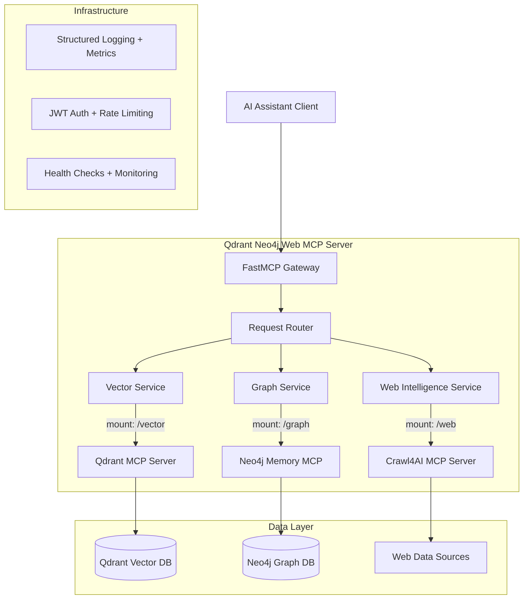

# Product Requirements Document: Qdrant Neo4j Web MCP Server

## 1. Project Purpose & Goals

### Vision

Create a production-ready Model Context Protocol (MCP) server combining Qdrant vector search, Neo4j knowledge graphs, and web intelligence into a cohesive platform for AI assistant interactions.

### Primary Goals

- **Portfolio Excellence**: Demonstrate advanced AI/ML engineering skills for 2025 recruiters
- **One-Day Development**: Complete functional deployment within 24 hours using modern tooling
- **Production-Ready**: Small-scale deployment with enterprise-grade patterns
- **Cost-Effective**: $0-30/month scaling path with clear optimization strategies
- **Maintainable**: Clean architecture requiring minimal ongoing maintenance

### Success Metrics

- ✅ Single FastMCP 2.0 server with three mounted service abstractions
- ✅ Docker deployment with monitoring, security, and health checks
- ✅ Comprehensive test coverage (≥90%) with modern testing patterns
- ✅ Production security (OWASP compliant, JWT auth, rate limiting)
- ✅ Interactive documentation and demo capabilities

## 2. Architecture Decision

### Selected Approach: Qdrant Neo4j Web FastMCP Server

**Decision Score**: 0.88/1.0 via weighted multi-criteria analysis

**Weighted Criteria Results**:

- Maintainability (35%): 0.90 - Clean FastMCP composition patterns
- Library Utilization (25%): 0.95 - Official MCP integrations
- Cost-Effectiveness (20%): 0.85 - Single container deployment
- Recruiter Appeal (15%): 0.80 - Modern architecture demonstration
- Security (5%): 0.90 - Built-in FastMCP security features

### Architecture Overview



## 3. Tool Contracts & Data Models

### Core MCP Tools

#### Vector Intelligence Tools (`/vector`)

- `vector-search` - Semantic search across embedded content
- `vector-store` - Store documents with embeddings
- `vector-collections` - Manage vector collections and schemas

#### Graph Intelligence Tools (`/graph`)

- `graph-query` - Cypher queries for structured knowledge
- `graph-memory` - Store and retrieve contextual memories
- `graph-relationships` - Analyze entity relationships and patterns

#### Web Intelligence Tools (`/web`)

- `web-crawl` - Extract structured data from web pages
- `web-search` - Search and analyze web content
- `web-monitor` - Track changes in web resources

### Unified Data Models

```python
from pydantic import BaseModel, Field
from typing import List, Dict, Any, Optional
from datetime import datetime

class IntelligenceQuery(BaseModel):
    """Unified query interface for all intelligence services"""
    query: str = Field(..., description="Natural language query")
    mode: str = Field("auto", description="Processing mode: auto, vector, graph, web")
    filters: Dict[str, Any] = Field(default_factory=dict)
    limit: int = Field(10, ge=1, le=100)
    
class IntelligenceResult(BaseModel):
    """Unified result interface for all intelligence services"""
    content: str = Field(..., description="Primary content result")
    source: str = Field(..., description="Source service: vector, graph, web")
    confidence: float = Field(..., ge=0.0, le=1.0)
    metadata: Dict[str, Any] = Field(default_factory=dict)
    timestamp: datetime = Field(default_factory=datetime.utcnow)

class HealthStatus(BaseModel):
    """Service health monitoring"""
    service: str
    status: str = Field(..., regex="^(healthy|degraded|unhealthy)$")
    response_time_ms: float
    last_check: datetime
    details: Dict[str, Any] = Field(default_factory=dict)
```

## 4. Security Implementation

### Authentication & Authorization

- **JWT Bearer Tokens**: Production-grade authentication
- **Scope-Based Access**: Granular permissions per service
- **Rate Limiting**: Prevent abuse and ensure fair usage
- **Request Validation**: Comprehensive input sanitization

### OWASP API Security Top 10 Compliance

- API1: Broken Object Level Authorization → Scope validation
- API2: Broken User Authentication → JWT with secure configuration
- API3: Broken Object Property Level Authorization → Field-level permissions
- API4: Unrestricted Resource Consumption → Rate limiting + resource quotas
- API5: Broken Function Level Authorization → Tool-level permissions
- API6: Unrestricted Access to Sensitive Business Flows → Audit logging
- API7: Server Side Request Forgery → URL validation and allowlists
- API8: Security Misconfiguration → Secure defaults and hardening
- API9: Improper Inventory Management → API documentation and monitoring
- API10: Unsafe Consumption of APIs → Input validation and sanitization

### Security Configuration

```python
# FastMCP Security Settings
security_config = {
    "jwt_secret": "${JWT_SECRET_KEY}",  # Environment variable
    "jwt_algorithm": "HS256",
    "jwt_expiry_hours": 24,
    "rate_limit_per_minute": 100,
    "cors_origins": ["https://your-domain.com"],
    "request_timeout_seconds": 30,
    "max_request_size_mb": 10
}
```

## 5. Non-Functional Requirements

### Performance

- **Response Time**: <200ms for cached queries, <2s for complex operations
- **Throughput**: Support 100+ concurrent requests per minute
- **Memory Usage**: <512MB base usage, <2GB under load
- **Scaling**: Horizontal scaling via container orchestration

### Reliability

- **Uptime**: 99.5% availability target for portfolio demonstration
- **Error Handling**: Graceful degradation with meaningful error messages
- **Monitoring**: Real-time health checks and structured logging
- **Backup**: Automated data backup strategies for persistence

### Security

- **Encryption**: TLS 1.3 for data in transit, encrypted storage at rest
- **Authentication**: Multi-layer auth with JWT and API keys
- **Audit**: Comprehensive request logging for security analysis
- **Vulnerability**: Regular dependency scanning and updates

## 6. Implementation Plan

### Phase 3: Core Implementation (Day 1)

**Timeline**: 8 hours, 6-8 parallel agents

1. **FastMCP Server Foundation** (Agent 1)
   - Server composition with mounting patterns
   - Authentication middleware and security
   - Request routing and error handling

2. **Qdrant Integration** (Agent 2)
   - Vector storage and search capabilities
   - Embedding pipeline integration
   - Collection management and optimization

3. **Neo4j Integration** (Agent 3)
   - Memory graph implementation
   - Relationship analysis and querying
   - GraphRAG integration patterns

4. **Crawl4AI Integration** (Agent 4)
   - Web intelligence extraction
   - Async crawling with rate limiting
   - Content processing and structuring

5. **Testing Infrastructure** (Agent 5)
   - Comprehensive test suite (unit, integration, property-based)
   - Performance benchmarking and validation
   - Test automation and coverage analysis

6. **Deployment & Infrastructure** (Agent 6)
   - Docker containerization with optimization
   - Health checks and monitoring setup
   - CI/CD pipeline implementation

### Phase 4: Quality Assurance (2 hours)

- Code formatting (ruff format, ruff check)
- Type checking and linting validation
- Security scanning and vulnerability assessment
- Performance testing and optimization

### Phase 5: Documentation & Portfolio (2 hours)

- Interactive API documentation
- Demo implementation and showcase
- Portfolio presentation materials
- Final integration testing

## 7. Technology Stack

### Core Framework

- **FastMCP 2.0**: Server composition and MCP protocol handling
- **Python 3.11+**: Modern async patterns and type safety
- **Pydantic v2**: Data validation and serialization
- **FastAPI**: Security, documentation, and performance

### Data & Intelligence

- **Qdrant**: Vector database for semantic search
- **Neo4j**: Graph database for knowledge representation
- **Crawl4AI**: Web intelligence and content extraction

### Development & Operations

- **uv**: Fast, deterministic package management
- **ruff**: Comprehensive linting and formatting
- **pytest**: Modern testing with async support
- **Docker**: Containerization and deployment

### Monitoring & Observability

- **structlog**: Structured logging for production
- **Sentry**: Error tracking and performance monitoring
- **UptimeRobot**: Availability monitoring

## 8. Deployment Strategy

### Three-Tier Approach

#### Tier 1: Development Portfolio ($0-5/month)

- Railway/Fly.io free tiers
- In-memory/SQLite persistence
- Basic monitoring and logging
- **Purpose**: Rapid prototyping and initial demo

#### Tier 2: Professional Demo ($15-30/month)

- Managed database services
- Enhanced monitoring and alerting
- CDN and performance optimization
- **Purpose**: Recruiter showcase and portfolio presentation

#### Tier 3: Production-Ready ($50-100/month)

- Auto-scaling infrastructure
- Comprehensive observability stack
- Enterprise security features
- **Purpose**: Real user deployment and scaling demonstration

### Container Configuration

```dockerfile
# Multi-stage optimized Dockerfile
FROM python:3.11-slim as builder
# ... dependency installation

FROM python:3.11-slim as runtime
# ... optimized runtime configuration
# Health checks, security hardening, non-root user
```

## 9. Testing Strategy

### Test Architecture

- **Unit Tests**: Individual component validation with 90%+ coverage
- **Integration Tests**: Service interaction and data flow validation
- **Property-Based Tests**: Edge case discovery and protocol compliance
- **Performance Tests**: Load testing and benchmark validation
- **Contract Tests**: API contract validation between services

### Test Implementation

```python
# Example test structure
class TestQdrantNeo4jWebMCPServer:
    async def test_vector_search_integration(self):
        """Test vector search with real embeddings"""
        
    async def test_graph_memory_persistence(self):
        """Test knowledge graph memory operations"""
        
    async def test_web_crawl_rate_limiting(self):
        """Test web crawling with proper rate limits"""
        
    async def test_security_authentication(self):
        """Test JWT authentication and authorization"""
```

## 10. Success Criteria & Portfolio Value

### Technical Excellence Indicators

- ✅ **Modern Architecture**: Demonstrates 2025 best practices
- ✅ **Production Patterns**: Real-world scalability and security
- ✅ **Testing Rigor**: Comprehensive validation strategies
- ✅ **Documentation Quality**: Clear, comprehensive, and interactive
- ✅ **Operational Excellence**: Monitoring, logging, and deployment automation

### Recruiter Appeal Factors

- **AI/ML Integration**: Demonstrates vector databases, knowledge graphs, and web intelligence
- **Modern Python**: Async patterns, type safety, and current ecosystem knowledge
- **Production Engineering**: Security, monitoring, testing, and deployment expertise
- **Architecture Skills**: Clean abstractions and composable system design
- **DevOps Capabilities**: Container orchestration, CI/CD, and infrastructure as code

## 11. Risk Mitigation

### Technical Risks

- **Complexity Overflow**: Mitigated by FastMCP composition patterns and proven libraries
- **Performance Issues**: Addressed through async architecture and caching strategies
- **Security Vulnerabilities**: Prevented via OWASP compliance and security-first design
- **Integration Challenges**: Reduced by using official MCP server implementations

### Timeline Risks

- **Scope Creep**: Strictly controlled via one-day development constraint
- **Debugging Time**: Minimized through comprehensive testing and monitoring
- **Configuration Complexity**: Simplified via environment-based configuration

## 12. Future Considerations

### Scalability Path

- **Horizontal Scaling**: Container orchestration with Kubernetes
- **Data Partitioning**: Sharding strategies for vector and graph databases
- **Caching Layers**: Redis integration for frequently accessed data
- **API Gateway**: Kong or AWS API Gateway for advanced routing

### Feature Extensions

- **Multi-Modal Intelligence**: Image and audio processing capabilities
- **Real-Time Streaming**: WebSocket support for live data feeds
- **Advanced Analytics**: Usage patterns and performance insights
- **Enterprise Features**: Multi-tenancy, RBAC, and audit compliance

## 13. References & Research Sources

### Documentation Sources

- **FastMCP 2.0**: `/logs/agent1_fastmcp_research.md` - Server composition patterns
- **Qdrant Integration**: `/logs/agent2_qdrant_research.md` - Vector database optimization
- **Neo4j Patterns**: `/logs/agent3_neo4j_research.md` - Knowledge graph implementation
- **Crawl4AI Integration**: `/logs/agent4_crawl4ai_research.md` - Web intelligence patterns
- **Security Best Practices**: `/logs/agent5_security_research.md` - OWASP compliance
- **Deployment Strategies**: `/logs/agent6_deployment_research.md` - Infrastructure patterns
- **Testing Approaches**: `/logs/agent7_testing_research.md` - Quality assurance
- **Portfolio Optimization**: `/logs/agent8_portfolio_research.md` - Recruiter appeal

### llms-txt Integration

- Referenced latest documentation for FastMCP, Qdrant, Neo4j, and Crawl4AI
- Incorporated 2025 best practices and modern Python patterns
- Applied security standards and deployment optimizations

---

**Document Version**: 1.0  
**Last Updated**: 2025-06-27  
**Next Review**: Implementation Phase Completion  
**Approval Status**: Ready for Implementation
