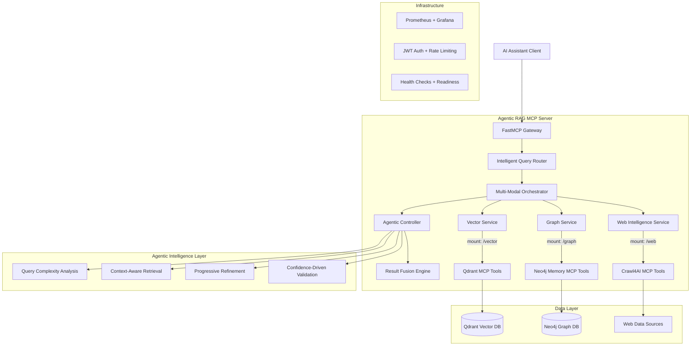
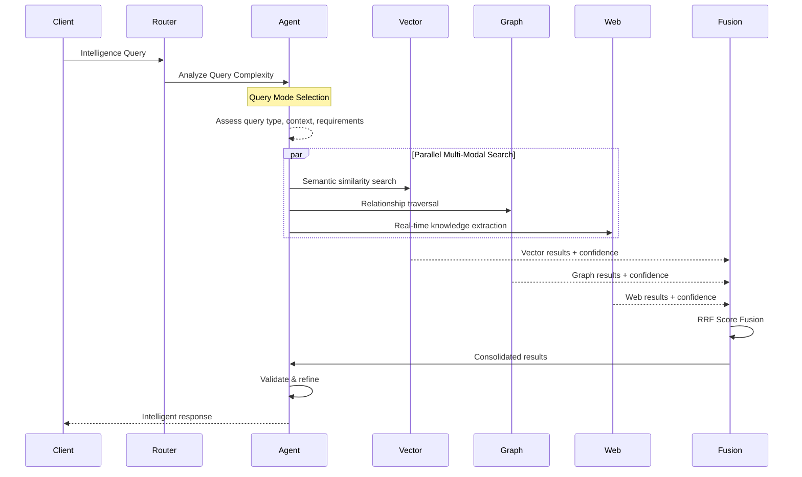
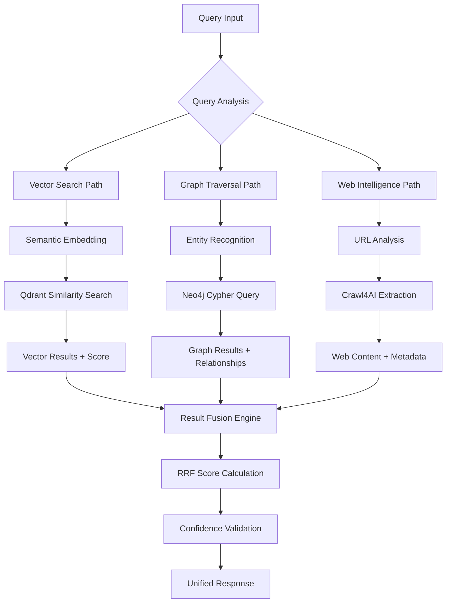
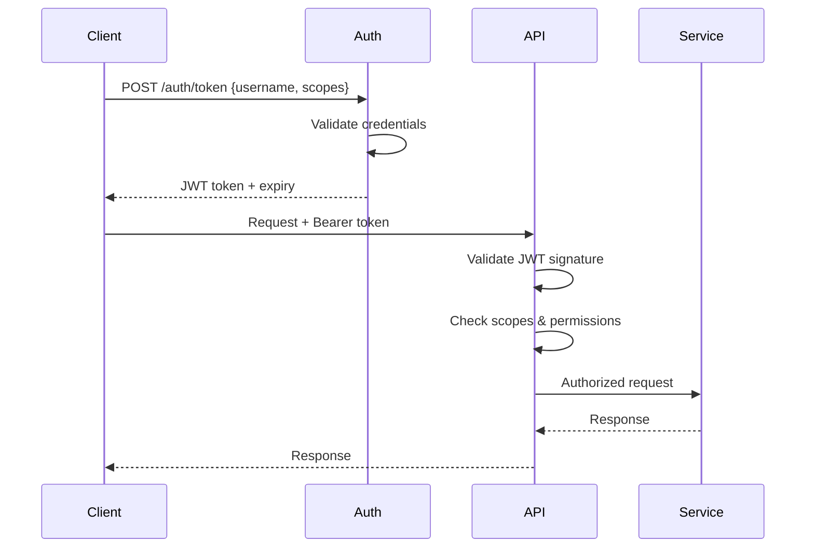

# Technical Documentation: Agentic RAG MCP Server

## Table of Contents

1. [System Overview](#system-overview)
2. [Architecture Documentation](#architecture-documentation)
3. [API Reference](#api-reference)
4. [Development Guide](#development-guide)
5. [Deployment Guide](#deployment-guide)
6. [Security & Authentication](#security--authentication)
7. [Monitoring & Observability](#monitoring--observability)
8. [Performance & Scaling](#performance--scaling)
9. [Troubleshooting](#troubleshooting)

---

## System Overview

The Agentic RAG MCP Server is a production-ready, unified Model Context Protocol (MCP) server that combines vector search (Qdrant), knowledge graphs (Neo4j), and web intelligence (Crawl4AI) into a cohesive platform for AI assistant interactions. Built with FastMCP 2.0, it provides autonomous research capabilities through multi-modal intelligence fusion.

### Key Features

- **Multi-Modal Intelligence**: Unified access to vector search, graph databases, and web crawling
- **Agentic Architecture**: Autonomous query routing and result fusion with confidence scoring
- **Production Security**: JWT authentication, OWASP compliance, rate limiting
- **Performance Optimized**: Async-first design with connection pooling and caching
- **Kubernetes Ready**: Complete container orchestration with auto-scaling
- **Comprehensive Monitoring**: Prometheus metrics, Grafana dashboards, structured logging

### Technology Stack

- **Framework**: FastMCP 2.0 with FastAPI
- **Language**: Python 3.11+ with async/await patterns
- **Databases**: Qdrant (vector), Neo4j (graph)
- **Web Intelligence**: Crawl4AI
- **Authentication**: JWT with bearer tokens
- **Monitoring**: Prometheus, Grafana, Loki
- **Deployment**: Docker, Kubernetes, Railway/Fly.io

---

## Architecture Documentation

### High-Level Architecture



### Service Architecture Details

#### 1. FastMCP Service Composition

```python
# Unified server with service mounting
main_mcp = FastMCP("Unified MCP Intelligence Server")

# Individual service servers
vector_mcp = FastMCP("Vector Intelligence")
graph_mcp = FastMCP("Graph Intelligence")
web_mcp = FastMCP("Web Intelligence")

# Service composition
main_mcp.mount(vector_mcp, prefix="/vector")
main_mcp.mount(graph_mcp, prefix="/graph")
main_mcp.mount(web_mcp, prefix="/web")
```

#### 2. Agentic Intelligence Flow



#### 3. Data Flow Architecture



---

## API Reference

### Authentication Endpoints

#### POST /auth/token

Generate JWT access token for API authentication.

**Request Body:**

```json
{
  "username": "string",
  "scopes": ["read", "write", "admin"]
}
```

**Response:**

```json
{
  "access_token": "eyJ0eXAiOiJKV1QiLCJhbGciOiJIUzI1NiJ9...",
  "token_type": "bearer",
  "expires_in": 86400,
  "scopes": ["read", "write"]
}
```

### Intelligence Endpoints

#### POST /api/v1/intelligence/query

Unified intelligence query across all services with agentic routing.

**Headers:**

```text
Authorization: Bearer <token>
Content-Type: application/json
```

**Request Body:**

```json
{
  "query": "What are the latest developments in RAG architecture?",
  "mode": "auto",
  "filters": {
    "domain": "AI/ML",
    "recency": "1_month"
  },
  "limit": 10
}
```

**Response:**

```json
{
  "content": "Based on multi-modal analysis...",
  "source": "hybrid",
  "confidence": 0.92,
  "metadata": {
    "vector_results": 8,
    "graph_paths": 3,
    "web_sources": 5,
    "fusion_method": "RRF",
    "query_complexity": "high",
    "processing_time_ms": 156
  },
  "timestamp": "2025-06-27T10:30:00Z"
}
```

### Vector Intelligence Endpoints

#### POST /api/v1/vector/search

Semantic vector search using Qdrant.

**Request Body:**

```json
{
  "query": "machine learning architectures",
  "limit": 5,
  "score_threshold": 0.7,
  "filters": {
    "content_type": "research_paper"
  }
}
```

#### POST /api/v1/vector/store

Store document with vector embedding.

**Request Body:**

```json
{
  "content": "Document content to embed",
  "collection_name": "knowledge_base",
  "metadata": {
    "source": "research_paper",
    "author": "Jane Doe",
    "topic": "RAG"
  },
  "tags": ["AI", "NLP", "RAG"]
}
```

#### GET /api/v1/vector/collections

List all vector collections with statistics.

**Response:**

```json
{
  "collections": [
    {
      "name": "knowledge_base",
      "status": "green",
      "vector_size": 384,
      "points_count": 15420,
      "disk_usage_mb": 234.5
    }
  ],
  "total_collections": 3,
  "total_vectors": 45670
}
```

### Graph Intelligence Endpoints

#### POST /api/v1/graph/query

Knowledge graph query using Neo4j Cypher.

**Request Body:**

```json
{
  "query": "Find researchers connected to RAG development",
  "cypher": "MATCH (r:Researcher)-[:WORKED_ON]->(p:Project {topic: 'RAG'}) RETURN r, p",
  "limit": 10
}
```

#### POST /api/v1/graph/memory

Store contextual memory in knowledge graph.

**Request Body:**

```json
{
  "entity": "OpenAI",
  "relationship": "DEVELOPED",
  "target": "GPT-4",
  "context": "Large language model development",
  "metadata": {
    "year": 2023,
    "significance": "high"
  }
}
```

### Web Intelligence Endpoints

#### POST /api/v1/web/crawl

Extract content from web sources using Crawl4AI.

**Request Body:**

```json
{
  "url": "https://example.com/research-paper",
  "extraction_mode": "intelligent",
  "include_links": true,
  "respect_robots": true
}
```

#### POST /api/v1/web/monitor

Monitor web sources for changes.

**Request Body:**

```json
{
  "urls": ["https://arxiv.org/list/cs.AI/recent"],
  "check_interval": "1h",
  "change_threshold": 0.1
}
```

### Administrative Endpoints

#### GET /health

Application health check with service status.

#### GET /ready

Kubernetes readiness probe.

#### GET /metrics

Prometheus metrics endpoint.

#### GET /api/v1/admin/stats

Administrative statistics (requires admin scope).

---

## Development Guide

### Prerequisites

- Python 3.11+
- Docker and Docker Compose
- uv package manager
- Access to Qdrant, Neo4j, and OpenAI APIs

### Development Setup

1. **Clone and Install Dependencies**

   ```bash
   git clone <repository-url>
   cd qdrant-neo4j-crawl4ai-mcp
   uv sync
   ```

2. **Environment Configuration**

   ```bash
   cp .env.example .env
   # Edit .env with your configuration
   ```

3. **Start Development Services**

   ```bash
   docker-compose up -d qdrant neo4j
   ```

4. **Run Development Server**

   ```bash
   uv run python -m qdrant_neo4j_crawl4ai_mcp.main
   ```

### Code Organization

```text
src/qdrant_neo4j_crawl4ai_mcp/
├── main.py              # FastAPI application entry point
├── config.py            # Configuration management
├── auth.py              # Authentication & authorization
├── middleware.py        # Custom middleware stack
├── models/              # Pydantic data models
│   ├── vector_models.py # Vector service models
│   ├── graph_models.py  # Graph service models
│   └── web_models.py    # Web service models
├── services/            # Core business logic
│   ├── vector_service.py    # Qdrant vector operations
│   ├── graph_service.py     # Neo4j graph operations
│   ├── web_service.py       # Crawl4AI web operations
│   └── agentic_service.py   # Agentic intelligence coordination
└── tools/               # MCP tool implementations
    ├── vector_tools.py  # Vector MCP tools
    ├── graph_tools.py   # Graph MCP tools
    └── web_tools.py     # Web MCP tools
```

### Adding New MCP Tools

1. **Define Tool Function**

   ```python
   @mcp.tool()
   async def new_vector_operation(
       query: str,
       ctx: Context = None
   ) -> dict:
       """New vector operation description."""
       ctx.info(f"Processing: {query}")
       # Implementation here
       return result
   ```

2. **Register Tool**

   ```python
   def register_vector_tools(mcp: FastMCP, service: VectorService):
       mcp.tool()(lambda **kwargs: new_vector_operation(**kwargs))
   ```

3. **Add Tests**

   ```python
   async def test_new_vector_operation():
       result = await new_vector_operation("test query")
       assert result["status"] == "success"
   ```

### Testing Strategy

```bash
# Run all tests
uv run pytest

# Run with coverage
uv run pytest --cov=src --cov-report=html

# Run specific test categories
uv run pytest tests/unit/        # Unit tests
uv run pytest tests/integration/ # Integration tests
uv run pytest tests/performance/ # Performance tests
```

### Code Quality

```bash
# Format code
uv run ruff format .

# Lint and fix
uv run ruff check . --fix

# Type checking
uv run mypy src/
```

---

## Deployment Guide

### Docker Deployment

#### Build and Run Locally

```bash
# Build image
docker build -t qdrant-neo4j-crawl4ai-mcp .

# Run with docker-compose
docker-compose up -d
```

#### Production Configuration

```yaml
# docker-compose.prod.yml
version: "3.8"
services:
  mcp-server:
    image: qdrant-neo4j-crawl4ai-mcp:latest
    environment:
      - ENVIRONMENT=production
      - LOG_LEVEL=INFO
      - JWT_SECRET_KEY=${JWT_SECRET_KEY}
    ports:
      - "8000:8000"
    depends_on:
      - qdrant
      - neo4j
    restart: unless-stopped
```

### Kubernetes Deployment

#### Basic Deployment

```bash
# Apply manifests
kubectl apply -f k8s/manifests/

# Check status
kubectl get pods -n qdrant-neo4j-crawl4ai-mcp
```

#### Scaling Configuration

```yaml
# k8s/manifests/deployment.yaml
apiVersion: apps/v1
kind: Deployment
metadata:
  name: mcp-server
spec:
  replicas: 3
  template:
    spec:
      containers:
        - name: mcp-server
          image: qdrant-neo4j-crawl4ai-mcp:latest
          resources:
            requests:
              memory: "256Mi"
              cpu: "100m"
            limits:
              memory: "512Mi"
              cpu: "500m"
          readinessProbe:
            httpGet:
              path: /ready
              port: 8000
            initialDelaySeconds: 10
            periodSeconds: 5
          livenessProbe:
            httpGet:
              path: /health
              port: 8000
            initialDelaySeconds: 30
            periodSeconds: 10
```

### Platform Deployments

#### Railway

```bash
# Install Railway CLI
npm install -g @railway/cli

# Deploy
railway login
railway up
```

#### Fly.io

```bash
# Install Fly CLI
curl -L https://fly.io/install.sh | sh

# Deploy
flyctl deploy
```

### Infrastructure as Code (AWS CDK)

```python
# infrastructure/mcp_stack.py
from aws_cdk import (
    Stack,
    aws_ecs as ecs,
    aws_ecs_patterns as ecs_patterns,
)

class MCPStack(Stack):
    def __init__(self, scope, construct_id, **kwargs):
        super().__init__(scope, construct_id, **kwargs)

        # ECS Fargate service
        ecs_patterns.ApplicationLoadBalancedFargateService(
            self, "MCPService",
            task_image_options=ecs_patterns.ApplicationLoadBalancedTaskImageOptions(
                image=ecs.ContainerImage.from_registry("your-repo/mcp-server:latest"),
                container_port=8000,
                environment={
                    "ENVIRONMENT": "production",
                    "LOG_LEVEL": "INFO"
                }
            ),
            memory_limit_mib=512,
            desired_count=2,
            public_load_balancer=True
        )
```

---

## Security & Authentication

### JWT Authentication Flow



### Security Configuration

#### Environment Variables

```bash
# Authentication
JWT_SECRET_KEY="your-secret-key-here"
JWT_ALGORITHM="HS256"
JWT_EXPIRE_MINUTES=1440

# CORS
ALLOWED_ORIGINS="https://yourdomain.com,https://staging.yourdomain.com"
ALLOWED_METHODS="GET,POST,PUT,DELETE"
ALLOWED_HEADERS="*"

# Rate Limiting
RATE_LIMIT_REQUESTS=100
RATE_LIMIT_WINDOW=60
```

#### OWASP Compliance

The server implements OWASP API Security Top 10 protections:

1. **API1 - Broken Object Level Authorization**: Scope-based access control
2. **API2 - Broken User Authentication**: JWT with secure configuration
3. **API3 - Broken Object Property Level Authorization**: Field-level permissions
4. **API4 - Unrestricted Resource Consumption**: Rate limiting + resource quotas
5. **API5 - Broken Function Level Authorization**: Tool-level permissions
6. **API6 - Unrestricted Access to Sensitive Business Flows**: Audit logging
7. **API7 - Server Side Request Forgery**: URL validation and allowlists
8. **API8 - Security Misconfiguration**: Secure defaults and hardening
9. **API9 - Improper Inventory Management**: API documentation and monitoring
10. **API10 - Unsafe Consumption of APIs**: Input validation and sanitization

### Security Headers

```python
# Implemented security headers
security_headers = {
    "X-Content-Type-Options": "nosniff",
    "X-Frame-Options": "DENY",
    "X-XSS-Protection": "1; mode=block",
    "Strict-Transport-Security": "max-age=31536000; includeSubDomains",
    "Content-Security-Policy": "default-src 'self'",
    "Referrer-Policy": "strict-origin-when-cross-origin"
}
```

---

## Monitoring & Observability

### Metrics Collection

#### Application Metrics

```python
# Custom metrics with Prometheus
from prometheus_client import Counter, Histogram, Gauge

REQUEST_COUNT = Counter('http_requests_total', 'Total HTTP requests', ['method', 'endpoint'])
REQUEST_DURATION = Histogram('http_request_duration_seconds', 'HTTP request duration')
ACTIVE_CONNECTIONS = Gauge('active_connections', 'Active database connections')
```

#### Service Health Metrics

- Vector service response time and success rate
- Graph query execution time and complexity
- Web crawl success rate and content quality
- Authentication success/failure rates
- Rate limiting triggers

### Grafana Dashboards

#### Overview Dashboard

```json
{
  "dashboard": {
    "title": "MCP Server Overview",
    "panels": [
      {
        "title": "Request Rate",
        "type": "graph",
        "targets": ["rate(http_requests_total[5m])"]
      },
      {
        "title": "Response Time",
        "type": "graph",
        "targets": [
          "histogram_quantile(0.95, rate(http_request_duration_seconds_bucket[5m]))"
        ]
      }
    ]
  }
}
```

### Structured Logging

```python
# Logging configuration
import structlog

structlog.configure(
    processors=[
        structlog.stdlib.filter_by_level,
        structlog.stdlib.add_logger_name,
        structlog.stdlib.add_log_level,
        structlog.processors.TimeStamper(fmt="iso"),
        structlog.processors.JSONRenderer(),
    ],
    logger_factory=structlog.stdlib.LoggerFactory(),
    wrapper_class=structlog.stdlib.BoundLogger,
)

# Usage in code
logger = structlog.get_logger(__name__)
logger.info("Vector search completed",
           query=query,
           results_count=len(results),
           processing_time_ms=duration)
```

### Alert Configuration

#### Critical Alerts

```yaml
# prometheus/alerts.yml
groups:
  - name: mcp-server
    rules:
      - alert: HighErrorRate
        expr: rate(http_requests_total{code=~"5.."}[5m]) > 0.1
        for: 2m
        labels:
          severity: critical
        annotations:
          summary: "High error rate detected"

      - alert: DatabaseConnectionFailure
        expr: up{job="mcp-server"} == 0
        for: 1m
        labels:
          severity: critical
        annotations:
          summary: "MCP server is down"
```

---

## Performance & Scaling

### Performance Characteristics

#### Baseline Performance

- **Request Latency**: <200ms for cached queries, <2s for complex operations
- **Throughput**: 100+ concurrent requests per minute
- **Memory Usage**: <512MB base, <2GB under load
- **Vector Search**: Sub-150ms with parallel execution
- **Graph Queries**: <500ms for typical relationship traversals

#### Optimization Strategies

1. **Connection Pooling**

   ```python
   # Qdrant connection pool
   QdrantClient(
       url=config.qdrant_url,
       timeout=config.connection_timeout,
       prefer_grpc=True,  # Better performance
   )

   # Neo4j connection pool
   GraphDatabase.driver(
       config.uri,
       auth=(config.username, config.password),
       max_connection_pool_size=config.max_pool_size,
       connection_acquisition_timeout=config.connection_timeout,
   )
   ```

2. **Caching Strategy**

   ```python
   # Redis caching for frequent queries
   @cached(ttl=300, key="vector_search_{query_hash}")
   async def cached_vector_search(query: str) -> List[SearchResult]:
       return await vector_service.search(query)
   ```

3. **Async Processing**

   ```python
   # Parallel service calls
   async def hybrid_search(query: str) -> CombinedResult:
       vector_task = asyncio.create_task(vector_service.search(query))
       graph_task = asyncio.create_task(graph_service.query(query))
       web_task = asyncio.create_task(web_service.crawl(query))

       results = await asyncio.gather(vector_task, graph_task, web_task)
       return fusion_engine.combine(results)
   ```

### Scaling Architecture

#### Horizontal Scaling

```yaml
# Kubernetes HPA
apiVersion: autoscaling/v2
kind: HorizontalPodAutoscaler
metadata:
  name: mcp-server-hpa
spec:
  scaleTargetRef:
    apiVersion: apps/v1
    kind: Deployment
    name: mcp-server
  minReplicas: 2
  maxReplicas: 10
  metrics:
    - type: Resource
      resource:
        name: cpu
        target:
          type: Utilization
          averageUtilization: 70
    - type: Resource
      resource:
        name: memory
        target:
          type: Utilization
          averageUtilization: 80
```

#### Load Testing

```python
# Performance test example
import asyncio
import aiohttp
import time

async def load_test():
    async with aiohttp.ClientSession() as session:
        tasks = []
        for i in range(100):  # 100 concurrent requests
            task = session.post(
                "http://localhost:8000/api/v1/intelligence/query",
                json={"query": f"test query {i}"},
                headers={"Authorization": f"Bearer {token}"}
            )
            tasks.append(task)

        start_time = time.time()
        responses = await asyncio.gather(*tasks)
        end_time = time.time()

        print(f"Completed 100 requests in {end_time - start_time:.2f}s")
        print(f"Average response time: {(end_time - start_time) / 100:.3f}s")
```

---

## Troubleshooting

### Common Issues

#### 1. Service Connection Failures

**Symptoms**: 503 Service Unavailable errors, health check failures

**Diagnosis**:

```bash
# Check service status
kubectl logs -f deployment/mcp-server

# Test database connections
docker exec -it qdrant-container qdrant-cli
docker exec -it neo4j-container cypher-shell
```

**Resolution**:

- Verify environment variables
- Check network connectivity
- Restart dependent services
- Review security group/firewall rules

#### 2. Authentication Issues

**Symptoms**: 401 Unauthorized, JWT validation errors

**Diagnosis**:

```bash
# Decode JWT token
echo "eyJ0eXAiOiJKV1QiLCJhbGciOiJIUzI1NiJ9..." | base64 -d

# Check token expiry
curl -H "Authorization: Bearer $TOKEN" http://localhost:8000/api/v1/profile
```

**Resolution**:

- Verify JWT_SECRET_KEY consistency
- Check token expiration
- Validate user scopes
- Review CORS configuration

#### 3. Performance Degradation

**Symptoms**: Slow response times, high memory usage

**Diagnosis**:

```bash
# Monitor resource usage
kubectl top pods
docker stats

# Check application metrics
curl http://localhost:8000/metrics | grep -E "(request_duration|memory_usage)"
```

**Resolution**:

- Scale horizontally with more replicas
- Optimize database queries
- Implement caching
- Tune connection pool sizes

#### 4. Vector Search Issues

**Symptoms**: Empty search results, embedding errors

**Diagnosis**:

```python
# Test embedding generation
from sentence_transformers import SentenceTransformer
model = SentenceTransformer('all-MiniLM-L6-v2')
embedding = model.encode("test query")
print(f"Embedding shape: {embedding.shape}")

# Check Qdrant collection
response = qdrant_client.get_collection("knowledge_base")
print(f"Collection points: {response.points_count}")
```

**Resolution**:

- Verify embedding model compatibility
- Check collection configuration
- Rebuild corrupted indices
- Validate input data format

### Debug Mode

Enable comprehensive debugging:

```bash
# Environment variables
DEBUG=true
LOG_LEVEL=DEBUG
ENABLE_SWAGGER_UI=true

# Run with debug logging
uv run python -m qdrant_neo4j_crawl4ai_mcp.main
```

### Health Check Endpoints

Monitor service health:

```bash
# Overall health
curl http://localhost:8000/health

# Individual service health
curl -H "Authorization: Bearer $TOKEN" http://localhost:8000/api/v1/vector/health
curl -H "Authorization: Bearer $TOKEN" http://localhost:8000/api/v1/graph/health
curl -H "Authorization: Bearer $TOKEN" http://localhost:8000/api/v1/web/health
```

---

## Conclusion

This technical documentation provides comprehensive guidance for understanding, developing, deploying, and maintaining the Agentic RAG MCP Server. The system represents a production-ready implementation of modern AI architecture patterns, combining vector search, knowledge graphs, and web intelligence into a unified, scalable platform.

For additional support:

- Review the [API Reference](#api-reference) for detailed endpoint documentation
- Consult the [Development Guide](#development-guide) for code examples and patterns
- Follow the [Deployment Guide](#deployment-guide) for platform-specific instructions
- Use the [Troubleshooting](#troubleshooting) section for issue resolution

The architecture is designed for both immediate demonstration value and long-term production scalability, making it an ideal showcase of modern AI engineering capabilities.
