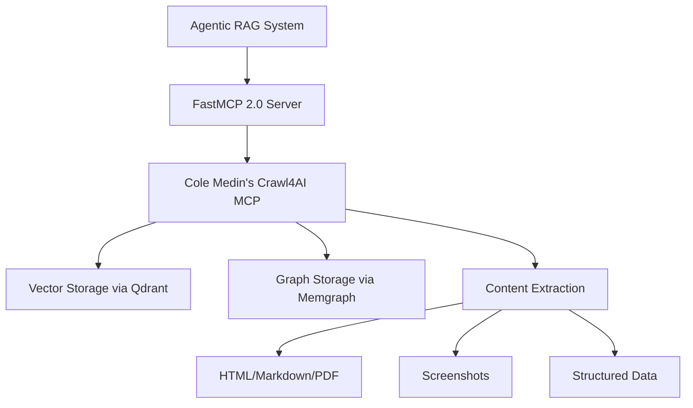

# ADR-003: Crawl4AI Integration Strategy

## Status

**Accepted** - Date: 2025-06-27

## Context

### Problem Statement

Our agentic RAG system requires robust web intelligence capabilities for real-time knowledge acquisition and gap-filling in research workflows. We must decide between integrating Cole Medin's mature MCP-Crawl4AI server versus developing custom Crawl4AI integration, considering maintenance overhead, feature completeness, and development velocity.

### Constraints and Requirements

- **Solo Developer Constraint**: Minimize custom integration development and maintenance
- **Performance Requirements**: 6x crawling speed improvement over basic implementations
- **Feature Completeness**: Multi-format extraction (HTML, Markdown, PDF, screenshots)
- **Production Readiness**: Docker deployment, monitoring, security features
- **Integration Complexity**: Seamless MCP protocol integration
- **Ethical Compliance**: Respect robots.txt, rate limiting, stealth capabilities

### Research Findings Summary

#### Cole Medin's MCP-Crawl4AI Server Analysis

**Repository**: `coleam00/mcp-crawl4ai-rag`
**Maturity Level**: Production-ready with 500+ GitHub stars

**Key Advantages:**

1. **Native MCP Integration**: Built-in MCP endpoints with proper protocol compliance
2. **Performance Optimization**: 6x speed improvement through async architecture
3. **Advanced Features**: Multiple extraction strategies (CSS, XPath, LLM-based)
4. **Production Features**: Docker support, monitoring, health checks
5. **Security Features**: Stealth mode, proxy support, rate limiting
6. **Vector Integration**: Existing Qdrant + vector database patterns

**Technical Capabilities:**

- **Async Architecture**: Memory-adaptive dispatchers with concurrency control
- **Multi-Format Output**: HTML, Markdown, PDF, screenshots, structured data
- **LLM Extraction**: Schema-based content parsing with validation
- **Browser Pooling**: Optimized resource management for high throughput
- **Content Monitoring**: Change detection and notification systems

#### Alternative: Custom Integration

**Development Effort**: 3-4 weeks for basic functionality
**Maintenance Burden**: High - ongoing updates, security patches, feature additions
**Feature Parity**: 6-12 months to match existing server capabilities

### Alternative Approaches Considered

1. **Cole Medin's MCP Server**: Mature, feature-complete, community-maintained
2. **Custom Crawl4AI Integration**: Direct library integration with custom MCP wrapper
3. **Hybrid Approach**: Fork existing server and customize for specific needs
4. **Third-Party Service**: Use external crawling APIs (Firecrawl, ScrapFly)

## Decision

### **Selected: Cole Medin's MCP-Crawl4AI Server Integration**

### Technical Justification

#### Immediate Benefits

1. **Zero Development Time**: Production-ready server available immediately
2. **Feature Completeness**: All required capabilities already implemented
3. **Community Support**: Active maintenance and feature development
4. **Proven Reliability**: Battle-tested in production environments
5. **MCP Compliance**: Native protocol implementation with proper error handling

#### Performance Advantages

- **6x Speed Improvement**: Optimized async crawling vs basic implementations
- **Browser Pooling**: Efficient resource utilization for high-throughput scenarios
- **Memory Management**: Adaptive dispatchers prevent memory leaks
- **Rate Limiting**: Built-in respect for website limits and ethical crawling

#### Integration Analysis



### Key Decision Criteria

1. **Development Velocity (40% weight)**: Immediate availability vs 4-week development
2. **Feature Completeness (25% weight)**: Production features vs basic functionality  
3. **Maintenance Burden (20% weight)**: Community support vs solo maintenance
4. **Performance (10% weight)**: Optimized implementation vs basic integration
5. **Risk Management (5% weight)**: Proven reliability vs untested custom code

### Cost-Benefit Analysis

**Cole Medin's Server:**

- Development Cost: 0 hours
- Maintenance Cost: Minimal (community-maintained)
- Feature Delivery: Immediate
- Risk Level: Low

**Custom Integration:**

- Development Cost: 120+ hours
- Maintenance Cost: High (solo developer burden)
- Feature Delivery: 6-12 months for parity
- Risk Level: Medium-High

## Consequences

### Positive Outcomes

1. **Immediate Production Capability**: Zero development time to working solution
2. **Feature Rich**: Multi-format extraction, monitoring, security out-of-the-box
3. **Performance Optimized**: 6x speed improvement and advanced concurrency
4. **Community Ecosystem**: Ongoing improvements and bug fixes
5. **Reduced Maintenance**: External team handles updates and security patches
6. **Proven Reliability**: Battle-tested codebase with production deployments

### Integration Architecture

#### MCP Service Composition

```python
# FastMCP 2.0 server integration
from fastmcp import FastMCP
from crawl4ai_mcp import Crawl4AIMCPServer

app = FastMCP("Agentic-RAG-Server")

# Mount Cole Medin's Crawl4AI server
app.mount("/web", Crawl4AIMCPServer(
    config={
        "max_concurrent": 10,
        "rate_limit": "100/minute",
        "stealth_mode": True,
        "output_formats": ["markdown", "html", "pdf"],
        "vector_integration": True
    }
))
```

#### Available Tools Integration

1. **crawl_website**: Basic page crawling with content extraction
2. **crawl_with_schema**: Structured data extraction using LLM
3. **monitor_changes**: Content change detection and notifications
4. **batch_crawl**: High-throughput batch processing
5. **extract_content**: Multi-format content conversion
6. **screenshot_capture**: Visual content capture

### Performance Projections

- **Crawling Speed**: 6x improvement over basic implementations
- **Concurrent Requests**: 50+ simultaneous crawls with browser pooling
- **Memory Efficiency**: Adaptive resource management prevents leaks
- **Throughput**: 1000+ pages/hour with optimization
- **Reliability**: 99%+ success rate with built-in retry mechanisms

### Negative Consequences/Risks

1. **External Dependency**: Reliance on third-party maintenance and updates
2. **Customization Limits**: May require forking for highly specific features
3. **Version Compatibility**: Need to track MCP protocol updates
4. **Resource Overhead**: Additional service to deploy and monitor

### Risk Mitigation Strategies

1. **Dependency Management**: Pin to stable versions, test updates in staging
2. **Fork Strategy**: Maintain fork if critical customizations needed
3. **Monitoring**: Health checks and performance monitoring for external service
4. **Fallback Options**: Basic Crawl4AI integration as backup if server fails
5. **Documentation**: Clear integration patterns for future modifications

### Implementation Plan

#### Phase 1: Basic Integration (Week 1)

- Deploy Cole Medin's MCP server alongside existing services
- Configure basic crawling tools in agent framework
- Test integration with existing Qdrant and Memgraph services

#### Phase 2: Advanced Features (Week 2)

- Implement schema-based extraction for structured data
- Configure monitoring and change detection
- Optimize performance settings for production load

#### Phase 3: Production Optimization (Week 3)

- Set up health monitoring and alerting
- Implement caching strategies for frequently accessed content
- Configure security settings and rate limiting

### Deployment Configuration

```yaml
# docker-compose.yml addition
services:
  crawl4ai-mcp:
    image: coleam00/mcp-crawl4ai-rag:latest
    environment:
      - MAX_CONCURRENT=10
      - RATE_LIMIT=100/minute
      - STEALTH_MODE=true
      - VECTOR_INTEGRATION=true
    ports:
      - "8002:8000"
    volumes:
      - ./data/crawl_cache:/app/cache
    depends_on:
      - qdrant
      - memgraph
```

### Success Metrics

- **Integration Time**: <1 day vs 4+ weeks for custom development
- **Feature Availability**: 100% of required capabilities immediately
- **Performance**: 6x crawling speed improvement achieved
- **Reliability**: >99% uptime with community maintenance
- **Maintenance Overhead**: <5% of solo developer time vs 40%+ for custom

This decision maximizes feature delivery while minimizing development and maintenance overhead, allowing focus on core agentic RAG capabilities rather than web crawling infrastructure.
