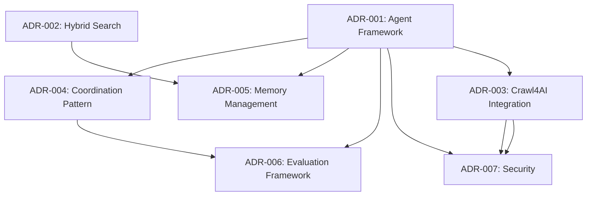

# Architecture Decision Records (ADRs)

This directory contains Architecture Decision Records for the agentic RAG implementation of the qdrant-memgraph-mcp server. These ADRs document key architectural decisions, their rationale, and consequences to maintain institutional knowledge and guide future development.

## Overview

Based on comprehensive research from 5 parallel research agents, these ADRs capture the decision-making process for implementing agentic RAG capabilities on top of our existing FastMCP 2.0 + Qdrant + Memgraph infrastructure.

## Decision Summary

| ADR                                                      | Title                               | Status   | Decision                            |
| -------------------------------------------------------- | ----------------------------------- | -------- | ----------------------------------- |
| [ADR-001](./ADR-001-agent-framework-selection.md)        | Agent Framework Selection           | Accepted | **Pydantic-AI**                     |
| [ADR-002](./ADR-002-hybrid-search-architecture.md)       | Hybrid Search Architecture          | Accepted | **RRF with Context Graph Boosting** |
| [ADR-003](./ADR-003-crawl4ai-integration-strategy.md)    | Crawl4AI Integration Strategy       | Accepted | **Cole Medin's MCP Server**         |
| [ADR-004](./ADR-004-multi-agent-coordination-pattern.md) | Multi-Agent Coordination Pattern    | Accepted | **Central Orchestration**           |
| [ADR-005](./ADR-005-memory-state-management.md)          | Memory and State Management         | Accepted | **GraphRAG Hybrid Memory**          |
| [ADR-006](./ADR-006-evaluation-monitoring-framework.md)  | Evaluation and Monitoring Framework | Accepted | **RAGAs + Custom Metrics**          |
| [ADR-007](./ADR-007-security-authentication.md)          | Security and Authentication         | Accepted | **Enhanced FastMCP Security**       |

## Implementation Dependencies



## Key Research Findings

### Framework Analysis

- **Pydantic-AI**: Optimal for solo developer productivity with FastAPI integration
- **RRF Algorithm**: 2024-2025 industry standard adopted by Azure, OpenSearch, MongoDB
- **Cole Medin's MCP Server**: Production-ready with 6x performance improvement
- **Central Orchestration**: Best balance of control and simplicity for solo developer

### Performance Targets

- **Query Latency**: Sub-200ms for simple queries, <2s for complex multi-agent workflows
- **Throughput**: 1000+ QPS capability with proper resource allocation
- **Relevance Improvement**: 15-30% over single-modal approaches
- **Infrastructure Reuse**: 90% code reuse with existing FastMCP patterns

### Risk Assessment

All decisions are classified as **LOW RISK** with:

- Proven frameworks and integration patterns
- Fallback strategies identified for each component
- Incremental implementation approach
- Existing production infrastructure foundation

## Implementation Roadmap

### Phase 1: Foundation (Weeks 1-2)

  1. **ADR-001**: Install Pydantic-AI and implement basic agent structure
  2. **ADR-002**: Implement basic RRF fusion for hybrid search
  3. **ADR-003**: Deploy Cole Medin's Crawl4AI MCP server

### Phase 2: Integration (Weeks 3-4)

  1. **ADR-004**: Implement central orchestration pattern
  2. **ADR-005**: Add GraphRAG hybrid memory system
  3. **ADR-006**: Deploy basic evaluation metrics

### Phase 3: Production (Weeks 5-6)

  1. **ADR-007**: Implement enhanced security features
  2. **ADR-006**: Complete comprehensive monitoring
  3. Integration testing and performance optimization

## Quality Criteria

Each ADR follows the standard format:

- **Status**: Current state (Proposed/Accepted/Superseded)
- **Context**: Problem statement, constraints, research findings
- **Decision**: Chosen solution with technical justification
- **Consequences**: Benefits, risks, implementation impact

### Decision Criteria Weights

- **Solo Developer Productivity**: 35% (highest priority)
- **Performance & Scalability**: 25%
- **Infrastructure Reuse**: 20%
- **Maintainability**: 15%
- **Risk Management**: 5%

## Related Documentation

- [Agentic RAG Recommendation](../AGENTIC_RAG_RECOMMENDATION.md) - Executive summary and strategic justification
- [Product Requirements Document](../PRD.md) - Detailed technical requirements
- [Research Logs](../../logs/research_log.md) - Comprehensive research findings
- [Developer Guide](../DEVELOPER_GUIDE.md) - Implementation patterns and best practices

## ADR Template

For future architectural decisions, use this template:

```markdown
# ADR-XXX: [Title]

## Status

[Proposed/Accepted/Superseded] - Date: YYYY-MM-DD

## Context

- Problem statement
- Constraints and requirements
- Research findings summary
- Alternative approaches considered

## Decision

- Chosen solution with technical justification
- Key criteria that drove the decision
- Trade-off analysis

## Consequences

- Positive outcomes
- Negative consequences/risks
- Implementation impact
- Maintenance considerations
```

## Contributing

When proposing new architectural decisions:

1. Create a new ADR following the template above
2. Reference relevant research and analysis
3. Include quantitative criteria where possible
4. Consider solo developer constraints and maintenance overhead
5. Update this README with the new ADR

## Questions or Feedback

For questions about these architectural decisions or to propose changes, please:

1. Review the relevant ADR and research documentation
2. Consider the decision criteria and constraints
3. Propose specific alternatives with supporting analysis
4. Open an issue or submit a pull request with your proposed changes

These ADRs represent the culmination of extensive research and analysis optimized for our specific constraints: solo developer productivity, budget efficiency, and production-grade reliability.
