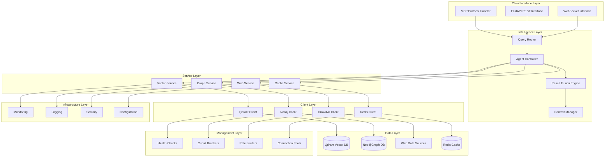

# Component Architecture

This document provides detailed technical specifications for each component in the agentic RAG MCP server architecture, including interfaces, implementation patterns, and integration details.

## Component Overview

The system consists of seven major component layers:



## Intelligence Layer Components

### 1. Query Router

The Query Router serves as the entry point for all intelligence requests, analyzing queries and determining optimal processing strategies.

#### Interface Definition

```python
class QueryRouter:
    """
    Intelligent query routing with strategy selection capabilities.
    
    Analyzes incoming queries to determine optimal processing strategies,
    including single-service routing or multi-service fusion.
    """
    
    async def analyze_query(self, query: IntelligenceQuery) -> QueryAnalysis
    async def select_strategy(self, analysis: QueryAnalysis) -> ProcessingStrategy
    async def route_request(self, strategy: ProcessingStrategy) -> RouteDecision
    async def validate_permissions(self, user: User, route: RouteDecision) -> bool
```

#### Implementation Details

```python
from dataclasses import dataclass
from enum import Enum
from typing import Dict, List, Optional, Set
import re
import spacy
from sentence_transformers import SentenceTransformer

class QueryComplexity(Enum):
    SIMPLE = "simple"      # Single concept, direct answer
    MODERATE = "moderate"  # Multiple concepts, basic relationships
    COMPLEX = "complex"    # Multi-faceted, requires fusion
    ADVANCED = "advanced"  # Deep analysis, expert-level

class QueryIntent(Enum):
    FACTUAL = "factual"           # Information retrieval
    RELATIONAL = "relational"     # Relationship exploration
    ANALYTICAL = "analytical"     # Data analysis
    CREATIVE = "creative"         # Content generation
    TEMPORAL = "temporal"         # Time-sensitive queries

@dataclass
class QueryAnalysis:
    """Comprehensive query analysis result."""
    
    original_query: str
    normalized_query: str
    complexity: QueryComplexity
    intent: QueryIntent
    entities: List[str]
    keywords: Set[str]
    temporal_indicators: List[str]
    confidence_score: float
    processing_hints: Dict[str, Any]

class QueryRouter:
    def __init__(self, config: QueryRouterConfig):
        self.nlp = spacy.load("en_core_web_sm")
        self.embedding_model = SentenceTransformer(config.embedding_model)
        self.complexity_threshold = config.complexity_threshold
        self.intent_classifier = self._load_intent_classifier()
        
        # Pre-computed query patterns
        self.factual_patterns = [
            r"what is",
            r"define",
            r"explain",
            r"describe"
        ]
        
        self.relational_patterns = [
            r"how.*related",
            r"connection between",
            r"relationship",
            r"compare.*with"
        ]
        
        self.temporal_patterns = [
            r"latest",
            r"recent",
            r"current",
            r"today",
            r"yesterday",
            r"last week"
        ]
    
    async def analyze_query(self, query: IntelligenceQuery) -> QueryAnalysis:
        """
        Perform comprehensive query analysis.
        
        Args:
            query: Input intelligence query
            
        Returns:
            Detailed analysis of query characteristics
        """
        # Text preprocessing
        normalized_query = self._normalize_text(query.query)
        
        # Entity extraction using spaCy
        doc = self.nlp(normalized_query)
        entities = [ent.text for ent in doc.ents]
        keywords = self._extract_keywords(doc)
        
        # Intent classification
        intent = self._classify_intent(normalized_query)
        
        # Complexity assessment
        complexity = self._assess_complexity(
            normalized_query, entities, keywords
        )
        
        # Temporal analysis
        temporal_indicators = self._extract_temporal_indicators(normalized_query)
        
        # Confidence scoring
        confidence_score = self._calculate_confidence(
            complexity, intent, entities
        )
        
        # Processing hints generation
        processing_hints = self._generate_processing_hints(
            intent, complexity, temporal_indicators
        )
        
        return QueryAnalysis(
            original_query=query.query,
            normalized_query=normalized_query,
            complexity=complexity,
            intent=intent,
            entities=entities,
            keywords=keywords,
            temporal_indicators=temporal_indicators,
            confidence_score=confidence_score,
            processing_hints=processing_hints
        )
    
    async def select_strategy(self, analysis: QueryAnalysis) -> ProcessingStrategy:
        """
        Select optimal processing strategy based on query analysis.
        
        Args:
            analysis: Query analysis result
            
        Returns:
            Processing strategy with service routing decisions
        """
        strategy_scores = {
            ProcessingStrategy.VECTOR_ONLY: 0.0,
            ProcessingStrategy.GRAPH_ONLY: 0.0,
            ProcessingStrategy.WEB_ONLY: 0.0,
            ProcessingStrategy.HYBRID_FUSION: 0.0
        }
        
        # Intent-based scoring
        if analysis.intent == QueryIntent.FACTUAL:
            strategy_scores[ProcessingStrategy.VECTOR_ONLY] += 0.7
            strategy_scores[ProcessingStrategy.HYBRID_FUSION] += 0.3
        elif analysis.intent == QueryIntent.RELATIONAL:
            strategy_scores[ProcessingStrategy.GRAPH_ONLY] += 0.8
            strategy_scores[ProcessingStrategy.HYBRID_FUSION] += 0.4
        elif analysis.intent == QueryIntent.TEMPORAL:
            strategy_scores[ProcessingStrategy.WEB_ONLY] += 0.9
            strategy_scores[ProcessingStrategy.HYBRID_FUSION] += 0.2
        
        # Complexity-based adjustments
        if analysis.complexity in [QueryComplexity.COMPLEX, QueryComplexity.ADVANCED]:
            strategy_scores[ProcessingStrategy.HYBRID_FUSION] += 0.6
        
        # Entity count influence
        if len(analysis.entities) > 3:
            strategy_scores[ProcessingStrategy.GRAPH_ONLY] += 0.3
            strategy_scores[ProcessingStrategy.HYBRID_FUSION] += 0.4
        
        # Select highest scoring strategy
        selected_strategy = max(strategy_scores, key=strategy_scores.get)
        
        return ProcessingStrategy(
            strategy_type=selected_strategy,
            confidence=strategy_scores[selected_strategy],
            services_required=self._determine_services(selected_strategy),
            execution_order=self._determine_execution_order(selected_strategy),
            fusion_weights=self._calculate_fusion_weights(analysis)
        )
```

### 2. Agent Controller

The Agent Controller orchestrates service execution and manages the overall intelligence workflow.

#### Interface Definition

```python
class AgentController:
    """
    Autonomous agent controller for multi-service orchestration.
    
    Manages parallel service execution, result collection, and
    intelligent coordination of complex query processing workflows.
    """
    
    async def execute_strategy(
        self, 
        strategy: ProcessingStrategy, 
        query: IntelligenceQuery
    ) -> List[ServiceResult]
    
    async def coordinate_services(
        self, 
        services: List[ServiceType]
    ) -> Dict[ServiceType, ServiceResult]
    
    async def handle_failures(
        self, 
        failures: List[ServiceFailure]
    ) -> RecoveryAction
    
    async def optimize_execution(
        self, 
        strategy: ProcessingStrategy
    ) -> OptimizedStrategy
```

#### Implementation Architecture

```python
import asyncio
from contextlib import asynccontextmanager
from typing import AsyncGenerator, Callable

class AgentController:
    def __init__(
        self,
        vector_service: VectorService,
        graph_service: GraphService,
        web_service: WebService,
        cache_service: CacheService,
        config: AgentConfig
    ):
        self.services = {
            ServiceType.VECTOR: vector_service,
            ServiceType.GRAPH: graph_service,
            ServiceType.WEB: web_service,
            ServiceType.CACHE: cache_service
        }
        self.config = config
        self.circuit_breakers = self._initialize_circuit_breakers()
        self.execution_metrics = ExecutionMetrics()
        
    async def execute_strategy(
        self, 
        strategy: ProcessingStrategy, 
        query: IntelligenceQuery
    ) -> List[ServiceResult]:
        """
        Execute processing strategy with intelligent coordination.
        
        Args:
            strategy: Selected processing strategy
            query: Original intelligence query
            
        Returns:
            List of service results for fusion
        """
        execution_context = ExecutionContext(
            strategy=strategy,
            query=query,
            start_time=asyncio.get_event_loop().time(),
            trace_id=self._generate_trace_id()
        )
        
        try:
            # Pre-execution validation
            await self._validate_execution_context(execution_context)
            
            # Execute based on strategy type
            if strategy.strategy_type == ProcessingStrategy.VECTOR_ONLY:
                results = await self._execute_single_service(
                    ServiceType.VECTOR, execution_context
                )
            elif strategy.strategy_type == ProcessingStrategy.GRAPH_ONLY:
                results = await self._execute_single_service(
                    ServiceType.GRAPH, execution_context
                )
            elif strategy.strategy_type == ProcessingStrategy.WEB_ONLY:
                results = await self._execute_single_service(
                    ServiceType.WEB, execution_context
                )
            elif strategy.strategy_type == ProcessingStrategy.HYBRID_FUSION:
                results = await self._execute_parallel_services(execution_context)
            else:
                raise ValueError(f"Unknown strategy type: {strategy.strategy_type}")
            
            # Post-execution processing
            await self._update_execution_metrics(execution_context, results)
            
            return results
            
        except Exception as e:
            await self._handle_execution_error(execution_context, e)
            raise AgentExecutionError(f"Strategy execution failed: {e}") from e
    
    async def _execute_parallel_services(
        self, 
        context: ExecutionContext
    ) -> List[ServiceResult]:
        """
        Execute multiple services in parallel with intelligent coordination.
        
        Args:
            context: Execution context with strategy and query
            
        Returns:
            List of results from all executed services
        """
        tasks = []
        
        # Create service execution tasks
        for service_type in context.strategy.services_required:
            if self._is_service_available(service_type):
                task = asyncio.create_task(
                    self._execute_service_with_retry(service_type, context),
                    name=f"service_{service_type.value}"
                )
                tasks.append((service_type, task))
        
        # Execute with timeout and error handling
        results = []
        completed_tasks = []
        
        try:
            # Wait for all tasks with timeout
            done, pending = await asyncio.wait(
                [task for _, task in tasks],
                timeout=context.strategy.timeout_seconds,
                return_when=asyncio.ALL_COMPLETED
            )
            
            # Cancel any pending tasks
            for task in pending:
                task.cancel()
                try:
                    await task
                except asyncio.CancelledError:
                    pass
            
            # Collect results from completed tasks
            for service_type, task in tasks:
                if task in done:
                    try:
                        result = await task
                        results.append(result)
                        completed_tasks.append(service_type)
                    except Exception as e:
                        logger.warning(
                            f"Service {service_type.value} failed",
                            error=str(e),
                            trace_id=context.trace_id
                        )
                        # Create error result for fusion
                        error_result = ServiceResult(
                            service=service_type,
                            status=ResultStatus.ERROR,
                            error=str(e),
                            timestamp=datetime.utcnow()
                        )
                        results.append(error_result)
            
            # Validate minimum results threshold
            successful_results = [
                r for r in results if r.status == ResultStatus.SUCCESS
            ]
            
            if len(successful_results) < context.strategy.min_successful_services:
                raise AgentExecutionError(
                    f"Insufficient successful results: {len(successful_results)} "
                    f"< {context.strategy.min_successful_services}"
                )
            
            return results
            
        except asyncio.TimeoutError:
            # Handle timeout gracefully
            logger.warning(
                "Service execution timeout",
                timeout=context.strategy.timeout_seconds,
                completed=len(completed_tasks),
                total=len(tasks)
            )
            
            # Return partial results if available
            if results:
                return results
            else:
                raise AgentExecutionError("All services timed out")
    
    @asynccontextmanager
    async def _service_execution_context(
        self, 
        service_type: ServiceType,
        context: ExecutionContext
    ) -> AsyncGenerator[ServiceExecutionContext, None]:
        """
        Context manager for service execution with monitoring and cleanup.
        
        Args:
            service_type: Type of service being executed
            context: Overall execution context
            
        Yields:
            Service-specific execution context
        """
        service_context = ServiceExecutionContext(
            service_type=service_type,
            execution_context=context,
            start_time=asyncio.get_event_loop().time(),
            circuit_breaker=self.circuit_breakers[service_type]
        )
        
        # Pre-execution setup
        await self._setup_service_context(service_context)
        
        try:
            yield service_context
        finally:
            # Cleanup and metrics collection
            await self._cleanup_service_context(service_context)
    
    async def _execute_service_with_retry(
        self,
        service_type: ServiceType,
        context: ExecutionContext
    ) -> ServiceResult:
        """
        Execute service with retry logic and circuit breaker protection.
        
        Args:
            service_type: Type of service to execute
            context: Execution context
            
        Returns:
            Service execution result
        """
        circuit_breaker = self.circuit_breakers[service_type]
        
        # Check circuit breaker state
        if circuit_breaker.is_open():
            raise ServiceUnavailableError(
                f"Circuit breaker open for {service_type.value}"
            )
        
        async with self._service_execution_context(service_type, context) as svc_ctx:
            max_retries = self.config.max_retries
            
            for attempt in range(max_retries + 1):
                try:
                    # Execute service
                    service = self.services[service_type]
                    result = await self._call_service(service, context, attempt)
                    
                    # Record success
                    circuit_breaker.record_success()
                    
                    return result
                    
                except Exception as e:
                    # Record failure
                    circuit_breaker.record_failure()
                    
                    if attempt < max_retries:
                        # Calculate retry delay with exponential backoff
                        delay = self.config.base_retry_delay * (2 ** attempt)
                        jitter = random.uniform(0, 0.1) * delay
                        total_delay = delay + jitter
                        
                        logger.info(
                            f"Retrying {service_type.value} after {total_delay:.2f}s",
                            attempt=attempt + 1,
                            max_retries=max_retries,
                            error=str(e)
                        )
                        
                        await asyncio.sleep(total_delay)
                    else:
                        # Final attempt failed
                        logger.error(
                            f"Service {service_type.value} failed after {max_retries} retries",
                            error=str(e),
                            trace_id=context.trace_id
                        )
                        raise ServiceExecutionError(
                            f"Service {service_type.value} failed: {e}"
                        ) from e
```

### 3. Result Fusion Engine

The Result Fusion Engine combines results from multiple services using advanced ranking algorithms.

#### Interface Definition

```python
class ResultFusionEngine:
    """
    Advanced result fusion using Reciprocal Rank Fusion (RRF) and
    confidence-weighted scoring algorithms.
    
    Combines results from multiple services into a unified, ranked
    response with confidence validation and source attribution.
    """
    
    async def fuse_results(
        self, 
        results: List[ServiceResult]
    ) -> FusionResult
    
    async def apply_rrf_algorithm(
        self, 
        ranked_results: Dict[ServiceType, List[ResultItem]]
    ) -> List[FusedResultItem]
    
    async def calculate_confidence_scores(
        self, 
        fused_results: List[FusedResultItem]
    ) -> List[FusedResultItem]
    
    async def validate_result_consistency(
        self, 
        results: List[ServiceResult]
    ) -> ConsistencyReport
```

#### RRF Implementation

```python
import math
from collections import defaultdict
from dataclasses import dataclass
from typing import Dict, List, Tuple

@dataclass
class FusionConfiguration:
    """Configuration for result fusion algorithms."""
    
    rrf_k_value: int = 60  # RRF parameter for rank normalization
    min_confidence_threshold: float = 0.1  # Minimum confidence to include
    max_results: int = 20  # Maximum results to return
    
    # Service-specific weights
    service_weights: Dict[ServiceType, float] = None
    
    # Content similarity threshold for deduplication
    similarity_threshold: float = 0.85
    
    # Temporal decay factor for time-sensitive results
    temporal_decay_factor: float = 0.95

class ResultFusionEngine:
    def __init__(self, config: FusionConfiguration):
        self.config = config
        self.similarity_model = SentenceTransformer("all-MiniLM-L6-v2")
        
        # Default service weights if not provided
        if not self.config.service_weights:
            self.config.service_weights = {
                ServiceType.VECTOR: 1.0,
                ServiceType.GRAPH: 1.0,
                ServiceType.WEB: 0.8  # Slightly lower weight for web results
            }
    
    async def fuse_results(self, results: List[ServiceResult]) -> FusionResult:
        """
        Main fusion pipeline combining multiple service results.
        
        Args:
            results: List of service results to fuse
            
        Returns:
            Unified fusion result with ranked items
        """
        fusion_start_time = time.time()
        
        try:
            # 1. Preprocess and validate results
            valid_results = self._filter_valid_results(results)
            
            if not valid_results:
                return FusionResult(
                    status=FusionStatus.NO_VALID_RESULTS,
                    items=[],
                    fusion_time_ms=0,
                    source_count=0
                )
            
            # 2. Extract and normalize result items
            normalized_items = await self._normalize_result_items(valid_results)
            
            # 3. Apply deduplication
            deduplicated_items = await self._deduplicate_results(normalized_items)
            
            # 4. Apply RRF algorithm
            rrf_ranked_items = await self._apply_rrf_ranking(deduplicated_items)
            
            # 5. Calculate confidence scores
            confidence_scored_items = await self._calculate_confidence_scores(
                rrf_ranked_items
            )
            
            # 6. Apply final filtering and ranking
            final_items = self._apply_final_filtering(confidence_scored_items)
            
            # 7. Generate fusion metadata
            fusion_metadata = self._generate_fusion_metadata(
                valid_results, final_items
            )
            
            fusion_time_ms = (time.time() - fusion_start_time) * 1000
            
            return FusionResult(
                status=FusionStatus.SUCCESS,
                items=final_items,
                fusion_time_ms=fusion_time_ms,
                source_count=len(valid_results),
                metadata=fusion_metadata
            )
            
        except Exception as e:
            logger.exception("Result fusion failed", error=str(e))
            return FusionResult(
                status=FusionStatus.ERROR,
                items=[],
                fusion_time_ms=(time.time() - fusion_start_time) * 1000,
                source_count=len(results),
                error=str(e)
            )
    
    async def _apply_rrf_ranking(
        self, 
        service_items: Dict[ServiceType, List[ResultItem]]
    ) -> List[FusedResultItem]:
        """
        Apply Reciprocal Rank Fusion algorithm to combine rankings.
        
        RRF Score = Σ(weight_i / (k + rank_i)) for each service i
        
        Args:
            service_items: Items grouped by service type
            
        Returns:
            List of fused items with RRF scores
        """
        fused_scores = defaultdict(lambda: {
            'score': 0.0,
            'sources': [],
            'item': None,
            'rank_positions': []
        })
        
        # Apply RRF scoring for each service
        for service_type, items in service_items.items():
            service_weight = self.config.service_weights[service_type]
            
            for rank, item in enumerate(items, 1):
                # Calculate RRF score component
                rrf_component = service_weight / (self.config.rrf_k_value + rank)
                
                # Accumulate score
                item_key = self._generate_item_key(item)
                fused_scores[item_key]['score'] += rrf_component
                fused_scores[item_key]['sources'].append({
                    'service': service_type,
                    'rank': rank,
                    'original_score': item.score,
                    'confidence': item.confidence
                })
                fused_scores[item_key]['rank_positions'].append(rank)
                
                # Store item reference (use first occurrence)
                if fused_scores[item_key]['item'] is None:
                    fused_scores[item_key]['item'] = item
        
        # Convert to FusedResultItem objects
        fused_items = []
        for item_key, data in fused_scores.items():
            fused_item = FusedResultItem(
                content=data['item'].content,
                rrf_score=data['score'],
                sources=data['sources'],
                rank_positions=data['rank_positions'],
                original_item=data['item'],
                fusion_confidence=self._calculate_fusion_confidence(data)
            )
            fused_items.append(fused_item)
        
        # Sort by RRF score (descending)
        return sorted(fused_items, key=lambda x: x.rrf_score, reverse=True)
    
    async def _calculate_confidence_scores(
        self, 
        fused_items: List[FusedResultItem]
    ) -> List[FusedResultItem]:
        """
        Calculate comprehensive confidence scores for fused results.
        
        Confidence factors:
        - Source agreement (multiple sources with similar content)
        - Service reliability weights
        - Original confidence scores
        - Rank consistency across services
        
        Args:
            fused_items: Items with RRF scores
            
        Returns:
            Items with updated confidence scores
        """
        for item in fused_items:
            confidence_factors = []
            
            # 1. Multi-source agreement factor
            source_count = len(item.sources)
            if source_count > 1:
                # Bonus for agreement across multiple services
                agreement_factor = min(1.0, 0.5 + (source_count - 1) * 0.25)
                confidence_factors.append(agreement_factor)
            
            # 2. Service reliability factor
            weighted_service_confidence = 0.0
            total_weight = 0.0
            
            for source in item.sources:
                service_weight = self.config.service_weights[source['service']]
                weighted_service_confidence += (
                    source['confidence'] * service_weight
                )
                total_weight += service_weight
            
            if total_weight > 0:
                avg_service_confidence = weighted_service_confidence / total_weight
                confidence_factors.append(avg_service_confidence)
            
            # 3. Rank consistency factor
            if len(item.rank_positions) > 1:
                # Calculate rank variance (lower variance = higher confidence)
                rank_variance = self._calculate_rank_variance(item.rank_positions)
                max_possible_variance = len(item.rank_positions) ** 2
                consistency_factor = 1.0 - (rank_variance / max_possible_variance)
                confidence_factors.append(consistency_factor)
            
            # 4. Content quality factor (based on length, structure, etc.)
            content_quality = self._assess_content_quality(item.content)
            confidence_factors.append(content_quality)
            
            # Combine confidence factors
            if confidence_factors:
                # Use geometric mean for conservative confidence estimation
                combined_confidence = math.prod(confidence_factors) ** (
                    1.0 / len(confidence_factors)
                )
            else:
                combined_confidence = 0.5  # Neutral confidence if no factors
            
            # Update item confidence
            item.fusion_confidence = max(
                self.config.min_confidence_threshold,
                min(1.0, combined_confidence)
            )
        
        return fused_items
    
    def _calculate_rank_variance(self, ranks: List[int]) -> float:
        """Calculate variance in rank positions across services."""
        if len(ranks) < 2:
            return 0.0
        
        mean_rank = sum(ranks) / len(ranks)
        variance = sum((rank - mean_rank) ** 2 for rank in ranks) / len(ranks)
        return variance
    
    def _assess_content_quality(self, content: str) -> float:
        """Assess content quality based on heuristics."""
        if not content:
            return 0.0
        
        quality_score = 0.5  # Base score
        
        # Length factor (optimal range: 50-500 characters)
        length = len(content)
        if 50 <= length <= 500:
            quality_score += 0.2
        elif length > 500:
            quality_score += 0.1
        
        # Structure factors
        if '.' in content:  # Has sentences
            quality_score += 0.1
        
        if any(char.isupper() for char in content):  # Has capitalization
            quality_score += 0.1
        
        # Avoid very short or very long content
        if length < 10:
            quality_score *= 0.5
        elif length > 1000:
            quality_score *= 0.8
        
        return min(1.0, quality_score)
```

## Service Layer Components

### 1. Vector Service

Manages semantic search operations through Qdrant vector database.

#### Architecture

```python
class VectorService:
    """
    Production-ready vector search service with advanced capabilities.
    
    Features:
    - Multi-model embedding support
    - Hybrid search (dense + sparse)
    - Real-time indexing
    - Collection management
    - Performance optimization
    """
    
    def __init__(self, config: VectorServiceConfig):
        self.config = config
        self.client = None
        self.embedding_models = {}
        self.connection_pool = None
        self.cache_client = None
        
    async def initialize(self) -> None:
        """Initialize service with connection pools and models."""
        # Initialize Qdrant client
        self.client = QdrantClient(
            url=self.config.qdrant_url,
            api_key=self.config.qdrant_api_key,
            timeout=self.config.connection_timeout
        )
        
        # Initialize embedding models
        await self._initialize_embedding_models()
        
        # Setup connection pooling
        self.connection_pool = await self._create_connection_pool()
        
        # Initialize cache if enabled
        if self.config.enable_caching:
            self.cache_client = await self._initialize_cache()
        
        # Verify collections exist
        await self._verify_collections()
    
    async def search_vectors(
        self, 
        request: VectorSearchRequest
    ) -> VectorSearchResponse:
        """
        Perform semantic vector search with advanced filtering.
        
        Args:
            request: Vector search request with query and parameters
            
        Returns:
            Search response with ranked results and metadata
        """
        search_start_time = time.time()
        
        try:
            # Input validation
            self._validate_search_request(request)
            
            # Check cache first
            if self.cache_client:
                cached_result = await self._check_search_cache(request)
                if cached_result:
                    return cached_result
            
            # Generate query embedding
            query_vector = await self._generate_embedding(
                request.query, request.embedding_model
            )
            
            # Prepare search parameters
            search_params = self._prepare_search_params(request, query_vector)
            
            # Execute search
            search_results = await self.client.search(
                collection_name=request.collection_name,
                query_vector=search_params.query_vector,
                limit=request.limit,
                score_threshold=request.score_threshold,
                query_filter=search_params.filters,
                with_payload=request.include_payload,
                with_vectors=request.include_vectors
            )
            
            # Process and format results
            formatted_results = self._format_search_results(
                search_results, request
            )
            
            search_time_ms = (time.time() - search_start_time) * 1000
            
            response = VectorSearchResponse(
                query=request.query,
                results=formatted_results,
                total_results=len(formatted_results),
                search_time_ms=search_time_ms,
                timestamp=datetime.utcnow(),
                collection_name=request.collection_name
            )
            
            # Cache result if enabled
            if self.cache_client:
                await self._cache_search_result(request, response)
            
            return response
            
        except Exception as e:
            logger.exception("Vector search failed", error=str(e))
            raise VectorServiceError(f"Search failed: {e}") from e
```

### 2. Graph Service

Manages knowledge graph operations through Neo4j database.

#### Architecture

```python
class GraphService:
    """
    Advanced graph database service for relationship analysis.
    
    Features:
    - Cypher query execution
    - GraphRAG integration
    - Relationship discovery
    - Entity management
    - Graph analytics
    """
    
    def __init__(self, config: Neo4jServiceConfig):
        self.config = config
        self.driver = None
        self.graphrag_engine = None
        self.query_optimizer = None
        
    async def initialize(self) -> None:
        """Initialize Neo4j driver and GraphRAG components."""
        # Initialize Neo4j driver
        self.driver = GraphDatabase.driver(
            self.config.uri,
            auth=(self.config.username, self.config.password),
            max_connection_pool_size=self.config.max_connection_pool_size,
            connection_acquisition_timeout=self.config.connection_acquisition_timeout
        )
        
        # Initialize GraphRAG if enabled
        if self.config.enable_graphrag:
            self.graphrag_engine = GraphRAGEngine(self.config)
            await self.graphrag_engine.initialize()
        
        # Initialize query optimizer
        self.query_optimizer = CypherQueryOptimizer()
        
        # Verify database connectivity
        await self._verify_connectivity()
    
    async def execute_cypher(
        self, 
        request: CypherQueryRequest
    ) -> CypherResponse:
        """
        Execute Cypher query with optimization and error handling.
        
        Args:
            request: Cypher query request
            
        Returns:
            Query execution results
        """
        execution_start_time = time.time()
        
        try:
            # Validate and optimize query
            optimized_query = self.query_optimizer.optimize(request.query)
            
            # Execute query
            async with self.driver.session(
                database=self.config.database
            ) as session:
                result = await session.run(
                    optimized_query,
                    parameters=request.parameters
                )
                
                records = [record.data() for record in result]
                summary = result.consume()
                
                execution_time_ms = (time.time() - execution_start_time) * 1000
                
                return CypherResponse(
                    query=request.query,
                    optimized_query=optimized_query,
                    results=records,
                    execution_time_ms=execution_time_ms,
                    nodes_created=summary.counters.nodes_created,
                    relationships_created=summary.counters.relationships_created,
                    timestamp=datetime.utcnow()
                )
                
        except Exception as e:
            logger.exception("Cypher execution failed", error=str(e))
            raise GraphServiceError(f"Query execution failed: {e}") from e
```

### 3. Web Service

Handles real-time web content extraction via Crawl4AI.

#### Architecture

```python
class WebService:
    """
    Intelligent web content extraction and analysis service.
    
    Features:
    - Real-time web crawling
    - Content extraction and cleaning
    - Metadata enrichment
    - Change monitoring
    - Batch processing
    """
    
    def __init__(self, config: WebServiceConfig):
        self.config = config
        self.crawl4ai_client = None
        self.session_pool = None
        self.content_extractor = None
        
    async def initialize(self) -> None:
        """Initialize web service components."""
        # Initialize Crawl4AI client
        self.crawl4ai_client = Crawl4AIClient(
            max_concurrent=self.config.web_config.max_concurrent,
            request_timeout=self.config.web_config.request_timeout,
            user_agent=self.config.web_config.user_agent
        )
        
        # Initialize session pool
        self.session_pool = AsyncSessionPool(
            max_sessions=self.config.web_config.max_concurrent
        )
        
        # Initialize content extractor
        self.content_extractor = ContentExtractor(
            enable_cleaning=True,
            preserve_structure=True
        )
    
    async def crawl_url(self, request: CrawlRequest) -> CrawlResponse:
        """
        Crawl and extract content from a web URL.
        
        Args:
            request: Web crawl request
            
        Returns:
            Extracted content and metadata
        """
        crawl_start_time = time.time()
        
        try:
            # Validate URL
            self._validate_url(request.url)
            
            # Check robots.txt if required
            if request.respect_robots:
                await self._check_robots_txt(request.url)
            
            # Perform crawl
            async with self.session_pool.get_session() as session:
                crawl_result = await self.crawl4ai_client.crawl(
                    url=request.url,
                    session=session,
                    extraction_mode=request.extraction_mode,
                    include_links=request.include_links,
                    timeout=request.timeout
                )
            
            # Extract and clean content
            cleaned_content = self.content_extractor.extract(
                crawl_result.html,
                mode=request.extraction_mode
            )
            
            # Generate metadata
            metadata = self._generate_metadata(crawl_result, request)
            
            extraction_time_ms = (time.time() - crawl_start_time) * 1000
            
            return CrawlResponse(
                url=request.url,
                content=cleaned_content,
                links=crawl_result.links if request.include_links else [],
                metadata=metadata,
                extraction_time_ms=extraction_time_ms,
                status=CrawlStatus.SUCCESS,
                timestamp=datetime.utcnow()
            )
            
        except Exception as e:
            logger.exception("Web crawl failed", error=str(e))
            return CrawlResponse(
                url=request.url,
                content="",
                links=[],
                metadata={"error": str(e)},
                extraction_time_ms=(time.time() - crawl_start_time) * 1000,
                status=CrawlStatus.ERROR,
                timestamp=datetime.utcnow()
            )
```

## Infrastructure Components

### 1. Connection Management

```python
class ConnectionManager:
    """
    Centralized connection pool management for all services.
    
    Manages connection pools, health monitoring, and automatic
    reconnection for database and external service connections.
    """
    
    def __init__(self, config: ConnectionConfig):
        self.config = config
        self.pools = {}
        self.health_monitors = {}
        
    async def create_pool(
        self, 
        service_type: ServiceType,
        connection_factory: Callable
    ) -> ConnectionPool:
        """Create and manage connection pool for service."""
        pool = ConnectionPool(
            factory=connection_factory,
            min_size=self.config.min_pool_size,
            max_size=self.config.max_pool_size,
            max_idle_time=self.config.max_idle_time
        )
        
        self.pools[service_type] = pool
        
        # Start health monitoring
        monitor = ConnectionHealthMonitor(pool)
        self.health_monitors[service_type] = monitor
        asyncio.create_task(monitor.start_monitoring())
        
        return pool
```

### 2. Circuit Breakers

```python
class CircuitBreaker:
    """
    Circuit breaker pattern implementation for service resilience.
    
    Provides automatic failure detection, service isolation,
    and recovery mechanisms to prevent cascade failures.
    """
    
    def __init__(self, config: CircuitBreakerConfig):
        self.config = config
        self.state = CircuitBreakerState.CLOSED
        self.failure_count = 0
        self.last_failure_time = None
        self.next_attempt_time = None
        
    async def call(self, operation: Callable) -> Any:
        """Execute operation with circuit breaker protection."""
        if self.state == CircuitBreakerState.OPEN:
            if time.time() < self.next_attempt_time:
                raise CircuitBreakerOpenError("Circuit breaker is open")
            else:
                self.state = CircuitBreakerState.HALF_OPEN
        
        try:
            result = await operation()
            self._record_success()
            return result
        except Exception as e:
            self._record_failure()
            raise
    
    def _record_success(self):
        """Record successful operation."""
        self.failure_count = 0
        self.state = CircuitBreakerState.CLOSED
        
    def _record_failure(self):
        """Record failed operation."""
        self.failure_count += 1
        self.last_failure_time = time.time()
        
        if self.failure_count >= self.config.failure_threshold:
            self.state = CircuitBreakerState.OPEN
            self.next_attempt_time = (
                time.time() + self.config.recovery_timeout
            )
```

This comprehensive component architecture provides the foundation for building, deploying, and maintaining the agentic RAG MCP server. Each component is designed for production scalability, reliability, and maintainability.