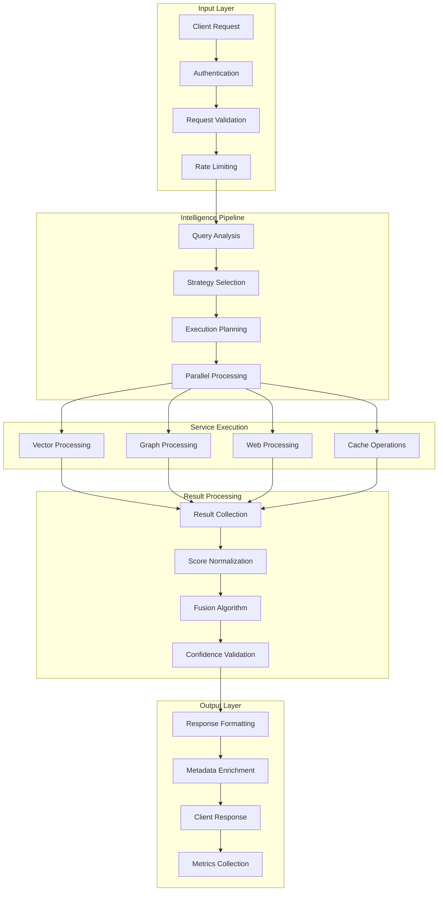
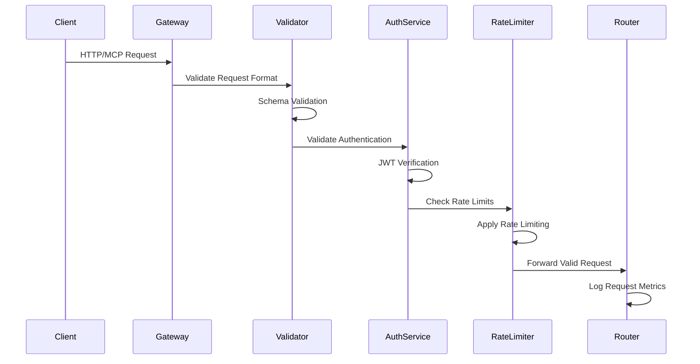
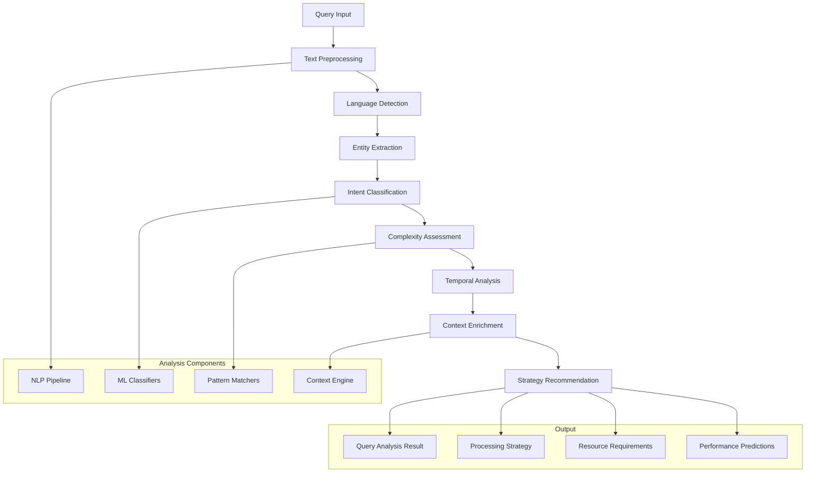
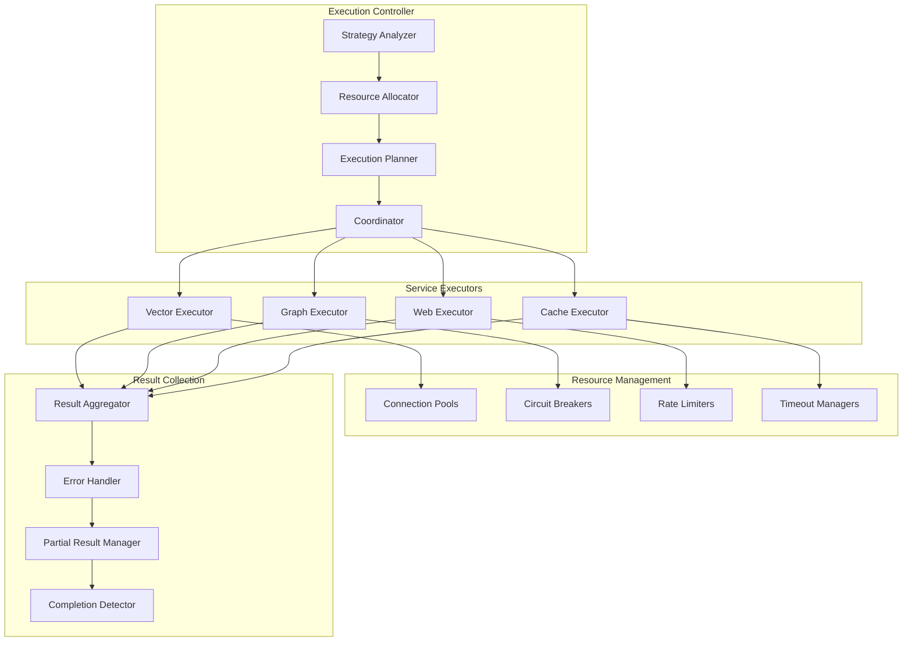
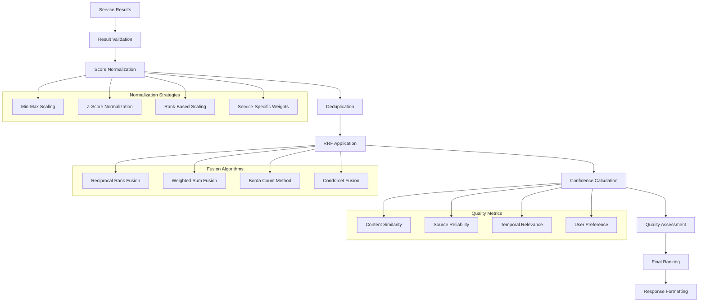
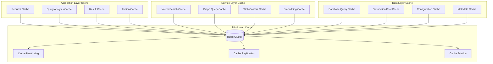

# Data Flow Architecture

This document details the comprehensive data flow and processing pipelines within the agentic RAG MCP server, including request routing, parallel processing, result fusion, and caching strategies.

## Overview

The system implements sophisticated data flow patterns that optimize for both performance and intelligence quality. Data flows through multiple specialized pipelines, each designed for specific types of intelligence operations while maintaining consistency and reliability.



## Core Data Flow Patterns

### 1. Request Processing Pipeline

The request processing pipeline implements a multi-stage approach with validation, routing, and optimization at each stage.

#### Stage 1: Request Ingestion and Validation



**Implementation Details:**

```python
class RequestProcessor:
    """
    Comprehensive request processing pipeline with validation,
    authentication, and routing capabilities.
    """
    
    async def process_request(self, raw_request: RawRequest) -> ProcessedRequest:
        """
        Process incoming request through validation pipeline.
        
        Args:
            raw_request: Raw client request
            
        Returns:
            Validated and enriched request object
        """
        # Stage 1: Basic validation
        validated_request = await self._validate_request_format(raw_request)
        
        # Stage 2: Authentication and authorization
        auth_context = await self._authenticate_request(validated_request)
        
        # Stage 3: Rate limiting
        await self._apply_rate_limiting(auth_context)
        
        # Stage 4: Request enrichment
        enriched_request = await self._enrich_request(
            validated_request, auth_context
        )
        
        # Stage 5: Routing preparation
        routable_request = await self._prepare_for_routing(enriched_request)
        
        return routable_request
    
    async def _validate_request_format(self, request: RawRequest) -> ValidatedRequest:
        """Validate request format and schema compliance."""
        try:
            # Parse request body
            if request.content_type == "application/json":
                body = json.loads(request.body)
            else:
                raise ValidationError(f"Unsupported content type: {request.content_type}")
            
            # Validate against schema
            if request.endpoint in self.request_schemas:
                schema = self.request_schemas[request.endpoint]
                jsonschema.validate(body, schema)
            
            # Extract query parameters
            query_params = parse_qs(request.query_string)
            
            return ValidatedRequest(
                endpoint=request.endpoint,
                method=request.method,
                headers=request.headers,
                body=body,
                query_params=query_params,
                client_ip=request.client_ip,
                timestamp=datetime.utcnow()
            )
            
        except Exception as e:
            raise ValidationError(f"Request validation failed: {e}") from e
    
    async def _enrich_request(
        self, 
        request: ValidatedRequest, 
        auth_context: AuthContext
    ) -> EnrichedRequest:
        """Enrich request with contextual information."""
        # Extract user context
        user_context = UserContext(
            user_id=auth_context.user_id,
            username=auth_context.username,
            scopes=auth_context.scopes,
            is_admin=auth_context.is_admin
        )
        
        # Generate request ID for tracing
        request_id = self._generate_request_id()
        
        # Extract client context
        client_context = ClientContext(
            client_ip=request.client_ip,
            user_agent=request.headers.get("User-Agent"),
            request_id=request_id,
            session_id=auth_context.session_id
        )
        
        # Create execution context
        execution_context = ExecutionContext(
            request_id=request_id,
            start_time=time.time(),
            timeout_deadline=time.time() + self.config.request_timeout,
            correlation_id=self._generate_correlation_id()
        )
        
        return EnrichedRequest(
            original_request=request,
            user_context=user_context,
            client_context=client_context,
            execution_context=execution_context
        )
```

#### Stage 2: Intelligent Query Analysis



**Query Analysis Implementation:**

```python
class QueryAnalysisEngine:
    """
    Advanced query analysis engine with ML-powered classification
    and intelligent strategy recommendation.
    """
    
    def __init__(self, config: AnalysisConfig):
        self.config = config
        self.nlp = spacy.load("en_core_web_sm")
        self.intent_classifier = self._load_intent_classifier()
        self.complexity_analyzer = ComplexityAnalyzer()
        self.temporal_extractor = TemporalExtractor()
        
    async def analyze_query(self, query: str, context: RequestContext) -> QueryAnalysis:
        """
        Perform comprehensive query analysis with ML classification.
        
        Args:
            query: Input query string
            context: Request context for personalization
            
        Returns:
            Detailed query analysis with strategy recommendations
        """
        analysis_start = time.time()
        
        # Stage 1: Text preprocessing
        preprocessed_query = await self._preprocess_text(query)
        
        # Stage 2: Language detection
        language = await self._detect_language(preprocessed_query)
        
        # Stage 3: Entity extraction
        entities = await self._extract_entities(preprocessed_query)
        
        # Stage 4: Intent classification
        intent = await self._classify_intent(preprocessed_query, entities)
        
        # Stage 5: Complexity assessment
        complexity = await self._assess_complexity(
            preprocessed_query, entities, intent
        )
        
        # Stage 6: Temporal analysis
        temporal_aspects = await self._analyze_temporal_aspects(preprocessed_query)
        
        # Stage 7: Context enrichment
        enriched_context = await self._enrich_context(
            preprocessed_query, entities, context
        )
        
        # Stage 8: Strategy recommendation
        recommended_strategy = await self._recommend_strategy(
            intent, complexity, temporal_aspects, enriched_context
        )
        
        analysis_time = time.time() - analysis_start
        
        return QueryAnalysis(
            original_query=query,
            preprocessed_query=preprocessed_query,
            language=language,
            entities=entities,
            intent=intent,
            complexity=complexity,
            temporal_aspects=temporal_aspects,
            enriched_context=enriched_context,
            recommended_strategy=recommended_strategy,
            analysis_time_ms=analysis_time * 1000,
            confidence_score=self._calculate_overall_confidence(
                intent, complexity, entities
            )
        )
    
    async def _extract_entities(self, text: str) -> List[Entity]:
        """Extract named entities using spaCy and custom models."""
        doc = self.nlp(text)
        
        entities = []
        for ent in doc.ents:
            entity = Entity(
                text=ent.text,
                label=ent.label_,
                start=ent.start_char,
                end=ent.end_char,
                confidence=ent._.confidence if hasattr(ent._, 'confidence') else 0.8
            )
            entities.append(entity)
        
        # Add custom entity extraction
        custom_entities = await self._extract_custom_entities(text)
        entities.extend(custom_entities)
        
        return entities
    
    async def _classify_intent(self, text: str, entities: List[Entity]) -> Intent:
        """Classify query intent using trained ML models."""
        # Prepare features for classification
        features = self._extract_classification_features(text, entities)
        
        # Run intent classification
        intent_scores = await self.intent_classifier.predict(features)
        
        # Select highest scoring intent
        best_intent = max(intent_scores.items(), key=lambda x: x[1])
        
        return Intent(
            type=best_intent[0],
            confidence=best_intent[1],
            sub_intents=self._extract_sub_intents(text, best_intent[0]),
            context_clues=self._extract_context_clues(text, entities)
        )
```

### 2. Parallel Service Execution

The system implements sophisticated parallel processing patterns to maximize throughput and minimize latency.

#### Execution Coordination Pattern



**Parallel Execution Implementation:**

```python
class ParallelExecutionEngine:
    """
    Advanced parallel execution engine with intelligent coordination,
    resource management, and error handling capabilities.
    """
    
    def __init__(self, config: ExecutionConfig):
        self.config = config
        self.resource_manager = ResourceManager(config)
        self.circuit_breakers = self._initialize_circuit_breakers()
        self.execution_metrics = ExecutionMetrics()
        
    async def execute_parallel_strategy(
        self,
        strategy: ProcessingStrategy,
        query_context: QueryContext
    ) -> List[ServiceResult]:
        """
        Execute parallel service strategy with intelligent coordination.
        
        Args:
            strategy: Processing strategy with service requirements
            query_context: Query context with analysis and metadata
            
        Returns:
            List of service results for fusion processing
        """
        execution_id = self._generate_execution_id()
        execution_start = time.time()
        
        try:
            # Stage 1: Resource allocation
            allocated_resources = await self._allocate_resources(
                strategy, query_context
            )
            
            # Stage 2: Execution planning
            execution_plan = await self._create_execution_plan(
                strategy, allocated_resources
            )
            
            # Stage 3: Parallel task creation
            execution_tasks = await self._create_execution_tasks(
                execution_plan, query_context
            )
            
            # Stage 4: Coordinated execution
            results = await self._coordinate_execution(
                execution_tasks, execution_plan
            )
            
            # Stage 5: Result validation
            validated_results = await self._validate_results(
                results, strategy.quality_requirements
            )
            
            execution_time = time.time() - execution_start
            
            # Update metrics
            await self._update_execution_metrics(
                execution_id, strategy, execution_time, validated_results
            )
            
            return validated_results
            
        except Exception as e:
            # Handle execution failure
            await self._handle_execution_failure(
                execution_id, strategy, query_context, e
            )
            raise ExecutionError(f"Parallel execution failed: {e}") from e
        finally:
            # Cleanup resources
            await self._cleanup_resources(allocated_resources)
    
    async def _coordinate_execution(
        self,
        tasks: List[ExecutionTask],
        plan: ExecutionPlan
    ) -> List[ServiceResult]:
        """
        Coordinate parallel task execution with advanced error handling.
        
        Args:
            tasks: List of execution tasks
            plan: Execution plan with timing and dependencies
            
        Returns:
            List of service results
        """
        # Group tasks by execution phase
        task_phases = self._group_tasks_by_phase(tasks, plan)
        
        all_results = []
        
        for phase_num, phase_tasks in task_phases.items():
            phase_start = time.time()
            
            try:
                # Execute phase tasks with timeout
                phase_results = await self._execute_phase_tasks(
                    phase_tasks, plan.phase_timeouts[phase_num]
                )
                
                all_results.extend(phase_results)
                
                # Check phase completion criteria
                if not self._validate_phase_completion(phase_results, plan):
                    raise PhaseExecutionError(
                        f"Phase {phase_num} failed completion criteria"
                    )
                
                phase_time = time.time() - phase_start
                logger.debug(
                    f"Phase {phase_num} completed",
                    phase_time_ms=phase_time * 1000,
                    results_count=len(phase_results)
                )
                
            except Exception as e:
                # Handle phase failure
                if plan.fail_fast:
                    raise
                else:
                    # Continue with partial results if allowed
                    logger.warning(
                        f"Phase {phase_num} failed, continuing with partial results",
                        error=str(e)
                    )
                    continue
        
        return all_results
    
    async def _execute_phase_tasks(
        self,
        tasks: List[ExecutionTask],
        timeout: float
    ) -> List[ServiceResult]:
        """
        Execute tasks within a single phase with timeout management.
        
        Args:
            tasks: Tasks to execute in parallel
            timeout: Phase timeout in seconds
            
        Returns:
            List of results from completed tasks
        """
        # Create asyncio tasks
        async_tasks = []
        for task in tasks:
            async_task = asyncio.create_task(
                self._execute_single_task(task),
                name=f"task_{task.service_type.value}_{task.task_id}"
            )
            async_tasks.append((task, async_task))
        
        results = []
        
        try:
            # Wait for all tasks with timeout
            done, pending = await asyncio.wait(
                [async_task for _, async_task in async_tasks],
                timeout=timeout,
                return_when=asyncio.ALL_COMPLETED
            )
            
            # Cancel pending tasks
            for task in pending:
                task.cancel()
                try:
                    await task
                except asyncio.CancelledError:
                    pass
            
            # Collect results from completed tasks
            for execution_task, async_task in async_tasks:
                if async_task in done:
                    try:
                        result = await async_task
                        results.append(result)
                    except Exception as e:
                        # Create error result
                        error_result = ServiceResult(
                            service=execution_task.service_type,
                            status=ResultStatus.ERROR,
                            error=str(e),
                            task_id=execution_task.task_id,
                            timestamp=datetime.utcnow()
                        )
                        results.append(error_result)
                        
                        logger.warning(
                            f"Task {execution_task.task_id} failed",
                            service=execution_task.service_type.value,
                            error=str(e)
                        )
                else:
                    # Task was cancelled due to timeout
                    timeout_result = ServiceResult(
                        service=execution_task.service_type,
                        status=ResultStatus.TIMEOUT,
                        error="Task execution timeout",
                        task_id=execution_task.task_id,
                        timestamp=datetime.utcnow()
                    )
                    results.append(timeout_result)
            
            return results
            
        except Exception as e:
            logger.exception("Phase execution failed", error=str(e))
            raise PhaseExecutionError(f"Phase execution failed: {e}") from e
```

### 3. Result Fusion Pipeline

The result fusion pipeline implements advanced algorithms for combining results from multiple services.

#### Fusion Processing Flow



**Advanced Fusion Implementation:**

```python
class AdvancedFusionEngine:
    """
    State-of-the-art result fusion engine implementing multiple
    fusion algorithms with adaptive selection and quality optimization.
    """
    
    def __init__(self, config: FusionConfig):
        self.config = config
        self.similarity_model = SentenceTransformer("all-MiniLM-L6-v2")
        self.quality_assessor = QualityAssessor()
        self.fusion_algorithms = self._initialize_fusion_algorithms()
        
    async def fuse_results(
        self,
        service_results: List[ServiceResult],
        fusion_context: FusionContext
    ) -> FusionResult:
        """
        Advanced result fusion with adaptive algorithm selection.
        
        Args:
            service_results: Results from multiple services
            fusion_context: Context for fusion optimization
            
        Returns:
            Optimally fused and ranked results
        """
        fusion_start = time.time()
        
        try:
            # Stage 1: Input validation and preprocessing
            validated_results = await self._validate_and_preprocess(
                service_results
            )
            
            if not validated_results:
                return self._create_empty_fusion_result("No valid results")
            
            # Stage 2: Score normalization
            normalized_results = await self._normalize_scores(
                validated_results, fusion_context
            )
            
            # Stage 3: Deduplication
            deduplicated_results = await self._intelligent_deduplication(
                normalized_results
            )
            
            # Stage 4: Algorithm selection
            selected_algorithm = await self._select_fusion_algorithm(
                deduplicated_results, fusion_context
            )
            
            # Stage 5: Fusion execution
            fused_items = await self._execute_fusion(
                deduplicated_results, selected_algorithm, fusion_context
            )
            
            # Stage 6: Confidence calculation
            confidence_scored_items = await self._calculate_confidence_scores(
                fused_items, deduplicated_results
            )
            
            # Stage 7: Quality assessment
            quality_assessed_items = await self._assess_result_quality(
                confidence_scored_items, fusion_context
            )
            
            # Stage 8: Final ranking and filtering
            final_results = await self._apply_final_ranking(
                quality_assessed_items, fusion_context
            )
            
            fusion_time = time.time() - fusion_start
            
            return FusionResult(
                items=final_results,
                fusion_algorithm=selected_algorithm.name,
                fusion_time_ms=fusion_time * 1000,
                source_count=len(service_results),
                successful_sources=len(validated_results),
                quality_score=self._calculate_overall_quality(final_results),
                metadata=self._generate_fusion_metadata(
                    service_results, final_results, fusion_context
                )
            )
            
        except Exception as e:
            logger.exception("Advanced fusion failed", error=str(e))
            return self._create_error_fusion_result(str(e))
    
    async def _normalize_scores(
        self,
        results: List[ServiceResult],
        context: FusionContext
    ) -> List[NormalizedResult]:
        """
        Apply intelligent score normalization across services.
        
        Different services use different scoring scales, so we need
        to normalize them for fair comparison and fusion.
        """
        normalized_results = []
        
        # Group results by service for normalization
        service_groups = defaultdict(list)
        for result in results:
            service_groups[result.service].append(result)
        
        for service_type, service_results in service_groups.items():
            # Select normalization strategy based on service characteristics
            normalization_strategy = self._select_normalization_strategy(
                service_type, service_results, context
            )
            
            # Apply normalization
            normalized_service_results = await normalization_strategy.normalize(
                service_results
            )
            
            normalized_results.extend(normalized_service_results)
        
        return normalized_results
    
    async def _intelligent_deduplication(
        self,
        results: List[NormalizedResult]
    ) -> List[DeduplicatedResult]:
        """
        Perform intelligent deduplication using semantic similarity.
        
        Instead of simple string matching, use semantic embeddings
        to identify and merge similar content from different sources.
        """
        if len(results) <= 1:
            return [DeduplicatedResult.from_normalized(r) for r in results]
        
        # Generate embeddings for all content
        content_texts = [r.content for r in results]
        embeddings = await self._generate_embeddings_batch(content_texts)
        
        # Create similarity matrix
        similarity_matrix = self._calculate_similarity_matrix(embeddings)
        
        # Find duplicate clusters
        duplicate_clusters = self._find_duplicate_clusters(
            similarity_matrix, self.config.similarity_threshold
        )
        
        # Merge duplicates intelligently
        deduplicated_results = []
        processed_indices = set()
        
        for cluster in duplicate_clusters:
            if any(idx in processed_indices for idx in cluster):
                continue
            
            if len(cluster) == 1:
                # Single item, no deduplication needed
                idx = cluster[0]
                deduplicated_results.append(
                    DeduplicatedResult.from_normalized(results[idx])
                )
                processed_indices.add(idx)
            else:
                # Multiple similar items, merge them
                cluster_results = [results[idx] for idx in cluster]
                merged_result = await self._merge_similar_results(cluster_results)
                deduplicated_results.append(merged_result)
                processed_indices.update(cluster)
        
        return deduplicated_results
    
    async def _execute_fusion(
        self,
        results: List[DeduplicatedResult],
        algorithm: FusionAlgorithm,
        context: FusionContext
    ) -> List[FusedItem]:
        """
        Execute selected fusion algorithm with context-aware optimization.
        
        Args:
            results: Deduplicated results from services
            algorithm: Selected fusion algorithm
            context: Fusion context for optimization
            
        Returns:
            Fused and ranked result items
        """
        if algorithm.name == "reciprocal_rank_fusion":
            return await self._apply_rrf_fusion(results, context)
        elif algorithm.name == "weighted_sum":
            return await self._apply_weighted_sum_fusion(results, context)
        elif algorithm.name == "borda_count":
            return await self._apply_borda_count_fusion(results, context)
        elif algorithm.name == "condorcet":
            return await self._apply_condorcet_fusion(results, context)
        else:
            raise ValueError(f"Unknown fusion algorithm: {algorithm.name}")
    
    async def _apply_rrf_fusion(
        self,
        results: List[DeduplicatedResult],
        context: FusionContext
    ) -> List[FusedItem]:
        """
        Apply Reciprocal Rank Fusion with context-aware weighting.
        
        Enhanced RRF that considers:
        - Service reliability weights
        - Query complexity adjustments
        - Temporal relevance factors
        - User preference learning
        """
        # Group results by service
        service_rankings = defaultdict(list)
        for result in results:
            service_rankings[result.original_service].append(result)
        
        # Sort each service's results by normalized score
        for service_type in service_rankings:
            service_rankings[service_type].sort(
                key=lambda x: x.normalized_score, reverse=True
            )
        
        # Calculate RRF scores with context weighting
        rrf_scores = defaultdict(lambda: {
            'score': 0.0,
            'sources': [],
            'result': None
        })
        
        for service_type, ranked_results in service_rankings.items():
            # Get context-aware service weight
            service_weight = self._calculate_context_aware_weight(
                service_type, context
            )
            
            for rank, result in enumerate(ranked_results, 1):
                # Enhanced RRF formula with context weighting
                base_rrf_score = 1.0 / (self.config.rrf_k + rank)
                weighted_score = base_rrf_score * service_weight
                
                # Apply temporal decay if relevant
                if context.temporal_sensitivity > 0:
                    temporal_factor = self._calculate_temporal_factor(
                        result, context
                    )
                    weighted_score *= temporal_factor
                
                result_key = self._generate_result_key(result)
                rrf_scores[result_key]['score'] += weighted_score
                rrf_scores[result_key]['sources'].append({
                    'service': service_type,
                    'rank': rank,
                    'weight': service_weight,
                    'original_score': result.normalized_score
                })
                
                if rrf_scores[result_key]['result'] is None:
                    rrf_scores[result_key]['result'] = result
        
        # Convert to FusedItem objects
        fused_items = []
        for result_key, data in rrf_scores.items():
            fused_item = FusedItem(
                content=data['result'].content,
                rrf_score=data['score'],
                sources=data['sources'],
                original_result=data['result'],
                fusion_algorithm="enhanced_rrf"
            )
            fused_items.append(fused_item)
        
        # Sort by RRF score
        return sorted(fused_items, key=lambda x: x.rrf_score, reverse=True)
```

### 4. Caching Architecture

The system implements multi-layer caching strategies for optimal performance.

#### Caching Layers



**Intelligent Caching Implementation:**

```python
class IntelligentCacheManager:
    """
    Multi-layer intelligent caching system with adaptive policies,
    smart invalidation, and performance optimization.
    """
    
    def __init__(self, config: CacheConfig):
        self.config = config
        self.redis_client = None
        self.local_cache = None
        self.cache_policies = self._initialize_cache_policies()
        self.cache_metrics = CacheMetrics()
        
    async def initialize(self):
        """Initialize cache infrastructure."""
        # Initialize Redis cluster
        self.redis_client = await aioredis.create_redis_pool(
            self.config.redis_cluster_nodes,
            encoding='utf-8',
            maxsize=self.config.max_connections
        )
        
        # Initialize local cache
        self.local_cache = TTLCache(
            maxsize=self.config.local_cache_size,
            ttl=self.config.local_cache_ttl
        )
        
        # Start cache maintenance tasks
        asyncio.create_task(self._cache_maintenance_loop())
    
    async def get_cached_result(
        self,
        cache_key: str,
        cache_layer: CacheLayer = CacheLayer.ALL
    ) -> Optional[CachedResult]:
        """
        Retrieve cached result with intelligent layer selection.
        
        Args:
            cache_key: Unique cache key
            cache_layer: Cache layer preference
            
        Returns:
            Cached result if found, None otherwise
        """
        cache_start = time.time()
        
        try:
            # Check local cache first (fastest)
            if cache_layer in [CacheLayer.LOCAL, CacheLayer.ALL]:
                local_result = self.local_cache.get(cache_key)
                if local_result:
                    await self._record_cache_hit('local', cache_start)
                    return local_result
            
            # Check distributed cache
            if cache_layer in [CacheLayer.DISTRIBUTED, CacheLayer.ALL]:
                redis_result = await self._get_from_redis(cache_key)
                if redis_result:
                    # Promote to local cache
                    self.local_cache[cache_key] = redis_result
                    await self._record_cache_hit('distributed', cache_start)
                    return redis_result
            
            # Cache miss
            await self._record_cache_miss(cache_key, cache_start)
            return None
            
        except Exception as e:
            logger.warning(f"Cache retrieval failed: {e}")
            await self._record_cache_error(cache_key, str(e))
            return None
    
    async def store_result(
        self,
        cache_key: str,
        result: Any,
        ttl: Optional[int] = None,
        cache_policy: Optional[CachePolicy] = None
    ) -> bool:
        """
        Store result with intelligent caching policy.
        
        Args:
            cache_key: Unique cache key
            result: Result to cache
            ttl: Time to live (optional)
            cache_policy: Caching policy (optional)
            
        Returns:
            True if stored successfully, False otherwise
        """
        try:
            # Determine optimal caching strategy
            if cache_policy is None:
                cache_policy = self._determine_cache_policy(cache_key, result)
            
            # Prepare cached result
            cached_result = CachedResult(
                data=result,
                cache_key=cache_key,
                created_at=datetime.utcnow(),
                ttl=ttl or cache_policy.default_ttl,
                access_count=0,
                cache_policy=cache_policy
            )
            
            # Store in appropriate layers
            success = True
            
            if cache_policy.use_local_cache:
                self.local_cache[cache_key] = cached_result
            
            if cache_policy.use_distributed_cache:
                success &= await self._store_in_redis(
                    cache_key, cached_result, cached_result.ttl
                )
            
            if success:
                await self._record_cache_store(cache_key, len(str(result)))
            
            return success
            
        except Exception as e:
            logger.warning(f"Cache storage failed: {e}")
            await self._record_cache_error(cache_key, str(e))
            return False
    
    def _determine_cache_policy(
        self,
        cache_key: str,
        result: Any
    ) -> CachePolicy:
        """
        Determine optimal caching policy based on key and result characteristics.
        
        Args:
            cache_key: Cache key to analyze
            result: Result to analyze
            
        Returns:
            Optimal cache policy
        """
        # Analyze key patterns
        key_type = self._analyze_key_type(cache_key)
        
        # Analyze result characteristics
        result_size = len(str(result))
        result_complexity = self._assess_result_complexity(result)
        
        # Select policy based on characteristics
        if key_type == "query_analysis":
            return CachePolicy(
                use_local_cache=True,
                use_distributed_cache=True,
                default_ttl=self.config.query_analysis_ttl,
                eviction_priority=EvictionPriority.MEDIUM
            )
        elif key_type == "vector_search":
            return CachePolicy(
                use_local_cache=result_size < self.config.local_cache_max_size,
                use_distributed_cache=True,
                default_ttl=self.config.vector_search_ttl,
                eviction_priority=EvictionPriority.HIGH
            )
        elif key_type == "web_content":
            return CachePolicy(
                use_local_cache=False,  # Web content can be large
                use_distributed_cache=True,
                default_ttl=self.config.web_content_ttl,
                eviction_priority=EvictionPriority.LOW
            )
        else:
            return self.cache_policies.default_policy
```

## Performance Optimization Patterns

### 1. Request Batching

```python
class RequestBatcher:
    """
    Intelligent request batching for improved throughput and efficiency.
    """
    
    async def batch_similar_requests(
        self,
        requests: List[ProcessedRequest]
    ) -> List[BatchedRequest]:
        """
        Group similar requests for batch processing.
        
        Args:
            requests: List of individual requests
            
        Returns:
            List of batched requests for parallel execution
        """
        # Group requests by similarity
        request_groups = self._group_by_similarity(requests)
        
        batched_requests = []
        for group in request_groups:
            if len(group) > 1:
                # Create batch request
                batch = BatchedRequest(
                    requests=group,
                    batch_type=self._determine_batch_type(group),
                    priority=max(req.priority for req in group)
                )
                batched_requests.append(batch)
            else:
                # Single request, no batching
                batched_requests.append(group[0])
        
        return batched_requests
```

### 2. Connection Pooling

```python
class OptimizedConnectionPool:
    """
    High-performance connection pool with intelligent management.
    """
    
    async def get_connection(
        self,
        service_type: ServiceType,
        priority: Priority = Priority.NORMAL
    ) -> Connection:
        """
        Get connection with priority-based allocation.
        
        Args:
            service_type: Type of service connection
            priority: Request priority level
            
        Returns:
            Database/service connection
        """
        pool = self.pools[service_type]
        
        if priority == Priority.HIGH:
            # High priority requests get immediate connection
            return await pool.get_connection(timeout=0.1)
        else:
            # Normal priority can wait longer
            return await pool.get_connection(timeout=1.0)
```

This comprehensive data flow architecture ensures optimal performance, reliability, and intelligence quality throughout the agentic RAG MCP server pipeline.
