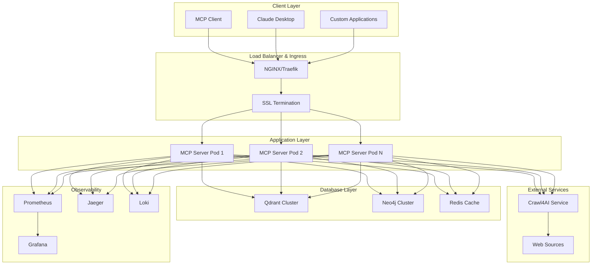
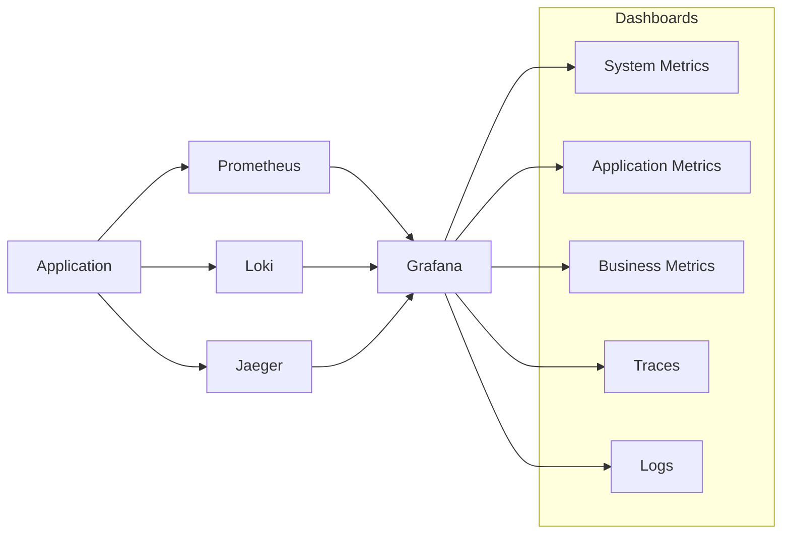
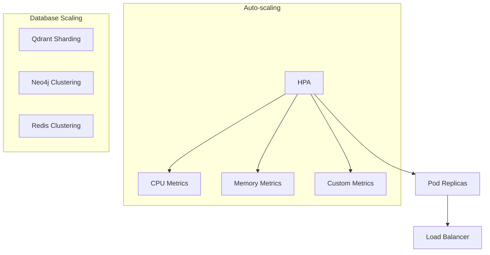

# Deployment & Operations Guide

This directory contains comprehensive deployment and operations documentation for the Qdrant Neo4j Crawl4AI MCP Server, a production-ready agentic RAG system that combines vector search, graph databases, and web intelligence.

## Overview

The Qdrant Neo4j Crawl4AI MCP Server is a sophisticated Model Context Protocol server that integrates:

- **Qdrant** - High-performance vector database for semantic search
- **Neo4j** - Graph database for knowledge relationships  
- **Crawl4AI** - Intelligent web crawling and content extraction
- **FastMCP 2.0** - Modern MCP server framework

## Architecture Diagram



## Deployment Options

### Quick Start

- **[Docker Compose](./docker.md)** - Single-node development and testing
- **[Local Development](../getting-started/installation.md)** - Developer setup

### Production Deployment

- **[Kubernetes](./kubernetes.md)** - Scalable container orchestration
- **[Cloud Providers](./cloud-providers.md)** - AWS, GCP, Azure specific guides
- **[Monitoring](./monitoring.md)** - Observability and alerting
- **[Security Hardening](./security-hardening.md)** - Production security

### Operations

- **[Backup & Recovery](./backup-recovery.md)** - Data protection strategies
- **[Performance Tuning](./performance-tuning.md)** - Optimization guides

## Deployment Matrix

| Environment | Orchestration | Scale | Complexity | Use Case |
|-------------|---------------|-------|------------|----------|
| Development | Docker Compose | Single Node | Low | Local dev, testing |
| Staging | Kubernetes | 2-3 Nodes | Medium | Pre-production validation |
| Production | Kubernetes | 3+ Nodes | High | Production workloads |
| Edge | K3s/MicroK8s | 1-2 Nodes | Medium | Edge computing |

## Prerequisites

### System Requirements

| Component | Minimum | Recommended |
|-----------|---------|-------------|
| CPU | 4 cores | 8+ cores |
| Memory | 8 GB | 16+ GB |
| Storage | 50 GB SSD | 200+ GB NVMe |
| Network | 1 Gbps | 10+ Gbps |

### Software Dependencies

- **Container Runtime**: Docker 24+ or Podman
- **Orchestration**: Kubernetes 1.28+ (for production)
- **Monitoring**: Prometheus, Grafana, Jaeger
- **Storage**: Persistent volumes for databases

## Environment Configuration

### Environment Variables

The system uses environment-based configuration. Key variables:

```bash
# Core Application
ENVIRONMENT=production
LOG_LEVEL=INFO
HOST=0.0.0.0
PORT=8000

# Database Connections
QDRANT_URL=http://qdrant-service:6333
NEO4J_URI=bolt://neo4j-service:7687
REDIS_URL=redis://redis-service:6379/0

# Security
JWT_SECRET_KEY=<secure-random-key>
ADMIN_API_KEY=<admin-api-key>

# Performance
WORKERS=4
CRAWL4AI_MAX_CONCURRENT=10
```

See [configuration.md](../getting-started/configuration.md) for complete reference.

## Security Considerations

### Production Security Checklist

- [ ] Use strong, unique passwords/keys
- [ ] Enable TLS/SSL for all communications
- [ ] Configure network policies and firewalls
- [ ] Implement proper RBAC
- [ ] Enable audit logging
- [ ] Regular security updates
- [ ] Backup encryption
- [ ] Secret management integration

### Secret Management

For production deployments:

- **Kubernetes**: Use Secrets, External Secrets Operator, or Vault
- **Docker**: Docker Secrets or external secret management
- **Cloud**: Cloud-native secret services (AWS Secrets Manager, etc.)

## Monitoring & Observability

### Metrics Stack



### Key Metrics

- **System**: CPU, Memory, Disk, Network
- **Application**: Request rate, latency, errors
- **Business**: Query performance, knowledge graph growth
- **Database**: Connection pools, query performance

## Backup Strategy

### Data Protection

| Component | Backup Method | Frequency | Retention |
|-----------|---------------|-----------|-----------|
| Qdrant | Snapshot API | Daily | 30 days |
| Neo4j | Database dump | Daily | 30 days |
| Redis | RDB snapshots | Hourly | 7 days |
| Config | Git repository | On change | Indefinite |

### Disaster Recovery

- **RTO**: Recovery Time Objective < 4 hours
- **RPO**: Recovery Point Objective < 1 hour
- **Multi-region**: For high availability
- **Automated**: Recovery procedures

## Scaling Guidelines

### Horizontal Scaling



### Scaling Thresholds

- **CPU**: Scale up at 70% utilization
- **Memory**: Scale up at 80% utilization
- **Request Rate**: Scale up at 1000 RPS
- **Response Time**: Scale up at 500ms P95

## Troubleshooting

### Common Issues

1. **Connection Timeouts**
   - Check network connectivity
   - Verify service endpoints
   - Review firewall rules

2. **High Memory Usage**
   - Monitor vector database cache
   - Check for memory leaks
   - Review embedding model size

3. **Performance Degradation**
   - Analyze query patterns
   - Review index performance
   - Check resource utilization

### Log Analysis

```bash
# View application logs
kubectl logs -f deployment/qdrant-neo4j-crawl4ai-mcp

# Check error patterns
kubectl logs deployment/qdrant-neo4j-crawl4ai-mcp | grep ERROR

# Monitor real-time logs
stern qdrant-neo4j-crawl4ai-mcp
```

## Support & Documentation

### Additional Resources

- **[API Reference](../API_REFERENCE.md)** - Complete API documentation
- **[Architecture Guide](../ARCHITECTURE.md)** - System architecture
- **[Developer Guide](../DEVELOPER_GUIDE.md)** - Development setup
- **[Troubleshooting](../getting-started/troubleshooting.md)** - Common issues

### Getting Help

1. **Documentation**: Check relevant deployment guides
2. **Logs**: Enable debug logging for detailed information
3. **Monitoring**: Use Grafana dashboards for insights
4. **Community**: GitHub discussions and issues

---

**Next Steps**: Choose your deployment method from the links above and follow the step-by-step guides for your specific environment.
