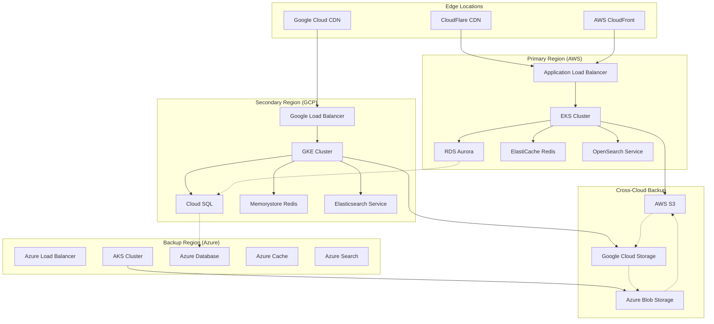

# Cloud Provider Deployment Guide

This guide covers deployment of the Qdrant Neo4j Crawl4AI MCP Server on major cloud providers including AWS, Google Cloud Platform (GCP), and Microsoft Azure.

## Overview

Cloud-native deployment provides:

- **Managed Kubernetes**: EKS, GKE, AKS for container orchestration
- **Managed Databases**: Cloud-native alternatives to self-hosted databases
- **Auto-scaling**: Cloud-specific scaling solutions
- **Security**: Cloud-native security services
- **Monitoring**: Integrated observability platforms
- **Backup**: Cloud storage for backup and disaster recovery

## Architecture Patterns

### Multi-Cloud Architecture



## AWS Deployment

### Prerequisites

```bash
# Install AWS CLI
curl "https://awscli.amazonaws.com/awscli-exe-linux-x86_64.zip" -o "awscliv2.zip"
unzip awscliv2.zip
sudo ./aws/install

# Install eksctl
curl --silent --location "https://github.com/weaveworks/eksctl/releases/latest/download/eksctl_$(uname -s)_amd64.tar.gz" | tar xz -C /tmp
sudo mv /tmp/eksctl /usr/local/bin

# Configure AWS credentials
aws configure
```

### EKS Cluster Setup

```yaml
# eks-cluster.yaml
apiVersion: eksctl.io/v1alpha5
kind: ClusterConfig

metadata:
  name: qdrant-neo4j-crawl4ai-mcp
  region: us-east-1
  version: "1.29"

vpc:
  cidr: "10.0.0.0/16"
  nat:
    gateway: Single
  clusterEndpoints:
    publicAccess: true
    privateAccess: true

iam:
  withOIDC: true
  serviceAccounts:
  - metadata:
      name: aws-load-balancer-controller
      namespace: kube-system
    wellKnownPolicies:
      awsLoadBalancerController: true
  - metadata:
      name: external-secrets
      namespace: external-secrets-system
    attachPolicyARNs:
    - "arn:aws:iam::aws:policy/SecretsManagerReadWrite"
  - metadata:
      name: cluster-autoscaler
      namespace: kube-system
    wellKnownPolicies:
      autoScaler: true

nodeGroups:
  - name: system-nodes
    instanceType: t3.large
    desiredCapacity: 3
    minSize: 3
    maxSize: 6
    volumeSize: 100
    ssh:
      allow: false
    labels:
      node-type: system
    taints:
    - key: system
      value: "true"
      effect: NoSchedule
    iam:
      attachPolicyARNs:
      - arn:aws:iam::aws:policy/AmazonEKSWorkerNodePolicy
      - arn:aws:iam::aws:policy/AmazonEKS_CNI_Policy
      - arn:aws:iam::aws:policy/AmazonEC2ContainerRegistryReadOnly
      - arn:aws:iam::aws:policy/AmazonSSMManagedInstanceCore

  - name: app-nodes
    instanceType: c5.xlarge
    desiredCapacity: 3
    minSize: 3
    maxSize: 20
    volumeSize: 200
    ssh:
      allow: false
    labels:
      node-type: application
    iam:
      attachPolicyARNs:
      - arn:aws:iam::aws:policy/AmazonEKSWorkerNodePolicy
      - arn:aws:iam::aws:policy/AmazonEKS_CNI_Policy
      - arn:aws:iam::aws:policy/AmazonEC2ContainerRegistryReadOnly

  - name: database-nodes
    instanceType: r5.xlarge
    desiredCapacity: 3
    minSize: 3
    maxSize: 6
    volumeSize: 500
    ssh:
      allow: false
    labels:
      node-type: database
    taints:
    - key: database
      value: "true"
      effect: NoSchedule
    iam:
      attachPolicyARNs:
      - arn:aws:iam::aws:policy/AmazonEKSWorkerNodePolicy
      - arn:aws:iam::aws:policy/AmazonEKS_CNI_Policy
      - arn:aws:iam::aws:policy/AmazonEC2ContainerRegistryReadOnly

addons:
  - name: vpc-cni
    version: latest
  - name: coredns
    version: latest
  - name: kube-proxy
    version: latest
  - name: aws-ebs-csi-driver
    version: latest
    wellKnownPolicies:
      ebsCSIController: true

cloudWatch:
  clusterLogging:
    enable: true
    logRetentionInDays: 30
```

### Deploy EKS Cluster

```bash
# Create EKS cluster
eksctl create cluster -f eks-cluster.yaml

# Update kubeconfig
aws eks update-kubeconfig --region us-east-1 --name qdrant-neo4j-crawl4ai-mcp

# Verify cluster
kubectl get nodes
```

### AWS-Specific Components

```bash
# Install AWS Load Balancer Controller
helm repo add eks https://aws.github.io/eks-charts
helm repo update

helm install aws-load-balancer-controller eks/aws-load-balancer-controller \
  --set clusterName=qdrant-neo4j-crawl4ai-mcp \
  --set serviceAccount.create=false \
  --set serviceAccount.name=aws-load-balancer-controller \
  -n kube-system

# Install External Secrets Operator
helm repo add external-secrets https://charts.external-secrets.io
helm install external-secrets external-secrets/external-secrets \
  --namespace external-secrets-system \
  --create-namespace

# Install Cluster Autoscaler
helm repo add autoscaler https://kubernetes.github.io/autoscaler
helm install cluster-autoscaler autoscaler/cluster-autoscaler \
  --set autoDiscovery.clusterName=qdrant-neo4j-crawl4ai-mcp \
  --set awsRegion=us-east-1 \
  --set serviceAccount.create=false \
  --set serviceAccount.name=cluster-autoscaler \
  -n kube-system
```

### AWS Managed Services

#### RDS Aurora for Neo4j Alternative

```yaml
# CloudFormation template for Aurora
Resources:
  AuroraCluster:
    Type: AWS::RDS::DBCluster
    Properties:
      Engine: aurora-postgresql
      EngineVersion: "15.4"
      MasterUsername: !Ref DatabaseUsername
      MasterUserPassword: !Ref DatabasePassword
      DatabaseName: qdrant_neo4j_crawl4ai_mcp
      VpcSecurityGroupIds:
        - !Ref DatabaseSecurityGroup
      DBSubnetGroupName: !Ref DatabaseSubnetGroup
      BackupRetentionPeriod: 30
      DeletionProtection: true
      StorageEncrypted: true
      EnableCloudwatchLogsExports:
        - postgresql

  AuroraInstance:
    Type: AWS::RDS::DBInstance
    Properties:
      DBInstanceClass: db.r6g.xlarge
      DBClusterIdentifier: !Ref AuroraCluster
      Engine: aurora-postgresql
      PubliclyAccessible: false
      MonitoringInterval: 60
      MonitoringRoleArn: !GetAtt EnhancedMonitoringRole.Arn
```

#### ElastiCache Redis

```yaml
# ElastiCache Redis cluster
Resources:
  RedisCluster:
    Type: AWS::ElastiCache::ReplicationGroup
    Properties:
      ReplicationGroupDescription: "Redis cluster for MCP server"
      NumCacheClusters: 3
      Engine: redis
      CacheNodeType: cache.r6g.large
      Port: 6379
      SecurityGroupIds:
        - !Ref RedisSecurityGroup
      SubnetGroupName: !Ref RedisSubnetGroup
      AtRestEncryptionEnabled: true
      TransitEncryptionEnabled: true
      MultiAZEnabled: true
      AutomaticFailoverEnabled: true
      SnapshotRetentionLimit: 7
      SnapshotWindow: "03:00-05:00"
      PreferredMaintenanceWindow: "sun:05:00-sun:07:00"
```

#### OpenSearch for Vector Search

```yaml
# OpenSearch cluster
Resources:
  OpenSearchDomain:
    Type: AWS::OpenSearch::Domain
    Properties:
      DomainName: qdrant-neo4j-crawl4ai-mcp
      EngineVersion: "OpenSearch_2.11"
      ClusterConfig:
        InstanceType: r6g.large.search
        InstanceCount: 3
        DedicatedMasterEnabled: true
        MasterInstanceType: r6g.medium.search
        MasterInstanceCount: 3
        ZoneAwarenessEnabled: true
      EBSOptions:
        EBSEnabled: true
        VolumeType: gp3
        VolumeSize: 100
      VPCOptions:
        SecurityGroupIds:
          - !Ref OpenSearchSecurityGroup
        SubnetIds:
          - !Ref PrivateSubnet1
          - !Ref PrivateSubnet2
          - !Ref PrivateSubnet3
      EncryptionAtRestOptions:
        Enabled: true
      NodeToNodeEncryptionOptions:
        Enabled: true
      DomainEndpointOptions:
        EnforceHTTPS: true
        TLSSecurityPolicy: "Policy-Min-TLS-1-2-2019-07"
```

### Terraform Deployment

```hcl
# terraform/aws/main.tf
terraform {
  required_providers {
    aws = {
      source  = "hashicorp/aws"
      version = "~> 5.0"
    }
    kubernetes = {
      source  = "hashicorp/kubernetes"
      version = "~> 2.0"
    }
    helm = {
      source  = "hashicorp/helm"
      version = "~> 2.0"
    }
  }
}

provider "aws" {
  region = var.aws_region
}

module "vpc" {
  source = "terraform-aws-modules/vpc/aws"
  
  name = "qdrant-neo4j-crawl4ai-mcp-vpc"
  cidr = "10.0.0.0/16"
  
  azs             = ["${var.aws_region}a", "${var.aws_region}b", "${var.aws_region}c"]
  private_subnets = ["10.0.1.0/24", "10.0.2.0/24", "10.0.3.0/24"]
  public_subnets  = ["10.0.101.0/24", "10.0.102.0/24", "10.0.103.0/24"]
  
  enable_nat_gateway = true
  enable_vpn_gateway = false
  enable_dns_hostnames = true
  enable_dns_support = true
  
  tags = {
    Terraform = "true"
    Environment = var.environment
    Project = "qdrant-neo4j-crawl4ai-mcp"
  }
}

module "eks" {
  source = "terraform-aws-modules/eks/aws"
  
  cluster_name    = "qdrant-neo4j-crawl4ai-mcp"
  cluster_version = "1.29"
  
  vpc_id     = module.vpc.vpc_id
  subnet_ids = module.vpc.private_subnets
  
  enable_irsa = true
  
  eks_managed_node_groups = {
    system = {
      min_size     = 3
      max_size     = 6
      desired_size = 3
      
      instance_types = ["t3.large"]
      capacity_type  = "ON_DEMAND"
      
      k8s_labels = {
        node-type = "system"
      }
      
      taints = [
        {
          key    = "system"
          value  = "true"
          effect = "NO_SCHEDULE"
        }
      ]
    }
    
    application = {
      min_size     = 3
      max_size     = 20
      desired_size = 3
      
      instance_types = ["c5.xlarge"]
      capacity_type  = "SPOT"
      
      k8s_labels = {
        node-type = "application"
      }
    }
    
    database = {
      min_size     = 3
      max_size     = 6
      desired_size = 3
      
      instance_types = ["r5.xlarge"]
      capacity_type  = "ON_DEMAND"
      
      k8s_labels = {
        node-type = "database"
      }
      
      taints = [
        {
          key    = "database"
          value  = "true"
          effect = "NO_SCHEDULE"
        }
      ]
    }
  }
  
  tags = {
    Terraform = "true"
    Environment = var.environment
    Project = "qdrant-neo4j-crawl4ai-mcp"
  }
}

# RDS Aurora PostgreSQL
resource "aws_rds_cluster" "aurora" {
  cluster_identifier      = "qdrant-neo4j-crawl4ai-mcp-aurora"
  engine                 = "aurora-postgresql"
  engine_version         = "15.4"
  availability_zones     = module.vpc.azs
  database_name          = "qdrant_neo4j_crawl4ai_mcp"
  master_username        = var.db_username
  master_password        = var.db_password
  backup_retention_period = 30
  preferred_backup_window = "03:00-04:00"
  preferred_maintenance_window = "sun:04:00-sun:05:00"
  db_subnet_group_name   = aws_db_subnet_group.aurora.name
  vpc_security_group_ids = [aws_security_group.aurora.id]
  storage_encrypted      = true
  deletion_protection    = true
  
  enabled_cloudwatch_logs_exports = ["postgresql"]
  
  tags = {
    Name = "qdrant-neo4j-crawl4ai-mcp-aurora"
    Environment = var.environment
  }
}

# ElastiCache Redis
resource "aws_elasticache_replication_group" "redis" {
  description          = "Redis cluster for MCP server"
  replication_group_id = "qdrant-neo4j-crawl4ai-mcp-redis"
  
  num_cache_clusters = 3
  node_type         = "cache.r6g.large"
  port              = 6379
  parameter_group_name = "default.redis7"
  
  subnet_group_name  = aws_elasticache_subnet_group.redis.name
  security_group_ids = [aws_security_group.redis.id]
  
  at_rest_encryption_enabled = true
  transit_encryption_enabled = true
  multi_az_enabled          = true
  automatic_failover_enabled = true
  
  snapshot_retention_limit = 7
  snapshot_window         = "03:00-05:00"
  maintenance_window      = "sun:05:00-sun:07:00"
  
  tags = {
    Name = "qdrant-neo4j-crawl4ai-mcp-redis"
    Environment = var.environment
  }
}

# OpenSearch domain
resource "aws_opensearch_domain" "opensearch" {
  domain_name    = "qdrant-neo4j-crawl4ai-mcp"
  engine_version = "OpenSearch_2.11"
  
  cluster_config {
    instance_type  = "r6g.large.search"
    instance_count = 3
    
    dedicated_master_enabled = true
    master_instance_type     = "r6g.medium.search"
    master_instance_count    = 3
    
    zone_awareness_enabled = true
    zone_awareness_config {
      availability_zone_count = 3
    }
  }
  
  ebs_options {
    ebs_enabled = true
    volume_type = "gp3"
    volume_size = 100
  }
  
  vpc_options {
    security_group_ids = [aws_security_group.opensearch.id]
    subnet_ids         = module.vpc.private_subnets
  }
  
  encrypt_at_rest {
    enabled = true
  }
  
  node_to_node_encryption {
    enabled = true
  }
  
  domain_endpoint_options {
    enforce_https       = true
    tls_security_policy = "Policy-Min-TLS-1-2-2019-07"
  }
  
  tags = {
    Name = "qdrant-neo4j-crawl4ai-mcp"
    Environment = var.environment
  }
}
```

### AWS CDK Deployment

```typescript
// aws-cdk/lib/qdrant-neo4j-crawl4ai-mcp-stack.ts
import * as cdk from 'aws-cdk-lib';
import * as eks from 'aws-cdk-lib/aws-eks';
import * as ec2 from 'aws-cdk-lib/aws-ec2';
import * as rds from 'aws-cdk-lib/aws-rds';
import * as elasticache from 'aws-cdk-lib/aws-elasticache';
import * as opensearch from 'aws-cdk-lib/aws-opensearch';
import * as iam from 'aws-cdk-lib/aws-iam';
import { Construct } from 'constructs';

export class QdrantNeo4jCrawl4aiMcpStack extends cdk.Stack {
  constructor(scope: Construct, id: string, props?: cdk.StackProps) {
    super(scope, id, props);

    // VPC
    const vpc = new ec2.Vpc(this, 'VPC', {
      maxAzs: 3,
      cidr: '10.0.0.0/16',
      natGateways: 3,
      subnetConfiguration: [
        {
          cidrMask: 24,
          name: 'public',
          subnetType: ec2.SubnetType.PUBLIC,
        },
        {
          cidrMask: 24,
          name: 'private',
          subnetType: ec2.SubnetType.PRIVATE_WITH_EGRESS,
        },
        {
          cidrMask: 24,
          name: 'isolated',
          subnetType: ec2.SubnetType.PRIVATE_ISOLATED,
        },
      ],
    });

    // EKS Cluster
    const cluster = new eks.Cluster(this, 'Cluster', {
      version: eks.KubernetesVersion.V1_29,
      vpc,
      vpcSubnets: [{ subnetType: ec2.SubnetType.PRIVATE_WITH_EGRESS }],
      defaultCapacity: 0,
    });

    // System Node Group
    cluster.addNodegroupCapacity('SystemNodes', {
      instanceTypes: [new ec2.InstanceType('t3.large')],
      minSize: 3,
      maxSize: 6,
      desiredSize: 3,
      subnets: { subnetType: ec2.SubnetType.PRIVATE_WITH_EGRESS },
      labels: {
        'node-type': 'system',
      },
      taints: [
        {
          key: 'system',
          value: 'true',
          effect: eks.TaintEffect.NO_SCHEDULE,
        },
      ],
    });

    // Application Node Group
    cluster.addNodegroupCapacity('ApplicationNodes', {
      instanceTypes: [new ec2.InstanceType('c5.xlarge')],
      minSize: 3,
      maxSize: 20,
      desiredSize: 3,
      capacityType: eks.CapacityType.SPOT,
      subnets: { subnetType: ec2.SubnetType.PRIVATE_WITH_EGRESS },
      labels: {
        'node-type': 'application',
      },
    });

    // Database Node Group
    cluster.addNodegroupCapacity('DatabaseNodes', {
      instanceTypes: [new ec2.InstanceType('r5.xlarge')],
      minSize: 3,
      maxSize: 6,
      desiredSize: 3,
      subnets: { subnetType: ec2.SubnetType.PRIVATE_WITH_EGRESS },
      labels: {
        'node-type': 'database',
      },
      taints: [
        {
          key: 'database',
          value: 'true',
          effect: eks.TaintEffect.NO_SCHEDULE,
        },
      ],
    });

    // RDS Aurora PostgreSQL
    const aurora = new rds.DatabaseCluster(this, 'Aurora', {
      engine: rds.DatabaseClusterEngine.auroraPostgres({
        version: rds.AuroraPostgresEngineVersion.VER_15_4,
      }),
      instanceProps: {
        instanceType: ec2.InstanceType.of(ec2.InstanceClass.R6G, ec2.InstanceSize.XLARGE),
        vpcSubnets: {
          subnetType: ec2.SubnetType.PRIVATE_ISOLATED,
        },
        vpc,
      },
      instances: 3,
      backup: {
        retention: cdk.Duration.days(30),
        preferredWindow: '03:00-04:00',
      },
      preferredMaintenanceWindow: 'sun:04:00-sun:05:00',
      storageEncrypted: true,
      deletionProtection: true,
      cloudwatchLogsExports: ['postgresql'],
    });

    // ElastiCache Redis
    const redisSubnetGroup = new elasticache.CfnSubnetGroup(this, 'RedisSubnetGroup', {
      description: 'Subnet group for Redis',
      subnetIds: vpc.selectSubnets({ subnetType: ec2.SubnetType.PRIVATE_ISOLATED }).subnetIds,
    });

    const redis = new elasticache.CfnReplicationGroup(this, 'Redis', {
      description: 'Redis cluster for MCP server',
      replicationGroupId: 'qdrant-neo4j-crawl4ai-mcp-redis',
      numCacheClusters: 3,
      cacheNodeType: 'cache.r6g.large',
      engine: 'redis',
      port: 6379,
      cacheSubnetGroupName: redisSubnetGroup.ref,
      atRestEncryptionEnabled: true,
      transitEncryptionEnabled: true,
      multiAzEnabled: true,
      automaticFailoverEnabled: true,
      snapshotRetentionLimit: 7,
      snapshotWindow: '03:00-05:00',
      preferredMaintenanceWindow: 'sun:05:00-sun:07:00',
    });

    // OpenSearch Domain
    const opensearch = new opensearch.Domain(this, 'OpenSearch', {
      version: opensearch.EngineVersion.OPENSEARCH_2_11,
      capacity: {
        masterNodes: 3,
        masterNodeInstanceType: 'r6g.medium.search',
        dataNodes: 3,
        dataNodeInstanceType: 'r6g.large.search',
        multiAzWithStandbyEnabled: false,
      },
      ebs: {
        volumeSize: 100,
        volumeType: ec2.EbsDeviceVolumeType.GP3,
      },
      vpc,
      vpcSubnets: [{ subnetType: ec2.SubnetType.PRIVATE_ISOLATED }],
      encryptionAtRest: {
        enabled: true,
      },
      nodeToNodeEncryption: true,
      enforceHttps: true,
      tlsSecurityPolicy: opensearch.TLSSecurityPolicy.TLS_1_2,
    });

    // Output important values
    new cdk.CfnOutput(this, 'ClusterName', {
      value: cluster.clusterName,
    });

    new cdk.CfnOutput(this, 'AuroraEndpoint', {
      value: aurora.clusterEndpoint.hostname,
    });

    new cdk.CfnOutput(this, 'RedisEndpoint', {
      value: redis.attrPrimaryEndPointAddress,
    });

    new cdk.CfnOutput(this, 'OpenSearchEndpoint', {
      value: opensearch.domainEndpoint,
    });
  }
}
```

## Google Cloud Platform (GCP) Deployment

### Prerequisites

```bash
# Install Google Cloud SDK
curl https://sdk.cloud.google.com | bash
exec -l $SHELL

# Initialize gcloud
gcloud init

# Install GKE components
gcloud components install gke-gcloud-auth-plugin

# Set default project and region
gcloud config set project YOUR_PROJECT_ID
gcloud config set compute/region us-central1
```

### GKE Cluster Setup

```yaml
# gke-cluster.yaml
apiVersion: container.v1
kind: Cluster
metadata:
  name: qdrant-neo4j-crawl4ai-mcp
spec:
  location: us-central1
  initialClusterVersion: "1.29"
  
  network: projects/YOUR_PROJECT_ID/global/networks/default
  subnetwork: projects/YOUR_PROJECT_ID/regions/us-central1/subnetworks/default
  
  ipAllocationPolicy:
    useIpAliases: true
    clusterSecondaryRangeName: "pods"
    servicesSecondaryRangeName: "services"
  
  addonsConfig:
    httpLoadBalancing:
      disabled: false
    horizontalPodAutoscaling:
      disabled: false
    networkPolicyConfig:
      disabled: false
    gcePersistentDiskCsiDriverConfig:
      enabled: true
  
  workloadIdentityConfig:
    workloadPool: "YOUR_PROJECT_ID.svc.id.goog"
  
  nodePools:
  - name: system-pool
    initialNodeCount: 3
    config:
      machineType: e2-standard-4
      diskSizeGb: 100
      diskType: pd-ssd
      imageType: COS_CONTAINERD
      serviceAccount: default
      oauthScopes:
      - https://www.googleapis.com/auth/cloud-platform
      labels:
        node-type: system
      taints:
      - key: system
        value: "true"
        effect: NO_SCHEDULE
    autoscaling:
      enabled: true
      minNodeCount: 3
      maxNodeCount: 6
    management:
      autoUpgrade: true
      autoRepair: true
  
  - name: app-pool
    initialNodeCount: 3
    config:
      machineType: c2-standard-8
      diskSizeGb: 200
      diskType: pd-ssd
      imageType: COS_CONTAINERD
      spot: true
      labels:
        node-type: application
    autoscaling:
      enabled: true
      minNodeCount: 3
      maxNodeCount: 20
    management:
      autoUpgrade: true
      autoRepair: true
  
  - name: database-pool
    initialNodeCount: 3
    config:
      machineType: n2-highmem-4
      diskSizeGb: 500
      diskType: pd-ssd
      imageType: COS_CONTAINERD
      labels:
        node-type: database
      taints:
      - key: database
        value: "true"
        effect: NO_SCHEDULE
    autoscaling:
      enabled: true
      minNodeCount: 3
      maxNodeCount: 6
    management:
      autoUpgrade: true
      autoRepair: true
```

### Create GKE Cluster

```bash
# Create GKE cluster
gcloud container clusters create qdrant-neo4j-crawl4ai-mcp \
  --location=us-central1 \
  --machine-type=e2-standard-4 \
  --num-nodes=3 \
  --enable-autorepair \
  --enable-autoupgrade \
  --enable-autoscaling \
  --min-nodes=3 \
  --max-nodes=20 \
  --enable-network-policy \
  --enable-ip-alias \
  --enable-shielded-nodes \
  --enable-autorepair \
  --enable-autoupgrade \
  --disk-type=pd-ssd \
  --disk-size=100GB \
  --workload-pool=YOUR_PROJECT_ID.svc.id.goog

# Get credentials
gcloud container clusters get-credentials qdrant-neo4j-crawl4ai-mcp --location=us-central1
```

### GCP Managed Services

#### Cloud SQL for PostgreSQL

```bash
# Create Cloud SQL instance
gcloud sql instances create qdrant-neo4j-crawl4ai-mcp-postgres \
  --database-version=POSTGRES_15 \
  --tier=db-custom-4-16384 \
  --region=us-central1 \
  --storage-size=200GB \
  --storage-type=SSD \
  --storage-auto-increase \
  --backup-start-time=03:00 \
  --maintenance-window-day=SUN \
  --maintenance-window-hour=04 \
  --enable-bin-log \
  --deletion-protection

# Create database
gcloud sql databases create qdrant_neo4j_crawl4ai_mcp \
  --instance=qdrant-neo4j-crawl4ai-mcp-postgres

# Create user
gcloud sql users create app-user \
  --instance=qdrant-neo4j-crawl4ai-mcp-postgres \
  --password=secure-password
```

#### Memorystore for Redis

```bash
# Create Memorystore Redis instance
gcloud redis instances create qdrant-neo4j-crawl4ai-mcp-redis \
  --size=5 \
  --region=us-central1 \
  --redis-version=redis_7_0 \
  --tier=standard \
  --auth-enabled \
  --transit-encryption-mode=SERVER_AUTHENTICATION
```

### Terraform for GCP

```hcl
# terraform/gcp/main.tf
terraform {
  required_providers {
    google = {
      source  = "hashicorp/google"
      version = "~> 5.0"
    }
    kubernetes = {
      source  = "hashicorp/kubernetes"
      version = "~> 2.0"
    }
  }
}

provider "google" {
  project = var.project_id
  region  = var.region
}

# GKE Cluster
resource "google_container_cluster" "primary" {
  name     = "qdrant-neo4j-crawl4ai-mcp"
  location = var.region
  
  remove_default_node_pool = true
  initial_node_count       = 1
  
  network    = "default"
  subnetwork = "default"
  
  workload_identity_config {
    workload_pool = "${var.project_id}.svc.id.goog"
  }
  
  ip_allocation_policy {
    cluster_ipv4_cidr_block  = "10.48.0.0/14"
    services_ipv4_cidr_block = "10.52.0.0/20"
  }
  
  addons_config {
    http_load_balancing {
      disabled = false
    }
    
    horizontal_pod_autoscaling {
      disabled = false
    }
    
    network_policy_config {
      disabled = false
    }
    
    gcp_filestore_csi_driver_config {
      enabled = true
    }
    
    gce_persistent_disk_csi_driver_config {
      enabled = true
    }
  }
  
  network_policy {
    enabled = true
  }
}

# Node Pools
resource "google_container_node_pool" "system_nodes" {
  name       = "system-pool"
  location   = var.region
  cluster    = google_container_cluster.primary.name
  node_count = 3
  
  autoscaling {
    min_node_count = 3
    max_node_count = 6
  }
  
  node_config {
    preemptible  = false
    machine_type = "e2-standard-4"
    disk_size_gb = 100
    disk_type    = "pd-ssd"
    
    labels = {
      node-type = "system"
    }
    
    taint {
      key    = "system"
      value  = "true"
      effect = "NO_SCHEDULE"
    }
    
    oauth_scopes = [
      "https://www.googleapis.com/auth/cloud-platform"
    ]
  }
  
  management {
    auto_repair  = true
    auto_upgrade = true
  }
}

resource "google_container_node_pool" "app_nodes" {
  name       = "app-pool"
  location   = var.region
  cluster    = google_container_cluster.primary.name
  node_count = 3
  
  autoscaling {
    min_node_count = 3
    max_node_count = 20
  }
  
  node_config {
    preemptible  = true
    machine_type = "c2-standard-8"
    disk_size_gb = 200
    disk_type    = "pd-ssd"
    
    labels = {
      node-type = "application"
    }
    
    oauth_scopes = [
      "https://www.googleapis.com/auth/cloud-platform"
    ]
  }
  
  management {
    auto_repair  = true
    auto_upgrade = true
  }
}

# Cloud SQL PostgreSQL
resource "google_sql_database_instance" "postgres" {
  name             = "qdrant-neo4j-crawl4ai-mcp-postgres"
  database_version = "POSTGRES_15"
  region           = var.region
  
  settings {
    tier = "db-custom-4-16384"
    
    disk_size         = 200
    disk_type         = "PD_SSD"
    disk_autoresize   = true
    
    backup_configuration {
      enabled                        = true
      start_time                     = "03:00"
      point_in_time_recovery_enabled = true
      backup_retention_settings {
        retained_backups = 30
      }
    }
    
    maintenance_window {
      day  = 7
      hour = 4
    }
    
    ip_configuration {
      ipv4_enabled    = false
      private_network = "default"
    }
  }
  
  deletion_protection = true
}

resource "google_sql_database" "database" {
  name     = "qdrant_neo4j_crawl4ai_mcp"
  instance = google_sql_database_instance.postgres.name
}

resource "google_sql_user" "user" {
  name     = "app-user"
  instance = google_sql_database_instance.postgres.name
  password = var.db_password
}

# Memorystore Redis
resource "google_redis_instance" "redis" {
  name           = "qdrant-neo4j-crawl4ai-mcp-redis"
  tier           = "STANDARD_HA"
  memory_size_gb = 5
  region         = var.region
  
  auth_enabled              = true
  transit_encryption_mode   = "SERVER_AUTHENTICATION"
  redis_version             = "REDIS_7_0"
  
  maintenance_policy {
    weekly_maintenance_window {
      day = "SUNDAY"
      start_time {
        hours   = 4
        minutes = 0
      }
    }
  }
}
```

## Microsoft Azure Deployment

### Prerequisites

```bash
# Install Azure CLI
curl -sL https://aka.ms/InstallAzureCLIDeb | sudo bash

# Login to Azure
az login

# Install kubectl
az aks install-cli

# Set default subscription
az account set --subscription "YOUR_SUBSCRIPTION_ID"
```

### AKS Cluster Setup

```bash
# Create resource group
az group create --name qdrant-neo4j-crawl4ai-mcp-rg --location eastus

# Create AKS cluster
az aks create \
  --resource-group qdrant-neo4j-crawl4ai-mcp-rg \
  --name qdrant-neo4j-crawl4ai-mcp-aks \
  --node-count 3 \
  --node-vm-size Standard_D4s_v3 \
  --enable-addons monitoring \
  --enable-cluster-autoscaler \
  --min-count 3 \
  --max-count 20 \
  --network-plugin azure \
  --network-policy azure \
  --enable-managed-identity \
  --enable-workload-identity \
  --enable-oidc-issuer \
  --kubernetes-version 1.29.0

# Get credentials
az aks get-credentials --resource-group qdrant-neo4j-crawl4ai-mcp-rg --name qdrant-neo4j-crawl4ai-mcp-aks
```

### Azure Managed Services

#### Azure Database for PostgreSQL

```bash
# Create PostgreSQL server
az postgres flexible-server create \
  --resource-group qdrant-neo4j-crawl4ai-mcp-rg \
  --name qdrant-neo4j-crawl4ai-mcp-postgres \
  --location eastus \
  --admin-user app-admin \
  --admin-password SecurePassword123! \
  --sku-name Standard_D4s_v3 \
  --storage-size 256 \
  --version 15 \
  --high-availability Enabled \
  --zone 1 \
  --standby-zone 2

# Create database
az postgres flexible-server db create \
  --resource-group qdrant-neo4j-crawl4ai-mcp-rg \
  --server-name qdrant-neo4j-crawl4ai-mcp-postgres \
  --database-name qdrant_neo4j_crawl4ai_mcp
```

#### Azure Cache for Redis

```bash
# Create Redis cache
az redis create \
  --resource-group qdrant-neo4j-crawl4ai-mcp-rg \
  --name qdrant-neo4j-crawl4ai-mcp-redis \
  --location eastus \
  --sku Premium \
  --vm-size P2 \
  --redis-version 6 \
  --enable-non-ssl-port
```

### Terraform for Azure

```hcl
# terraform/azure/main.tf
terraform {
  required_providers {
    azurerm = {
      source  = "hashicorp/azurerm"
      version = "~> 3.0"
    }
    kubernetes = {
      source  = "hashicorp/kubernetes"
      version = "~> 2.0"
    }
  }
}

provider "azurerm" {
  features {}
}

resource "azurerm_resource_group" "main" {
  name     = "qdrant-neo4j-crawl4ai-mcp-rg"
  location = var.location
}

# AKS Cluster
resource "azurerm_kubernetes_cluster" "main" {
  name                = "qdrant-neo4j-crawl4ai-mcp-aks"
  location            = azurerm_resource_group.main.location
  resource_group_name = azurerm_resource_group.main.name
  dns_prefix          = "qdrant-neo4j-crawl4ai-mcp"
  kubernetes_version  = "1.29.0"
  
  default_node_pool {
    name                = "system"
    node_count          = 3
    vm_size             = "Standard_D4s_v3"
    os_disk_size_gb     = 128
    os_disk_type        = "Managed"
    type                = "VirtualMachineScaleSets"
    enable_auto_scaling = true
    min_count           = 3
    max_count           = 6
    
    node_labels = {
      "node-type" = "system"
    }
    
    node_taints = [
      "system=true:NoSchedule"
    ]
  }
  
  identity {
    type = "SystemAssigned"
  }
  
  network_profile {
    network_plugin = "azure"
    network_policy = "azure"
  }
  
  oms_agent {
    log_analytics_workspace_id = azurerm_log_analytics_workspace.main.id
  }
  
  workload_identity_enabled = true
  oidc_issuer_enabled      = true
}

# Additional node pools
resource "azurerm_kubernetes_cluster_node_pool" "app" {
  name                  = "app"
  kubernetes_cluster_id = azurerm_kubernetes_cluster.main.id
  vm_size               = "Standard_D8s_v3"
  node_count            = 3
  enable_auto_scaling   = true
  min_count             = 3
  max_count             = 20
  os_disk_size_gb       = 256
  priority              = "Spot"
  spot_max_price        = 0.5
  
  node_labels = {
    "node-type" = "application"
  }
}

resource "azurerm_kubernetes_cluster_node_pool" "database" {
  name                  = "database"
  kubernetes_cluster_id = azurerm_kubernetes_cluster.main.id
  vm_size               = "Standard_E8s_v3"
  node_count            = 3
  enable_auto_scaling   = true
  min_count             = 3
  max_count             = 6
  os_disk_size_gb       = 512
  
  node_labels = {
    "node-type" = "database"
  }
  
  node_taints = [
    "database=true:NoSchedule"
  ]
}

# PostgreSQL Flexible Server
resource "azurerm_postgresql_flexible_server" "main" {
  name                   = "qdrant-neo4j-crawl4ai-mcp-postgres"
  resource_group_name    = azurerm_resource_group.main.name
  location               = azurerm_resource_group.main.location
  version                = "15"
  administrator_login    = var.db_admin_username
  administrator_password = var.db_admin_password
  zone                   = "1"
  
  storage_mb = 262144  # 256 GB
  
  sku_name = "GP_Standard_D4s_v3"
  
  backup_retention_days        = 30
  geo_redundant_backup_enabled = true
  
  high_availability {
    mode                      = "ZoneRedundant"
    standby_availability_zone = "2"
  }
}

resource "azurerm_postgresql_flexible_server_database" "main" {
  name      = "qdrant_neo4j_crawl4ai_mcp"
  server_id = azurerm_postgresql_flexible_server.main.id
  collation = "en_US.utf8"
  charset   = "utf8"
}

# Redis Cache
resource "azurerm_redis_cache" "main" {
  name                = "qdrant-neo4j-crawl4ai-mcp-redis"
  location            = azurerm_resource_group.main.location
  resource_group_name = azurerm_resource_group.main.name
  capacity            = 2
  family              = "P"
  sku_name            = "Premium"
  enable_non_ssl_port = false
  minimum_tls_version = "1.2"
  
  redis_configuration {
    enable_authentication = true
  }
  
  patch_schedule {
    day_of_week    = "Sunday"
    start_hour_utc = 4
  }
}

# Log Analytics Workspace
resource "azurerm_log_analytics_workspace" "main" {
  name                = "qdrant-neo4j-crawl4ai-mcp-logs"
  location            = azurerm_resource_group.main.location
  resource_group_name = azurerm_resource_group.main.name
  sku                 = "PerGB2018"
  retention_in_days   = 30
}
```

## Multi-Cloud Backup Strategy

### Cross-Cloud Backup Configuration

```yaml
# Velero backup configuration for multi-cloud
apiVersion: velero.io/v1
kind: Schedule
metadata:
  name: qdrant-neo4j-crawl4ai-mcp-backup
  namespace: velero
spec:
  schedule: "0 2 * * *"  # Daily at 2 AM
  template:
    includedNamespaces:
    - qdrant-neo4j-crawl4ai-mcp
    storageLocation: aws-backup
    volumeSnapshotLocations:
    - aws-ebs
    ttl: "720h"  # 30 days
---
# Cross-region backup
apiVersion: velero.io/v1
kind: Schedule
metadata:
  name: qdrant-neo4j-crawl4ai-mcp-cross-region-backup
  namespace: velero
spec:
  schedule: "0 6 * * 0"  # Weekly on Sunday at 6 AM
  template:
    includedNamespaces:
    - qdrant-neo4j-crawl4ai-mcp
    storageLocation: gcp-backup
    volumeSnapshotLocations:
    - gcp-pd
    ttl: "8760h"  # 1 year
```

## Monitoring Across Clouds

### Prometheus Federation

```yaml
# prometheus-federation.yaml
global:
  scrape_interval: 15s
  evaluation_interval: 15s

scrape_configs:
  # Federate from AWS cluster
  - job_name: 'federate-aws'
    scrape_interval: 15s
    honor_labels: true
    metrics_path: '/federate'
    params:
      'match[]':
        - '{job=~"qdrant-neo4j-crawl4ai-mcp.*"}'
        - '{__name__=~"up|http_requests_total|http_request_duration_seconds.*"}'
    static_configs:
      - targets:
        - 'prometheus-aws.monitoring.svc.cluster.local:9090'
  
  # Federate from GCP cluster
  - job_name: 'federate-gcp'
    scrape_interval: 15s
    honor_labels: true
    metrics_path: '/federate'
    params:
      'match[]':
        - '{job=~"qdrant-neo4j-crawl4ai-mcp.*"}'
        - '{__name__=~"up|http_requests_total|http_request_duration_seconds.*"}'
    static_configs:
      - targets:
        - 'prometheus-gcp.monitoring.svc.cluster.local:9090'
  
  # Federate from Azure cluster
  - job_name: 'federate-azure'
    scrape_interval: 15s
    honor_labels: true
    metrics_path: '/federate'
    params:
      'match[]':
        - '{job=~"qdrant-neo4j-crawl4ai-mcp.*"}'
        - '{__name__=~"up|http_requests_total|http_request_duration_seconds.*"}'
    static_configs:
      - targets:
        - 'prometheus-azure.monitoring.svc.cluster.local:9090'
```

## Cost Optimization

### Cloud Cost Comparison

| Component | AWS | GCP | Azure |
|-----------|-----|-----|-------|
| Kubernetes | EKS: $0.10/hour | GKE: Free | AKS: Free |
| Compute (c5.xlarge equiv) | $0.192/hour | $0.168/hour | $0.184/hour |
| Database (4vCPU, 16GB) | RDS: $0.348/hour | Cloud SQL: $0.295/hour | PostgreSQL: $0.312/hour |
| Redis (5GB) | ElastiCache: $0.245/hour | Memorystore: $0.196/hour | Redis Cache: $0.268/hour |
| Storage (SSD) | $0.10/GB/month | $0.17/GB/month | $0.125/GB/month |

### Cost Optimization Strategies

```bash
# AWS Spot instances with mixed instance types
aws autoscaling create-auto-scaling-group \
  --auto-scaling-group-name qdrant-neo4j-crawl4ai-mcp-spot \
  --mixed-instances-policy '{
    "LaunchTemplate": {
      "LaunchTemplateSpecification": {
        "LaunchTemplateName": "qdrant-neo4j-crawl4ai-mcp",
        "Version": "$Latest"
      },
      "Overrides": [
        {"InstanceType": "c5.large"},
        {"InstanceType": "c5.xlarge"},
        {"InstanceType": "c5a.large"},
        {"InstanceType": "c5a.xlarge"}
      ]
    },
    "InstancesDistribution": {
      "OnDemandBaseCapacity": 1,
      "OnDemandPercentageAboveBaseCapacity": 20,
      "SpotAllocationStrategy": "diversified"
    }
  }'

# GCP preemptible instances
gcloud compute instance-templates create qdrant-neo4j-crawl4ai-mcp-preemptible \
  --machine-type=c2-standard-4 \
  --preemptible \
  --boot-disk-size=100GB \
  --boot-disk-type=pd-ssd

# Azure Spot VMs
az vmss create \
  --resource-group qdrant-neo4j-crawl4ai-mcp-rg \
  --name qdrant-neo4j-crawl4ai-mcp-spot-vmss \
  --image UbuntuLTS \
  --priority Spot \
  --max-price 0.5 \
  --eviction-policy Deallocate
```

## Next Steps

- **[Monitoring Setup](./monitoring.md)** - Advanced observability across clouds
- **[Security Hardening](./security-hardening.md)** - Multi-cloud security
- **[Backup & Recovery](./backup-recovery.md)** - Cross-cloud data protection
- **[Performance Tuning](./performance-tuning.md)** - Cloud-specific optimizations

---

This multi-cloud deployment guide provides flexibility, redundancy, and cost optimization across major cloud providers while maintaining consistency in deployment patterns and operational practices.
