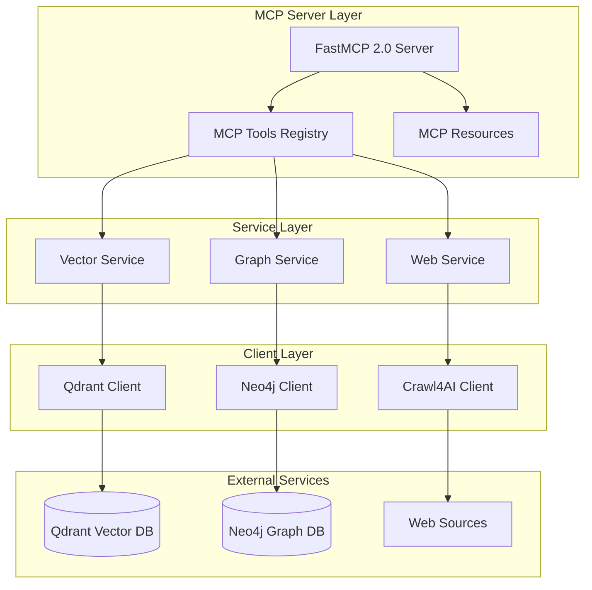

# Development Documentation

Welcome to the development documentation for the **Unified MCP Intelligence Server** - a production-ready agentic RAG MCP server that combines Qdrant (vector database), Neo4j (knowledge graphs), and Crawl4AI (web intelligence) into a unified Model Context Protocol server using FastMCP 2.0.

## 📋 Table of Contents

### Getting Started
- [Local Setup Guide](local-setup.md) - Environment setup and installation
- [Testing Guidelines](testing.md) - Testing frameworks and strategies
- [Debugging Tools](debugging.md) - Development debugging techniques

### Contributing
- [Contributing Guidelines](contributing.md) - How to contribute to the project
- [Code Style Guide](code-style.md) - Coding standards and formatting
- [Release Process](release-process.md) - Versioning and release workflow

### Performance & Optimization
- [Performance Testing](performance.md) - Benchmarking and optimization

## 🚀 Quick Start for Developers

```bash
# Clone and setup development environment
git clone <repository-url>
cd qdrant-neo4j-crawl4ai-mcp

# Install with development dependencies
uv install --extra dev

# Setup pre-commit hooks
pre-commit install

# Start development services
docker-compose up -d

# Run tests
pytest

# Start development server
uv run qdrant-neo4j-crawl4ai-mcp
```

## 🏗️ Architecture Overview

The Unified MCP Intelligence Server is built on a modular architecture:



## 🛠️ Development Stack

- **Language**: Python 3.11+
- **Framework**: FastMCP 2.0, FastAPI
- **Databases**: Qdrant (vectors), Neo4j (graphs)
- **Web Intelligence**: Crawl4AI
- **Testing**: pytest, pytest-asyncio, testcontainers
- **Code Quality**: ruff, mypy, bandit
- **Monitoring**: Prometheus, Grafana, Loki
- **Deployment**: Docker, Kubernetes, Fly.io

## 🧪 Development Workflow

1. **Feature Development**
   - Create feature branch from `main`
   - Implement changes with tests
   - Ensure code quality passes
   - Create pull request

2. **Code Quality Gates**
   - Linting with `ruff`
   - Type checking with `mypy`
   - Security scanning with `bandit`
   - Test coverage ≥90%

3. **Testing Strategy**
   - Unit tests for individual components
   - Integration tests for service interactions
   - End-to-end tests for complete workflows
   - Performance tests for scalability

## 📁 Project Structure

```
qdrant-neo4j-crawl4ai-mcp/
├── src/qdrant_neo4j_crawl4ai_mcp/
│   ├── main.py                 # FastMCP server entry point
│   ├── config.py               # Configuration management
│   ├── auth.py                 # Authentication & authorization
│   ├── middleware.py           # Request/response middleware
│   ├── services/               # Core service implementations
│   │   ├── vector_service.py   # Qdrant vector operations
│   │   ├── graph_service.py    # Neo4j graph operations
│   │   └── web_service.py      # Crawl4AI web intelligence
│   ├── tools/                  # MCP tool implementations
│   │   ├── vector_tools.py     # Vector search & storage tools
│   │   ├── graph_tools.py      # Graph query & analysis tools
│   │   └── web_tools.py        # Web crawling & extraction tools
│   └── models/                 # Pydantic data models
├── tests/                      # Test suite
│   ├── unit/                   # Unit tests
│   ├── integration/            # Integration tests
│   ├── security/               # Security tests
│   └── performance/            # Performance tests
├── docs/                       # Documentation
├── monitoring/                 # Observability stack
└── deployment/                 # Deployment configurations
```

## 🔧 Key Development Areas

### Adding New MCP Tools

1. Define tool in appropriate module (`vector_tools.py`, `graph_tools.py`, `web_tools.py`)
2. Implement using FastMCP decorators
3. Add comprehensive error handling
4. Include parameter validation
5. Write unit and integration tests
6. Update API documentation

### Extending Database Integrations

- **Vector Database**: Add new embedding models or distance metrics
- **Graph Database**: Implement additional Cypher patterns or GraphRAG features
- **Web Intelligence**: Extend crawling capabilities or content extraction

### Custom Agent Implementations

- Implement agentic workflows combining multiple services
- Add memory management for conversation context
- Integrate with external LLM providers
- Build evaluation and monitoring frameworks

## 🔒 Security Considerations

- JWT-based authentication with configurable scopes
- Rate limiting and request throttling
- Input validation and sanitization
- Secure credential management
- Audit logging for sensitive operations

## 📊 Monitoring & Observability

- **Metrics**: Prometheus metrics for performance monitoring
- **Logging**: Structured JSON logging with correlation IDs
- **Tracing**: Request tracing across service boundaries
- **Health Checks**: Kubernetes-style health and readiness probes

## 🤝 Getting Help

- **Issues**: Report bugs and feature requests via GitHub Issues
- **Discussions**: Technical discussions and questions
- **Documentation**: Comprehensive guides in the `docs/` directory
- **Code Reviews**: All changes go through peer review process

## 📚 Additional Resources

- [Architecture Decision Records (ADRs)](../adrs/)
- [API Reference](../API_REFERENCE.md)
- [Deployment Guide](../DEPLOYMENT_OPERATIONS.md)
- [Technical Documentation](../TECHNICAL_DOCUMENTATION.md)

---

*Happy coding! 🚀*