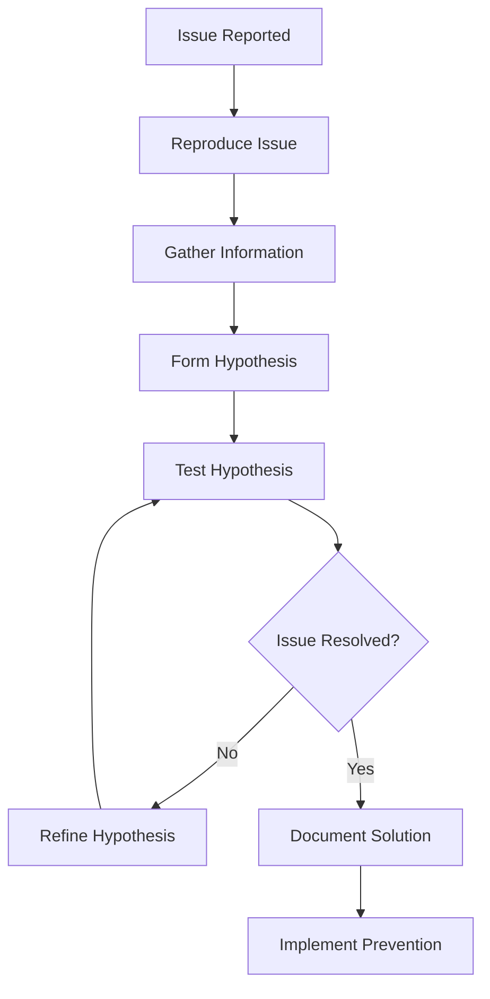

# Debugging Guide

Comprehensive debugging strategies, tools, and techniques for the Unified MCP Intelligence Server to quickly identify and resolve issues during development.

## 🎯 Debugging Philosophy

### Core Principles

1. **Systematic Approach**: Debug methodically, not randomly
2. **Evidence-Based**: Use logs, metrics, and tools to guide investigation
3. **Isolate and Reproduce**: Create minimal reproduction cases
4. **Document Findings**: Record solutions for future reference
5. **Prevention Focus**: Fix root causes, not just symptoms

### Debugging Process



## 🔧 Development Environment Setup

### Debug Configuration

Create a debug-specific environment file:

```bash
# .env.debug
ENVIRONMENT=development
DEBUG=true
LOG_LEVEL=DEBUG

# Enable detailed database logging
QDRANT_LOG_LEVEL=DEBUG
NEO4J_LOG_LEVEL=DEBUG

# Enable development tools
ENABLE_SWAGGER_UI=true
ENABLE_REDOC=true
ENABLE_DEBUG_TOOLBAR=true

# Disable caching for debugging
ENABLE_CACHING=false
CRAWL4AI_ENABLE_CACHING=false

# Extended timeouts for debugging
CONNECTION_TIMEOUT=300
REQUEST_TIMEOUT=300
```

### Debug Server Launch

```python
# debug.py - Development debugging script
import asyncio
import logging
from qdrant_neo4j_crawl4ai_mcp.main import create_app
from qdrant_neo4j_crawl4ai_mcp.config import get_settings
import uvicorn

async def debug_server():
    """Launch server with debug configuration."""
    # Enable asyncio debug mode
    asyncio.get_event_loop().set_debug(True)
    
    # Configure detailed logging
    logging.basicConfig(
        level=logging.DEBUG,
        format='%(asctime)s - %(name)s - %(levelname)s - %(message)s'
    )
    
    # Load debug settings
    settings = get_settings()
    settings.debug = True
    settings.log_level = "DEBUG"
    
    # Create app with debug configuration
    app = create_app(settings)
    
    # Start with debugging enabled
    config = uvicorn.Config(
        app=app,
        host="0.0.0.0",
        port=8000,
        log_level="debug",
        reload=True,
        reload_dirs=["src"],
        access_log=True
    )
    
    server = uvicorn.Server(config)
    await server.serve()

if __name__ == "__main__":
    asyncio.run(debug_server())
```

## 📊 Logging and Monitoring

### Structured Logging Setup

```python
# Enhanced logging configuration
import structlog
import sys
import json
from datetime import datetime

def setup_debug_logging():
    """Configure comprehensive debug logging."""
    
    # Custom processor for debug information
    def add_debug_info(logger, method_name, event_dict):
        """Add debug context to log entries."""
        event_dict["debug_timestamp"] = datetime.utcnow().isoformat()
        event_dict["logger_name"] = logger.name
        event_dict["method"] = method_name
        
        # Add stack trace for errors
        if event_dict.get("level") == "error":
            import traceback
            event_dict["stack_trace"] = traceback.format_stack()
        
        return event_dict
    
    # Configure structlog
    structlog.configure(
        processors=[
            structlog.stdlib.filter_by_level,
            structlog.stdlib.add_logger_name,
            structlog.stdlib.add_log_level,
            structlog.processors.TimeStamper(fmt="iso"),
            add_debug_info,
            structlog.processors.JSONRenderer(indent=2)
        ],
        context_class=dict,
        logger_factory=structlog.stdlib.LoggerFactory(),
        wrapper_class=structlog.stdlib.BoundLogger,
        cache_logger_on_first_use=True,
    )

# Usage in services
logger = structlog.get_logger(__name__)

async def debug_vector_search(request: VectorSearchRequest) -> VectorSearchResponse:
    """Vector search with extensive debug logging."""
    
    # Log request details
    logger.debug(
        "Vector search debug start",
        request_id=str(uuid.uuid4()),
        query_text=request.query,
        query_length=len(request.query),
        collection_name=request.collection_name,
        limit=request.limit,
        filters=request.filters,
        embedding_model=self.config.default_embedding_model
    )
    
    try:
        # Debug embedding generation
        start_time = time.time()
        embedding = await self._generate_embedding(request.query)
        embedding_time = time.time() - start_time
        
        logger.debug(
            "Embedding generated",
            embedding_dimensions=len(embedding),
            embedding_time_ms=int(embedding_time * 1000),
            embedding_preview=embedding[:5],  # First 5 dimensions
            embedding_norm=sum(x*x for x in embedding) ** 0.5
        )
        
        # Debug search execution
        search_start = time.time()
        results = await self._client.search(
            collection_name=request.collection_name,
            query_vector=embedding,
            limit=request.limit
        )
        search_time = time.time() - search_start
        
        logger.debug(
            "Search completed",
            results_count=len(results),
            search_time_ms=int(search_time * 1000),
            score_distribution=[r.score for r in results[:5]]
        )
        
        return VectorSearchResponse(
            results=results,
            search_time_ms=int(search_time * 1000),
            debug_info={
                "embedding_time_ms": int(embedding_time * 1000),
                "embedding_dimensions": len(embedding),
                "total_time_ms": int((time.time() - start_time) * 1000)
            }
        )
        
    except Exception as e:
        logger.exception(
            "Vector search failed",
            error_type=type(e).__name__,
            error_message=str(e),
            request_params=request.dict()
        )
        raise
```

### Debug Middleware

```python
# middleware/debug_middleware.py
from fastapi import Request, Response
from fastapi.middleware.base import BaseHTTPMiddleware
import time
import uuid

class DebugMiddleware(BaseHTTPMiddleware):
    """Middleware for request/response debugging."""
    
    async def dispatch(self, request: Request, call_next):
        """Add debug information to requests."""
        
        # Generate request ID
        request_id = str(uuid.uuid4())
        request.state.request_id = request_id
        
        # Log request start
        start_time = time.time()
        
        logger.debug(
            "Request started",
            request_id=request_id,
            method=request.method,
            url=str(request.url),
            headers=dict(request.headers),
            client_ip=request.client.host if request.client else None
        )
        
        try:
            # Process request
            response = await call_next(request)
            
            # Calculate response time
            process_time = time.time() - start_time
            
            # Log response
            logger.debug(
                "Request completed",
                request_id=request_id,
                status_code=response.status_code,
                process_time_ms=int(process_time * 1000),
                response_headers=dict(response.headers)
            )
            
            # Add debug headers
            response.headers["X-Request-ID"] = request_id
            response.headers["X-Process-Time"] = str(process_time)
            
            return response
            
        except Exception as e:
            # Log error
            process_time = time.time() - start_time
            
            logger.exception(
                "Request failed",
                request_id=request_id,
                error_type=type(e).__name__,
                error_message=str(e),
                process_time_ms=int(process_time * 1000)
            )
            
            raise
```

## 🐛 Common Issues and Solutions

### Service Initialization Issues

#### Issue: Vector Service Won't Initialize

**Symptoms:**
- `ServiceInitializationError` on startup
- Qdrant connection failures
- Embedding model loading errors

**Debug Steps:**

```python
# Debug script for vector service issues
async def debug_vector_service():
    """Debug vector service initialization."""
    
    print("🔍 Debugging Vector Service Initialization...")
    
    # 1. Test Qdrant connection
    try:
        from qdrant_client import QdrantClient
        client = QdrantClient(url="http://localhost:6333")
        collections = await client.get_collections()
        print(f"✅ Qdrant connection successful: {len(collections)} collections")
    except Exception as e:
        print(f"❌ Qdrant connection failed: {e}")
        return
    
    # 2. Test embedding model loading
    try:
        from sentence_transformers import SentenceTransformer
        model = SentenceTransformer("sentence-transformers/all-MiniLM-L6-v2")
        test_embedding = model.encode("test text")
        print(f"✅ Embedding model loaded: {len(test_embedding)} dimensions")
    except Exception as e:
        print(f"❌ Embedding model failed: {e}")
        return
    
    # 3. Test full service initialization
    try:
        from qdrant_neo4j_crawl4ai_mcp.services.vector_service import VectorService
        from qdrant_neo4j_crawl4ai_mcp.models.vector_models import VectorServiceConfig
        
        config = VectorServiceConfig(qdrant_url="http://localhost:6333")
        service = VectorService(config)
        await service.initialize()
        print("✅ Vector service initialized successfully")
        
        # Test basic operations
        await service.health_check()
        print("✅ Vector service health check passed")
        
    except Exception as e:
        print(f"❌ Vector service initialization failed: {e}")
        import traceback
        traceback.print_exc()

# Run debugging
asyncio.run(debug_vector_service())
```

**Common Solutions:**

```bash
# Check Qdrant is running
docker ps | grep qdrant
curl http://localhost:6333/collections

# Check Qdrant logs
docker logs qdrant-container

# Reset Qdrant data
docker-compose down -v
docker-compose up -d qdrant

# Check Python dependencies
uv pip list | grep -E "(qdrant|sentence-transformers)"

# Clear embedding model cache
rm -rf ~/.cache/torch/sentence_transformers/
```

#### Issue: Graph Service Connection Problems

**Symptoms:**
- Neo4j connection timeouts
- Authentication failures
- Cypher query errors

**Debug Steps:**

```python
# Debug script for graph service issues
async def debug_graph_service():
    """Debug graph service issues."""
    
    print("🔍 Debugging Graph Service...")
    
    # 1. Test Neo4j connection
    try:
        from neo4j import AsyncGraphDatabase
        
        driver = AsyncGraphDatabase.driver(
            "bolt://localhost:7687",
            auth=("neo4j", "devpassword")
        )
        
        async with driver.session() as session:
            result = await session.run("RETURN 1 as test")
            record = await result.single()
            print(f"✅ Neo4j connection successful: {record['test']}")
            
    except Exception as e:
        print(f"❌ Neo4j connection failed: {e}")
        return
    
    # 2. Test graph service initialization
    try:
        from qdrant_neo4j_crawl4ai_mcp.services.graph_service import GraphService
        from qdrant_neo4j_crawl4ai_mcp.models.graph_models import Neo4jServiceConfig
        
        config = Neo4jServiceConfig(
            uri="bolt://localhost:7687",
            username="neo4j",
            password="devpassword"
        )
        
        service = GraphService(config)
        await service.initialize()
        print("✅ Graph service initialized successfully")
        
    except Exception as e:
        print(f"❌ Graph service initialization failed: {e}")
        import traceback
        traceback.print_exc()

# Run debugging
asyncio.run(debug_graph_service())
```

### MCP Protocol Issues

#### Issue: Tool Registration Failures

**Debug Tool Registration:**

```python
# Debug MCP tool registration
def debug_mcp_tools():
    """Debug MCP tool registration issues."""
    
    from fastmcp import FastMCP
    
    print("🔍 Debugging MCP Tool Registration...")
    
    try:
        # Create MCP instance
        mcp = FastMCP("Debug MCP Server")
        
        # Register a simple test tool
        @mcp.tool()
        async def test_tool(message: str) -> str:
            """Test tool for debugging."""
            return f"Echo: {message}"
        
        # List registered tools
        tools = mcp.list_tools()
        print(f"✅ Registered tools: {[tool.name for tool in tools]}")
        
        # Test tool execution
        result = await mcp.call_tool("test_tool", {"message": "Hello"})
        print(f"✅ Tool execution successful: {result}")
        
    except Exception as e:
        print(f"❌ MCP tool registration failed: {e}")
        import traceback
        traceback.print_exc()
```

### Performance Issues

#### Issue: Slow Vector Search

**Debug Performance:**

```python
# Performance debugging for vector operations
import time
import cProfile
import pstats
from contextlib import contextmanager

@contextmanager
def profile_operation(operation_name: str):
    """Context manager for profiling operations."""
    profiler = cProfile.Profile()
    start_time = time.time()
    
    profiler.enable()
    try:
        yield
    finally:
        profiler.disable()
        end_time = time.time()
        
        print(f"\n📊 Performance Report: {operation_name}")
        print(f"Total Time: {(end_time - start_time)*1000:.2f}ms")
        
        # Print top 10 functions by cumulative time
        stats = pstats.Stats(profiler)
        stats.sort_stats('cumulative')
        stats.print_stats(10)

# Usage example
async def debug_vector_search_performance():
    """Debug vector search performance."""
    
    with profile_operation("Vector Search"):
        # Perform vector search operation
        request = VectorSearchRequest(
            query="performance test query",
            collection_name="test_collection",
            limit=10
        )
        
        response = await vector_service.search_vectors(request)
        print(f"Found {len(response.results)} results")
```

## 🔧 Advanced Debugging Tools

### Memory Debugging

```python
# Memory usage debugging
import tracemalloc
import gc
from typing import Dict, Any

class MemoryDebugger:
    """Debug memory usage and leaks."""
    
    def __init__(self):
        self.snapshots: Dict[str, Any] = {}
    
    def start_tracing(self) -> None:
        """Start memory tracing."""
        tracemalloc.start()
        print("🔍 Memory tracing started")
    
    def take_snapshot(self, label: str) -> None:
        """Take memory snapshot."""
        if not tracemalloc.is_tracing():
            print("❌ Memory tracing not active")
            return
        
        snapshot = tracemalloc.take_snapshot()
        self.snapshots[label] = snapshot
        
        current, peak = tracemalloc.get_traced_memory()
        print(f"📊 Memory snapshot '{label}': {current/1024/1024:.2f}MB current, {peak/1024/1024:.2f}MB peak")
    
    def compare_snapshots(self, label1: str, label2: str) -> None:
        """Compare two memory snapshots."""
        if label1 not in self.snapshots or label2 not in self.snapshots:
            print("❌ Snapshots not found")
            return
        
        snapshot1 = self.snapshots[label1]
        snapshot2 = self.snapshots[label2]
        
        top_stats = snapshot2.compare_to(snapshot1, 'lineno')
        
        print(f"\n📈 Memory comparison: {label1} -> {label2}")
        print("Top 10 memory differences:")
        
        for index, stat in enumerate(top_stats[:10], 1):
            print(f"{index}. {stat}")
    
    def analyze_memory_usage(self) -> None:
        """Analyze current memory usage."""
        if not tracemalloc.is_tracing():
            print("❌ Memory tracing not active")
            return
        
        snapshot = tracemalloc.take_snapshot()
        top_stats = snapshot.statistics('lineno')
        
        print("\n📊 Top 10 memory allocations:")
        for index, stat in enumerate(top_stats[:10], 1):
            print(f"{index}. {stat}")
        
        # Garbage collection info
        print(f"\n🗑️ Garbage collection: {gc.get_count()}")

# Usage example
async def debug_memory_usage():
    """Debug memory usage during operations."""
    
    debugger = MemoryDebugger()
    debugger.start_tracing()
    
    # Baseline
    debugger.take_snapshot("baseline")
    
    # After service initialization
    await initialize_services()
    debugger.take_snapshot("after_init")
    
    # After processing requests
    for i in range(100):
        await process_request()
    debugger.take_snapshot("after_requests")
    
    # Compare snapshots
    debugger.compare_snapshots("baseline", "after_init")
    debugger.compare_snapshots("after_init", "after_requests")
    
    debugger.analyze_memory_usage()
```

### Async Debugging

```python
# Async operation debugging
import asyncio
import functools
from typing import Callable, Any

def debug_async(func: Callable) -> Callable:
    """Decorator for debugging async functions."""
    
    @functools.wraps(func)
    async def wrapper(*args, **kwargs):
        func_name = f"{func.__module__}.{func.__name__}"
        
        print(f"🔄 Starting async function: {func_name}")
        print(f"   Args: {args}")
        print(f"   Kwargs: {kwargs}")
        
        start_time = time.time()
        
        try:
            # Check if we're in the main thread
            loop = asyncio.get_event_loop()
            if loop.is_running():
                print(f"   Running in event loop: {id(loop)}")
            
            result = await func(*args, **kwargs)
            
            end_time = time.time()
            print(f"✅ Completed async function: {func_name} ({(end_time-start_time)*1000:.2f}ms)")
            
            return result
            
        except Exception as e:
            end_time = time.time()
            print(f"❌ Failed async function: {func_name} ({(end_time-start_time)*1000:.2f}ms)")
            print(f"   Error: {type(e).__name__}: {e}")
            raise
    
    return wrapper

# Usage
@debug_async
async def search_vectors(request: VectorSearchRequest) -> VectorSearchResponse:
    """Vector search with async debugging."""
    # Function implementation
    pass

# Debug event loop
def debug_event_loop():
    """Debug event loop state."""
    try:
        loop = asyncio.get_event_loop()
        print(f"📊 Event Loop Debug:")
        print(f"   Loop ID: {id(loop)}")
        print(f"   Is Running: {loop.is_running()}")
        print(f"   Is Closed: {loop.is_closed()}")
        print(f"   Debug Mode: {loop.get_debug()}")
        
        # Count pending tasks
        tasks = asyncio.all_tasks(loop)
        print(f"   Active Tasks: {len(tasks)}")
        
        for i, task in enumerate(tasks):
            if not task.done():
                print(f"     Task {i}: {task.get_name()} - {task.get_coro()}")
                
    except RuntimeError as e:
        print(f"❌ No event loop: {e}")
```

### Database Connection Debugging

```python
# Database connection debugging utilities
class ConnectionDebugger:
    """Debug database connections."""
    
    @staticmethod
    async def debug_qdrant_connection(url: str, api_key: Optional[str] = None):
        """Debug Qdrant connection issues."""
        print(f"🔍 Debugging Qdrant connection to {url}")
        
        try:
            from qdrant_client import QdrantClient
            
            # Test basic connection
            client = QdrantClient(url=url, api_key=api_key)
            
            # Test health
            health = await client.get_health()
            print(f"✅ Qdrant health: {health}")
            
            # Test collections
            collections = await client.get_collections()
            print(f"✅ Collections available: {len(collections.collections)}")
            
            for collection in collections.collections:
                info = await client.get_collection(collection.name)
                print(f"   - {collection.name}: {info.points_count} points")
            
            # Test metrics
            metrics = await client.get_metrics()
            print(f"✅ Qdrant metrics: {metrics}")
            
        except Exception as e:
            print(f"❌ Qdrant connection failed: {e}")
            import traceback
            traceback.print_exc()
    
    @staticmethod
    async def debug_neo4j_connection(uri: str, username: str, password: str):
        """Debug Neo4j connection issues."""
        print(f"🔍 Debugging Neo4j connection to {uri}")
        
        try:
            from neo4j import AsyncGraphDatabase
            
            # Test connection
            driver = AsyncGraphDatabase.driver(uri, auth=(username, password))
            
            async with driver.session() as session:
                # Test basic query
                result = await session.run("RETURN 1 as test")
                record = await result.single()
                print(f"✅ Neo4j basic query: {record['test']}")
                
                # Test database info
                result = await session.run("CALL dbms.components()")
                components = await result.data()
                print(f"✅ Neo4j components: {len(components)}")
                
                # Test node count
                result = await session.run("MATCH (n) RETURN count(n) as node_count")
                record = await result.single()
                print(f"✅ Neo4j nodes: {record['node_count']}")
                
            await driver.close()
            
        except Exception as e:
            print(f"❌ Neo4j connection failed: {e}")
            import traceback
            traceback.print_exc()
```

## 🛠️ IDE Debugging Setup

### VS Code Debug Configuration

Create `.vscode/launch.json`:

```json
{
    "version": "0.2.0",
    "configurations": [
        {
            "name": "Debug MCP Server",
            "type": "python",
            "request": "launch",
            "program": "${workspaceFolder}/src/qdrant_neo4j_crawl4ai_mcp/main.py",
            "console": "integratedTerminal",
            "env": {
                "PYTHONPATH": "${workspaceFolder}/src",
                "DEBUG": "true",
                "LOG_LEVEL": "DEBUG"
            },
            "args": [],
            "justMyCode": false,
            "subProcess": true
        },
        {
            "name": "Debug Tests",
            "type": "python",
            "request": "launch",
            "module": "pytest",
            "args": [
                "${workspaceFolder}/tests",
                "-v",
                "--tb=short"
            ],
            "console": "integratedTerminal",
            "env": {
                "PYTHONPATH": "${workspaceFolder}/src"
            },
            "justMyCode": false
        },
        {
            "name": "Debug Specific Test",
            "type": "python",
            "request": "launch",
            "module": "pytest",
            "args": [
                "${file}",
                "-v",
                "--tb=long"
            ],
            "console": "integratedTerminal",
            "env": {
                "PYTHONPATH": "${workspaceFolder}/src"
            },
            "justMyCode": false
        }
    ]
}
```

### Breakpoint Best Practices

```python
# Strategic breakpoint placement
async def vector_search_with_breakpoints(request: VectorSearchRequest) -> VectorSearchResponse:
    """Vector search with strategic debugging breakpoints."""
    
    # Breakpoint 1: Input validation
    breakpoint()  # Check request parameters
    self._validate_request(request)
    
    # Breakpoint 2: Before embedding generation
    breakpoint()  # Inspect query and model
    embedding = await self._generate_embedding(request.query)
    
    # Breakpoint 3: Before database search
    breakpoint()  # Check embedding and search parameters
    results = await self._client.search(...)
    
    # Breakpoint 4: Before response formatting
    breakpoint()  # Inspect raw results
    response = self._format_response(results)
    
    return response
```

## 📊 Performance Profiling

### CPU Profiling

```python
# CPU profiling utilities
import cProfile
import pstats
import io
from contextlib import contextmanager

@contextmanager
def cpu_profile(operation_name: str):
    """Profile CPU usage for operations."""
    profiler = cProfile.Profile()
    
    print(f"🔍 Starting CPU profiling: {operation_name}")
    profiler.enable()
    
    try:
        yield profiler
    finally:
        profiler.disable()
        
        # Generate report
        output = io.StringIO()
        stats = pstats.Stats(profiler, stream=output)
        stats.sort_stats('cumulative')
        stats.print_stats(20)  # Top 20 functions
        
        print(f"📊 CPU Profile Report: {operation_name}")
        print(output.getvalue())

# Usage
async def profile_vector_operations():
    """Profile vector operations."""
    
    with cpu_profile("Vector Search Performance"):
        for i in range(100):
            await vector_service.search_vectors(test_request)
```

### Memory Profiling

```python
# Memory profiling with memory_profiler
from memory_profiler import profile
import psutil
import os

@profile
def memory_intensive_operation():
    """Function decorated for memory profiling."""
    # Operation implementation
    pass

def monitor_memory_usage():
    """Monitor system memory usage."""
    process = psutil.Process(os.getpid())
    memory_info = process.memory_info()
    
    print(f"📊 Memory Usage:")
    print(f"   RSS: {memory_info.rss / 1024 / 1024:.2f} MB")
    print(f"   VMS: {memory_info.vms / 1024 / 1024:.2f} MB")
    print(f"   CPU: {process.cpu_percent():.1f}%")
    
    # System memory
    system_memory = psutil.virtual_memory()
    print(f"   System Available: {system_memory.available / 1024 / 1024:.2f} MB")
    print(f"   System Usage: {system_memory.percent:.1f}%")
```

## 🚨 Error Tracking and Alerting

### Error Context Collection

```python
# Comprehensive error context collection
import sys
import traceback
from typing import Dict, Any

class ErrorContextCollector:
    """Collect comprehensive error context."""
    
    @staticmethod
    def collect_error_context(exception: Exception) -> Dict[str, Any]:
        """Collect comprehensive error context."""
        
        # Get exception details
        exc_type, exc_value, exc_traceback = sys.exc_info()
        
        context = {
            "error": {
                "type": type(exception).__name__,
                "message": str(exception),
                "module": getattr(exception, "__module__", None)
            },
            "traceback": {
                "formatted": traceback.format_exception(exc_type, exc_value, exc_traceback),
                "frames": []
            },
            "system": {
                "python_version": sys.version,
                "platform": sys.platform,
                "executable": sys.executable
            },
            "process": {
                "pid": os.getpid(),
                "memory_usage": psutil.Process().memory_info()._asdict(),
                "cpu_percent": psutil.Process().cpu_percent()
            }
        }
        
        # Extract frame information
        if exc_traceback:
            for frame in traceback.extract_tb(exc_traceback):
                context["traceback"]["frames"].append({
                    "filename": frame.filename,
                    "line_number": frame.lineno,
                    "function": frame.name,
                    "code": frame.line
                })
        
        return context

# Enhanced exception handler
async def handle_service_error(operation: str, exception: Exception):
    """Handle service errors with comprehensive logging."""
    
    # Collect error context
    context = ErrorContextCollector.collect_error_context(exception)
    
    # Log error with context
    logger.exception(
        f"Service operation failed: {operation}",
        error_context=context,
        operation=operation
    )
    
    # Optional: Send to error tracking service
    # await send_to_error_tracking(context)
```

## 📚 Debugging Cheat Sheet

### Quick Debugging Commands

```bash
# Service status checks
curl http://localhost:8000/health
curl http://localhost:8000/ready

# Database connectivity
curl http://localhost:6333/collections
docker exec neo4j cypher-shell -u neo4j -p devpassword "RETURN 1"

# Log analysis
tail -f logs/app.log | grep ERROR
docker logs -f qdrant-container
docker logs -f neo4j-container

# Performance monitoring
htop
iostat -x 1
netstat -tlnp

# Memory debugging
cat /proc/meminfo
ps aux --sort=-%mem | head

# Python debugging
python -m pdb script.py
python -c "import qdrant_neo4j_crawl4ai_mcp; print('Import successful')"
```

### Common Debug Scenarios

| Issue | Quick Check | Debug Command |
|-------|-------------|---------------|
| Service won't start | Check ports | `netstat -tlnp \| grep 8000` |
| Database connection | Test connectivity | `curl http://localhost:6333` |
| Memory leak | Monitor usage | `watch -n 1 'ps aux \| grep python'` |
| Slow responses | Check logs | `tail -f logs/app.log \| grep time` |
| Import errors | Test imports | `python -c "import module"` |

## 🔧 Debugging Tools Installation

### Required Debug Tools

```bash
# Install debugging tools
uv add --dev memory-profiler
uv add --dev line-profiler
uv add --dev py-spy
uv add --dev objgraph

# System monitoring tools
sudo apt-get install htop iotop nethogs

# Database debugging tools
sudo apt-get install postgresql-client-common
npm install -g @neo4j/cypher-shell
```

### Custom Debug Scripts

Create `scripts/debug.py`:

```python
#!/usr/bin/env python3
"""Debugging utilities for the MCP server."""

import asyncio
import click
from qdrant_neo4j_crawl4ai_mcp.services.vector_service import VectorService
from qdrant_neo4j_crawl4ai_mcp.services.graph_service import GraphService

@click.group()
def cli():
    """MCP Server debugging utilities."""
    pass

@cli.command()
@click.option('--url', default='http://localhost:6333', help='Qdrant URL')
def test_qdrant(url: str):
    """Test Qdrant connection and operations."""
    asyncio.run(ConnectionDebugger.debug_qdrant_connection(url))

@cli.command()
@click.option('--uri', default='bolt://localhost:7687', help='Neo4j URI')
@click.option('--username', default='neo4j', help='Neo4j username')
@click.option('--password', prompt=True, hide_input=True, help='Neo4j password')
def test_neo4j(uri: str, username: str, password: str):
    """Test Neo4j connection and operations."""
    asyncio.run(ConnectionDebugger.debug_neo4j_connection(uri, username, password))

@cli.command()
def check_services():
    """Check all service health."""
    print("🔍 Checking all services...")
    # Implementation here

if __name__ == '__main__':
    cli()
```

---

*Effective debugging is the key to maintaining a robust and reliable system!* 🐛🔧