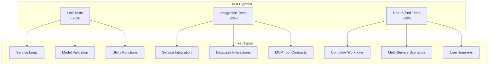

# Testing Guidelines

Comprehensive testing strategy for the Unified MCP Intelligence Server to ensure reliability, performance, and security across all components.

## 🧪 Testing Philosophy

Our testing approach follows the **Test Pyramid** principle:



## 📁 Test Structure

```
tests/
├── conftest.py                 # Shared fixtures and configuration
├── unit/                       # Fast, isolated unit tests
│   ├── test_vector_service.py  # Vector service unit tests
│   ├── test_graph_service.py   # Graph service unit tests
│   ├── test_web_service.py     # Web service unit tests
│   ├── test_auth.py           # Authentication unit tests
│   └── test_models.py         # Pydantic model tests
├── integration/                # Service integration tests
│   ├── test_cross_service_integration.py
│   ├── test_unified_server.py
│   ├── test_database_operations.py
│   └── test_mcp_protocol.py
├── security/                   # Security-focused tests
│   ├── test_auth_security.py
│   ├── test_input_validation.py
│   └── test_rate_limiting.py
├── performance/                # Performance and load tests
│   ├── test_load_benchmarks.py
│   ├── test_memory_usage.py
│   └── test_concurrent_operations.py
├── property/                   # Property-based tests
│   ├── test_mcp_protocol.py
│   └── test_data_consistency.py
└── fixtures/                   # Test data and fixtures
    ├── sample_documents.json
    ├── test_graphs.cypher
    └── web_content_samples.html
```

## 🚀 Quick Start

### Run All Tests

```bash
# Run complete test suite
pytest

# Run with coverage
pytest --cov=qdrant_neo4j_crawl4ai_mcp --cov-report=html --cov-report=term

# Run specific test categories
pytest -m unit
pytest -m integration
pytest -m "not slow"
```

### Test Categories

```bash
# Unit tests (fast, isolated)
pytest tests/unit/ -v

# Integration tests (require databases)
pytest tests/integration/ -v

# Security tests
pytest tests/security/ -v

# Performance tests
pytest tests/performance/ -v --benchmark-only

# Property-based tests
pytest tests/property/ -v
```

## 🔧 Test Configuration

### pytest Configuration

The `pyproject.toml` includes comprehensive pytest configuration:

```toml
[tool.pytest.ini_options]
minversion = "8.0"
addopts = [
    "--strict-markers",
    "--strict-config",
    "--cov=qdrant_neo4j_crawl4ai_mcp",
    "--cov-report=term-missing",
    "--cov-report=html",
    "--cov-report=xml",
    "--cov-fail-under=90",
    "--cov-branch",
    "--timeout=300",
    "--tb=short",
]
markers = [
    "unit: Unit tests",
    "integration: Integration tests", 
    "e2e: End-to-end tests",
    "slow: Slow tests",
    "network: Tests requiring network",
    "security: Security-focused tests",
    "performance: Performance tests",
    "property: Property-based tests",
]
```

### Test Markers

Use markers to categorize and run specific test types:

```python
import pytest

@pytest.mark.unit
def test_vector_embedding():
    """Unit test for vector embedding generation."""
    pass

@pytest.mark.integration
@pytest.mark.asyncio
async def test_vector_search_integration():
    """Integration test for vector search."""
    pass

@pytest.mark.slow
@pytest.mark.performance
def test_bulk_operations(benchmark):
    """Performance test for bulk operations."""
    pass
```

## 🧩 Unit Testing

### Service Testing Pattern

```python
# tests/unit/test_vector_service.py
import pytest
from unittest.mock import AsyncMock, Mock
from qdrant_neo4j_crawl4ai_mcp.services.vector_service import VectorService
from qdrant_neo4j_crawl4ai_mcp.models.vector_models import VectorServiceConfig

@pytest.fixture
def vector_config():
    """Vector service configuration fixture."""
    return VectorServiceConfig(
        qdrant_url="http://localhost:6333",
        default_collection="test_collection"
    )

@pytest.fixture
def mock_qdrant_client():
    """Mock Qdrant client."""
    client = Mock()
    client.get_collections = AsyncMock(return_value=[])
    client.search = AsyncMock(return_value=[])
    return client

@pytest.mark.unit
@pytest.mark.asyncio
async def test_vector_service_initialization(vector_config, mock_qdrant_client):
    """Test vector service initialization."""
    service = VectorService(vector_config)
    service._client = mock_qdrant_client
    
    await service.initialize()
    
    assert service.is_initialized
    mock_qdrant_client.get_collections.assert_called_once()

@pytest.mark.unit
@pytest.mark.asyncio
async def test_vector_search_empty_query(vector_config):
    """Test vector search with empty query."""
    service = VectorService(vector_config)
    
    with pytest.raises(ValueError, match="Query cannot be empty"):
        await service.search_vectors("")
```

### Model Testing

```python
# tests/unit/test_models.py
import pytest
from pydantic import ValidationError
from qdrant_neo4j_crawl4ai_mcp.models.vector_models import VectorSearchRequest

@pytest.mark.unit
def test_vector_search_request_validation():
    """Test vector search request validation."""
    # Valid request
    request = VectorSearchRequest(
        query="test query",
        collection_name="test_collection",
        limit=10
    )
    assert request.query == "test query"
    assert request.limit == 10

    # Invalid limit
    with pytest.raises(ValidationError):
        VectorSearchRequest(
            query="test",
            collection_name="test",
            limit=0  # Should be >= 1
        )

    # Empty query
    with pytest.raises(ValidationError):
        VectorSearchRequest(
            query="",  # Should not be empty
            collection_name="test"
        )
```

## 🔄 Integration Testing

### Database Integration

```python
# tests/integration/test_vector_integration.py
import pytest
from testcontainers.compose import DockerCompose
from qdrant_neo4j_crawl4ai_mcp.services.vector_service import VectorService

@pytest.fixture(scope="session")
def qdrant_container():
    """Start Qdrant container for integration tests."""
    with DockerCompose(".", compose_file_name="docker-compose.test.yml") as compose:
        compose.wait_for("http://localhost:6333/collections")
        yield compose

@pytest.mark.integration
@pytest.mark.asyncio
async def test_vector_search_integration(qdrant_container, vector_service):
    """Test actual vector search integration."""
    # Store test document
    store_request = VectorStoreRequest(
        content="This is a test document for vector search",
        collection_name="test_collection"
    )
    store_response = await vector_service.store_vector(store_request)
    assert store_response.id is not None

    # Search for document
    search_request = VectorSearchRequest(
        query="test document",
        collection_name="test_collection",
        limit=5
    )
    search_response = await vector_service.search_vectors(search_request)
    
    assert len(search_response.results) > 0
    assert search_response.results[0].score > 0.5
```

### MCP Protocol Testing

```python
# tests/integration/test_mcp_protocol.py
import pytest
from fastmcp.testing import MCPTestClient
from qdrant_neo4j_crawl4ai_mcp.main import create_app

@pytest.fixture
async def mcp_client():
    """MCP test client fixture."""
    app = create_app()
    async with MCPTestClient(app.mcp) as client:
        yield client

@pytest.mark.integration
@pytest.mark.asyncio
async def test_vector_search_tool(mcp_client):
    """Test vector search MCP tool."""
    # Call vector search tool
    result = await mcp_client.call_tool(
        "vector_search",
        arguments={
            "query": "test query",
            "collection_name": "test_collection",
            "limit": 5
        }
    )
    
    assert result.content is not None
    assert "results" in result.content
```

## 🔒 Security Testing

### Authentication Testing

```python
# tests/security/test_auth_security.py
import pytest
from fastapi.testclient import TestClient
from qdrant_neo4j_crawl4ai_mcp.main import create_app

@pytest.fixture
def client():
    """Test client fixture."""
    app = create_app()
    return TestClient(app)

@pytest.mark.security
def test_jwt_token_validation(client):
    """Test JWT token validation."""
    # Test without token
    response = client.get("/api/v1/profile")
    assert response.status_code == 401

    # Test with invalid token
    response = client.get(
        "/api/v1/profile",
        headers={"Authorization": "Bearer invalid_token"}
    )
    assert response.status_code == 401

    # Test with valid token
    token_response = client.post("/auth/token", json={
        "username": "testuser",
        "scopes": ["read"]
    })
    token = token_response.json()["access_token"]
    
    response = client.get(
        "/api/v1/profile",
        headers={"Authorization": f"Bearer {token}"}
    )
    assert response.status_code == 200

@pytest.mark.security
def test_rate_limiting(client):
    """Test rate limiting protection."""
    # Make multiple requests rapidly
    responses = []
    for _ in range(20):
        response = client.get("/health")
        responses.append(response.status_code)
    
    # Should have some rate limited responses
    assert 429 in responses
```

### Input Validation Testing

```python
# tests/security/test_input_validation.py
import pytest
from hypothesis import given, strategies as st

@pytest.mark.security
@pytest.mark.property
@given(st.text(min_size=0, max_size=10000))
def test_query_input_validation(query_input):
    """Property-based test for query input validation."""
    from qdrant_neo4j_crawl4ai_mcp.models.vector_models import VectorSearchRequest
    
    try:
        request = VectorSearchRequest(
            query=query_input,
            collection_name="test"
        )
        # If validation passes, query should be properly sanitized
        assert len(request.query) <= 1000
        assert request.query.strip() == request.query
    except ValueError:
        # Validation should fail for invalid inputs
        assert len(query_input) == 0 or len(query_input) > 1000
```

## ⚡ Performance Testing

### Benchmark Testing

```python
# tests/performance/test_load_benchmarks.py
import pytest
import asyncio
from pytest_benchmark import BenchmarkFixture

@pytest.mark.performance
def test_vector_embedding_performance(benchmark: BenchmarkFixture, vector_service):
    """Benchmark vector embedding generation."""
    def embed_text():
        return asyncio.run(vector_service.generate_embedding("test text"))
    
    result = benchmark(embed_text)
    # Embedding should be fast
    assert benchmark.stats.stats.mean < 0.5  # Less than 500ms

@pytest.mark.performance
@pytest.mark.asyncio
async def test_concurrent_searches(vector_service):
    """Test concurrent search performance."""
    search_tasks = []
    for i in range(10):
        task = vector_service.search_vectors(VectorSearchRequest(
            query=f"test query {i}",
            collection_name="test_collection"
        ))
        search_tasks.append(task)
    
    start_time = asyncio.get_event_loop().time()
    results = await asyncio.gather(*search_tasks)
    end_time = asyncio.get_event_loop().time()
    
    # Concurrent searches should complete within reasonable time
    assert end_time - start_time < 5.0
    assert len(results) == 10
```

### Memory Usage Testing

```python
# tests/performance/test_memory_usage.py
import pytest
import tracemalloc
from qdrant_neo4j_crawl4ai_mcp.services.vector_service import VectorService

@pytest.mark.performance
@pytest.mark.asyncio
async def test_memory_usage_vector_operations():
    """Test memory usage during vector operations."""
    tracemalloc.start()
    
    # Perform operations
    service = VectorService(config)
    await service.initialize()
    
    # Store multiple documents
    for i in range(100):
        await service.store_vector(VectorStoreRequest(
            content=f"Test document {i}",
            collection_name="test"
        ))
    
    current, peak = tracemalloc.get_traced_memory()
    tracemalloc.stop()
    
    # Memory usage should be reasonable
    assert peak < 100 * 1024 * 1024  # Less than 100MB
```

## 🔄 Property-Based Testing

### Data Consistency Testing

```python
# tests/property/test_data_consistency.py
import pytest
from hypothesis import given, strategies as st
from qdrant_neo4j_crawl4ai_mcp.models.vector_models import VectorStoreRequest

@pytest.mark.property
@given(
    content=st.text(min_size=1, max_size=1000),
    tags=st.lists(st.text(min_size=1, max_size=50), max_size=10)
)
def test_vector_store_retrieve_consistency(content, tags):
    """Test that stored vectors can be retrieved consistently."""
    store_request = VectorStoreRequest(
        content=content,
        tags=tags,
        collection_name="test"
    )
    
    # Store and retrieve should be consistent
    # (This would be an async test in practice)
    assert store_request.content == content
    assert store_request.tags == tags
```

## 📊 Test Coverage

### Coverage Configuration

```toml
[tool.coverage.run]
source = ["qdrant_neo4j_crawl4ai_mcp"]
omit = [
    "*/tests/*",
    "*/migrations/*",
    "*/__pycache__/*",
]
branch = true

[tool.coverage.report]
exclude_lines = [
    "pragma: no cover",
    "def __repr__",
    "if self.debug:",
    "raise AssertionError",
    "raise NotImplementedError",
]
show_missing = true
skip_covered = false
precision = 2
```

### Generate Coverage Reports

```bash
# HTML report
pytest --cov=qdrant_neo4j_crawl4ai_mcp --cov-report=html
open htmlcov/index.html

# Terminal report
pytest --cov=qdrant_neo4j_crawl4ai_mcp --cov-report=term-missing

# XML report (for CI)
pytest --cov=qdrant_neo4j_crawl4ai_mcp --cov-report=xml
```

### Coverage Goals

- **Overall Coverage**: ≥90%
- **Unit Tests**: ≥95%
- **Integration Tests**: ≥80%
- **Critical Paths**: 100%

## 🚀 Test Environment Management

### Using TestContainers

```python
# conftest.py
import pytest
from testcontainers.qdrant import QdrantContainer
from testcontainers.neo4j import Neo4jContainer

@pytest.fixture(scope="session")
def qdrant_container():
    """Qdrant test container."""
    with QdrantContainer() as container:
        yield container

@pytest.fixture(scope="session")
def neo4j_container():
    """Neo4j test container."""
    with Neo4jContainer("neo4j:latest") as container:
        yield container
```

### Docker Compose for Testing

```yaml
# docker-compose.test.yml
version: '3.8'
services:
  qdrant-test:
    image: qdrant/qdrant:latest
    ports:
      - "6333:6333"
    environment:
      - QDRANT__LOG_LEVEL=DEBUG
    
  neo4j-test:
    image: neo4j:latest
    ports:
      - "7687:7687"
      - "7474:7474"
    environment:
      - NEO4J_AUTH=neo4j/testpassword
      - NEO4J_PLUGINS=["apoc"]
```

## 🤖 Continuous Integration

### GitHub Actions Test Workflow

```yaml
# .github/workflows/test.yml
name: Test Suite
on: [push, pull_request]

jobs:
  test:
    runs-on: ubuntu-latest
    strategy:
      matrix:
        python-version: [3.11, 3.12]
    
    steps:
    - uses: actions/checkout@v4
    - uses: astral-sh/setup-uv@v1
      with:
        python-version: ${{ matrix.python-version }}
    
    - name: Install dependencies
      run: uv install --extra dev
    
    - name: Start test services
      run: docker-compose -f docker-compose.test.yml up -d
    
    - name: Run tests
      run: pytest --cov=qdrant_neo4j_crawl4ai_mcp --cov-report=xml
    
    - name: Upload coverage
      uses: codecov/codecov-action@v3
```

## 📝 Test Documentation

### Writing Good Tests

1. **Clear Names**: Test names should describe what they test
2. **Single Responsibility**: One test should test one thing
3. **Independent**: Tests should not depend on each other
4. **Fast**: Unit tests should run quickly
5. **Deterministic**: Tests should have predictable outcomes

### Test Documentation Standards

```python
def test_vector_search_with_filters():
    """
    Test vector search with metadata filters.
    
    This test verifies that:
    1. Vector search respects metadata filters
    2. Results are properly ranked by similarity
    3. Filter combinations work correctly
    
    Given:
        - A collection with documents having metadata
        - A search query with metadata filters
    
    When:
        - Vector search is performed
    
    Then:
        - Only documents matching filters are returned
        - Results are ranked by relevance
    """
    # Test implementation
```

## 🔧 Test Utilities

### Common Test Fixtures

```python
# tests/conftest.py
import pytest
import asyncio
from qdrant_neo4j_crawl4ai_mcp.services.vector_service import VectorService

@pytest.fixture
def event_loop():
    """Create event loop for async tests."""
    loop = asyncio.new_event_loop()
    yield loop
    loop.close()

@pytest.fixture
async def vector_service():
    """Vector service fixture."""
    config = VectorServiceConfig(
        qdrant_url="http://localhost:6333",
        default_collection="test_collection"
    )
    service = VectorService(config)
    await service.initialize()
    yield service
    await service.shutdown()

@pytest.fixture
def sample_documents():
    """Sample documents for testing."""
    return [
        {"content": "Artificial intelligence is transforming technology"},
        {"content": "Machine learning enables computers to learn"},
        {"content": "Natural language processing handles text data"},
    ]
```

## 📚 Additional Resources

- [pytest Documentation](https://docs.pytest.org/)
- [Hypothesis Property Testing](https://hypothesis.readthedocs.io/)
- [TestContainers Python](https://testcontainers-python.readthedocs.io/)
- [pytest-asyncio](https://pytest-asyncio.readthedocs.io/)
- [pytest-benchmark](https://pytest-benchmark.readthedocs.io/)

---

*Remember: Good tests are an investment in code quality and developer productivity!* 🚀
