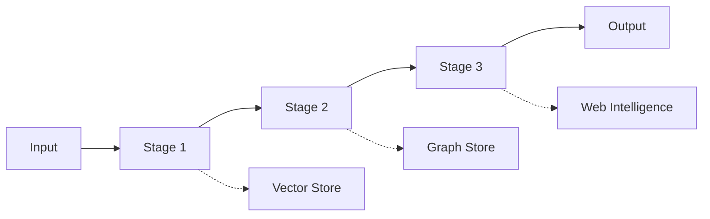
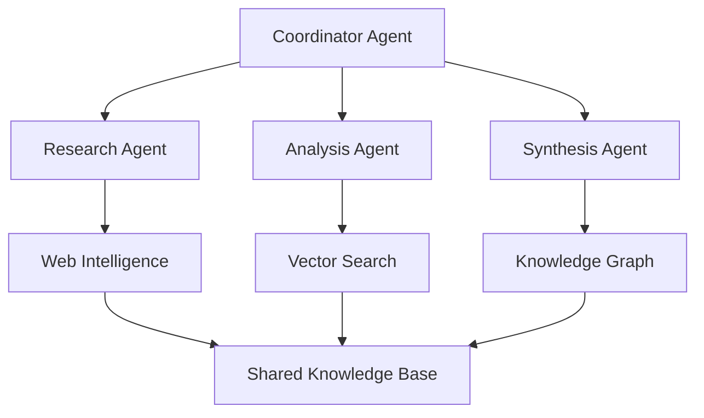
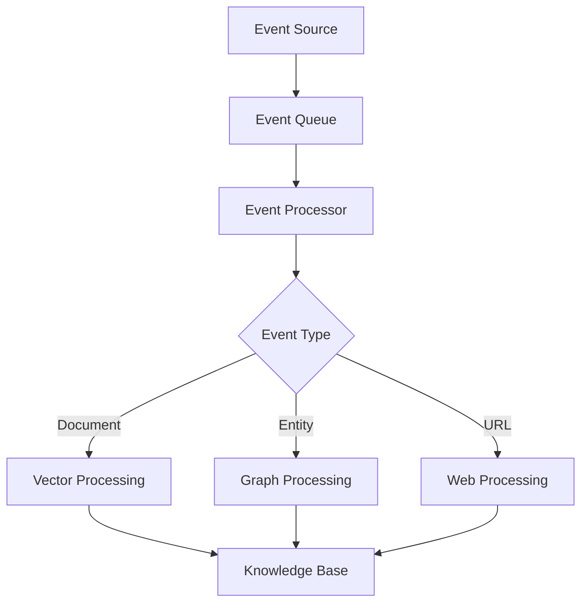
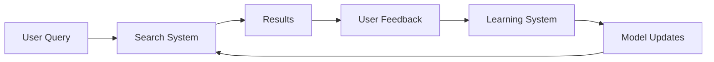

# Advanced Workflows

This directory contains sophisticated examples that demonstrate complex multi-service scenarios and advanced patterns using the Agentic RAG MCP server. These workflows combine vector search, knowledge graphs, and web intelligence to solve real-world problems.

## 🚀 Available Workflows

### 🔬 [Multi-Agent Research](./multi-agent-research/)
Coordinate multiple AI agents for comprehensive research tasks:
- **Research Coordinator** - Orchestrates multiple research agents
- **Web Research Agent** - Discovers and analyzes web content
- **Document Analysis Agent** - Processes academic papers and reports
- **Knowledge Synthesis Agent** - Combines findings into coherent insights
- **Fact Verification Agent** - Cross-references information across sources

### 🧠 [Graph-Enhanced RAG](./graph-rag.py)
Advanced RAG system that combines vector similarity with graph relationships:
- **Hybrid Search** - Vector + Graph query fusion
- **Relationship-Aware Retrieval** - Leverage entity relationships
- **Multi-Hop Reasoning** - Follow relationship chains for deeper insights
- **Context Enrichment** - Enhance answers with related knowledge

### 🌐 [Real-Time Content Pipeline](./content-pipeline/)
Automated content discovery, processing, and knowledge building:
- **Web Monitoring** - Track changes across multiple sources
- **Content Extraction** - Intelligent content parsing and cleanup
- **Knowledge Integration** - Merge new information into existing knowledge base
- **Duplicate Detection** - Identify and handle redundant information
- **Quality Assessment** - Evaluate content reliability and relevance

### 🔍 [Hybrid Search System](./hybrid-search.py)
Sophisticated search combining multiple modalities:
- **Multi-Modal Retrieval** - Text, graph, and web sources
- **Result Fusion** - Intelligent ranking across different result types
- **Query Understanding** - Intent classification and query expansion
- **Relevance Tuning** - Adaptive relevance scoring

### ⚡ [Real-Time Knowledge Graphs](./real-time-knowledge/)
Dynamic knowledge graph construction from live data:
- **Stream Processing** - Real-time data ingestion and processing
- **Entity Resolution** - Merge entities across different sources
- **Relationship Inference** - Discover implicit relationships
- **Graph Evolution** - Track knowledge graph changes over time
- **Conflict Resolution** - Handle contradictory information

### 🔧 [Custom Tool Development](./custom-tools/)
Examples of building custom MCP tools:
- **Domain-Specific Tools** - Specialized tools for specific industries
- **Integration Adapters** - Connect external services to MCP
- **Workflow Orchestrators** - Combine multiple tools into workflows
- **Custom Analytics** - Domain-specific analysis and metrics

## 🎯 Workflow Patterns

### 1. Pipeline Pattern
Sequential processing with data flow between stages:



### 2. Agent Coordination Pattern
Multiple agents working collaboratively:



### 3. Event-Driven Pattern
Reactive processing based on events and triggers:



### 4. Feedback Loop Pattern
Continuous learning and improvement:



## 🔧 Implementation Strategies

### Async Coordination

```python
import asyncio
from typing import List, Dict, Any

class WorkflowCoordinator:
    def __init__(self, mcp_client):
        self.mcp_client = mcp_client
        self.agents = {}
    
    async def execute_parallel_tasks(self, tasks: List[Dict[str, Any]]) -> List[Any]:
        """Execute multiple tasks in parallel with proper error handling."""
        semaphore = asyncio.Semaphore(5)  # Limit concurrent operations
        
        async def execute_task(task):
            async with semaphore:
                try:
                    return await self.mcp_client.call_tool(
                        task["tool"], task["params"]
                    )
                except Exception as e:
                    return {"error": str(e), "task": task}
        
        return await asyncio.gather(*[execute_task(task) for task in tasks])
    
    async def execute_sequential_pipeline(self, stages: List[str], data: Any) -> Any:
        """Execute stages sequentially, passing data between stages."""
        current_data = data
        
        for stage in stages:
            agent = self.agents.get(stage)
            if agent:
                current_data = await agent.process(current_data)
            else:
                raise ValueError(f"Unknown stage: {stage}")
        
        return current_data
```

### State Management

```python
from dataclasses import dataclass
from datetime import datetime
from typing import Optional, Dict, Any
import json

@dataclass
class WorkflowState:
    workflow_id: str
    status: str
    current_stage: str
    data: Dict[str, Any]
    metadata: Dict[str, Any]
    created_at: datetime
    updated_at: datetime
    error: Optional[str] = None
    
    def to_json(self) -> str:
        return json.dumps({
            "workflow_id": self.workflow_id,
            "status": self.status,
            "current_stage": self.current_stage,
            "data": self.data,
            "metadata": self.metadata,
            "created_at": self.created_at.isoformat(),
            "updated_at": self.updated_at.isoformat(),
            "error": self.error
        })

class WorkflowStateManager:
    def __init__(self, storage_backend="memory"):
        self.states = {}  # In production, use Redis or database
    
    async def save_state(self, state: WorkflowState):
        self.states[state.workflow_id] = state
    
    async def get_state(self, workflow_id: str) -> Optional[WorkflowState]:
        return self.states.get(workflow_id)
    
    async def update_state(self, workflow_id: str, updates: Dict[str, Any]):
        if workflow_id in self.states:
            state = self.states[workflow_id]
            for key, value in updates.items():
                setattr(state, key, value)
            state.updated_at = datetime.utcnow()
```

### Error Handling and Retry Logic

```python
import asyncio
from functools import wraps
from typing import Callable, Any
import logging

def retry_with_backoff(max_retries: int = 3, base_delay: float = 1.0):
    def decorator(func: Callable) -> Callable:
        @wraps(func)
        async def wrapper(*args, **kwargs) -> Any:
            last_exception = None
            
            for attempt in range(max_retries):
                try:
                    return await func(*args, **kwargs)
                except Exception as e:
                    last_exception = e
                    if attempt < max_retries - 1:
                        delay = base_delay * (2 ** attempt)
                        logging.warning(
                            f"Attempt {attempt + 1} failed, retrying in {delay}s: {e}"
                        )
                        await asyncio.sleep(delay)
                    else:
                        logging.error(f"All {max_retries} attempts failed: {e}")
            
            raise last_exception
        return wrapper
    return decorator

class CircuitBreaker:
    def __init__(self, failure_threshold: int = 5, timeout: int = 60):
        self.failure_threshold = failure_threshold
        self.timeout = timeout
        self.failure_count = 0
        self.last_failure_time = 0
        self.state = "CLOSED"  # CLOSED, OPEN, HALF_OPEN
    
    async def call(self, func: Callable, *args, **kwargs) -> Any:
        if self.state == "OPEN":
            if time.time() - self.last_failure_time > self.timeout:
                self.state = "HALF_OPEN"
            else:
                raise Exception("Circuit breaker is OPEN")
        
        try:
            result = await func(*args, **kwargs)
            if self.state == "HALF_OPEN":
                self.state = "CLOSED"
                self.failure_count = 0
            return result
        except Exception as e:
            self.failure_count += 1
            self.last_failure_time = time.time()
            
            if self.failure_count >= self.failure_threshold:
                self.state = "OPEN"
            
            raise e
```

## 📊 Performance Optimization

### Caching Strategies

```python
import hashlib
from typing import Any, Optional
import aioredis
from functools import wraps

class CacheManager:
    def __init__(self, redis_url: str = "redis://localhost"):
        self.redis = aioredis.from_url(redis_url)
        self.local_cache = {}
        self.cache_stats = {"hits": 0, "misses": 0}
    
    def generate_key(self, prefix: str, *args, **kwargs) -> str:
        """Generate cache key from function arguments."""
        key_data = f"{prefix}:{args}:{sorted(kwargs.items())}"
        return hashlib.md5(key_data.encode()).hexdigest()
    
    async def get(self, key: str) -> Optional[Any]:
        # Try local cache first
        if key in self.local_cache:
            self.cache_stats["hits"] += 1
            return self.local_cache[key]
        
        # Try Redis cache
        value = await self.redis.get(key)
        if value:
            self.cache_stats["hits"] += 1
            # Store in local cache for faster access
            self.local_cache[key] = value
            return value
        
        self.cache_stats["misses"] += 1
        return None
    
    async def set(self, key: str, value: Any, ttl: int = 3600):
        # Store in both local and Redis cache
        self.local_cache[key] = value
        await self.redis.setex(key, ttl, value)

def cached(ttl: int = 3600, prefix: str = "default"):
    def decorator(func: Callable) -> Callable:
        @wraps(func)
        async def wrapper(*args, **kwargs) -> Any:
            cache_manager = kwargs.pop('cache_manager', None)
            if not cache_manager:
                return await func(*args, **kwargs)
            
            key = cache_manager.generate_key(prefix, *args, **kwargs)
            cached_result = await cache_manager.get(key)
            
            if cached_result is not None:
                return cached_result
            
            result = await func(*args, **kwargs)
            await cache_manager.set(key, result, ttl)
            return result
        return wrapper
    return decorator
```

### Batch Processing

```python
import asyncio
from typing import List, TypeVar, Callable, Any
from dataclasses import dataclass

T = TypeVar('T')
R = TypeVar('R')

@dataclass
class BatchConfig:
    batch_size: int = 10
    max_concurrent_batches: int = 3
    timeout_per_batch: float = 30.0
    retry_failed_items: bool = True

class BatchProcessor:
    def __init__(self, config: BatchConfig):
        self.config = config
        self.semaphore = asyncio.Semaphore(config.max_concurrent_batches)
    
    async def process_batch(
        self, 
        items: List[T], 
        processor: Callable[[List[T]], Any],
        progress_callback: Optional[Callable[[int, int], None]] = None
    ) -> List[R]:
        """Process items in batches with concurrency control."""
        batches = [
            items[i:i + self.config.batch_size]
            for i in range(0, len(items), self.config.batch_size)
        ]
        
        results = []
        completed_batches = 0
        
        async def process_single_batch(batch: List[T]) -> List[R]:
            nonlocal completed_batches
            
            async with self.semaphore:
                try:
                    result = await asyncio.wait_for(
                        processor(batch),
                        timeout=self.config.timeout_per_batch
                    )
                    completed_batches += 1
                    
                    if progress_callback:
                        progress_callback(completed_batches, len(batches))
                    
                    return result
                except Exception as e:
                    if self.config.retry_failed_items:
                        # Retry individual items
                        individual_results = []
                        for item in batch:
                            try:
                                item_result = await processor([item])
                                individual_results.extend(item_result)
                            except Exception:
                                # Skip failed individual items
                                pass
                        return individual_results
                    else:
                        raise e
        
        # Process all batches concurrently
        batch_results = await asyncio.gather(
            *[process_single_batch(batch) for batch in batches],
            return_exceptions=True
        )
        
        # Flatten results and handle exceptions
        for batch_result in batch_results:
            if isinstance(batch_result, Exception):
                print(f"Batch failed: {batch_result}")
            else:
                results.extend(batch_result)
        
        return results
```

## 🎯 Monitoring and Observability

### Metrics Collection

```python
import time
from typing import Dict, Any
from dataclasses import dataclass, field
from collections import defaultdict, Counter
import asyncio

@dataclass
class WorkflowMetrics:
    total_executions: int = 0
    successful_executions: int = 0
    failed_executions: int = 0
    total_execution_time: float = 0.0
    stage_metrics: Dict[str, Dict[str, Any]] = field(default_factory=lambda: defaultdict(dict))
    error_counts: Counter = field(default_factory=Counter)
    
    @property
    def success_rate(self) -> float:
        if self.total_executions == 0:
            return 0.0
        return self.successful_executions / self.total_executions
    
    @property
    def average_execution_time(self) -> float:
        if self.total_executions == 0:
            return 0.0
        return self.total_execution_time / self.total_executions

class MetricsCollector:
    def __init__(self):
        self.metrics = WorkflowMetrics()
        self.active_executions = {}
    
    def start_execution(self, execution_id: str):
        self.active_executions[execution_id] = time.time()
    
    def end_execution(self, execution_id: str, success: bool, error: str = None):
        if execution_id not in self.active_executions:
            return
        
        execution_time = time.time() - self.active_executions[execution_id]
        del self.active_executions[execution_id]
        
        self.metrics.total_executions += 1
        self.metrics.total_execution_time += execution_time
        
        if success:
            self.metrics.successful_executions += 1
        else:
            self.metrics.failed_executions += 1
            if error:
                self.metrics.error_counts[error] += 1
    
    def record_stage_metric(self, stage: str, metric_name: str, value: Any):
        if stage not in self.metrics.stage_metrics:
            self.metrics.stage_metrics[stage] = {}
        
        if metric_name not in self.metrics.stage_metrics[stage]:
            self.metrics.stage_metrics[stage][metric_name] = []
        
        self.metrics.stage_metrics[stage][metric_name].append(value)
    
    def get_metrics_summary(self) -> Dict[str, Any]:
        return {
            "total_executions": self.metrics.total_executions,
            "success_rate": self.metrics.success_rate,
            "average_execution_time": self.metrics.average_execution_time,
            "active_executions": len(self.active_executions),
            "top_errors": self.metrics.error_counts.most_common(5),
            "stage_metrics": dict(self.metrics.stage_metrics)
        }
```

## 🔐 Security Considerations

### Secure Agent Communication

```python
import jwt
import hashlib
import hmac
from typing import Dict, Any
from datetime import datetime, timedelta

class SecureAgentCommunication:
    def __init__(self, secret_key: str, algorithm: str = "HS256"):
        self.secret_key = secret_key
        self.algorithm = algorithm
    
    def create_agent_token(self, agent_id: str, permissions: List[str]) -> str:
        """Create JWT token for agent-to-agent communication."""
        payload = {
            "agent_id": agent_id,
            "permissions": permissions,
            "iat": datetime.utcnow(),
            "exp": datetime.utcnow() + timedelta(hours=1)
        }
        return jwt.encode(payload, self.secret_key, algorithm=self.algorithm)
    
    def verify_agent_token(self, token: str) -> Dict[str, Any]:
        """Verify and decode agent token."""
        try:
            payload = jwt.decode(token, self.secret_key, algorithms=[self.algorithm])
            return payload
        except jwt.ExpiredSignatureError:
            raise Exception("Agent token has expired")
        except jwt.InvalidTokenError:
            raise Exception("Invalid agent token")
    
    def sign_message(self, message: str, agent_id: str) -> str:
        """Sign message with agent's secret."""
        signature = hmac.new(
            f"{self.secret_key}:{agent_id}".encode(),
            message.encode(),
            hashlib.sha256
        ).hexdigest()
        return signature
    
    def verify_message(self, message: str, signature: str, agent_id: str) -> bool:
        """Verify message signature."""
        expected_signature = self.sign_message(message, agent_id)
        return hmac.compare_digest(signature, expected_signature)
```

## 🧪 Testing Advanced Workflows

### Integration Testing

```python
import pytest
import asyncio
from unittest.mock import AsyncMock, MagicMock

class TestWorkflowExecution:
    @pytest.fixture
    def mock_mcp_client(self):
        client = AsyncMock()
        client.call_tool.return_value = {"status": "success", "data": "test_result"}
        return client
    
    @pytest.fixture
    def workflow_coordinator(self, mock_mcp_client):
        return WorkflowCoordinator(mock_mcp_client)
    
    @pytest.mark.asyncio
    async def test_parallel_task_execution(self, workflow_coordinator):
        tasks = [
            {"tool": "semantic_vector_search", "params": {"query": "test1"}},
            {"tool": "search_knowledge_graph", "params": {"query": "test2"}},
            {"tool": "crawl_website", "params": {"url": "https://example.com"}}
        ]
        
        results = await workflow_coordinator.execute_parallel_tasks(tasks)
        
        assert len(results) == 3
        assert all(result.get("status") == "success" for result in results)
    
    @pytest.mark.asyncio
    async def test_error_handling_in_parallel_tasks(self, workflow_coordinator):
        # Mock one task to fail
        def mock_call_tool(tool_name, params):
            if tool_name == "failing_tool":
                raise Exception("Tool failed")
            return {"status": "success", "data": "test_result"}
        
        workflow_coordinator.mcp_client.call_tool.side_effect = mock_call_tool
        
        tasks = [
            {"tool": "working_tool", "params": {}},
            {"tool": "failing_tool", "params": {}}
        ]
        
        results = await workflow_coordinator.execute_parallel_tasks(tasks)
        
        assert len(results) == 2
        assert results[0].get("status") == "success"
        assert "error" in results[1]

class TestCacheManager:
    @pytest.mark.asyncio
    async def test_cache_hit_and_miss(self):
        cache_manager = CacheManager()
        
        # Test cache miss
        result = await cache_manager.get("nonexistent_key")
        assert result is None
        assert cache_manager.cache_stats["misses"] == 1
        
        # Set value
        await cache_manager.set("test_key", "test_value")
        
        # Test cache hit
        result = await cache_manager.get("test_key")
        assert result == "test_value"
        assert cache_manager.cache_stats["hits"] == 1
```

## 📚 Learning Resources

### Documentation
- **[Workflow Design Patterns](./patterns.md)** - Common workflow architectures
- **[Performance Tuning Guide](./performance.md)** - Optimization strategies
- **[Security Best Practices](./security.md)** - Secure workflow implementation
- **[Troubleshooting Guide](./troubleshooting.md)** - Common issues and solutions

### Sample Projects
- **[Research Automation Pipeline](./research-pipeline/)** - Complete research workflow
- **[Content Curation System](./content-curation/)** - Automated content discovery
- **[Multi-Source Analytics](./analytics-workflow/)** - Complex data analysis workflows

## 🤝 Contributing

We welcome contributions to expand and improve these advanced workflows:

1. **New Patterns** - Implement additional workflow patterns
2. **Performance Improvements** - Optimize existing workflows
3. **Documentation** - Improve guides and examples  
4. **Testing** - Add comprehensive test coverage
5. **Real-World Examples** - Share production use cases

### Development Guidelines
- **Async First** - Use async/await for all I/O operations
- **Error Handling** - Implement comprehensive error handling
- **Monitoring** - Include metrics and observability
- **Documentation** - Provide clear documentation and examples
- **Testing** - Include unit and integration tests

---

**Ready for advanced workflows?** Start with [hybrid-search.py](./hybrid-search.py) for a practical example, or dive into [multi-agent-research/](./multi-agent-research/) for sophisticated agent coordination! 🚀