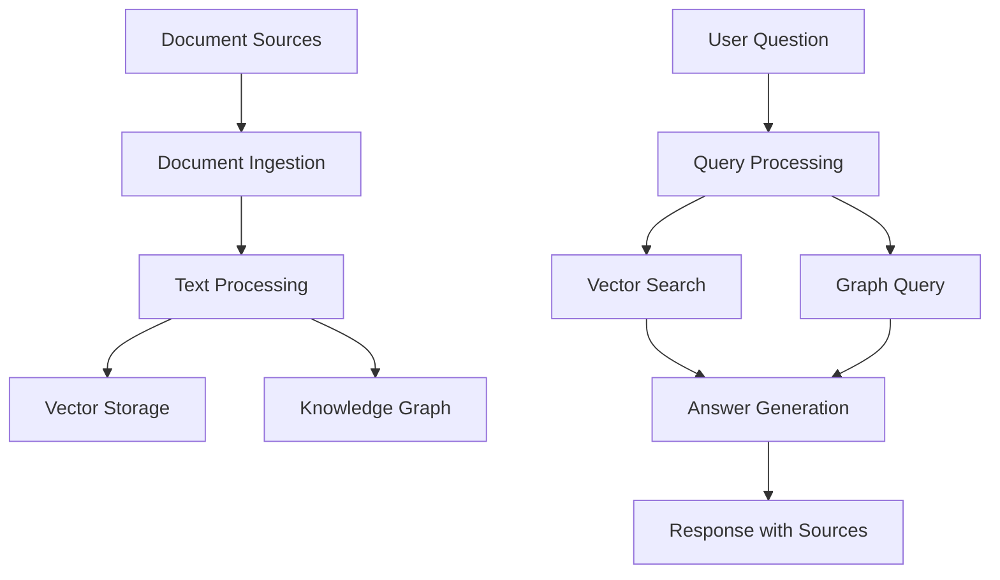

# Document Q&A System Tutorial

This tutorial guides you through building a complete document question-answering system using the Agentic RAG MCP server. You'll learn how to combine vector search, knowledge graphs, and web intelligence to create a powerful document understanding system.

## 🎯 What You'll Build

A complete Q&A system that can:

- **Ingest documents** from multiple sources (files, URLs, databases)
- **Store knowledge** in both vector and graph databases
- **Answer questions** using semantic search and relationship understanding
- **Provide sources** and confidence scores for answers
- **Learn and improve** from user interactions

## 🏗️ Architecture Overview



## 📋 Prerequisites

Before starting, ensure you have:

- **Python 3.11+** installed
- **MCP Server** running with all services (Vector, Graph, Web)
- **Required packages**: `pip install httpx asyncio python-dotenv`
- **Sample documents** to work with (provided in `sample_data/`)

## 🚀 Step-by-Step Implementation

### Step 1: Project Setup

Create your project structure:

```bash
document-qa-system/
├── main.py              # Main application
├── config.py            # Configuration management
├── document_processor.py # Document ingestion and processing
├── qa_engine.py         # Question-answering logic
├── mcp_client.py        # MCP client wrapper
├── utils.py             # Utility functions
├── sample_data/         # Sample documents
│   ├── ai_overview.txt
│   ├── ml_concepts.pdf
│   └── research_papers.json
├── .env.example         # Environment variables template
└── requirements.txt     # Dependencies
```

### Step 2: Configuration

Set up your environment and configuration:

```python
# config.py
import os
from dataclasses import dataclass
from dotenv import load_dotenv

load_dotenv()

@dataclass
class Config:
    # MCP Server settings
    mcp_server_url: str = os.getenv("MCP_SERVER_URL", "http://localhost:8000")
    mcp_auth_token: str = os.getenv("MCP_AUTH_TOKEN", "")
    
    # Vector settings
    vector_collection: str = "documents"
    vector_search_limit: int = 5
    vector_score_threshold: float = 0.7
    
    # Graph settings
    graph_confidence_threshold: float = 0.8
    
    # Processing settings
    chunk_size: int = 1000
    chunk_overlap: int = 200
    max_file_size_mb: int = 10
    
    # Answer generation
    max_context_length: int = 4000
    answer_confidence_threshold: float = 0.6
```

### Step 3: MCP Client Wrapper

Create a robust MCP client:

```python
# mcp_client.py
import asyncio
from typing import Any, Dict, List
import httpx
from config import Config

class MCPClient:
    def __init__(self, config: Config):
        self.config = config
        self.headers = {"Content-Type": "application/json"}
        if config.mcp_auth_token:
            self.headers["Authorization"] = f"Bearer {config.mcp_auth_token}"
    
    async def call_tool(self, tool_name: str, params: Dict[str, Any]) -> Dict[str, Any]:
        """Call an MCP tool with error handling and retries."""
        max_retries = 3
        for attempt in range(max_retries):
            try:
                async with httpx.AsyncClient() as client:
                    response = await client.post(
                        f"{self.config.mcp_server_url}/mcp/tools/{tool_name}",
                        json=params,
                        headers=self.headers,
                        timeout=60.0
                    )
                    response.raise_for_status()
                    return response.json()
            except Exception as e:
                if attempt == max_retries - 1:
                    raise
                await asyncio.sleep(2 ** attempt)  # Exponential backoff
```

### Step 4: Document Processing

Implement document ingestion and processing:

```python
# document_processor.py
import asyncio
from pathlib import Path
from typing import List, Dict, Any
import re
from mcp_client import MCPClient
from config import Config

class DocumentProcessor:
    def __init__(self, mcp_client: MCPClient, config: Config):
        self.mcp_client = mcp_client
        self.config = config
    
    def chunk_text(self, text: str) -> List[str]:
        """Split text into overlapping chunks."""
        sentences = re.split(r'[.!?]+', text)
        chunks = []
        current_chunk = ""
        
        for sentence in sentences:
            sentence = sentence.strip()
            if not sentence:
                continue
                
            # Check if adding this sentence exceeds chunk size
            if len(current_chunk) + len(sentence) > self.config.chunk_size:
                if current_chunk:
                    chunks.append(current_chunk.strip())
                    # Start new chunk with overlap
                    overlap_words = current_chunk.split()[-self.config.chunk_overlap:]
                    current_chunk = " ".join(overlap_words) + " " + sentence
                else:
                    current_chunk = sentence
            else:
                current_chunk += " " + sentence
        
        if current_chunk.strip():
            chunks.append(current_chunk.strip())
        
        return chunks
    
    async def process_text_document(self, content: str, source: str, metadata: Dict[str, Any]) -> List[str]:
        """Process a text document into the knowledge base."""
        chunks = self.chunk_text(content)
        stored_ids = []
        
        for i, chunk in enumerate(chunks):
            # Store in vector database
            vector_result = await self.mcp_client.call_tool("store_vector_document", {
                "content": chunk,
                "collection_name": self.config.vector_collection,
                "content_type": "document_chunk",
                "source": f"{source}_chunk_{i}",
                "tags": metadata.get("tags", []),
                "metadata": {
                    **metadata,
                    "chunk_index": i,
                    "total_chunks": len(chunks)
                }
            })
            
            if vector_result.get("status") == "success":
                stored_ids.append(vector_result["id"])
        
        # Extract knowledge for graph database
        await self._extract_knowledge_to_graph(content, source, metadata)
        
        return stored_ids
    
    async def _extract_knowledge_to_graph(self, content: str, source: str, metadata: Dict[str, Any]):
        """Extract entities and relationships for the knowledge graph."""
        result = await self.mcp_client.call_tool("extract_knowledge_from_text", {
            "text": content,
            "domain": metadata.get("domain", "general"),
            "extract_entities": True,
            "extract_relationships": True,
            "confidence_threshold": self.config.graph_confidence_threshold
        })
        
        if result.get("success"):
            # Create nodes for extracted entities
            entities = result.get("entities", [])
            for entity in entities:
                await self.mcp_client.call_tool("create_graph_node", {
                    "name": entity["name"],
                    "node_type": entity["type"],
                    "description": entity.get("description", ""),
                    "properties": entity.get("properties", {}),
                    "confidence_score": entity["confidence"],
                    "source": source
                })
```

### Step 5: Q&A Engine

Implement the core question-answering logic:

```python
# qa_engine.py
import asyncio
from typing import List, Dict, Any, Optional
from mcp_client import MCPClient
from config import Config

class QAEngine:
    def __init__(self, mcp_client: MCPClient, config: Config):
        self.mcp_client = mcp_client
        self.config = config
    
    async def answer_question(self, question: str) -> Dict[str, Any]:
        """Answer a question using vector search and graph knowledge."""
        
        # Step 1: Vector similarity search
        vector_results = await self._vector_search(question)
        
        # Step 2: Graph knowledge search
        graph_results = await self._graph_search(question)
        
        # Step 3: Combine and rank results
        combined_context = self._combine_search_results(vector_results, graph_results)
        
        # Step 4: Generate answer
        answer = await self._generate_answer(question, combined_context)
        
        return {
            "question": question,
            "answer": answer["text"],
            "confidence": answer["confidence"],
            "sources": answer["sources"],
            "context_used": len(combined_context),
            "vector_results": len(vector_results),
            "graph_results": len(graph_results)
        }
    
    async def _vector_search(self, question: str) -> List[Dict[str, Any]]:
        """Perform vector similarity search."""
        result = await self.mcp_client.call_tool("semantic_vector_search", {
            "query": question,
            "collection_name": self.config.vector_collection,
            "limit": self.config.vector_search_limit,
            "score_threshold": self.config.vector_score_threshold,
            "include_content": True
        })
        
        if result.get("status") == "success":
            return result["results"]
        return []
    
    async def _graph_search(self, question: str) -> List[Dict[str, Any]]:
        """Search the knowledge graph for relevant information."""
        result = await self.mcp_client.call_tool("search_knowledge_graph", {
            "query": question,
            "search_type": "semantic",
            "limit": 5,
            "include_relationships": True
        })
        
        if result.get("success"):
            return result["results"]
        return []
    
    def _combine_search_results(self, vector_results: List[Dict], graph_results: List[Dict]) -> List[Dict]:
        """Combine and rank search results from different sources."""
        combined = []
        
        # Add vector results with source type
        for result in vector_results:
            combined.append({
                "content": result["content"],
                "score": result["score"],
                "source": result.get("source", "unknown"),
                "type": "document",
                "metadata": result.get("metadata", {})
            })
        
        # Add graph results with source type
        for result in graph_results:
            combined.append({
                "content": result.get("description", result["name"]),
                "score": result["score"],
                "source": result.get("source", "knowledge_graph"),
                "type": "knowledge",
                "metadata": {
                    "node_type": result.get("node_type", "unknown"),
                    "relationships": result.get("relationships", [])
                }
            })
        
        # Sort by score and limit context length
        combined.sort(key=lambda x: x["score"], reverse=True)
        
        # Limit total context to avoid overwhelming the answer generation
        total_length = 0
        filtered_results = []
        
        for result in combined:
            content_length = len(result["content"])
            if total_length + content_length <= self.config.max_context_length:
                filtered_results.append(result)
                total_length += content_length
            else:
                break
        
        return filtered_results
    
    async def _generate_answer(self, question: str, context: List[Dict]) -> Dict[str, Any]:
        """Generate an answer based on the question and context."""
        if not context:
            return {
                "text": "I don't have enough information to answer that question.",
                "confidence": 0.0,
                "sources": []
            }
        
        # Prepare context text
        context_text = "\n\n".join([
            f"Source: {ctx['source']}\nContent: {ctx['content']}"
            for ctx in context
        ])
        
        # Simple answer generation (in a real implementation, you'd use an LLM)
        # For this example, we'll create a rule-based answer
        answer_text = self._create_answer_from_context(question, context)
        
        # Calculate confidence based on context relevance
        avg_score = sum(ctx["score"] for ctx in context) / len(context)
        confidence = min(avg_score, 1.0)
        
        # Extract unique sources
        sources = list(set(ctx["source"] for ctx in context))
        
        return {
            "text": answer_text,
            "confidence": confidence,
            "sources": sources
        }
    
    def _create_answer_from_context(self, question: str, context: List[Dict]) -> str:
        """Create an answer from the provided context (simplified implementation)."""
        # This is a simplified implementation
        # In a real system, you'd use an LLM for answer generation
        
        if not context:
            return "No relevant information found."
        
        # Find the most relevant context
        best_context = max(context, key=lambda x: x["score"])
        
        # Create a simple answer based on the best context
        answer = f"Based on the available information: {best_context['content'][:500]}"
        
        if len(best_context['content']) > 500:
            answer += "..."
        
        return answer
```

### Step 6: Main Application

Put it all together in the main application:

```python
# main.py
import asyncio
from pathlib import Path
from config import Config
from mcp_client import MCPClient
from document_processor import DocumentProcessor
from qa_engine import QAEngine

class DocumentQASystem:
    def __init__(self):
        self.config = Config()
        self.mcp_client = MCPClient(self.config)
        self.document_processor = DocumentProcessor(self.mcp_client, self.config)
        self.qa_engine = QAEngine(self.mcp_client, self.config)
    
    async def setup(self):
        """Initialize the system and create collections if needed."""
        print("🔧 Setting up Document Q&A System...")
        
        # Create vector collection if it doesn't exist
        result = await self.mcp_client.call_tool("create_vector_collection", {
            "name": self.config.vector_collection,
            "vector_size": 384,  # Standard sentence transformer size
            "distance_metric": "Cosine",
            "description": "Document Q&A knowledge base"
        })
        
        print(f"✅ Vector collection ready: {self.config.vector_collection}")
    
    async def ingest_documents(self, documents_path: Path):
        """Ingest documents from a directory."""
        print(f"📚 Ingesting documents from {documents_path}")
        
        text_files = list(documents_path.glob("*.txt"))
        
        for file_path in text_files:
            print(f"   Processing: {file_path.name}")
            
            with open(file_path, 'r', encoding='utf-8') as f:
                content = f.read()
            
            metadata = {
                "filename": file_path.name,
                "file_type": "text",
                "domain": "general",
                "tags": ["document", "ingested"]
            }
            
            stored_ids = await self.document_processor.process_text_document(
                content, str(file_path), metadata
            )
            
            print(f"      ✅ Stored {len(stored_ids)} chunks")
    
    async def interactive_qa(self):
        """Start an interactive Q&A session."""
        print("\n🤖 Document Q&A System Ready!")
        print("Ask questions about your documents. Type 'quit' to exit.\n")
        
        while True:
            question = input("❓ Question: ").strip()
            
            if question.lower() in ['quit', 'exit', 'q']:
                break
            
            if not question:
                continue
            
            print("🔍 Searching for answer...")
            
            try:
                result = await self.qa_engine.answer_question(question)
                
                print(f"\n💡 Answer (Confidence: {result['confidence']:.2f}):")
                print(f"   {result['answer']}")
                
                print(f"\n📚 Sources ({len(result['sources'])}):")
                for source in result['sources']:
                    print(f"   • {source}")
                
                print(f"\n📊 Search Stats:")
                print(f"   Vector results: {result['vector_results']}")
                print(f"   Graph results: {result['graph_results']}")
                print(f"   Context used: {result['context_used']} items")
                
            except Exception as e:
                print(f"❌ Error processing question: {e}")
            
            print("\n" + "="*50 + "\n")
    
    async def demo_questions(self):
        """Run a demo with sample questions."""
        sample_questions = [
            "What is machine learning?",
            "Who are the pioneers in artificial intelligence?",
            "How do neural networks work?",
            "What are the applications of AI in healthcare?",
            "Explain the difference between supervised and unsupervised learning."
        ]
        
        print("🎬 Running demo with sample questions...\n")
        
        for question in sample_questions:
            print(f"❓ Question: {question}")
            
            try:
                result = await self.qa_engine.answer_question(question)
                print(f"💡 Answer: {result['answer'][:200]}...")
                print(f"📊 Confidence: {result['confidence']:.2f}")
                print(f"📚 Sources: {len(result['sources'])}")
                
            except Exception as e:
                print(f"❌ Error: {e}")
            
            print("-" * 50)

async def main():
    """Main application entry point."""
    system = DocumentQASystem()
    
    try:
        # Setup the system
        await system.setup()
        
        # Ingest sample documents
        sample_data_path = Path("sample_data")
        if sample_data_path.exists():
            await system.ingest_documents(sample_data_path)
        else:
            print("⚠️  No sample_data directory found. Create one with .txt files to ingest.")
        
        # Choose demo mode or interactive mode
        mode = input("\nChoose mode: [d]emo or [i]nteractive? ").lower()
        
        if mode.startswith('d'):
            await system.demo_questions()
        else:
            await system.interactive_qa()
            
    except KeyboardInterrupt:
        print("\n👋 Goodbye!")
    except Exception as e:
        print(f"❌ Application error: {e}")

if __name__ == "__main__":
    asyncio.run(main())
```

## 🧪 Testing Your System

### Sample Data

Create sample documents in `sample_data/`:

```text
# sample_data/ai_overview.txt
Artificial Intelligence (AI) is a broad field of computer science concerned with 
building smart machines capable of performing tasks that typically require human 
intelligence. Machine learning is a subset of AI that enables computers to learn 
and make decisions from data without being explicitly programmed.

Key pioneers in AI include Alan Turing, who proposed the Turing Test, and Geoffrey 
Hinton, known as the "Godfather of Deep Learning." These researchers laid the 
foundation for modern AI systems.

Applications of AI span across many industries including healthcare, finance, 
transportation, and entertainment. In healthcare, AI helps with medical diagnosis, 
drug discovery, and personalized treatment plans.
```

### Running the System

1. **Setup environment**:

   ```bash
   cd document-qa-system/
   pip install -r requirements.txt
   cp .env.example .env
   # Edit .env with your settings
   ```

2. **Run the application**:

   ```bash
   python main.py
   ```

3. **Test with sample questions**:
   - "What is artificial intelligence?"
   - "Who is Geoffrey Hinton?"
   - "How is AI used in healthcare?"

## 🔧 Customization Options

### Advanced Features

1. **Multi-modal Support**: Add support for PDFs, images, audio
2. **Real-time Learning**: Update knowledge base from user feedback
3. **Conversation Memory**: Maintain context across questions
4. **Source Verification**: Cross-reference information across sources
5. **Confidence Calibration**: Improve answer confidence scoring

### Integration Patterns

1. **Web Interface**: Add FastAPI endpoints for web access
2. **API Integration**: Connect to external knowledge sources
3. **Batch Processing**: Process large document collections
4. **Monitoring**: Add logging and metrics collection

## 📈 Performance Optimization

- **Caching**: Cache frequently accessed embeddings and graph queries
- **Indexing**: Optimize database indices for common query patterns
- **Chunking Strategy**: Experiment with different text chunking approaches
- **Parallel Processing**: Process multiple documents concurrently
- **Model Selection**: Choose optimal embedding models for your domain

## 🎯 Next Steps

1. **Enhance Answer Quality**: Integrate with LLMs like GPT-4 or Claude
2. **Add Web Sources**: Incorporate real-time web search
3. **Build UI**: Create a web interface with React or Streamlit
4. **Deploy to Production**: Use Docker and cloud deployment
5. **Advanced Analytics**: Add user interaction tracking and system metrics

## 🤝 Contributing

This tutorial is part of the larger Agentic RAG MCP project. Contributions are welcome:

1. **Improve Examples**: Add more sophisticated document processing
2. **Add Features**: Implement new Q&A capabilities
3. **Fix Issues**: Report and fix bugs
4. **Documentation**: Improve explanations and add diagrams

---

**Congratulations!** 🎉 You've built a complete document Q&A system using the Agentic RAG MCP server. This foundation can be extended for many real-world applications including research assistants, customer support systems, and knowledge management platforms.
