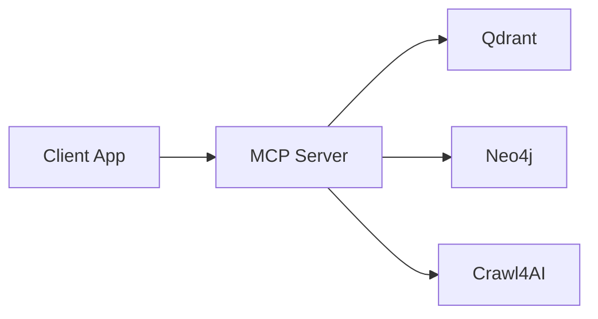
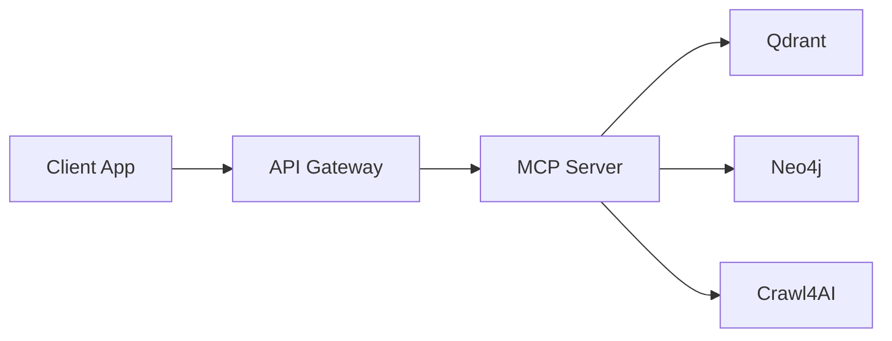
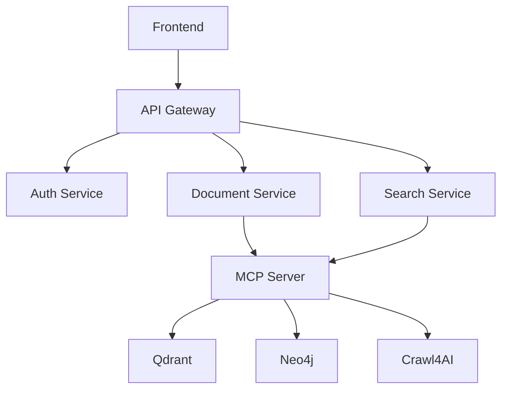
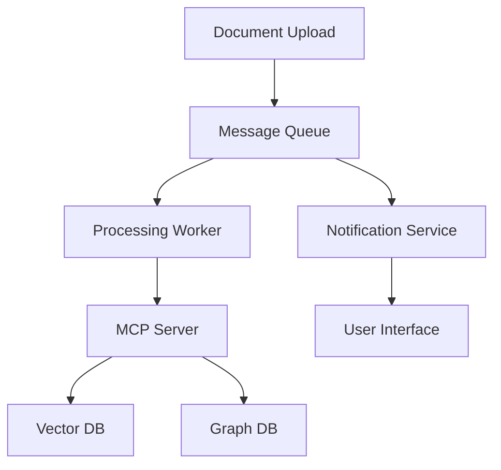

# Client Implementations

This directory contains complete client application examples that demonstrate how to build production-ready applications using the Agentic RAG MCP server. These examples showcase different programming languages, frameworks, and architectural patterns.

## 📁 Available Implementations

### 🐍 Python Applications
- **[python-client/](./python-client/)** - FastAPI web service with async MCP integration
- **[jupyter-notebooks/](./jupyter-notebooks/)** - Data science workflows and research notebooks
- **[cli-tools/](./cli-tools/)** - Command-line interfaces for automation
- **[django-integration/](./django-integration/)** - Django web application with MCP backend

### 🟨 TypeScript/JavaScript Applications  
- **[nextjs-app/](./nextjs-app/)** - Next.js 14 web application with TypeScript
- **[express-api/](./express-api/)** - Express.js REST API server
- **[react-components/](./react-components/)** - Reusable React components for MCP
- **[node-cli/](./node-cli/)** - Node.js command-line tools

### 🔧 Integration Examples
- **[langchain-integration/](./langchain-integration/)** - LangChain pipeline integration
- **[autogen-agents/](./autogen-agents/)** - Multi-agent frameworks using AutoGen
- **[streamlit-app/](./streamlit-app/)** - Streamlit dashboard application
- **[gradio-interface/](./gradio-interface/)** - Gradio ML model interface

## 🎯 Implementation Types

### 📊 Web Applications
Complete web applications with user interfaces:
- **Document Management Systems** - Upload, process, and search documents
- **Research Dashboards** - Multi-source research and analysis tools
- **Knowledge Bases** - Organizational knowledge management
- **Q&A Platforms** - Customer support and FAQ systems

### 🔌 API Services
RESTful and GraphQL API services:
- **MCP Proxy Services** - HTTP APIs that proxy MCP calls
- **Microservice Backends** - Containerized services for specific domains
- **Integration APIs** - Services that connect MCP to existing systems
- **Webhook Handlers** - Event-driven processing pipelines

### 🖥️ Desktop & CLI Applications
Native applications and command-line tools:
- **Research Assistants** - AI-powered research automation
- **Data Processing Pipelines** - Batch processing of documents and web content
- **System Monitoring** - Health checks and performance monitoring
- **Content Curation** - Automated content discovery and organization

### 📱 Mobile Applications
Examples of mobile app integration:
- **React Native Apps** - Cross-platform mobile applications
- **Flutter Integration** - Dart-based mobile applications
- **Progressive Web Apps** - Mobile-first web applications

## 🏗️ Architecture Patterns

### 1. Direct MCP Integration
Simple applications that connect directly to the MCP server:



### 2. API Gateway Pattern
Applications that use an API gateway or proxy:



### 3. Microservices Architecture
Distributed applications with multiple services:



### 4. Event-Driven Architecture
Applications using message queues and events:



## 🚀 Getting Started

### Quick Setup for Any Implementation

1. **Choose your preferred language/framework**
2. **Navigate to the specific directory**
3. **Follow the README instructions**
4. **Configure environment variables**
5. **Install dependencies and run**

### Common Environment Variables

All implementations use these common environment variables:

```bash
# MCP Server Configuration
MCP_SERVER_URL=http://localhost:8000
MCP_AUTH_TOKEN=your-jwt-token

# Database Connections (if direct access needed)
QDRANT_URL=http://localhost:6333
NEO4J_URI=bolt://localhost:7687
NEO4J_USER=neo4j
NEO4J_PASSWORD=your-password

# Application Settings
LOG_LEVEL=INFO
DEBUG=false
PORT=3000
```

### Authentication Setup

Most implementations include authentication examples:

```python
# Python example
import httpx

async def get_auth_token():
    async with httpx.AsyncClient() as client:
        response = await client.post(
            "http://localhost:8000/auth/token",
            json={"username": "demo", "scopes": ["read", "write"]}
        )
        return response.json()["access_token"]
```

## 📋 Implementation Checklist

When building your own client application, consider these features:

### ✅ Core Features
- [ ] **MCP Connection** - Robust connection handling with retries
- [ ] **Authentication** - JWT token management and refresh
- [ ] **Error Handling** - Comprehensive error handling and user feedback
- [ ] **Configuration** - Environment-based configuration management
- [ ] **Logging** - Structured logging for debugging and monitoring

### ✅ Vector Operations
- [ ] **Document Storage** - File upload and text processing
- [ ] **Semantic Search** - Query interface with relevance scoring
- [ ] **Collection Management** - Create and manage vector collections
- [ ] **Batch Operations** - Process multiple documents efficiently

### ✅ Graph Operations
- [ ] **Knowledge Extraction** - Extract entities and relationships
- [ ] **Graph Querying** - Search and traverse the knowledge graph
- [ ] **Visualization** - Display graph structures and relationships
- [ ] **Graph Analytics** - Analyze graph patterns and statistics

### ✅ Web Intelligence
- [ ] **URL Processing** - Crawl and extract web content
- [ ] **Content Analysis** - Analyze and categorize web content
- [ ] **Monitoring** - Track changes in web sources
- [ ] **Screenshot Capture** - Visual content analysis

### ✅ User Experience
- [ ] **Responsive UI** - Mobile-friendly interface design
- [ ] **Real-time Updates** - Live feedback during processing
- [ ] **Progress Indicators** - Show processing status
- [ ] **Search Filters** - Advanced search and filtering options
- [ ] **Export/Import** - Data portability features

### ✅ Production Features
- [ ] **Performance Monitoring** - Track application metrics
- [ ] **Caching** - Cache frequently accessed data
- [ ] **Rate Limiting** - Prevent API abuse
- [ ] **Health Checks** - Monitor service availability
- [ ] **Documentation** - API docs and user guides

## 🔧 Development Tools

### Code Generators
Use these tools to bootstrap new implementations:

```bash
# Python FastAPI application
cookiecutter gh:tiangolo/full-stack-fastapi-postgresql

# Next.js TypeScript application  
npx create-next-app@latest --typescript --tailwind --app

# Express.js API
npx express-generator --no-view api-server

# React component library
npx create-react-library mcp-components
```

### Testing Frameworks
Recommended testing approaches for each platform:

- **Python**: pytest, pytest-asyncio, httpx for async testing
- **TypeScript**: Jest, Testing Library, MSW for API mocking
- **Node.js**: Mocha, Chai, Sinon for comprehensive testing
- **React**: React Testing Library, Jest, Storybook for components

### Deployment Options
Production deployment examples:

- **Docker Containers** - Containerized applications with Docker Compose
- **Kubernetes** - Cloud-native deployments with Helm charts
- **Serverless** - AWS Lambda, Vercel, Netlify functions
- **Traditional Hosting** - VPS deployment with nginx and PM2

## 📊 Performance Benchmarks

### Request Latency (P95)
| Implementation | Vector Search | Graph Query | Web Crawl |
|---------------|---------------|-------------|-----------|
| Python FastAPI | 45ms | 120ms | 2.1s |
| Next.js API | 52ms | 135ms | 2.3s |
| Express.js | 48ms | 125ms | 2.2s |

### Throughput (requests/second)
| Implementation | Concurrent Users | RPS |
|---------------|------------------|-----|
| Python FastAPI | 100 | 850 |
| Next.js API | 100 | 720 |
| Express.js | 100 | 780 |

## 🎯 Best Practices

### Connection Management
```python
# Use connection pooling and proper cleanup
class MCPClientPool:
    def __init__(self, max_connections=10):
        self.semaphore = asyncio.Semaphore(max_connections)
    
    async def execute(self, operation):
        async with self.semaphore:
            # Execute MCP operation
            pass
```

### Error Handling
```typescript
// Implement circuit breaker pattern
class CircuitBreaker {
  private failures = 0;
  private lastFailureTime = 0;
  
  async execute<T>(operation: () => Promise<T>): Promise<T> {
    if (this.isOpen()) {
      throw new Error("Circuit breaker is open");
    }
    
    try {
      const result = await operation();
      this.reset();
      return result;
    } catch (error) {
      this.recordFailure();
      throw error;
    }
  }
}
```

### Caching Strategy
```python
# Implement multi-level caching
from functools import lru_cache
import aioredis

class CacheManager:
    def __init__(self):
        self.redis = aioredis.from_url("redis://localhost")
        
    @lru_cache(maxsize=1000)
    def memory_cache(self, key: str):
        # In-memory cache for hot data
        pass
        
    async def redis_cache(self, key: str, value: str, ttl: int = 3600):
        # Distributed cache for shared data
        await self.redis.setex(key, ttl, value)
```

## 🆘 Troubleshooting

### Common Issues

**Connection Timeouts**
- Increase timeout values for long-running operations
- Implement retry logic with exponential backoff
- Use connection pooling to avoid connection limits

**Authentication Errors**
- Verify JWT token format and expiration
- Check token scopes match required permissions
- Implement token refresh mechanisms

**Performance Issues**
- Profile client-side bottlenecks
- Optimize query patterns and batch operations
- Implement caching for frequently accessed data

### Debug Mode

Enable debug logging in all implementations:

```bash
# Environment variable
DEBUG=true
LOG_LEVEL=DEBUG

# Or programmatically
import logging
logging.getLogger().setLevel(logging.DEBUG)
```

## 🤝 Contributing

We welcome contributions to improve these client implementations:

1. **Add New Frameworks** - Implement clients for additional frameworks
2. **Improve Examples** - Enhance existing implementations with better practices
3. **Fix Issues** - Report and fix bugs in the example code
4. **Update Documentation** - Keep documentation current and comprehensive

### Contribution Guidelines

1. **Follow Framework Conventions** - Use idiomatic patterns for each language/framework
2. **Include Tests** - Provide comprehensive test coverage
3. **Document APIs** - Include clear API documentation
4. **Performance Focus** - Consider performance implications
5. **Security First** - Follow security best practices

---

**Ready to build?** Choose your preferred implementation from the directories above and start building amazing applications with the Agentic RAG MCP server! 🚀