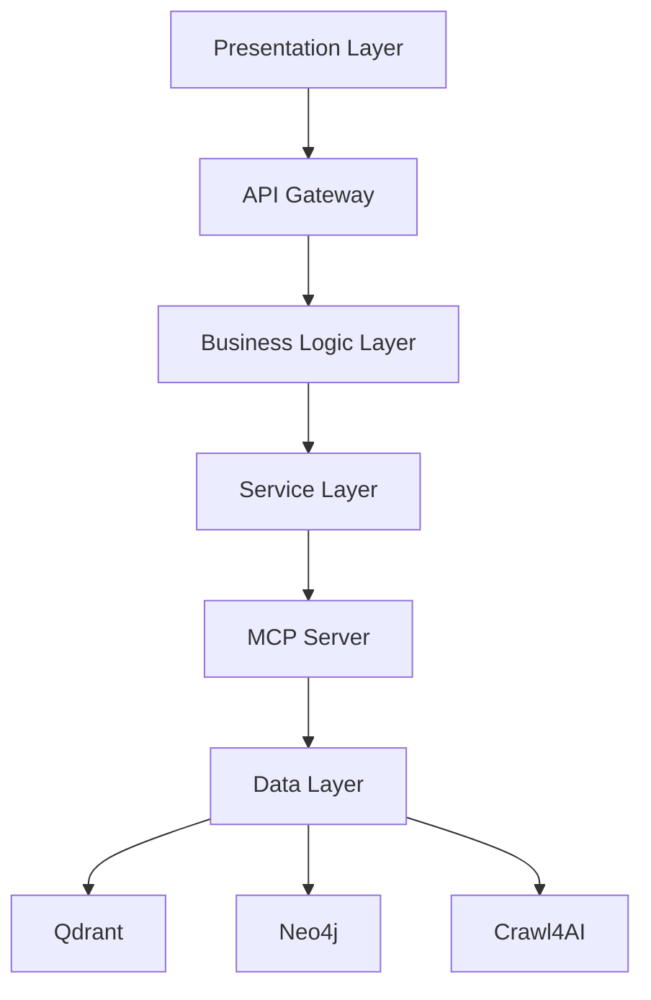
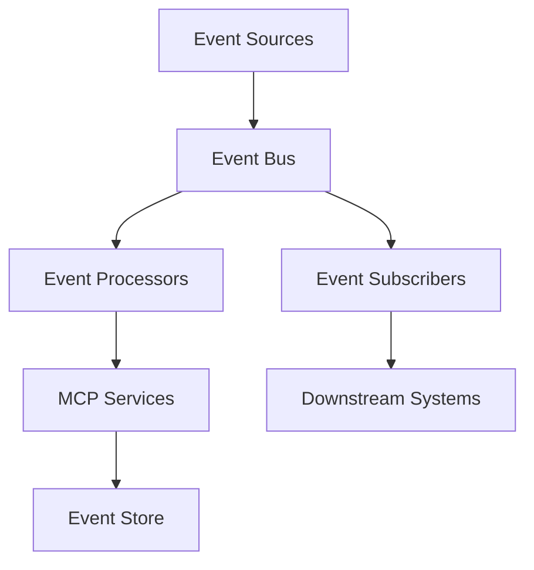
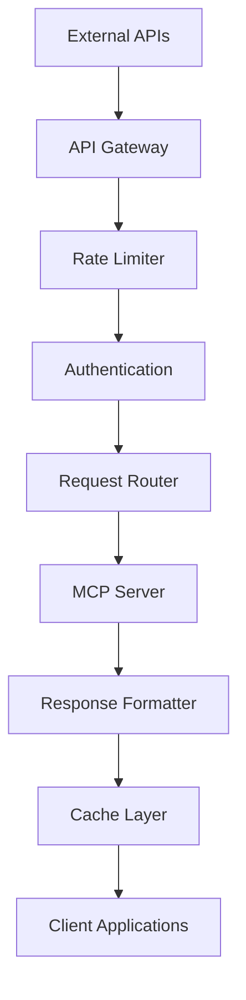
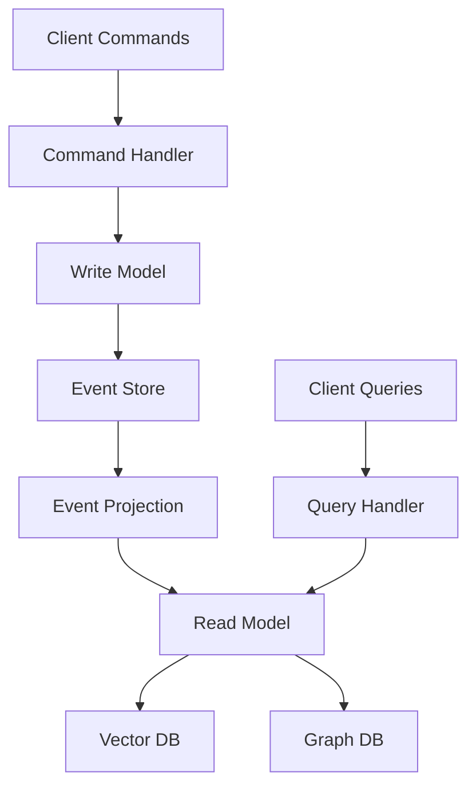

# Integration Patterns

This directory contains proven integration patterns and architectural approaches for deploying the Agentic RAG MCP server in production environments. These patterns address common integration challenges, scalability requirements, and operational considerations.

## 🏗️ Available Integration Patterns

### 🔌 [API Gateway Pattern](./api-gateway/)
Centralized API management and routing:
- **Request Routing** - Route requests to appropriate MCP services
- **Authentication & Authorization** - Centralized security enforcement
- **Rate Limiting & Throttling** - Protect backend services from overload
- **API Versioning** - Manage multiple API versions
- **Monitoring & Analytics** - Centralized request/response monitoring

### 🔄 [Event-Driven Architecture](./event-driven/)
Asynchronous processing and event streaming:
- **Message Queues** - Reliable async processing with Redis/RabbitMQ
- **Event Sourcing** - Track all data changes as events
- **CQRS Pattern** - Separate read/write operations for scalability
- **Stream Processing** - Real-time data processing with Kafka/Pulsar
- **Saga Pattern** - Distributed transaction management

### 🐳 [Microservices Deployment](./microservices/)
Container-based distributed deployment:
- **Service Mesh** - Inter-service communication with Istio/Linkerd
- **Container Orchestration** - Kubernetes deployment patterns
- **Service Discovery** - Dynamic service registration and discovery
- **Circuit Breakers** - Fault tolerance and resilience patterns
- **Distributed Tracing** - End-to-end request tracing

### ☁️ [Cloud-Native Patterns](./cloud-native/)
Cloud platform integration approaches:
- **Serverless Integration** - AWS Lambda, Azure Functions, Google Cloud Functions
- **Managed Services** - Cloud-managed databases and message queues
- **Auto-scaling** - Dynamic scaling based on load and metrics
- **Multi-region Deployment** - Global distribution strategies
- **Disaster Recovery** - Backup, replication, and failover patterns

### 🔗 [Legacy System Integration](./legacy-integration/)
Connect with existing enterprise systems:
- **Database Integration** - Connect to SQL/NoSQL databases
- **API Adaptation** - Integrate with REST/SOAP/GraphQL APIs
- **File System Integration** - Process files from shared storage
- **ETL Pipelines** - Extract, transform, load data workflows
- **Change Data Capture** - Real-time sync with legacy systems

### 🌊 [Stream Processing](./stream-processing/)
Real-time data processing and analytics:
- **Real-time Ingestion** - Continuous data ingestion from multiple sources
- **Stream Analytics** - Real-time analysis and alerting
- **Complex Event Processing** - Pattern detection in event streams
- **Windowing Operations** - Time-based data aggregation
- **Stream Joins** - Combine data from multiple streams

## 🎯 Integration Architecture Patterns

### 1. Layered Architecture Pattern



**Benefits:**
- Clear separation of concerns
- Easy to understand and maintain
- Standard enterprise pattern

**Use Cases:**
- Traditional enterprise applications
- Monolithic to microservices migration
- Systems with complex business logic

### 2. Event-Driven Architecture Pattern



**Benefits:**
- Loose coupling between components
- High scalability and resilience
- Real-time processing capabilities

**Use Cases:**
- Real-time analytics systems
- IoT data processing
- High-throughput applications

### 3. API-First Architecture Pattern



**Benefits:**
- Standardized API contracts
- Easy integration with external systems
- Centralized API management

**Use Cases:**
- Public API platforms
- Partner integrations
- Mobile and web applications

### 4. CQRS (Command Query Responsibility Segregation) Pattern



**Benefits:**
- Optimized read and write operations
- Independent scaling of read/write sides
- Event sourcing capabilities

**Use Cases:**
- High-read-volume applications
- Complex domain models
- Audit trail requirements

## 🔧 Implementation Examples

### API Gateway Integration

```python
from fastapi import FastAPI, Depends, HTTPException
from fastapi.middleware.cors import CORSMiddleware
from fastapi.security import HTTPBearer
import httpx
import asyncio
from typing import Dict, Any
import time

class MCPGateway:
    def __init__(self, mcp_server_url: str):
        self.mcp_server_url = mcp_server_url
        self.client_pool = httpx.AsyncClient()
        self.rate_limits = {}
        
    async def route_request(self, 
                          service: str, 
                          tool: str, 
                          params: Dict[str, Any],
                          user_id: str) -> Dict[str, Any]:
        """Route request to appropriate MCP service with rate limiting."""
        
        # Apply rate limiting
        if not await self._check_rate_limit(user_id, service):
            raise HTTPException(status_code=429, detail="Rate limit exceeded")
        
        # Route to appropriate service
        if service == "vector":
            return await self._call_vector_service(tool, params)
        elif service == "graph":
            return await self._call_graph_service(tool, params)
        elif service == "web":
            return await self._call_web_service(tool, params)
        else:
            raise HTTPException(status_code=400, detail=f"Unknown service: {service}")
    
    async def _check_rate_limit(self, user_id: str, service: str) -> bool:
        """Implement token bucket rate limiting."""
        current_time = time.time()
        key = f"{user_id}:{service}"
        
        if key not in self.rate_limits:
            self.rate_limits[key] = {
                "tokens": 100,  # Initial tokens
                "last_refill": current_time
            }
        
        bucket = self.rate_limits[key]
        
        # Refill tokens
        time_passed = current_time - bucket["last_refill"]
        tokens_to_add = time_passed * 10  # 10 tokens per second
        bucket["tokens"] = min(100, bucket["tokens"] + tokens_to_add)
        bucket["last_refill"] = current_time
        
        # Check if request can be processed
        if bucket["tokens"] >= 1:
            bucket["tokens"] -= 1
            return True
        
        return False
    
    async def _call_vector_service(self, tool: str, params: Dict[str, Any]) -> Dict[str, Any]:
        """Call vector service with circuit breaker."""
        try:
            response = await self.client_pool.post(
                f"{self.mcp_server_url}/mcp/tools/{tool}",
                json=params,
                timeout=30.0
            )
            response.raise_for_status()
            return response.json()
        except httpx.TimeoutException:
            raise HTTPException(status_code=504, detail="Vector service timeout")
        except httpx.HTTPStatusError as e:
            raise HTTPException(status_code=502, detail=f"Vector service error: {e}")

# FastAPI application
app = FastAPI(title="MCP API Gateway", version="1.0.0")

# Add CORS middleware
app.add_middleware(
    CORSMiddleware,
    allow_origins=["*"],
    allow_credentials=True,
    allow_methods=["*"],
    allow_headers=["*"],
)

# Initialize gateway
gateway = MCPGateway("http://mcp-server:8000")
security = HTTPBearer()

@app.post("/api/v1/{service}/{tool}")
async def proxy_mcp_request(
    service: str,
    tool: str,
    params: Dict[str, Any],
    token: str = Depends(security)
):
    """Proxy request to MCP server with authentication and rate limiting."""
    # Extract user ID from token (simplified)
    user_id = "user123"  # In practice, decode from JWT
    
    result = await gateway.route_request(service, tool, params, user_id)
    return result
```

### Event-Driven Integration

```python
import asyncio
import json
from typing import Dict, Any, Callable
from dataclasses import dataclass
from datetime import datetime
import aioredis
from abc import ABC, abstractmethod

@dataclass
class Event:
    id: str
    type: str
    source: str
    data: Dict[str, Any]
    timestamp: datetime
    correlation_id: str = None

class EventHandler(ABC):
    @abstractmethod
    async def handle(self, event: Event) -> None:
        pass

class EventBus:
    def __init__(self, redis_url: str = "redis://localhost"):
        self.redis = aioredis.from_url(redis_url)
        self.handlers: Dict[str, List[EventHandler]] = {}
        self.running = False
    
    def subscribe(self, event_type: str, handler: EventHandler):
        """Subscribe handler to event type."""
        if event_type not in self.handlers:
            self.handlers[event_type] = []
        self.handlers[event_type].append(handler)
    
    async def publish(self, event: Event):
        """Publish event to the bus."""
        event_data = {
            "id": event.id,
            "type": event.type,
            "source": event.source,
            "data": event.data,
            "timestamp": event.timestamp.isoformat(),
            "correlation_id": event.correlation_id
        }
        
        await self.redis.publish(f"events:{event.type}", json.dumps(event_data))
    
    async def start_consuming(self):
        """Start consuming events from Redis."""
        self.running = True
        pubsub = self.redis.pubsub()
        
        # Subscribe to all event types
        for event_type in self.handlers.keys():
            await pubsub.subscribe(f"events:{event_type}")
        
        async for message in pubsub.listen():
            if message["type"] == "message":
                await self._handle_message(message)
    
    async def _handle_message(self, message):
        """Handle incoming event message."""
        try:
            event_data = json.loads(message["data"])
            event = Event(
                id=event_data["id"],
                type=event_data["type"],
                source=event_data["source"],
                data=event_data["data"],
                timestamp=datetime.fromisoformat(event_data["timestamp"]),
                correlation_id=event_data.get("correlation_id")
            )
            
            # Dispatch to handlers
            handlers = self.handlers.get(event.type, [])
            for handler in handlers:
                try:
                    await handler.handle(event)
                except Exception as e:
                    print(f"Handler error: {e}")
        
        except Exception as e:
            print(f"Message processing error: {e}")

class DocumentProcessedEventHandler(EventHandler):
    def __init__(self, mcp_client):
        self.mcp_client = mcp_client
    
    async def handle(self, event: Event):
        """Handle document processed event."""
        if event.type == "document.processed":
            # Extract knowledge from the processed document
            document_id = event.data["document_id"]
            content = event.data["content"]
            
            # Store in vector database
            await self.mcp_client.call_tool("store_vector_document", {
                "content": content,
                "source": f"document_{document_id}",
                "metadata": event.data.get("metadata", {})
            })
            
            # Extract entities for knowledge graph
            await self.mcp_client.call_tool("extract_knowledge_from_text", {
                "text": content,
                "source": f"document_{document_id}"
            })

# Usage example
async def main():
    event_bus = EventBus()
    mcp_client = MCPClient("http://mcp-server:8000")
    
    # Register handlers
    doc_handler = DocumentProcessedEventHandler(mcp_client)
    event_bus.subscribe("document.processed", doc_handler)
    
    # Start consuming events
    await event_bus.start_consuming()
```

### Microservices Integration

```yaml
# kubernetes/namespace.yaml
apiVersion: v1
kind: Namespace
metadata:
  name: mcp-system
  labels:
    istio-injection: enabled

---
# kubernetes/mcp-server.yaml
apiVersion: apps/v1
kind: Deployment
metadata:
  name: mcp-server
  namespace: mcp-system
spec:
  replicas: 3
  selector:
    matchLabels:
      app: mcp-server
  template:
    metadata:
      labels:
        app: mcp-server
        version: v1
    spec:
      containers:
      - name: mcp-server
        image: mcp-server:latest
        ports:
        - containerPort: 8000
        env:
        - name: QDRANT_URL
          value: "http://qdrant-service:6333"
        - name: NEO4J_URI
          value: "bolt://neo4j-service:7687"
        resources:
          requests:
            memory: "512Mi"
            cpu: "250m"
          limits:
            memory: "1Gi"
            cpu: "500m"
        livenessProbe:
          httpGet:
            path: /health
            port: 8000
          initialDelaySeconds: 30
          periodSeconds: 10
        readinessProbe:
          httpGet:
            path: /ready
            port: 8000
          initialDelaySeconds: 5
          periodSeconds: 5

---
apiVersion: v1
kind: Service
metadata:
  name: mcp-server-service
  namespace: mcp-system
spec:
  selector:
    app: mcp-server
  ports:
  - port: 8000
    targetPort: 8000
  type: ClusterIP

---
# Istio VirtualService for traffic management
apiVersion: networking.istio.io/v1beta1
kind: VirtualService
metadata:
  name: mcp-server-vs
  namespace: mcp-system
spec:
  hosts:
  - mcp-server-service
  http:
  - match:
    - uri:
        prefix: "/mcp/tools/"
    route:
    - destination:
        host: mcp-server-service
        port:
          number: 8000
    timeout: 30s
    retries:
      attempts: 3
      perTryTimeout: 10s

---
# HorizontalPodAutoscaler for auto-scaling
apiVersion: autoscaling/v2
kind: HorizontalPodAutoscaler
metadata:
  name: mcp-server-hpa
  namespace: mcp-system
spec:
  scaleTargetRef:
    apiVersion: apps/v1
    kind: Deployment
    name: mcp-server
  minReplicas: 3
  maxReplicas: 10
  metrics:
  - type: Resource
    resource:
      name: cpu
      target:
        type: Utilization
        averageUtilization: 70
  - type: Resource
    resource:
      name: memory
      target:
        type: Utilization
        averageUtilization: 80
```

### Cloud-Native Serverless Integration

```python
# AWS Lambda integration example
import json
import boto3
import asyncio
import httpx
from typing import Dict, Any

class ServerlessMCPIntegration:
    def __init__(self, mcp_server_url: str):
        self.mcp_server_url = mcp_server_url
        self.s3_client = boto3.client('s3')
        self.sqs_client = boto3.client('sqs')
    
    async def process_s3_event(self, event: Dict[str, Any]) -> Dict[str, Any]:
        """Process S3 file upload event."""
        for record in event.get('Records', []):
            bucket = record['s3']['bucket']['name']
            key = record['s3']['object']['key']
            
            # Download file from S3
            file_content = await self._download_s3_file(bucket, key)
            
            # Process with MCP server
            async with httpx.AsyncClient() as client:
                response = await client.post(
                    f"{self.mcp_server_url}/mcp/tools/store_vector_document",
                    json={
                        "content": file_content,
                        "source": f"s3://{bucket}/{key}",
                        "metadata": {
                            "bucket": bucket,
                            "key": key,
                            "processed_timestamp": "2024-01-01T00:00:00Z"
                        }
                    },
                    timeout=60.0
                )
                
                return response.json()
    
    async def _download_s3_file(self, bucket: str, key: str) -> str:
        """Download file content from S3."""
        response = self.s3_client.get_object(Bucket=bucket, Key=key)
        return response['Body'].read().decode('utf-8')

# Lambda handler
def lambda_handler(event, context):
    integration = ServerlessMCPIntegration(
        mcp_server_url=os.environ['MCP_SERVER_URL']
    )
    
    # Run async function in Lambda
    loop = asyncio.new_event_loop()
    asyncio.set_event_loop(loop)
    
    try:
        result = loop.run_until_complete(
            integration.process_s3_event(event)
        )
        
        return {
            'statusCode': 200,
            'body': json.dumps(result)
        }
    except Exception as e:
        return {
            'statusCode': 500,
            'body': json.dumps({'error': str(e)})
        }
    finally:
        loop.close()
```

## 📊 Performance and Monitoring

### Observability Stack

```yaml
# Monitoring stack with Prometheus, Grafana, and Jaeger
version: '3.8'
services:
  prometheus:
    image: prom/prometheus:latest
    ports:
      - "9090:9090"
    volumes:
      - ./prometheus.yml:/etc/prometheus/prometheus.yml
  
  grafana:
    image: grafana/grafana:latest
    ports:
      - "3000:3000"
    environment:
      - GF_SECURITY_ADMIN_PASSWORD=admin
    volumes:
      - grafana-storage:/var/lib/grafana
  
  jaeger:
    image: jaegertracing/all-in-one:latest
    ports:
      - "16686:16686"
      - "14268:14268"
    environment:
      - COLLECTOR_OTLP_ENABLED=true
  
  loki:
    image: grafana/loki:latest
    ports:
      - "3100:3100"
    command: -config.file=/etc/loki/local-config.yaml
  
  promtail:
    image: grafana/promtail:latest
    volumes:
      - /var/log:/var/log:ro
      - ./promtail.yml:/etc/promtail/config.yml

volumes:
  grafana-storage:
```

### Custom Metrics Collection

```python
from prometheus_client import Counter, Histogram, Gauge, start_http_server
import time
from functools import wraps
from typing import Callable, Any

# Define metrics
REQUEST_COUNT = Counter('mcp_requests_total', 'Total MCP requests', ['service', 'tool', 'status'])
REQUEST_DURATION = Histogram('mcp_request_duration_seconds', 'MCP request duration', ['service', 'tool'])
ACTIVE_CONNECTIONS = Gauge('mcp_active_connections', 'Active MCP connections')
ERROR_RATE = Counter('mcp_errors_total', 'Total MCP errors', ['service', 'tool', 'error_type'])

def monitor_mcp_calls(service: str):
    """Decorator to monitor MCP calls."""
    def decorator(func: Callable) -> Callable:
        @wraps(func)
        async def wrapper(*args, **kwargs) -> Any:
            tool_name = func.__name__
            start_time = time.time()
            
            ACTIVE_CONNECTIONS.inc()
            
            try:
                result = await func(*args, **kwargs)
                REQUEST_COUNT.labels(service=service, tool=tool_name, status='success').inc()
                return result
            except Exception as e:
                REQUEST_COUNT.labels(service=service, tool=tool_name, status='error').inc()
                ERROR_RATE.labels(service=service, tool=tool_name, error_type=type(e).__name__).inc()
                raise
            finally:
                duration = time.time() - start_time
                REQUEST_DURATION.labels(service=service, tool=tool_name).observe(duration)
                ACTIVE_CONNECTIONS.dec()
        
        return wrapper
    return decorator

# Usage example
class MonitoredMCPClient:
    def __init__(self, base_url: str):
        self.base_url = base_url
    
    @monitor_mcp_calls('vector')
    async def semantic_vector_search(self, query: str, **kwargs):
        # Implementation here
        pass
    
    @monitor_mcp_calls('graph')
    async def search_knowledge_graph(self, query: str, **kwargs):
        # Implementation here
        pass

# Start metrics server
start_http_server(8000)
```

## 🔐 Security Integration Patterns

### Zero Trust Architecture

```python
import jwt
from datetime import datetime, timedelta
from typing import Dict, Any, Optional
from fastapi import HTTPException, Depends
from fastapi.security import HTTPBearer
import hashlib
import hmac

class ZeroTrustSecurity:
    def __init__(self, secret_key: str, issuer: str):
        self.secret_key = secret_key
        self.issuer = issuer
        self.security = HTTPBearer()
    
    def create_token(self, user_id: str, scopes: list, resource_access: Dict[str, Any]) -> str:
        """Create JWT token with fine-grained permissions."""
        payload = {
            "user_id": user_id,
            "scopes": scopes,
            "resource_access": resource_access,
            "iss": self.issuer,
            "iat": datetime.utcnow(),
            "exp": datetime.utcnow() + timedelta(hours=1),
            "jti": hashlib.sha256(f"{user_id}{datetime.utcnow()}".encode()).hexdigest()
        }
        
        return jwt.encode(payload, self.secret_key, algorithm="HS256")
    
    def verify_token(self, token: str) -> Dict[str, Any]:
        """Verify and decode JWT token."""
        try:
            payload = jwt.decode(token, self.secret_key, algorithms=["HS256"])
            return payload
        except jwt.ExpiredSignatureError:
            raise HTTPException(status_code=401, detail="Token has expired")
        except jwt.InvalidTokenError:
            raise HTTPException(status_code=401, detail="Invalid token")
    
    def check_permissions(self, token_payload: Dict[str, Any], 
                         required_scope: str, 
                         resource: str) -> bool:
        """Check if token has required permissions for resource."""
        scopes = token_payload.get("scopes", [])
        resource_access = token_payload.get("resource_access", {})
        
        # Check scope-based access
        if required_scope not in scopes:
            return False
        
        # Check resource-based access
        if resource in resource_access:
            allowed_operations = resource_access[resource]
            if required_scope in allowed_operations:
                return True
        
        return False
    
    async def secure_endpoint(self, 
                            required_scope: str, 
                            resource: str,
                            token: str = Depends(HTTPBearer())):
        """Dependency for securing endpoints."""
        payload = self.verify_token(token.credentials)
        
        if not self.check_permissions(payload, required_scope, resource):
            raise HTTPException(
                status_code=403, 
                detail=f"Insufficient permissions for {resource}"
            )
        
        return payload
```

## 🚀 Deployment Strategies

### Blue-Green Deployment

```yaml
# Blue-Green deployment configuration
apiVersion: argoproj.io/v1alpha1
kind: Rollout
metadata:
  name: mcp-server-rollout
spec:
  replicas: 5
  strategy:
    blueGreen:
      activeService: mcp-server-active
      previewService: mcp-server-preview
      prePromotionAnalysis:
        templates:
        - templateName: success-rate
        args:
        - name: service-name
          value: mcp-server-preview
      postPromotionAnalysis:
        templates:
        - templateName: success-rate
        args:
        - name: service-name
          value: mcp-server-active
      scaleDownDelaySeconds: 30
      previewReplicaCount: 2
  selector:
    matchLabels:
      app: mcp-server
  template:
    metadata:
      labels:
        app: mcp-server
    spec:
      containers:
      - name: mcp-server
        image: mcp-server:latest
        ports:
        - containerPort: 8000

---
apiVersion: argoproj.io/v1alpha1
kind: AnalysisTemplate
metadata:
  name: success-rate
spec:
  args:
  - name: service-name
  metrics:
  - name: success-rate
    interval: 10s
    count: 5
    successCondition: result[0] >= 0.95
    provider:
      prometheus:
        address: http://prometheus:9090
        query: |
          sum(rate(http_requests_total{job="{{args.service-name}}",status!~"5.."}[2m])) /
          sum(rate(http_requests_total{job="{{args.service-name}}"}[2m]))
```

### Canary Deployment

```yaml
apiVersion: argoproj.io/v1alpha1
kind: Rollout
metadata:
  name: mcp-server-canary
spec:
  replicas: 10
  strategy:
    canary:
      steps:
      - setWeight: 10
      - pause: {duration: 1m}
      - setWeight: 20
      - pause: {duration: 1m}
      - setWeight: 50
      - pause: {duration: 2m}
      - setWeight: 80
      - pause: {duration: 2m}
      canaryService: mcp-server-canary
      stableService: mcp-server-stable
      trafficRouting:
        istio:
          virtualService:
            name: mcp-server-vs
            routes:
            - primary
  selector:
    matchLabels:
      app: mcp-server
  template:
    metadata:
      labels:
        app: mcp-server
    spec:
      containers:
      - name: mcp-server
        image: mcp-server:latest
```

## 📝 Best Practices Summary

### 1. Design Principles
- **Loose Coupling**: Services should be independently deployable
- **High Cohesion**: Related functionality should be grouped together
- **Single Responsibility**: Each service should have one clear purpose
- **Fail Fast**: Detect and handle errors early in the request flow

### 2. Operational Excellence
- **Monitoring**: Comprehensive metrics, logs, and tracing
- **Alerting**: Proactive alerts for performance and error conditions
- **Documentation**: Keep integration docs up-to-date
- **Testing**: Automated testing at all integration points

### 3. Security by Design
- **Zero Trust**: Never trust, always verify
- **Defense in Depth**: Multiple layers of security controls
- **Least Privilege**: Minimum necessary permissions
- **Audit Logging**: Comprehensive audit trails

### 4. Performance Optimization
- **Caching**: Multi-level caching strategies
- **Connection Pooling**: Reuse connections efficiently
- **Circuit Breakers**: Prevent cascade failures
- **Load Balancing**: Distribute load evenly

## 🤝 Contributing

We welcome contributions to improve these integration patterns:

1. **New Patterns** - Add integration patterns for new platforms
2. **Best Practices** - Share lessons learned from production deployments
3. **Tools and Scripts** - Provide automation tools and utilities
4. **Documentation** - Improve existing documentation and examples

### Pattern Contribution Guidelines

1. **Real-World Validation** - Patterns should be tested in production-like environments
2. **Complete Examples** - Provide full, runnable code examples
3. **Performance Data** - Include performance benchmarks and considerations
4. **Security Review** - Address security implications and best practices
5. **Documentation** - Comprehensive documentation with troubleshooting guides

---

**Ready to integrate?** Choose the pattern that best fits your architecture and start building production-ready systems with the Agentic RAG MCP server! 🚀