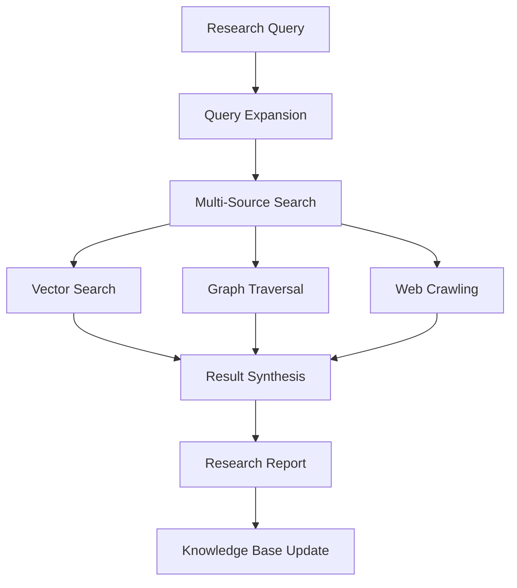
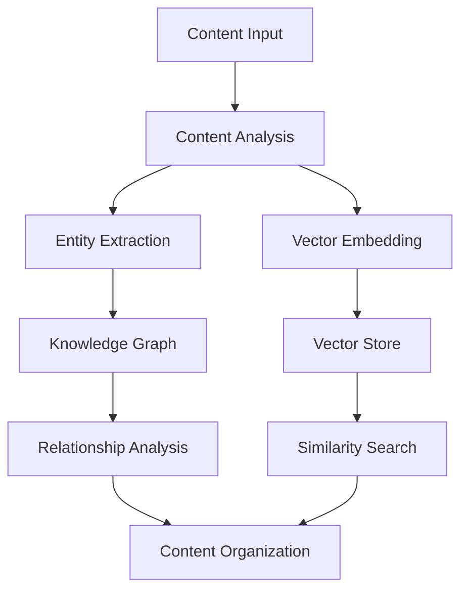
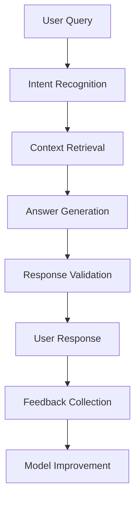

# Real-World Use Cases

This directory contains practical examples that demonstrate how to apply the Agentic RAG MCP server to solve real-world problems across various industries and domains. Each use case includes complete implementations, deployment guides, and scaling considerations.

## 🎯 Available Use Cases

### 🔬 [Research Assistant](./research-assistant/)
AI-powered research automation for academic and business research:
- **Literature Review** - Automated paper discovery and synthesis
- **Market Research** - Competitor analysis and trend identification
- **Patent Analysis** - Prior art search and innovation tracking
- **Expert Discovery** - Find researchers and thought leaders
- **Citation Networks** - Analyze research impact and connections

### 📚 [Content Management](./content-management/)
Intelligent document processing and knowledge organization:
- **Document Classification** - Automatic categorization and tagging
- **Content Deduplication** - Identify and merge duplicate content
- **Knowledge Extraction** - Extract entities, relationships, and insights
- **Content Recommendations** - Suggest related documents and topics
- **Version Control** - Track document evolution and changes

### 🎧 [Customer Support](./customer-support/)
Intelligent customer service and knowledge base systems:
- **FAQ Automation** - Automatic question answering from documentation
- **Ticket Classification** - Categorize and route support requests
- **Knowledge Base Search** - Semantic search across support content
- **Agent Assistance** - Real-time suggestions for support agents
- **Customer Insights** - Analyze support patterns and trends

### 📊 [Business Intelligence](./business-intelligence/)
Data-driven insights and decision support systems:
- **Report Generation** - Automated business report creation
- **Trend Analysis** - Identify patterns in business data
- **Competitive Intelligence** - Monitor competitor activities
- **Risk Assessment** - Analyze business and market risks
- **Strategic Planning** - Data-driven strategy recommendations

### 🏥 [Healthcare Analytics](./healthcare-analytics/)
Medical knowledge and patient data analysis:
- **Clinical Decision Support** - Evidence-based treatment recommendations
- **Drug Discovery** - Analyze research papers and clinical trials
- **Patient Record Analysis** - Extract insights from medical records
- **Medical Literature Review** - Systematic review automation
- **Diagnostic Assistance** - Pattern recognition in medical data

### 🏛️ [Legal Research](./legal-research/)
Legal document analysis and case research:
- **Case Law Search** - Semantic search across legal databases
- **Contract Analysis** - Extract terms and identify risks
- **Regulatory Compliance** - Track regulatory changes and requirements
- **Legal Precedent Analysis** - Find relevant case precedents
- **Document Review** - Automated legal document processing

### 🎓 [Educational Technology](./educational-technology/)
Personalized learning and educational content systems:
- **Curriculum Planning** - Automated course content organization
- **Student Assessment** - Personalized evaluation and feedback
- **Learning Path Optimization** - Adaptive learning recommendations
- **Educational Content Search** - Find relevant learning materials
- **Knowledge Gap Analysis** - Identify learning gaps and recommendations

### 💰 [Financial Services](./financial-services/)
Financial data analysis and risk management:
- **Investment Research** - Automated equity and market analysis
- **Risk Assessment** - Credit and operational risk evaluation
- **Regulatory Reporting** - Automated compliance reporting
- **Fraud Detection** - Pattern recognition in transaction data
- **Customer Insights** - Analyze customer behavior and preferences

## 🏗️ Architecture Patterns by Use Case

### Research-Intensive Applications


### Content-Centric Applications


### Customer-Facing Applications


## 📋 Implementation Guidelines

### 1. Define Clear Objectives

Before implementing any use case:
- **Identify specific problems** to solve
- **Define success metrics** and KPIs
- **Understand user workflows** and requirements
- **Assess data availability** and quality
- **Plan for scalability** and growth

### 2. Data Architecture

Design your data flow:
```python
@dataclass
class DataPipeline:
    sources: List[str]              # Data sources (files, APIs, databases)
    processors: List[str]           # Processing stages
    storage: List[str]              # Storage systems (vector, graph, cache)
    outputs: List[str]              # Output formats and destinations
    
    validation_rules: Dict[str, Any]
    quality_metrics: Dict[str, float]
    monitoring_config: Dict[str, Any]
```

### 3. Service Integration

Plan your service architecture:
```python
class UseCaseArchitecture:
    def __init__(self):
        self.vector_config = VectorConfig(
            collections=["documents", "entities", "summaries"],
            embedding_models=["all-MiniLM-L6-v2", "text-embedding-ada-002"],
            search_strategies=["semantic", "hybrid", "faceted"]
        )
        
        self.graph_config = GraphConfig(
            node_types=["Entity", "Document", "Person", "Organization"],
            relationship_types=["MENTIONS", "RELATES_TO", "AUTHORED_BY"],
            analysis_algorithms=["centrality", "community", "similarity"]
        )
        
        self.web_config = WebConfig(
            crawl_strategies=["targeted", "exploratory", "monitoring"],
            extraction_methods=["text", "structured", "multimedia"],
            update_frequencies=["real-time", "daily", "weekly"]
        )
```

### 4. Performance Optimization

Optimize for your specific use case:

```python
class PerformanceOptimizer:
    def __init__(self, use_case_type: str):
        self.use_case_type = use_case_type
        self.optimization_strategies = self._get_strategies()
    
    def _get_strategies(self) -> Dict[str, Any]:
        if self.use_case_type == "research":
            return {
                "caching": {"strategy": "aggressive", "ttl": 86400},
                "batching": {"size": 50, "timeout": 30},
                "parallel_search": {"max_concurrent": 10},
                "result_filtering": {"min_score": 0.7, "max_results": 100}
            }
        elif self.use_case_type == "customer_support":
            return {
                "caching": {"strategy": "fast_lookup", "ttl": 3600},
                "response_time": {"target_ms": 500, "timeout_ms": 2000},
                "relevance_tuning": {"precision_focused": True},
                "fallback_responses": {"enabled": True}
            }
        # ... other use case optimizations
```

## 📊 Performance Benchmarks by Use Case

### Response Time Targets

| Use Case | Target Response | Maximum Acceptable | Typical Queries/Min |
|----------|----------------|-------------------|-------------------|
| Customer Support | < 500ms | 2s | 500-1000 |
| Research Assistant | < 2s | 10s | 50-100 |
| Content Management | < 1s | 5s | 100-300 |
| Business Intelligence | < 3s | 15s | 20-50 |

### Scalability Considerations

| Use Case | Concurrent Users | Data Volume | Update Frequency |
|----------|-----------------|-------------|------------------|
| Customer Support | 100-1000 | GB-TB | Real-time |
| Research Assistant | 10-100 | TB-PB | Daily |
| Content Management | 50-500 | TB-PB | Hourly |
| Business Intelligence | 20-200 | PB+ | Weekly |

## 🔧 Deployment Patterns

### Single-Tenant Deployment
Best for: Small organizations, specialized use cases
```yaml
services:
  mcp-server:
    replicas: 1
    resources:
      cpu: 2
      memory: 4Gi
  qdrant:
    replicas: 1
    storage: 100Gi
  neo4j:
    replicas: 1
    storage: 50Gi
```

### Multi-Tenant Deployment
Best for: SaaS applications, large organizations
```yaml
services:
  mcp-server:
    replicas: 3
    resources:
      cpu: 4
      memory: 8Gi
  qdrant-cluster:
    replicas: 3
    storage: 1Ti
  neo4j-cluster:
    replicas: 3
    storage: 500Gi
  load-balancer:
    type: nginx
    ssl: enabled
```

### Edge Deployment
Best for: Low-latency requirements, distributed users
```yaml
regions:
  - name: us-east
    services: [mcp-server, qdrant]
  - name: eu-west
    services: [mcp-server, qdrant]
  - name: asia-pacific
    services: [mcp-server, qdrant]
central:
  services: [neo4j-master, analytics]
```

## 📈 ROI and Business Impact

### Quantifiable Benefits

| Use Case | Typical ROI | Time to Value | Key Metrics |
|----------|-------------|---------------|-------------|
| Customer Support | 300-500% | 3-6 months | Response time ↓60%, CSAT ↑40% |
| Research Assistant | 200-400% | 1-3 months | Research time ↓70%, Quality ↑50% |
| Content Management | 250-350% | 2-4 months | Processing time ↓80%, Accuracy ↑60% |
| Business Intelligence | 400-600% | 6-12 months | Decision speed ↑200%, Insights ↑300% |

### Cost Considerations

**Infrastructure Costs:**
- Compute: $500-5000/month depending on scale
- Storage: $100-1000/month for vector and graph databases
- Network: $50-500/month for API calls and data transfer

**Development Costs:**
- Initial setup: 2-8 weeks of development time
- Customization: 4-16 weeks depending on complexity
- Maintenance: 10-20% of development cost annually

**Training and Adoption:**
- User training: 1-4 weeks
- Change management: 2-8 weeks
- Ongoing support: 5-15% of total cost

## 🧪 Testing and Validation

### Use Case Testing Framework

```python
class UseCaseValidator:
    def __init__(self, use_case_type: str):
        self.use_case_type = use_case_type
        self.test_scenarios = self._load_test_scenarios()
    
    async def validate_accuracy(self, test_set: List[Dict]) -> Dict[str, float]:
        """Validate accuracy metrics for the use case."""
        results = {"precision": 0.0, "recall": 0.0, "f1": 0.0}
        
        for test_case in test_set:
            prediction = await self._get_prediction(test_case["input"])
            ground_truth = test_case["expected_output"]
            
            # Calculate metrics based on use case type
            metrics = self._calculate_metrics(prediction, ground_truth)
            for key, value in metrics.items():
                results[key] += value
        
        # Average the results
        for key in results:
            results[key] /= len(test_set)
        
        return results
    
    async def validate_performance(self, load_profile: Dict) -> Dict[str, float]:
        """Validate performance under load."""
        # Performance testing logic
        pass
    
    async def validate_scalability(self, scale_factors: List[int]) -> Dict[str, Any]:
        """Test scalability characteristics."""
        # Scalability testing logic
        pass
```

### Quality Assurance Checklist

For each use case implementation:

- [ ] **Functional Requirements**
  - [ ] Core functionality works as specified
  - [ ] Error handling is comprehensive
  - [ ] Edge cases are properly handled
  - [ ] User workflows are supported

- [ ] **Performance Requirements**
  - [ ] Response times meet targets
  - [ ] System handles expected load
  - [ ] Resource usage is within limits
  - [ ] Scalability requirements are met

- [ ] **Quality Requirements**
  - [ ] Accuracy meets business requirements
  - [ ] Results are consistent and reliable
  - [ ] Bias and fairness are addressed
  - [ ] Privacy and security are protected

- [ ] **Operational Requirements**
  - [ ] Monitoring and alerting are configured
  - [ ] Backup and recovery procedures exist
  - [ ] Documentation is complete and accurate
  - [ ] Support procedures are defined

## 🔐 Security and Compliance

### Security Considerations by Use Case

**Healthcare and Finance:**
- HIPAA/SOX compliance requirements
- Data encryption at rest and in transit
- Access controls and audit logging
- Regular security assessments

**Legal and Government:**
- Attorney-client privilege protection
- Classification level handling
- Data sovereignty requirements
- Regulatory compliance tracking

**Corporate and Commercial:**
- Intellectual property protection
- Competitive information handling
- Employee privacy considerations
- Customer data protection

### Implementation Security Framework

```python
class SecurityFramework:
    def __init__(self, use_case_type: str, compliance_requirements: List[str]):
        self.use_case_type = use_case_type
        self.compliance_requirements = compliance_requirements
        self.security_policies = self._define_policies()
    
    def _define_policies(self) -> Dict[str, Any]:
        base_policies = {
            "authentication": {"method": "JWT", "mfa_required": True},
            "authorization": {"rbac": True, "fine_grained": True},
            "encryption": {"at_rest": "AES-256", "in_transit": "TLS 1.3"},
            "logging": {"level": "detailed", "retention": "7_years"},
            "data_handling": {"anonymization": True, "right_to_delete": True}
        }
        
        # Add compliance-specific policies
        if "HIPAA" in self.compliance_requirements:
            base_policies.update({
                "phi_handling": {"encryption_required": True, "access_logging": True},
                "audit_trail": {"comprehensive": True, "tamper_proof": True}
            })
        
        if "GDPR" in self.compliance_requirements:
            base_policies.update({
                "consent_management": {"explicit": True, "granular": True},
                "data_portability": {"export_format": "standard", "automated": True}
            })
        
        return base_policies
```

## 🚀 Getting Started

### Choose Your Use Case

1. **Identify your primary need:**
   - Information retrieval and search
   - Content analysis and organization
   - Decision support and insights
   - Process automation

2. **Assess your data:**
   - Volume and variety of content
   - Update frequency and freshness requirements
   - Quality and structure of existing data
   - Integration points and APIs

3. **Define success criteria:**
   - Accuracy and relevance requirements
   - Performance and scalability needs
   - User experience expectations
   - Business impact metrics

### Implementation Process

1. **Start with a pilot** (2-4 weeks)
   - Choose a narrow, well-defined use case
   - Implement core functionality
   - Validate with a small user group
   - Measure initial results

2. **Expand functionality** (4-8 weeks)
   - Add advanced features
   - Integrate with existing systems
   - Scale to more users
   - Optimize performance

3. **Production deployment** (2-4 weeks)
   - Implement monitoring and alerting
   - Add security and compliance features
   - Deploy to production environment
   - Train users and support staff

4. **Continuous improvement** (ongoing)
   - Monitor usage and performance
   - Gather user feedback
   - Iterate on features and accuracy
   - Expand to additional use cases

## 🤝 Community and Support

### Contributing Use Cases

We welcome new use case examples:

1. **Document your use case** with clear business context
2. **Provide complete implementation** with deployment guides
3. **Include evaluation metrics** and performance benchmarks
4. **Add troubleshooting guides** and common issues
5. **Create demo data and scripts** for easy testing

### Getting Help

- **GitHub Issues**: Report bugs and request features
- **Community Forum**: Ask questions and share experiences
- **Professional Support**: Enterprise support options available
- **Training Programs**: Workshops and certification courses

---

**Ready to solve real problems?** Choose a use case that matches your needs and start building with the battle-tested patterns and implementations provided! 🚀