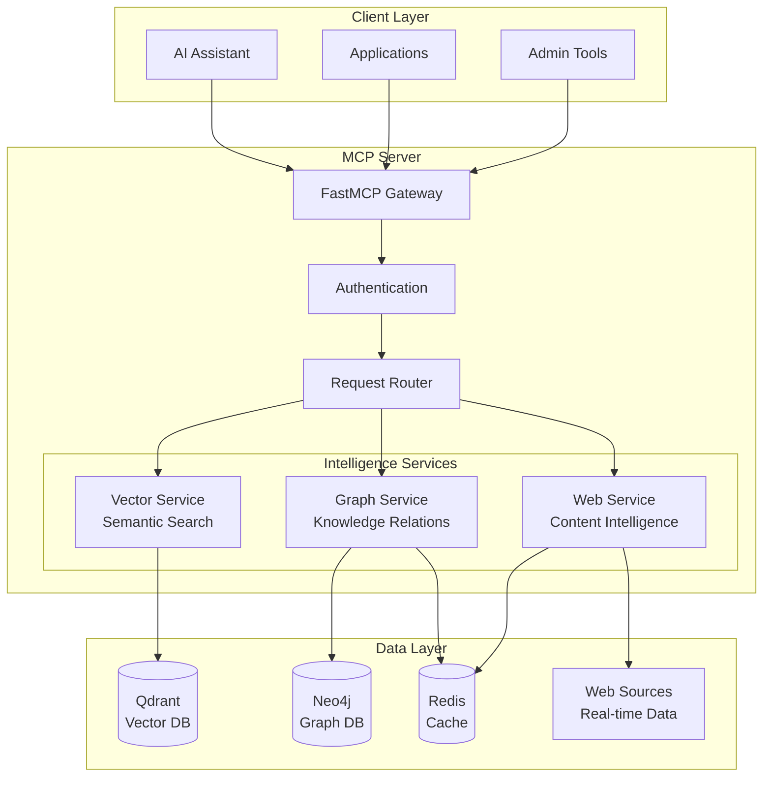

# Getting Started with Qdrant Neo4j Crawl4AI MCP Server

Welcome to the **Qdrant Neo4j Crawl4AI MCP Server** - a production-ready agentic RAG system that combines vector search, knowledge graphs, and web intelligence into a unified Model Context Protocol server.

## 🏃‍♂️ Quick Navigation

Choose your path based on your role and needs:

### 🚀 [Quick Start Guide](./quick-start.md)
**5-minute setup** - Get the system running with Docker Compose in minutes.

### 🔧 [Installation Guide](./installation.md)
**Detailed setup** - Complete installation instructions for all deployment options.

### ⚙️ [Configuration Guide](./configuration.md)
**System configuration** - Environment variables, security settings, and service configuration.

### 🎯 [First Queries Guide](./first-queries.md)
**Getting started** - Your first vector searches, graph queries, and web intelligence operations.

### 🛠️ [Troubleshooting Guide](./troubleshooting.md)
**Problem solving** - Common issues, solutions, and debugging techniques.

## 🎭 Role-Based Quick Starts

### 🤖 AI Assistant Developer
You want to integrate intelligent RAG capabilities into your AI assistant.

**Best Path**: [Quick Start](./quick-start.md) → [First Queries](./first-queries.md) → [MCP Client Integration](./first-queries.md#mcp-client-integration)

**Key Features**:
- Vector semantic search for knowledge retrieval
- Graph memory for conversation context
- Web intelligence for real-time information

### 📊 Data Scientist/Researcher
You need to analyze and extract insights from complex data relationships.

**Best Path**: [Installation](./installation.md) → [Configuration](./configuration.md) → [Advanced Queries](./first-queries.md#advanced-query-patterns)

**Key Features**:
- GraphRAG for knowledge discovery
- Multi-modal embeddings
- Advanced graph analytics

### 🏗️ DevOps/Infrastructure Engineer
You want to deploy and manage the system in production.

**Best Path**: [Installation](./installation.md) → [Kubernetes Deployment](./installation.md#kubernetes-deployment) → [Monitoring Setup](./troubleshooting.md#monitoring-and-observability)

**Key Features**:
- Container orchestration
- Auto-scaling capabilities
- Comprehensive monitoring

### 💻 Application Developer
You're building applications that need intelligent data processing.

**Best Path**: [Quick Start](./quick-start.md) → [API Integration](./first-queries.md#rest-api-usage) → [Configuration](./configuration.md)

**Key Features**:
- RESTful API interface
- JWT authentication
- OpenAPI documentation

## 🏗️ System Architecture Overview

## ✨ Key Capabilities

### 🔍 Vector Intelligence
- **Semantic search** across document collections
- **Multi-modal embeddings** (text, code, structured data)
- **Similarity scoring** with configurable thresholds
- **Real-time indexing** of new content

### 🕸️ Graph Intelligence
- **Knowledge graph** construction and querying
- **Relationship analysis** and path finding
- **Memory systems** for conversational AI
- **GraphRAG** for enhanced retrieval

### 🌐 Web Intelligence
- **Smart web crawling** with content extraction
- **Real-time data** from web sources
- **Content analysis** and structure detection
- **Rate-limited** and respectful crawling

### 🔒 Production Features
- **JWT authentication** with role-based access
- **Rate limiting** and security headers
- **Health monitoring** with Prometheus metrics
- **Container orchestration** ready

## 📋 Prerequisites

Before you begin, ensure you have:

### Required
- **Python 3.11+** with pip or uv
- **Docker** and Docker Compose
- **Git** for repository management
- **4GB+ RAM** for all services

### Optional (for advanced deployment)
- **Kubernetes cluster** for production deployment
- **Redis** for enhanced caching (included in Docker setup)
- **Prometheus/Grafana** for monitoring (included)

## 🚦 System Requirements

### Minimum (Development)
- **CPU**: 2 cores
- **RAM**: 4GB
- **Storage**: 10GB free space
- **Network**: Internet connection for web intelligence

### Recommended (Production)
- **CPU**: 4+ cores
- **RAM**: 8GB+
- **Storage**: 50GB+ SSD
- **Network**: Stable internet with good bandwidth

## 🎯 What's Next?

1. **Start with [Quick Start](./quick-start.md)** if you want to see the system in action immediately
2. **Read [Installation](./installation.md)** for detailed setup instructions
3. **Check [Configuration](./configuration.md)** to customize the system for your needs
4. **Try [First Queries](./first-queries.md)** to understand the capabilities
5. **Review [Troubleshooting](./troubleshooting.md)** when you need help

## 🆘 Need Help?

- **Quick Issues**: Check [Troubleshooting Guide](./troubleshooting.md)
- **Configuration Questions**: See [Configuration Guide](./configuration.md)
- **API Questions**: Check the interactive docs at `http://localhost:8000/docs`
- **Performance Issues**: Review the monitoring setup in [Troubleshooting](./troubleshooting.md#monitoring-and-observability)

## 📚 Additional Resources

- [Technical Documentation](../TECHNICAL_DOCUMENTATION.md) - Deep dive into the architecture
- [API Reference](../API_REFERENCE.md) - Complete API documentation
- [Deployment Guide](../DEPLOYMENT_OPERATIONS.md) - Production deployment strategies
- [Examples](../examples/) - Code examples and use cases

---

Ready to get started? **[Begin with the Quick Start Guide →](./quick-start.md)**