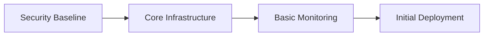
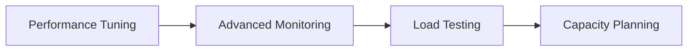
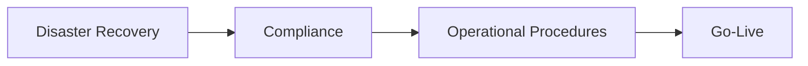
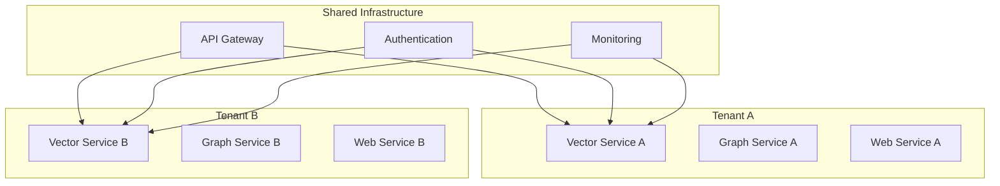
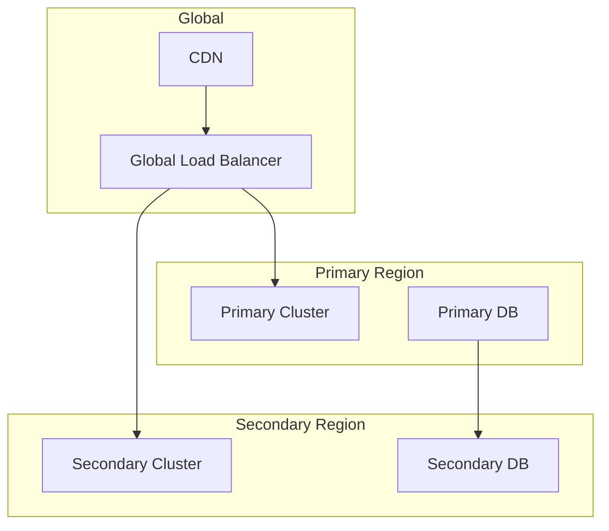
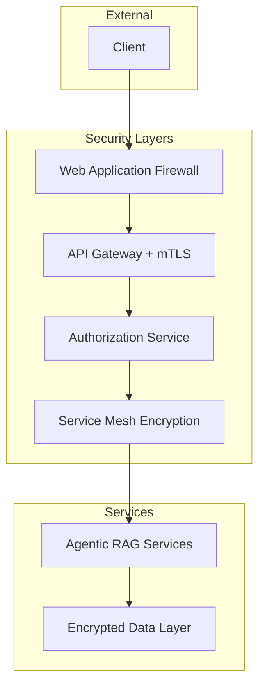

# Advanced Guides & Best Practices

> **Advanced implementation patterns and production best practices for enterprise-scale agentic RAG deployments**

## 🎯 Guide Overview

This section provides comprehensive guides for implementing, deploying, and maintaining the agentic RAG MCP server in production environments. These guides assume familiarity with the basic system and focus on advanced scenarios, enterprise requirements, and production operations.

## 📚 Guide Categories

### 🏭 Production Operations

| Guide | Description | Target Audience | Complexity |
|-------|-------------|-----------------|------------|
| **[Best Practices](best-practices.md)** | **Essential patterns for production deployments** | DevOps, Architects | Intermediate |
| **[Performance Optimization](performance-optimization.md)** | **Scaling and performance tuning strategies** | SRE, Performance Engineers | Advanced |
| **[Security Hardening](security-hardening.md)** | **Enterprise security and compliance** | Security Teams, Architects | Advanced |
| **[Monitoring & Observability](monitoring-observability.md)** | **Advanced monitoring, alerting, and diagnostics** | SRE, Operations | Advanced |

### 🔧 Operations & Maintenance

| Guide | Description | Target Audience | Complexity |
|-------|-------------|-----------------|------------|
| **[Troubleshooting](troubleshooting.md)** | **Advanced diagnostics and problem resolution** | All Users | Intermediate |
| **[Migration Guide](migration.md)** | **Upgrade procedures and data migration** | DevOps, Architects | Advanced |
| **[Customization Guide](customization.md)** | **Extension patterns and custom implementations** | Developers, Architects | Expert |

## 🎯 Quick Navigation by Use Case

### 🚀 New Production Deployment

**Goal**: Deploy a production-ready agentic RAG system from scratch

**Recommended Path**:

1. **[Best Practices](best-practices.md)** - Understand core production patterns
2. **[Security Hardening](security-hardening.md)** - Configure security baseline
3. **[Performance Optimization](performance-optimization.md)** - Scale for your workload
4. **[Monitoring & Observability](monitoring-observability.md)** - Set up comprehensive monitoring

**Time Investment**: 2-3 days for complete setup

### 🔧 Existing System Optimization

**Goal**: Improve performance and reliability of existing deployment

**Recommended Path**:

1. **[Performance Optimization](performance-optimization.md)** - Identify bottlenecks and optimizations
2. **[Monitoring & Observability](monitoring-observability.md)** - Enhanced monitoring and alerting
3. **[Troubleshooting](troubleshooting.md)** - Advanced diagnostic capabilities

**Time Investment**: 1-2 days for optimization

### 🛡️ Security & Compliance Review

**Goal**: Ensure security posture meets enterprise requirements

**Recommended Path**:

1. **[Security Hardening](security-hardening.md)** - Complete security assessment and hardening
2. **[Best Practices](best-practices.md)** - Operational security patterns
3. **[Monitoring & Observability](monitoring-observability.md)** - Security monitoring and alerting

**Time Investment**: 2-4 days for comprehensive review

### 🎨 Custom Implementation

**Goal**: Extend or customize the system for specific requirements

**Recommended Path**:

1. **[Customization Guide](customization.md)** - Extension patterns and architectures
2. **[Best Practices](best-practices.md)** - Maintain production quality
3. **[Performance Optimization](performance-optimization.md)** - Optimize custom components

**Time Investment**: Variable, 1-4 weeks depending on scope

### 🚨 Production Issues

**Goal**: Diagnose and resolve production problems

**Immediate Path**:

1. **[Troubleshooting](troubleshooting.md)** - Rapid problem diagnosis
2. **[Monitoring & Observability](monitoring-observability.md)** - Deep diagnostic capabilities

**Time Investment**: Minutes to hours for resolution

## 📋 Prerequisites

Before using these guides, ensure you have:

### Basic Knowledge

- ✅ Completed [Getting Started Guide](../getting-started/README.md)
- ✅ Familiar with [System Architecture](../ARCHITECTURE.md)
- ✅ Understanding of [API Reference](../API_REFERENCE.md)

### Infrastructure Access

- ✅ Production environment access with appropriate permissions
- ✅ Monitoring and logging infrastructure
- ✅ CI/CD pipeline integration capabilities

### Tools & Technologies

- ✅ Kubernetes cluster access (for K8s deployments)
- ✅ Docker and container orchestration familiarity
- ✅ Prometheus/Grafana monitoring stack
- ✅ Security scanning and compliance tools

## 🎯 Production Deployment Framework

### Phase 1: Foundation (Week 1)

- **Security**: [Security Hardening Guide](security-hardening.md) - Sections 1-3
- **Infrastructure**: [Best Practices Guide](best-practices.md) - Sections 1-2
- **Monitoring**: [Monitoring Guide](monitoring-observability.md) - Sections 1-2

### Phase 2: Optimization (Week 2)

- **Performance**: [Performance Optimization Guide](performance-optimization.md) - All sections
- **Monitoring**: [Monitoring Guide](monitoring-observability.md) - Sections 3-4
- **Validation**: [Troubleshooting Guide](troubleshooting.md) - Section 6 (Load Testing)

### Phase 3: Production Readiness (Week 3-4)

- **Operations**: [Best Practices Guide](best-practices.md) - Sections 3-5
- **Security**: [Security Hardening Guide](security-hardening.md) - Sections 4-6
- **Procedures**: [Troubleshooting Guide](troubleshooting.md) - All sections

## 🏗️ Architecture Patterns

### Multi-Tenant Enterprise Pattern

**Covered in**: [Best Practices Guide](best-practices.md) - Section 4

### High-Availability Pattern

**Covered in**: [Performance Optimization Guide](performance-optimization.md) - Section 4

### Zero-Trust Security Pattern

**Covered in**: [Security Hardening Guide](security-hardening.md) - Section 3

## 📊 Success Metrics

### Performance Benchmarks

| Metric | Target | Enterprise Target | Notes |
|--------|--------|-------------------|-------|
| Query Latency | <200ms | <100ms | P95 for simple queries |
| Complex Query Latency | <2s | <1s | P95 for multi-modal queries |
| Throughput | 1000+ QPS | 5000+ QPS | Sustained load |
| Availability | 99.9% | 99.99% | Monthly SLA |
| MTTR | <15min | <5min | Mean time to recovery |

### Security Compliance

| Framework | Coverage | Validation Method |
|-----------|----------|-------------------|
| **OWASP Top 10** | 100% | Automated scanning + manual review |
| **SOC 2 Type II** | Controls implemented | Third-party audit |
| **ISO 27001** | Risk assessment complete | Internal audit |
| **GDPR** | Data protection controls | Legal review |

### Operational Excellence

| Area | Target | Measurement |
|------|--------|-------------|
| **Deployment Frequency** | Daily | CI/CD metrics |
| **Change Failure Rate** | <5% | Rollback frequency |
| **Lead Time** | <4 hours | Feature to production |
| **Recovery Time** | <15 minutes | Incident metrics |

## 🚀 Getting Started with Advanced Guides

### 1. Choose Your Path

Based on your primary goal:

- **New Deployment**: Start with [Best Practices](best-practices.md)
- **Performance Issues**: Start with [Performance Optimization](performance-optimization.md)
- **Security Review**: Start with [Security Hardening](security-hardening.md)
- **Production Problems**: Start with [Troubleshooting](troubleshooting.md)

### 2. Prepare Your Environment

Ensure you have:

- Production or production-like environment access
- Monitoring and logging infrastructure
- Security scanning tools configured
- Team coordination for changes

### 3. Follow the Framework

Use the production deployment framework above to ensure comprehensive coverage of all critical areas.

## 🆘 Support & Community

### Documentation Issues

- **Unclear Instructions**: [Open documentation issue](https://github.com/BjornMelin/qdrant-neo4j-crawl4ai-mcp/issues)
- **Missing Information**: [Start a discussion](https://github.com/BjornMelin/qdrant-neo4j-crawl4ai-mcp/discussions)

### Production Support

- **Security Issues**: `security@yourproject.com`
- **Performance Issues**: [Performance troubleshooting](troubleshooting.md#performance-issues)
- **Operational Questions**: [Community Discord](https://discord.gg/mcp-community)

### Contributing to Guides

We welcome contributions to improve these guides:

1. **Experience Reports**: Share your production deployment stories
2. **Pattern Additions**: Contribute new architectural patterns
3. **Tool Integrations**: Add support for additional monitoring/security tools
4. **Best Practice Updates**: Keep practices current with evolving standards

## 📅 Guide Maintenance

### Update Schedule

- **Monthly**: Security best practices and vulnerability assessments
- **Quarterly**: Performance benchmarks and optimization techniques
- **Bi-annually**: Architecture patterns and technology updates
- **As needed**: Critical security updates and urgent fixes

### Version Compatibility

| Guide Version | System Compatibility | Status |
|---------------|---------------------|--------|
| **v1.0** | System v1.0+ | Current |
| **v0.9** | System v0.9-v1.0 | Deprecated |

---

**Last Updated**: June 27, 2025 | **Guide Version**: 1.0.0 | **Status**: Production Ready

For questions about these guides or suggestions for improvement, please [open an issue](https://github.com/BjornMelin/qdrant-neo4j-crawl4ai-mcp/issues) or [start a discussion](https://github.com/BjornMelin/qdrant-neo4j-crawl4ai-mcp/discussions).
