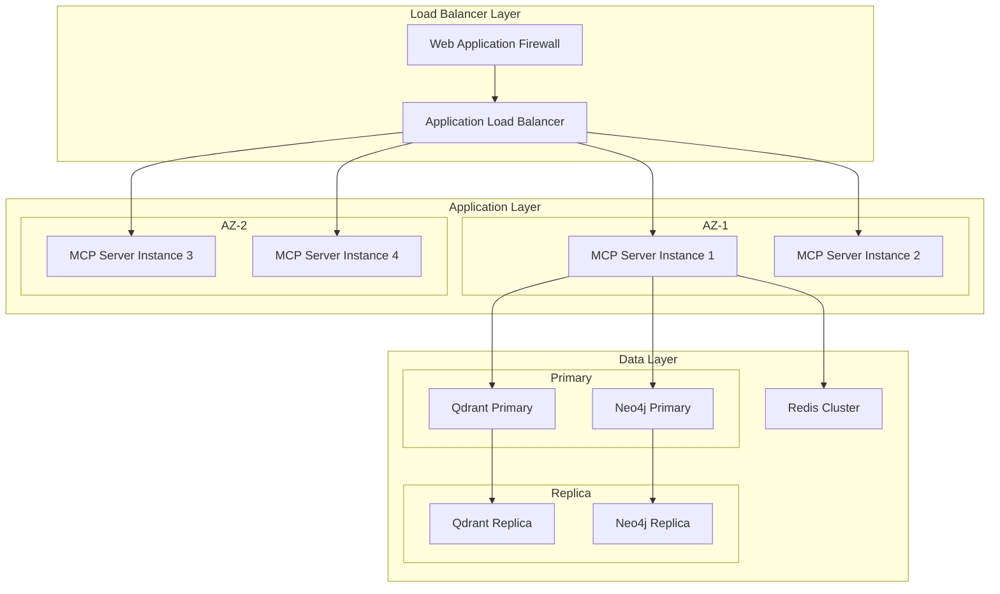

# Production Best Practices

[](https://github.com/BjornMelin/qdrant-neo4j-crawl4ai-mcp)
[](https://github.com/BjornMelin/qdrant-neo4j-crawl4ai-mcp)

> **Essential patterns and practices for deploying and operating the agentic RAG MCP server in production environments**

## 📖 Table of Contents

- [Infrastructure & Deployment](#-infrastructure--deployment)
- [Configuration Management](#-configuration-management)
- [Security & Authentication](#-security--authentication)
- [Performance & Scaling](#-performance--scaling)
- [Monitoring & Observability](#-monitoring--observability)
- [Data Management](#-data-management)
- [Operational Procedures](#-operational-procedures)
- [See Also](#-see-also)

## 🏗️ Infrastructure & Deployment

### Container Best Practices

```yaml
# Production Dockerfile patterns
FROM python:3.11-slim as builder
# Use multi-stage builds for smaller images
WORKDIR /app
COPY pyproject.toml uv.lock ./
RUN pip install uv && uv sync --frozen

FROM python:3.11-slim as runtime
WORKDIR /app
COPY --from=builder /app/.venv /app/.venv
COPY src/ ./src/
# Non-root user for security
RUN adduser --disabled-password --gecos '' appuser
USER appuser
EXPOSE 8000
HEALTHCHECK --interval=30s --timeout=10s --start-period=30s --retries=3 \
  CMD curl -f http://localhost:8000/health || exit 1
```

### Kubernetes Deployment Patterns

```yaml
# Production-ready Kubernetes configuration
apiVersion: apps/v1
kind: Deployment
metadata:
  name: qdrant-neo4j-crawl4ai-mcp
  labels:
    app: qdrant-neo4j-crawl4ai-mcp
    version: v1.0.0
    tier: backend
spec:
  replicas: 3
  strategy:
    type: RollingUpdate
    rollingUpdate:
      maxUnavailable: 1
      maxSurge: 1
  selector:
    matchLabels:
      app: qdrant-neo4j-crawl4ai-mcp
  template:
    metadata:
      labels:
        app: qdrant-neo4j-crawl4ai-mcp
        version: v1.0.0
    spec:
      securityContext:
        runAsNonRoot: true
        runAsUser: 1000
        fsGroup: 1000
      containers:
      - name: mcp-server
        image: qdrant-neo4j-crawl4ai-mcp:v1.0.0
        ports:
        - containerPort: 8000
          name: http
        env:
        - name: ENVIRONMENT
          value: "production"
        resources:
          requests:
            memory: "512Mi"
            cpu: "250m"
          limits:
            memory: "1Gi"
            cpu: "500m"
        livenessProbe:
          httpGet:
            path: /health
            port: 8000
          initialDelaySeconds: 30
          periodSeconds: 10
        readinessProbe:
          httpGet:
            path: /health/ready
            port: 8000
          initialDelaySeconds: 5
          periodSeconds: 5
        securityContext:
          allowPrivilegeEscalation: false
          readOnlyRootFilesystem: true
          capabilities:
            drop:
            - ALL
```

### High Availability Architecture



**Related**: [Architecture Overview](../ARCHITECTURE.md) | [Deployment Operations](../DEPLOYMENT_OPERATIONS.md)

## ⚙️ Configuration Management

### Environment-Based Configuration

```python
# Production configuration patterns
from pydantic import BaseSettings
from typing import Optional
import os

class ProductionConfig(BaseSettings):
    """Production-ready configuration with validation"""
    
    # Server Configuration
    host: str = "0.0.0.0"
    port: int = 8000
    workers: int = 4
    environment: str = "production"
    
    # Security
    jwt_secret_key: str
    cors_origins: list[str] = ["https://your-domain.com"]
    rate_limit_per_minute: int = 100
    
    # Database Configuration
    qdrant_url: str
    neo4j_uri: str
    neo4j_user: str
    neo4j_password: str
    redis_url: Optional[str] = None
    
    # Monitoring
    enable_metrics: bool = True
    log_level: str = "INFO"
    sentry_dsn: Optional[str] = None
    
    # Performance
    max_concurrent_requests: int = 100
    request_timeout: int = 30
    connection_pool_size: int = 20
    
    class Config:
        env_file = ".env"
        env_file_encoding = "utf-8"
        case_sensitive = False
        
    def __post_init__(self):
        """Validate production configuration"""
        if self.environment == "production":
            assert self.jwt_secret_key, "JWT secret required in production"
            assert len(self.jwt_secret_key) >= 32, "JWT secret must be at least 32 characters"
            assert self.sentry_dsn, "Sentry DSN required for production monitoring"

# Usage
config = ProductionConfig()
```

### Secrets Management

```yaml
# Kubernetes Secret Management
apiVersion: v1
kind: Secret
metadata:
  name: mcp-server-secrets
type: Opaque
stringData:
  jwt-secret-key: "${JWT_SECRET_KEY}"
  neo4j-password: "${NEO4J_PASSWORD}"
  sentry-dsn: "${SENTRY_DSN}"
---
apiVersion: v1
kind: ConfigMap
metadata:
  name: mcp-server-config
data:
  environment: "production"
  log-level: "INFO"
  rate-limit: "100"
  max-workers: "4"
```

**Related**: [Configuration Guide](../getting-started/configuration.md) | [Security Hardening](security-hardening.md)

## 🔒 Security & Authentication

### JWT Authentication Best Practices

```python
# Secure JWT implementation
from datetime import datetime, timedelta
from jose import JWTError, jwt
from passlib.context import CryptContext
import secrets

class SecurityManager:
    """Production-ready security management"""
    
    def __init__(self, secret_key: str):
        self.secret_key = secret_key
        self.algorithm = "HS256"
        self.pwd_context = CryptContext(schemes=["bcrypt"], deprecated="auto")
        
    def create_access_token(self, data: dict, expires_delta: timedelta = None):
        """Create secure access token with expiration"""
        to_encode = data.copy()
        
        if expires_delta:
            expire = datetime.utcnow() + expires_delta
        else:
            expire = datetime.utcnow() + timedelta(hours=1)
            
        to_encode.update({"exp": expire, "iat": datetime.utcnow()})
        
        # Add random jti (JWT ID) for token revocation
        to_encode["jti"] = secrets.token_urlsafe(16)
        
        return jwt.encode(to_encode, self.secret_key, algorithm=self.algorithm)
    
    def verify_token(self, token: str) -> dict:
        """Verify and decode JWT token"""
        try:
            payload = jwt.decode(token, self.secret_key, algorithms=[self.algorithm])
            return payload
        except JWTError:
            raise HTTPException(
                status_code=401,
                detail="Invalid authentication credentials",
                headers={"WWW-Authenticate": "Bearer"},
            )
```

### Rate Limiting Implementation

```python
# Production rate limiting
from slowapi import Limiter, _rate_limit_exceeded_handler
from slowapi.util import get_remote_address
from slowapi.errors import RateLimitExceeded
import redis

# Redis-backed rate limiting for multi-instance deployments
limiter = Limiter(
    key_func=get_remote_address,
    storage_uri="redis://redis:6379/0",
    default_limits=["1000/hour", "100/minute"]
)

app.state.limiter = limiter
app.add_exception_handler(RateLimitExceeded, _rate_limit_exceeded_handler)

@app.post("/vector/search")
@limiter.limit("10/minute")  # Endpoint-specific limits
async def vector_search(request: Request, query: VectorSearchRequest):
    """Rate-limited vector search endpoint"""
    pass
```

**Related**: [Security Configuration](../deployment/security.md) | [Authentication Setup](../getting-started/configuration.md#security-configuration)

## 🚀 Performance & Scaling

### Connection Pool Management

```python
# Efficient connection pooling
from qdrant_client import QdrantClient
from neo4j import GraphDatabase
import asyncio
import aioredis

class ConnectionManager:
    """Production connection pool management"""
    
    def __init__(self, config):
        self.config = config
        self._qdrant_client = None
        self._neo4j_driver = None
        self._redis_pool = None
    
    async def initialize(self):
        """Initialize all connection pools"""
        # Qdrant with connection pooling
        self._qdrant_client = QdrantClient(
            url=self.config.qdrant_url,
            timeout=30,
            # Connection pool settings
            pool_size=20,
            retries=3
        )
        
        # Neo4j with connection pooling
        self._neo4j_driver = GraphDatabase.driver(
            self.config.neo4j_uri,
            auth=(self.config.neo4j_user, self.config.neo4j_password),
            max_connection_lifetime=3600,
            max_connection_pool_size=50,
            connection_acquisition_timeout=30
        )
        
        # Redis connection pool
        self._redis_pool = aioredis.ConnectionPool.from_url(
            self.config.redis_url,
            max_connections=20,
            retry_on_timeout=True
        )
    
    async def close(self):
        """Gracefully close all connections"""
        if self._qdrant_client:
            self._qdrant_client.close()
        if self._neo4j_driver:
            await self._neo4j_driver.close()
        if self._redis_pool:
            await self._redis_pool.disconnect()
```

### Caching Strategy

```python
# Multi-layer caching implementation
import pickle
from typing import Any, Optional
from functools import wraps

class CacheManager:
    """Production caching with Redis backend"""
    
    def __init__(self, redis_pool):
        self.redis = redis_pool
        
    async def get(self, key: str) -> Optional[Any]:
        """Get cached value with error handling"""
        try:
            data = await self.redis.get(key)
            return pickle.loads(data) if data else None
        except Exception as e:
            logger.warning(f"Cache get error: {e}")
            return None
    
    async def set(self, key: str, value: Any, ttl: int = 3600):
        """Set cached value with TTL"""
        try:
            await self.redis.setex(key, ttl, pickle.dumps(value))
        except Exception as e:
            logger.warning(f"Cache set error: {e}")

def cache_result(ttl: int = 3600):
    """Decorator for caching function results"""
    def decorator(func):
        @wraps(func)
        async def wrapper(*args, **kwargs):
            # Generate cache key
            cache_key = f"{func.__name__}:{hash(str(args) + str(kwargs))}"
            
            # Try cache first
            cached = await cache_manager.get(cache_key)
            if cached is not None:
                return cached
            
            # Execute function and cache result
            result = await func(*args, **kwargs)
            await cache_manager.set(cache_key, result, ttl)
            return result
        return wrapper
    return decorator

# Usage
@cache_result(ttl=1800)  # 30-minute cache
async def vector_search(query: str, limit: int = 10):
    """Cached vector search"""
    return await qdrant_service.search(query, limit)
```

**Related**: [Performance Optimization](performance-optimization.md) | [System Architecture](../ARCHITECTURE.md)

## 📊 Monitoring & Observability

### Prometheus Metrics

```python
# Production metrics collection
from prometheus_client import Counter, Histogram, Gauge, CollectorRegistry
from prometheus_client.exposition import make_asgi_app
import time

# Custom metrics registry
REGISTRY = CollectorRegistry()

# Application metrics
REQUEST_COUNT = Counter(
    'mcp_requests_total',
    'Total requests by endpoint and status',
    ['endpoint', 'status'],
    registry=REGISTRY
)

REQUEST_DURATION = Histogram(
    'mcp_request_duration_seconds',
    'Request duration by endpoint',
    ['endpoint'],
    buckets=[0.1, 0.25, 0.5, 1.0, 2.5, 5.0, 10.0],
    registry=REGISTRY
)

ACTIVE_CONNECTIONS = Gauge(
    'mcp_active_connections',
    'Number of active connections',
    registry=REGISTRY
)

DATABASE_OPERATIONS = Counter(
    'mcp_database_operations_total',
    'Database operations by service and operation',
    ['service', 'operation', 'status'],
    registry=REGISTRY
)

# Middleware for automatic metrics collection
@app.middleware("http")
async def metrics_middleware(request: Request, call_next):
    start_time = time.time()
    
    response = await call_next(request)
    
    # Record metrics
    REQUEST_COUNT.labels(
        endpoint=request.url.path,
        status=response.status_code
    ).inc()
    
    REQUEST_DURATION.labels(
        endpoint=request.url.path
    ).observe(time.time() - start_time)
    
    return response

# Expose metrics endpoint
metrics_app = make_asgi_app(registry=REGISTRY)
app.mount("/metrics", metrics_app)
```

### Structured Logging

```python
# Production logging configuration
import structlog
import logging.config

LOGGING_CONFIG = {
    "version": 1,
    "disable_existing_loggers": False,
    "formatters": {
        "json": {
            "()": structlog.stdlib.ProcessorFormatter,
            "processor": structlog.processors.JSONRenderer(),
        },
    },
    "handlers": {
        "default": {
            "level": "INFO",
            "class": "logging.StreamHandler",
            "formatter": "json",
        },
    },
    "loggers": {
        "": {
            "handlers": ["default"],
            "level": "INFO",
            "propagate": True,
        },
    }
}

# Configure structured logging
logging.config.dictConfig(LOGGING_CONFIG)

structlog.configure(
    processors=[
        structlog.contextvars.merge_contextvars,
        structlog.processors.TimeStamper(fmt="iso"),
        structlog.processors.add_log_level,
        structlog.processors.StackInfoRenderer(),
        structlog.processors.JSONRenderer()
    ],
    wrapper_class=structlog.stdlib.BoundLogger,
    logger_factory=structlog.stdlib.LoggerFactory(),
    cache_logger_on_first_use=True,
)

# Usage with context
logger = structlog.get_logger()

async def vector_search(query: str, user_id: str):
    """Example with structured logging"""
    with structlog.contextvars.bound_contextvars(
        user_id=user_id,
        operation="vector_search",
        query_length=len(query)
    ):
        logger.info("Starting vector search")
        
        try:
            results = await qdrant_service.search(query)
            logger.info("Vector search completed", result_count=len(results))
            return results
        except Exception as e:
            logger.error("Vector search failed", error=str(e))
            raise
```

**Related**: [Monitoring & Observability](monitoring-observability.md) | [Troubleshooting](troubleshooting.md)

## 💾 Data Management

### Backup & Recovery

```bash
#!/bin/bash
# Production backup script

set -euo pipefail

BACKUP_DATE=$(date +%Y%m%d_%H%M%S)
BACKUP_DIR="/backups/${BACKUP_DATE}"

# Qdrant backup
echo "Creating Qdrant backup..."
kubectl exec -n mcp-server qdrant-0 -- \
  qdrant-cli backup create --backup-dir /tmp/backup
kubectl cp mcp-server/qdrant-0:/tmp/backup \
  "${BACKUP_DIR}/qdrant"

# Neo4j backup
echo "Creating Neo4j backup..."
kubectl exec -n mcp-server neo4j-0 -- \
  neo4j-admin backup --backup-dir=/tmp/backup \
  --database=neo4j --verbose
kubectl cp mcp-server/neo4j-0:/tmp/backup \
  "${BACKUP_DIR}/neo4j"

# Compress and upload to S3
echo "Compressing backup..."
tar -czf "${BACKUP_DIR}.tar.gz" -C /backups "${BACKUP_DATE}"

echo "Uploading to S3..."
aws s3 cp "${BACKUP_DIR}.tar.gz" \
  "s3://your-backup-bucket/mcp-server/${BACKUP_DATE}.tar.gz"

# Cleanup local backup
rm -rf "${BACKUP_DIR}" "${BACKUP_DIR}.tar.gz"

echo "Backup completed: ${BACKUP_DATE}"
```

### Data Retention Policies

```python
# Automated data cleanup
import asyncio
from datetime import datetime, timedelta

class DataRetentionManager:
    """Manage data retention policies"""
    
    def __init__(self, qdrant_client, neo4j_driver):
        self.qdrant = qdrant_client
        self.neo4j = neo4j_driver
        
    async def cleanup_old_data(self):
        """Run retention policies"""
        cutoff_date = datetime.utcnow() - timedelta(days=90)
        
        # Cleanup old vector embeddings
        await self._cleanup_vectors(cutoff_date)
        
        # Cleanup old graph nodes
        await self._cleanup_graph(cutoff_date)
        
        # Cleanup old web crawl cache
        await self._cleanup_web_cache(cutoff_date)
    
    async def _cleanup_vectors(self, cutoff_date: datetime):
        """Remove vectors older than cutoff date"""
        # Implementation for vector cleanup
        pass
    
    async def _cleanup_graph(self, cutoff_date: datetime):
        """Remove graph nodes older than cutoff date"""
        query = """
        MATCH (n) 
        WHERE n.created_at < $cutoff_date 
        AND NOT n:System
        DETACH DELETE n
        """
        
        async with self.neo4j.session() as session:
            await session.run(query, cutoff_date=cutoff_date.isoformat())

# Schedule cleanup
async def schedule_cleanup():
    retention_manager = DataRetentionManager(qdrant_client, neo4j_driver)
    
    while True:
        await retention_manager.cleanup_old_data()
        await asyncio.sleep(86400)  # Run daily
```

**Related**: [Data Architecture](../architecture/data-flow.md) | [Deployment Operations](../DEPLOYMENT_OPERATIONS.md)

## 🔄 Operational Procedures

### Health Checks

```python
# Comprehensive health monitoring
from fastapi import HTTPException
from enum import Enum

class HealthStatus(str, Enum):
    HEALTHY = "healthy"
    DEGRADED = "degraded"
    UNHEALTHY = "unhealthy"

class HealthChecker:
    """Production health monitoring"""
    
    def __init__(self, qdrant_client, neo4j_driver, redis_pool):
        self.qdrant = qdrant_client
        self.neo4j = neo4j_driver
        self.redis = redis_pool
    
    async def check_health(self) -> dict:
        """Comprehensive health check"""
        checks = {
            "qdrant": await self._check_qdrant(),
            "neo4j": await self._check_neo4j(),
            "redis": await self._check_redis(),
            "disk_space": await self._check_disk_space(),
            "memory": await self._check_memory()
        }
        
        # Determine overall status
        if all(check["status"] == HealthStatus.HEALTHY for check in checks.values()):
            overall_status = HealthStatus.HEALTHY
        elif any(check["status"] == HealthStatus.UNHEALTHY for check in checks.values()):
            overall_status = HealthStatus.UNHEALTHY
        else:
            overall_status = HealthStatus.DEGRADED
        
        return {
            "status": overall_status,
            "timestamp": datetime.utcnow().isoformat(),
            "checks": checks
        }
    
    async def _check_qdrant(self) -> dict:
        """Check Qdrant connectivity and performance"""
        try:
            start_time = time.time()
            collections = await self.qdrant.get_collections()
            response_time = time.time() - start_time
            
            return {
                "status": HealthStatus.HEALTHY,
                "response_time": response_time,
                "collections_count": len(collections.collections)
            }
        except Exception as e:
            return {
                "status": HealthStatus.UNHEALTHY,
                "error": str(e)
            }
    
    async def _check_neo4j(self) -> dict:
        """Check Neo4j connectivity and performance"""
        try:
            start_time = time.time()
            async with self.neo4j.session() as session:
                result = await session.run("RETURN 1 as test")
                await result.single()
            response_time = time.time() - start_time
            
            return {
                "status": HealthStatus.HEALTHY,
                "response_time": response_time
            }
        except Exception as e:
            return {
                "status": HealthStatus.UNHEALTHY,
                "error": str(e)
            }
```

### Graceful Shutdown

```python
# Production shutdown handling
import signal
import asyncio

class GracefulShutdown:
    """Handle graceful application shutdown"""
    
    def __init__(self, app, connection_manager):
        self.app = app
        self.connection_manager = connection_manager
        self.shutdown_event = asyncio.Event()
        
    def setup_signal_handlers(self):
        """Setup signal handlers for graceful shutdown"""
        signal.signal(signal.SIGTERM, self._signal_handler)
        signal.signal(signal.SIGINT, self._signal_handler)
    
    def _signal_handler(self, signum, frame):
        """Handle shutdown signals"""
        logger.info(f"Received signal {signum}, initiating graceful shutdown")
        asyncio.create_task(self._shutdown())
    
    async def _shutdown(self):
        """Perform graceful shutdown"""
        logger.info("Starting graceful shutdown...")
        
        # Stop accepting new requests
        self.shutdown_event.set()
        
        # Wait for active requests to complete (max 30 seconds)
        await asyncio.sleep(5)
        
        # Close database connections
        await self.connection_manager.close()
        
        # Close other resources
        await self.app.router.shutdown()
        
        logger.info("Graceful shutdown completed")

# Usage in application startup
@app.on_event("startup")
async def startup_event():
    shutdown_handler = GracefulShutdown(app, connection_manager)
    shutdown_handler.setup_signal_handlers()
```

**Related**: [Deployment Operations](../DEPLOYMENT_OPERATIONS.md) | [Monitoring Setup](monitoring-observability.md)

## 📋 Deployment Checklist

### Pre-Production Checklist

- [ ] **Security Configuration**
  - [ ] JWT secrets configured and rotated
  - [ ] Rate limiting configured appropriately
  - [ ] CORS origins restricted to production domains
  - [ ] TLS/SSL certificates configured
  - [ ] Security headers enabled

- [ ] **Infrastructure Setup**
  - [ ] High availability deployment (minimum 3 replicas)
  - [ ] Auto-scaling configured (HPA/VPA)
  - [ ] Load balancer configured with health checks
  - [ ] Persistent storage configured for databases
  - [ ] Backup procedures tested

- [ ] **Monitoring & Alerting**
  - [ ] Prometheus metrics configured
  - [ ] Grafana dashboards deployed
  - [ ] Alert rules configured
  - [ ] Log aggregation setup (ELK/Loki)
  - [ ] Error tracking configured (Sentry)

- [ ] **Database Configuration**
  - [ ] Connection pooling optimized
  - [ ] Backup procedures automated
  - [ ] Data retention policies configured
  - [ ] Performance monitoring enabled
  - [ ] Replication configured (if applicable)

- [ ] **Performance Optimization**
  - [ ] Caching layers configured
  - [ ] Connection limits optimized
  - [ ] Resource limits set appropriately
  - [ ] Load testing completed
  - [ ] Performance baselines established

### Go-Live Checklist

- [ ] **Final Testing**
  - [ ] End-to-end testing in production environment
  - [ ] Load testing with production-like traffic
  - [ ] Disaster recovery procedures tested
  - [ ] Rollback procedures verified

- [ ] **Team Readiness**
  - [ ] On-call rotation established
  - [ ] Runbooks documented and accessible
  - [ ] Team trained on monitoring tools
  - [ ] Incident response procedures defined

- [ ] **Communication**
  - [ ] Stakeholders notified of go-live timeline
  - [ ] Communication channels established
  - [ ] Status page configured (if applicable)
  - [ ] Documentation accessible to support team

## 🆘 See Also

### Essential Reading
- **[Architecture Overview](../ARCHITECTURE.md)** - Understand the system design
- **[Security Hardening](security-hardening.md)** - Comprehensive security practices
- **[Performance Optimization](performance-optimization.md)** - Advanced performance tuning
- **[Monitoring & Observability](monitoring-observability.md)** - Production monitoring setup

### Quick References
- **[Configuration Guide](../getting-started/configuration.md)** - Environment setup
- **[Troubleshooting Guide](troubleshooting.md)** - Problem resolution
- **[API Reference](../API_REFERENCE.md)** - Complete API documentation
- **[Deployment Operations](../DEPLOYMENT_OPERATIONS.md)** - Production deployment

### Advanced Topics
- **[Customization Guide](customization.md)** - Extending the system
- **[Migration Guide](migration.md)** - Upgrade procedures
- **[Architecture Decision Records](../adrs/README.md)** - Design decisions

---

**Next**: [Performance Optimization →](performance-optimization.md)  
**Previous**: [← Guides Overview](README.md)

**Last Updated**: June 27, 2025 | **Version**: 1.0.0 | **Status**: Production Ready