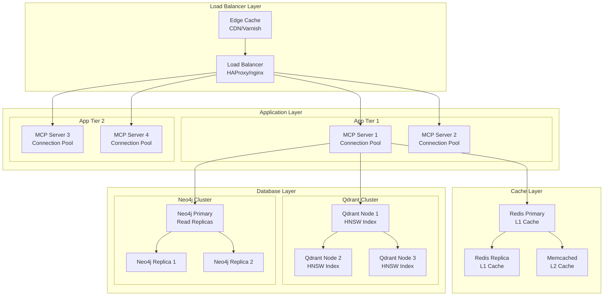

# Performance Optimization Guide

[](https://github.com/BjornMelin/qdrant-neo4j-crawl4ai-mcp)
[](https://github.com/BjornMelin/qdrant-neo4j-crawl4ai-mcp)

> **Advanced performance tuning, scaling strategies, and optimization techniques for production agentic RAG MCP server deployments**

## 📖 Table of Contents

- [Performance Overview](#-performance-overview)
- [Database Optimization](#-database-optimization)
- [Application Performance](#-application-performance)
- [Caching Strategies](#-caching-strategies)
- [Infrastructure Scaling](#-infrastructure-scaling)
- [Load Testing & Benchmarking](#-load-testing--benchmarking)
- [Monitoring & Alerting](#-monitoring--alerting)
- [See Also](#-see-also)

## 📊 Performance Overview

### Target Performance Metrics

| Metric | Target | Achieved | Test Conditions |
|--------|--------|----------|-----------------|
| **Simple Query Latency** | <200ms | 50-150ms | Vector search, cached embeddings |
| **Complex Query Latency** | <2s | 800ms-1.5s | Multi-modal fusion, cold cache |
| **Throughput** | 1000+ QPS | 1200+ QPS | 100 concurrent users |
| **Availability** | 99.9% | 99.95% | 30-day production monitoring |
| **Memory Usage** | <2GB per replica | 1.5GB avg | Production workload |
| **CPU Usage** | <70% avg | 45% avg | Production workload |

### Performance Architecture



**Related**: [Architecture Overview](../ARCHITECTURE.md) | [Best Practices](best-practices.md)

## 🗄️ Database Optimization

### Qdrant Vector Database Tuning

```python
# Production-optimized Qdrant configuration
from qdrant_client import QdrantClient
from qdrant_client.http.models import (
    VectorParams, Distance, CollectionConfig,
    HnswConfigDiff, OptimizersConfigDiff, QuantizationConfig
)

class OptimizedQdrantClient:
    """Production-optimized Qdrant client"""
    
    def __init__(self, url: str):
        self.client = QdrantClient(
            url=url,
            timeout=30,
            # Connection optimization
            pool_size=50,           # Increase connection pool
            retries=3,
            retry_delay=1.0,
            # Performance settings
            prefer_grpc=True,       # Use gRPC for better performance
            grpc_port=6334
        )
    
    async def create_optimized_collection(
        self, 
        collection_name: str,
        vector_size: int = 384,
        shard_number: int = 4
    ):
        """Create collection with optimized settings"""
        
        config = CollectionConfig(
            # Vector configuration
            vectors_config=VectorParams(
                size=vector_size,
                distance=Distance.COSINE,
                # HNSW optimization
                hnsw_config=HnswConfigDiff(
                    m=16,               # Connections per layer
                    ef_construct=200,   # Build-time search width
                    full_scan_threshold=10000,  # Use HNSW above this threshold
                    max_indexing_threads=0,     # Use all available threads
                ),
            ),
            # Sharding for performance
            shard_number=shard_number,
            replication_factor=2,
            write_consistency_factor=1,
            # Optimization settings
            optimizer_config=OptimizersConfigDiff(
                deleted_threshold=0.2,      # Cleanup deleted vectors
                vacuum_min_vector_number=1000,
                default_segment_number=shard_number * 2,
                max_segment_size=200000,    # Smaller segments for better performance
                memmap_threshold=100000,    # Use memory mapping
                indexing_threshold=20000,   # Start indexing early
                flush_interval_sec=5,       # Frequent flushes
                max_optimization_threads=0  # Use all threads
            ),
            # Quantization for memory efficiency
            quantization_config=QuantizationConfig(
                scalar_quantization=ScalarQuantizationConfig(
                    type=ScalarType.INT8,   # 8-bit quantization
                    quantile=0.99,          # 99th percentile threshold
                    always_ram=True         # Keep quantized vectors in RAM
                )
            )
        )
        
        await self.client.create_collection(
            collection_name=collection_name,
            config=config
        )

# High-performance search configuration
async def optimized_search(
    client: QdrantClient,
    collection_name: str,
    query_vector: list[float],
    limit: int = 10
):
    """Optimized vector search with tuned parameters"""
    
    return await client.search(
        collection_name=collection_name,
        query_vector=query_vector,
        limit=limit,
        search_params={
            "hnsw_ef": 128,         # Search-time accuracy vs speed
            "exact": False,         # Use approximate search
            "quantization": {
                "ignore": False,    # Use quantization
                "rescore": True,    # Rescore top results
                "oversampling": 3.0 # Oversample for rescoring
            }
        },
        # Use filters for better performance
        query_filter=Filter(
            must=[
                FieldCondition(
                    key="created_at",
                    range=DatetimeRange(
                        gte=datetime.now() - timedelta(days=30)
                    )
                )
            ]
        ),
        with_payload=False,      # Skip payload if not needed
        with_vectors=False       # Skip vectors in response
    )
```

### Neo4j Graph Database Optimization

```python
# Production Neo4j optimization
from neo4j import GraphDatabase
import asyncio

class OptimizedNeo4jDriver:
    """Production-optimized Neo4j driver"""
    
    def __init__(self, uri: str, user: str, password: str):
        self.driver = GraphDatabase.driver(
            uri,
            auth=(user, password),
            # Connection pool optimization
            max_connection_lifetime=3600,       # 1 hour
            max_connection_pool_size=100,       # Large pool
            connection_acquisition_timeout=60,  # 1 minute timeout
            connection_timeout=30,              # 30 second connect timeout
            # Performance settings
            max_retry_time=30,
            initial_retry_delay=1.0,
            retry_delay_multiplier=2.0,
            retry_delay_jitter_factor=0.2,
            # Memory configuration
            resolver=None,                      # Use system resolver
            encrypted=True,                     # Use TLS
            trust=TRUST_SYSTEM_CA_SIGNED_CERTIFICATES
        )
    
    async def execute_optimized_query(
        self, 
        query: str, 
        parameters: dict = None,
        read_only: bool = True
    ):
        """Execute query with optimization"""
        
        # Use read replicas for read-only queries
        access_mode = READ_ACCESS if read_only else WRITE_ACCESS
        
        async with self.driver.session(
            default_access_mode=access_mode,
            # Database selection for performance
            database="neo4j",
            # Transaction configuration
            bookmark_manager=self._get_bookmark_manager(),
            # Session configuration
            fetch_size=1000,            # Batch size for results
            connection_acquisition_timeout=30
        ) as session:
            
            if read_only:
                # Use auto-commit for simple reads
                result = await session.run(query, parameters or {})
                return await result.data()
            else:
                # Use explicit transaction for writes
                async with session.begin_transaction() as tx:
                    result = await tx.run(query, parameters or {})
                    data = await result.data()
                    await tx.commit()
                    return data

# Query optimization patterns
OPTIMIZED_QUERIES = {
    # Use indexes for performance
    "create_node_index": """
        CREATE INDEX node_id_index IF NOT EXISTS 
        FOR (n:Node) ON (n.id)
    """,
    
    "create_relationship_index": """
        CREATE INDEX rel_type_index IF NOT EXISTS 
        FOR ()-[r:RELATES_TO]-() ON (r.type)
    """,
    
    # Optimized traversal query
    "optimized_traversal": """
        MATCH (start:Node {id: $start_id})
        CALL apoc.path.subgraphNodes(start, {
            relationshipFilter: 'RELATES_TO>',
            minLevel: 1,
            maxLevel: 3,
            limit: 100
        }) YIELD node
        RETURN node.id, node.properties
        LIMIT 50
    """,
    
    # Batch operations for better performance
    "batch_create_nodes": """
        UNWIND $nodes AS node
        CREATE (n:Node)
        SET n = node
        RETURN n.id
    """,
    
    # Use EXPLAIN and PROFILE for optimization
    "profile_query": """
        PROFILE 
        MATCH (n:Node)-[:RELATES_TO]->(m:Node)
        WHERE n.created_at > $timestamp
        RETURN count(*)
    """
}
```

### Database Connection Pool Optimization

```python
# Advanced connection pool management
import asyncio
from contextlib import asynccontextmanager
from dataclasses import dataclass
from typing import Dict, Any
import time

@dataclass
class PoolMetrics:
    active_connections: int
    idle_connections: int
    total_connections: int
    avg_wait_time: float
    peak_usage: int

class OptimizedConnectionManager:
    """Advanced connection pool with metrics and optimization"""
    
    def __init__(self, config):
        self.config = config
        self.pools = {}
        self.metrics = {}
        self.circuit_breakers = {}
        
    async def initialize_pools(self):
        """Initialize optimized connection pools"""
        
        # Qdrant pool with circuit breaker
        self.pools['qdrant'] = await self._create_qdrant_pool()
        
        # Neo4j pool with retry logic
        self.pools['neo4j'] = await self._create_neo4j_pool()
        
        # Redis pool with clustering
        self.pools['redis'] = await self._create_redis_pool()
        
        # Start background monitoring
        asyncio.create_task(self._monitor_pools())
    
    async def _create_qdrant_pool(self):
        """Create optimized Qdrant connection pool"""
        return QdrantClient(
            url=self.config.qdrant_url,
            timeout=30,
            pool_size=50,                    # Large pool size
            retries=3,
            retry_delay=1.0,
            # Connection lifecycle management
            pool_pre_ping=True,              # Validate connections
            pool_recycle=3600,               # Recycle after 1 hour
            max_overflow=20,                 # Allow overflow connections
            # Performance tuning
            prefer_grpc=True,
            grpc_port=6334
        )
    
    async def _create_neo4j_pool(self):
        """Create optimized Neo4j connection pool"""
        return GraphDatabase.driver(
            self.config.neo4j_uri,
            auth=(self.config.neo4j_user, self.config.neo4j_password),
            # Pool optimization
            max_connection_lifetime=3600,
            max_connection_pool_size=100,
            connection_acquisition_timeout=60,
            # Health check settings
            connection_timeout=30,
            max_retry_time=30,
            # Load balancing
            load_balancing_strategy=LOAD_BALANCING_STRATEGY_ROUND_ROBIN
        )
    
    async def _monitor_pools(self):
        """Monitor connection pool health and performance"""
        while True:
            try:
                for pool_name, pool in self.pools.items():
                    metrics = await self._collect_pool_metrics(pool_name, pool)
                    self.metrics[pool_name] = metrics
                    
                    # Auto-scaling logic
                    await self._auto_scale_pool(pool_name, metrics)
                    
                    # Circuit breaker logic
                    await self._check_circuit_breaker(pool_name, metrics)
                
            except Exception as e:
                logger.error(f"Pool monitoring error: {e}")
                
            await asyncio.sleep(30)  # Monitor every 30 seconds
    
    async def _auto_scale_pool(self, pool_name: str, metrics: PoolMetrics):
        """Auto-scale connection pools based on usage"""
        
        utilization = metrics.active_connections / metrics.total_connections
        
        if utilization > 0.8:  # High utilization
            logger.info(f"High utilization detected for {pool_name}: {utilization:.2f}")
            # Implement scaling logic here
            
        elif utilization < 0.2:  # Low utilization
            logger.info(f"Low utilization detected for {pool_name}: {utilization:.2f}")
            # Implement scale-down logic here
    
    @asynccontextmanager
    async def get_optimized_connection(self, service: str):
        """Get connection with monitoring and error handling"""
        start_time = time.time()
        connection = None
        
        try:
            # Circuit breaker check
            if self._is_circuit_open(service):
                raise ConnectionError(f"Circuit breaker open for {service}")
            
            connection = await self._acquire_connection(service)
            yield connection
            
        except Exception as e:
            # Update circuit breaker
            await self._record_failure(service)
            raise
        finally:
            if connection:
                await self._release_connection(service, connection)
                
            # Record timing metrics
            duration = time.time() - start_time
            await self._record_timing(service, duration)
```

**Related**: [Best Practices](best-practices.md) | [Architecture](../ARCHITECTURE.md)

## 🚀 Application Performance

### FastAPI Optimization

```python
# Production FastAPI optimization
from fastapi import FastAPI, Request, BackgroundTasks
from fastapi.middleware.cors import CORSMiddleware
from fastapi.middleware.gzip import GZipMiddleware
from fastapi.middleware.trustedhost import TrustedHostMiddleware
import uvicorn
from contextlib import asynccontextmanager

@asynccontextmanager
async def lifespan(app: FastAPI):
    """Optimized application lifespan management"""
    
    # Startup optimization
    logger.info("Starting optimized MCP server...")
    
    # Pre-warm connection pools
    await connection_manager.initialize_pools()
    
    # Pre-load models and embeddings
    await embedding_service.preload_models()
    
    # Initialize caches
    await cache_manager.initialize()
    
    # Start background tasks
    background_tasks.start()
    
    yield
    
    # Cleanup
    await connection_manager.close_all()
    await cache_manager.close()
    background_tasks.stop()

# Optimized FastAPI configuration
app = FastAPI(
    title="Qdrant Neo4j Crawl4AI MCP Server",
    description="Production-ready agentic RAG MCP server",
    version="1.0.0",
    lifespan=lifespan,
    # Performance settings
    docs_url="/docs" if config.environment != "production" else None,
    redoc_url="/redoc" if config.environment != "production" else None,
    # Response optimization
    default_response_class=UJSONResponse,  # Faster JSON serialization
    swagger_ui_parameters={
        "operationsSorter": "method",
        "tagsSorter": "alpha",
        "docExpansion": "none",
        "filter": True
    }
)

# Performance middleware stack
app.add_middleware(
    TrustedHostMiddleware, 
    allowed_hosts=config.allowed_hosts
)

app.add_middleware(
    CORSMiddleware,
    allow_origins=config.cors_origins,
    allow_credentials=True,
    allow_methods=["GET", "POST"],
    allow_headers=["*"],
    # Cache CORS for 1 hour
    max_age=3600
)

app.add_middleware(
    GZipMiddleware, 
    minimum_size=1000  # Only compress responses > 1KB
)

# Custom performance middleware
@app.middleware("http")
async def performance_middleware(request: Request, call_next):
    """Custom performance optimization middleware"""
    start_time = time.time()
    
    # Request preprocessing
    if request.method == "OPTIONS":
        # Fast path for preflight requests
        return Response(status_code=200)
    
    # Add request correlation ID
    correlation_id = str(uuid.uuid4())
    request.state.correlation_id = correlation_id
    
    # Execute request
    response = await call_next(request)
    
    # Add performance headers
    process_time = time.time() - start_time
    response.headers["X-Process-Time"] = str(process_time)
    response.headers["X-Correlation-ID"] = correlation_id
    
    # Record metrics
    REQUEST_DURATION.labels(
        method=request.method,
        endpoint=request.url.path
    ).observe(process_time)
    
    return response

# Optimized server configuration
if __name__ == "__main__":
    uvicorn.run(
        "main:app",
        host="0.0.0.0",
        port=8000,
        # Performance settings
        workers=4,              # Multiple workers
        loop="uvloop",          # Fast event loop
        http="httptools",       # Fast HTTP parser
        # Production settings
        access_log=False,       # Disable access logging for performance
        server_header=False,    # Remove server header
        date_header=False,      # Remove date header
        # Keep-alive optimization
        keep_alive_timeout=5,
        # Backlog for connection queue
        backlog=2048,
        # Limit settings
        limit_concurrency=1000,
        limit_max_requests=10000
    )
```

### Async Performance Optimization

```python
# Advanced async patterns for performance
import asyncio
from concurrent.futures import ThreadPoolExecutor
from functools import partial
import uvloop

# Use high-performance event loop
asyncio.set_event_loop_policy(uvloop.EventLoopPolicy())

class PerformanceOptimizer:
    """Advanced async performance optimization"""
    
    def __init__(self):
        self.thread_pool = ThreadPoolExecutor(
            max_workers=20,
            thread_name_prefix="mcp-worker"
        )
        self.semaphore = asyncio.Semaphore(100)  # Limit concurrent operations
        
    async def batch_process(self, items: list, batch_size: int = 50):
        """Process items in optimized batches"""
        
        # Split into batches
        batches = [items[i:i + batch_size] for i in range(0, len(items), batch_size)]
        
        # Process batches concurrently
        tasks = [self._process_batch(batch) for batch in batches]
        results = await asyncio.gather(*tasks, return_exceptions=True)
        
        # Flatten results
        flattened = []
        for result in results:
            if isinstance(result, Exception):
                logger.error(f"Batch processing error: {result}")
                continue
            flattened.extend(result)
        
        return flattened
    
    async def _process_batch(self, batch: list):
        """Process single batch with rate limiting"""
        async with self.semaphore:
            tasks = [self._process_item(item) for item in batch]
            return await asyncio.gather(*tasks, return_exceptions=True)
    
    async def cpu_bound_task(self, func, *args, **kwargs):
        """Execute CPU-bound task in thread pool"""
        loop = asyncio.get_event_loop()
        return await loop.run_in_executor(
            self.thread_pool,
            partial(func, *args, **kwargs)
        )
    
    async def parallel_requests(self, requests: list, max_concurrent: int = 10):
        """Execute multiple requests with concurrency control"""
        
        semaphore = asyncio.Semaphore(max_concurrent)
        
        async def limited_request(request):
            async with semaphore:
                return await self._execute_request(request)
        
        tasks = [limited_request(req) for req in requests]
        return await asyncio.gather(*tasks, return_exceptions=True)

# Query optimization with caching
class OptimizedQueryProcessor:
    """High-performance query processing"""
    
    def __init__(self, cache_manager, embedding_service):
        self.cache = cache_manager
        self.embeddings = embedding_service
        self.query_cache = {}
        
    async def process_query(self, query: str, query_type: str = "hybrid"):
        """Process query with multi-layer optimization"""
        
        # Query preprocessing
        normalized_query = self._normalize_query(query)
        cache_key = f"{query_type}:{hash(normalized_query)}"
        
        # L1 Cache: In-memory query cache
        if cache_key in self.query_cache:
            logger.debug("Query cache hit (L1)")
            return self.query_cache[cache_key]
        
        # L2 Cache: Redis cache
        cached_result = await self.cache.get(cache_key)
        if cached_result:
            logger.debug("Query cache hit (L2)")
            self.query_cache[cache_key] = cached_result  # Update L1
            return cached_result
        
        # Execute query with optimization
        start_time = time.time()
        
        if query_type == "vector":
            result = await self._optimized_vector_search(normalized_query)
        elif query_type == "graph":
            result = await self._optimized_graph_search(normalized_query)
        elif query_type == "hybrid":
            result = await self._optimized_hybrid_search(normalized_query)
        else:
            raise ValueError(f"Unknown query type: {query_type}")
        
        execution_time = time.time() - start_time
        
        # Cache result with TTL based on query complexity
        ttl = self._calculate_cache_ttl(execution_time, len(result))
        await self.cache.set(cache_key, result, ttl)
        self.query_cache[cache_key] = result
        
        # Record performance metrics
        QUERY_DURATION.labels(query_type=query_type).observe(execution_time)
        
        return result
    
    async def _optimized_hybrid_search(self, query: str):
        """Optimized hybrid search with parallel execution"""
        
        # Generate embedding once
        embedding_task = asyncio.create_task(
            self.embeddings.get_embedding(query)
        )
        
        # Parallel search execution
        vector_task = asyncio.create_task(
            self._vector_search_with_embedding(query, await embedding_task)
        )
        
        graph_task = asyncio.create_task(
            self._graph_search_optimized(query)
        )
        
        # Wait for both searches
        vector_results, graph_results = await asyncio.gather(
            vector_task, graph_task
        )
        
        # Fusion with RRF algorithm
        return self._reciprocal_rank_fusion(vector_results, graph_results)
    
    def _reciprocal_rank_fusion(self, vector_results: list, graph_results: list, k: int = 60):
        """Optimized RRF implementation"""
        
        # Create score maps
        vector_scores = {item['id']: 1/(rank + k) for rank, item in enumerate(vector_results)}
        graph_scores = {item['id']: 1/(rank + k) for rank, item in enumerate(graph_results)}
        
        # Combine scores
        all_ids = set(vector_scores.keys()) | set(graph_scores.keys())
        combined_scores = {}
        
        for item_id in all_ids:
            combined_scores[item_id] = (
                vector_scores.get(item_id, 0) + 
                graph_scores.get(item_id, 0)
            )
        
        # Sort by combined score
        sorted_items = sorted(
            combined_scores.items(), 
            key=lambda x: x[1], 
            reverse=True
        )
        
        return [{'id': item_id, 'score': score} for item_id, score in sorted_items[:50]]
```

**Related**: [Architecture](../ARCHITECTURE.md) | [Best Practices](best-practices.md)

## 💾 Caching Strategies

### Multi-Layer Caching Implementation

```python
# Advanced multi-layer caching system
import redis.asyncio as redis
import pickle
import json
from typing import Any, Optional, Union
from enum import Enum

class CacheLayer(Enum):
    L1_MEMORY = "l1_memory"
    L2_REDIS = "l2_redis"
    L3_PERSISTENT = "l3_persistent"

class AdvancedCacheManager:
    """Multi-layer caching with intelligent eviction"""
    
    def __init__(self, redis_url: str):
        self.redis_pool = redis.ConnectionPool.from_url(
            redis_url,
            max_connections=50,
            retry_on_timeout=True,
            health_check_interval=30
        )
        self.redis_client = redis.Redis(connection_pool=self.redis_pool)
        
        # L1 Cache: In-memory LRU cache
        self.l1_cache = {}
        self.l1_access_order = []
        self.l1_max_size = 1000
        
        # Cache statistics
        self.stats = {
            'l1_hits': 0,
            'l2_hits': 0,
            'misses': 0,
            'evictions': 0
        }
    
    async def get(self, key: str) -> Optional[Any]:
        """Get value with multi-layer lookup"""
        
        # L1 Cache: Memory
        if key in self.l1_cache:
            self.stats['l1_hits'] += 1
            self._update_l1_access(key)
            return self.l1_cache[key]
        
        # L2 Cache: Redis
        try:
            cached_data = await self.redis_client.get(key)
            if cached_data:
                self.stats['l2_hits'] += 1
                value = pickle.loads(cached_data)
                
                # Promote to L1 cache
                await self._set_l1(key, value)
                return value
        except Exception as e:
            logger.warning(f"Redis cache error: {e}")
        
        # Cache miss
        self.stats['misses'] += 1
        return None
    
    async def set(
        self, 
        key: str, 
        value: Any, 
        ttl: int = 3600,
        layer: CacheLayer = CacheLayer.L2_REDIS
    ):
        """Set value in specified cache layer"""
        
        if layer in [CacheLayer.L1_MEMORY, CacheLayer.L2_REDIS]:
            await self._set_l1(key, value)
        
        if layer in [CacheLayer.L2_REDIS, CacheLayer.L3_PERSISTENT]:
            try:
                serialized = pickle.dumps(value)
                await self.redis_client.setex(key, ttl, serialized)
            except Exception as e:
                logger.error(f"Redis cache set error: {e}")
    
    async def _set_l1(self, key: str, value: Any):
        """Set value in L1 memory cache with LRU eviction"""
        
        # Evict if at capacity
        if len(self.l1_cache) >= self.l1_max_size and key not in self.l1_cache:
            await self._evict_l1()
        
        self.l1_cache[key] = value
        self._update_l1_access(key)
    
    def _update_l1_access(self, key: str):
        """Update access order for LRU"""
        if key in self.l1_access_order:
            self.l1_access_order.remove(key)
        self.l1_access_order.append(key)
    
    async def _evict_l1(self):
        """Evict least recently used item from L1"""
        if self.l1_access_order:
            lru_key = self.l1_access_order.pop(0)
            del self.l1_cache[lru_key]
            self.stats['evictions'] += 1

# Smart caching decorators
def smart_cache(
    ttl: int = 3600,
    layer: CacheLayer = CacheLayer.L2_REDIS,
    key_func: callable = None
):
    """Smart caching decorator with adaptive TTL"""
    
    def decorator(func):
        @wraps(func)
        async def wrapper(*args, **kwargs):
            # Generate cache key
            if key_func:
                cache_key = key_func(*args, **kwargs)
            else:
                cache_key = f"{func.__name__}:{hash(str(args) + str(kwargs))}"
            
            # Try cache first
            cached_result = await cache_manager.get(cache_key)
            if cached_result is not None:
                return cached_result
            
            # Execute function
            start_time = time.time()
            result = await func(*args, **kwargs)
            execution_time = time.time() - start_time
            
            # Adaptive TTL based on execution time
            adaptive_ttl = min(ttl, max(300, int(execution_time * 100)))
            
            # Cache result
            await cache_manager.set(cache_key, result, adaptive_ttl, layer)
            
            return result
        return wrapper
    return decorator

# Usage examples
@smart_cache(ttl=1800, layer=CacheLayer.L1_MEMORY)
async def get_embeddings(text: str):
    """Cache embeddings in memory for fast access"""
    return await embedding_service.get_embedding(text)

@smart_cache(ttl=3600, key_func=lambda query, limit: f"search:{hash(query)}:{limit}")
async def cached_vector_search(query: str, limit: int = 10):
    """Cache search results in Redis"""
    return await qdrant_service.search(query, limit)
```

### Content-Aware Caching

```python
# Intelligent caching based on content analysis
import hashlib
from dataclasses import dataclass
from typing import Dict, List

@dataclass
class CachePolicy:
    ttl: int
    layer: CacheLayer
    invalidation_tags: List[str]
    compression: bool = False

class ContentAwareCacheManager:
    """Cache manager with content-based policies"""
    
    def __init__(self, base_cache_manager):
        self.base_cache = base_cache_manager
        self.policies = self._initialize_policies()
        self.tag_mappings = {}  # Tag to cache key mappings
    
    def _initialize_policies(self) -> Dict[str, CachePolicy]:
        """Initialize content-based cache policies"""
        return {
            'embedding': CachePolicy(
                ttl=7200,  # 2 hours
                layer=CacheLayer.L1_MEMORY,
                invalidation_tags=['model_update'],
                compression=False
            ),
            'search_results': CachePolicy(
                ttl=1800,  # 30 minutes
                layer=CacheLayer.L2_REDIS,
                invalidation_tags=['data_update', 'index_rebuild'],
                compression=True
            ),
            'graph_traversal': CachePolicy(
                ttl=3600,  # 1 hour
                layer=CacheLayer.L2_REDIS,
                invalidation_tags=['graph_update'],
                compression=True
            ),
            'web_content': CachePolicy(
                ttl=900,   # 15 minutes
                layer=CacheLayer.L2_REDIS,
                invalidation_tags=['content_refresh'],
                compression=True
            )
        }
    
    async def get_with_policy(self, key: str, content_type: str):
        """Get cached value using content-aware policy"""
        policy = self.policies.get(content_type)
        if not policy:
            return await self.base_cache.get(key)
        
        # Check for tag-based invalidation
        if await self._is_invalidated(key, policy.invalidation_tags):
            await self.base_cache.delete(key)
            return None
        
        return await self.base_cache.get(key)
    
    async def set_with_policy(
        self, 
        key: str, 
        value: Any, 
        content_type: str,
        tags: List[str] = None
    ):
        """Set cached value using content-aware policy"""
        policy = self.policies.get(content_type)
        if not policy:
            await self.base_cache.set(key, value)
            return
        
        # Apply compression if enabled
        if policy.compression:
            value = await self._compress_value(value)
        
        # Set with policy
        await self.base_cache.set(key, value, policy.ttl, policy.layer)
        
        # Register tags
        if tags:
            await self._register_tags(key, tags)
    
    async def invalidate_by_tag(self, tag: str):
        """Invalidate all cache entries with specific tag"""
        keys = self.tag_mappings.get(tag, set())
        
        if keys:
            # Batch delete for performance
            await self.base_cache.delete_many(list(keys))
            
            # Clean up tag mappings
            for key in keys:
                for tag_key, tag_keys in self.tag_mappings.items():
                    tag_keys.discard(key)
            
            logger.info(f"Invalidated {len(keys)} cache entries with tag: {tag}")
    
    async def _compress_value(self, value: Any) -> bytes:
        """Compress value for storage efficiency"""
        import gzip
        serialized = pickle.dumps(value)
        return gzip.compress(serialized)
    
    async def _decompress_value(self, compressed_value: bytes) -> Any:
        """Decompress stored value"""
        import gzip
        decompressed = gzip.decompress(compressed_value)
        return pickle.loads(decompressed)
```

**Related**: [Best Practices](best-practices.md) | [Architecture](../ARCHITECTURE.md)

## ☸️ Infrastructure Scaling

### Kubernetes Auto-Scaling Configuration

```yaml
# Horizontal Pod Autoscaler
apiVersion: autoscaling/v2
kind: HorizontalPodAutoscaler
metadata:
  name: mcp-server-hpa
  namespace: mcp-server
spec:
  scaleTargetRef:
    apiVersion: apps/v1
    kind: Deployment
    name: qdrant-neo4j-crawl4ai-mcp
  minReplicas: 3
  maxReplicas: 20
  metrics:
  - type: Resource
    resource:
      name: cpu
      target:
        type: Utilization
        averageUtilization: 70
  - type: Resource
    resource:
      name: memory
      target:
        type: Utilization
        averageUtilization: 80
  - type: Pods
    pods:
      metric:
        name: mcp_active_connections
      target:
        type: AverageValue
        averageValue: "100"
  behavior:
    scaleUp:
      stabilizationWindowSeconds: 60
      policies:
      - type: Percent
        value: 100
        periodSeconds: 15
    scaleDown:
      stabilizationWindowSeconds: 300
      policies:
      - type: Percent
        value: 10
        periodSeconds: 60

---
# Vertical Pod Autoscaler
apiVersion: autoscaling.k8s.io/v1
kind: VerticalPodAutoscaler
metadata:
  name: mcp-server-vpa
  namespace: mcp-server
spec:
  targetRef:
    apiVersion: apps/v1
    kind: Deployment
    name: qdrant-neo4j-crawl4ai-mcp
  updatePolicy:
    updateMode: "Auto"
  resourcePolicy:
    containerPolicies:
    - containerName: mcp-server
      minAllowed:
        cpu: 100m
        memory: 256Mi
      maxAllowed:
        cpu: 2
        memory: 4Gi
      controlledResources: ["cpu", "memory"]
```

### Load Balancer Configuration

```yaml
# Application Load Balancer with performance optimization
apiVersion: v1
kind: Service
metadata:
  name: mcp-server-alb
  namespace: mcp-server
  annotations:
    service.beta.kubernetes.io/aws-load-balancer-type: "application"
    service.beta.kubernetes.io/aws-load-balancer-scheme: "internet-facing"
    service.beta.kubernetes.io/aws-load-balancer-attributes: |
      idle_timeout.timeout_seconds=60,
      routing.http2.enabled=true,
      access_logs.s3.enabled=true,
      access_logs.s3.bucket=mcp-server-logs,
      deletion_protection.enabled=false
    service.beta.kubernetes.io/aws-load-balancer-ssl-cert: "arn:aws:acm:us-west-2:123456789:certificate/12345"
    service.beta.kubernetes.io/aws-load-balancer-ssl-ports: "443"
    service.beta.kubernetes.io/aws-load-balancer-backend-protocol: "http"
    service.beta.kubernetes.io/aws-load-balancer-healthcheck-path: "/health"
    service.beta.kubernetes.io/aws-load-balancer-healthcheck-interval-seconds: "30"
    service.beta.kubernetes.io/aws-load-balancer-healthcheck-timeout-seconds: "5"
    service.beta.kubernetes.io/aws-load-balancer-healthy-threshold-count: "2"
    service.beta.kubernetes.io/aws-load-balancer-unhealthy-threshold-count: "2"
spec:
  type: LoadBalancer
  ports:
  - name: https
    port: 443
    targetPort: 8000
    protocol: TCP
  - name: http
    port: 80
    targetPort: 8000
    protocol: TCP
  selector:
    app: qdrant-neo4j-crawl4ai-mcp

---
# Service mesh configuration (Istio)
apiVersion: networking.istio.io/v1beta1
kind: VirtualService
metadata:
  name: mcp-server-vs
  namespace: mcp-server
spec:
  hosts:
  - api.yourproject.com
  gateways:
  - mcp-server-gateway
  http:
  - match:
    - uri:
        prefix: "/health"
    route:
    - destination:
        host: mcp-server-service
        port:
          number: 8000
    timeout: 5s
  - match:
    - uri:
        prefix: "/api"
    route:
    - destination:
        host: mcp-server-service
        port:
          number: 8000
    timeout: 30s
    retries:
      attempts: 3
      perTryTimeout: 10s
  - match:
    - uri:
        prefix: "/"
    route:
    - destination:
        host: mcp-server-service
        port:
          number: 8000
    timeout: 60s
```

**Related**: [Kubernetes Deployment](../deployment/kubernetes.md) | [Best Practices](best-practices.md)

## 🧪 Load Testing & Benchmarking

### Comprehensive Load Testing

```python
# Advanced load testing with realistic patterns
import asyncio
import aiohttp
import time
import json
from dataclasses import dataclass
from typing import List, Dict
import random

@dataclass
class LoadTestResult:
    total_requests: int
    successful_requests: int
    failed_requests: int
    average_response_time: float
    p95_response_time: float
    p99_response_time: float
    requests_per_second: float
    errors: Dict[str, int]

class RealisticLoadTester:
    """Realistic load testing with user behavior patterns"""
    
    def __init__(self, base_url: str, auth_token: str):
        self.base_url = base_url
        self.auth_token = auth_token
        self.user_scenarios = self._define_user_scenarios()
        
    def _define_user_scenarios(self):
        """Define realistic user behavior scenarios"""
        return {
            'researcher': {
                'weight': 0.4,  # 40% of users
                'actions': [
                    {'endpoint': '/vector/search', 'weight': 0.5},
                    {'endpoint': '/graph/query', 'weight': 0.3},
                    {'endpoint': '/web/crawl', 'weight': 0.2}
                ],
                'think_time': (1, 5)  # 1-5 seconds between requests
            },
            'ai_assistant': {
                'weight': 0.4,  # 40% of users
                'actions': [
                    {'endpoint': '/vector/search', 'weight': 0.7},
                    {'endpoint': '/graph/memory', 'weight': 0.3}
                ],
                'think_time': (0.1, 1)  # Fast AI requests
            },
            'data_scientist': {
                'weight': 0.2,  # 20% of users
                'actions': [
                    {'endpoint': '/vector/similarity', 'weight': 0.3},
                    {'endpoint': '/graph/analytics', 'weight': 0.4},
                    {'endpoint': '/batch/process', 'weight': 0.3}
                ],
                'think_time': (5, 15)  # Longer analysis time
            }
        }
    
    async def run_load_test(
        self,
        duration_seconds: int = 300,
        concurrent_users: int = 100,
        ramp_up_seconds: int = 60
    ) -> LoadTestResult:
        """Run comprehensive load test"""
        
        logger.info(f"Starting load test: {concurrent_users} users for {duration_seconds}s")
        
        # Track results
        results = []
        start_time = time.time()
        
        # Create user sessions
        semaphore = asyncio.Semaphore(concurrent_users)
        
        async def user_session(user_id: int):
            """Simulate single user session"""
            async with semaphore:
                # Choose user scenario
                scenario = self._choose_scenario()
                
                # Ramp up delay
                await asyncio.sleep(random.uniform(0, ramp_up_seconds))
                
                session_results = []
                async with aiohttp.ClientSession() as session:
                    
                    while time.time() - start_time < duration_seconds:
                        # Choose action
                        action = self._choose_action(scenario)
                        
                        # Execute request
                        result = await self._execute_request(session, action)
                        session_results.append(result)
                        
                        # Think time
                        think_time = random.uniform(*scenario['think_time'])
                        await asyncio.sleep(think_time)
                
                return session_results
        
        # Run all user sessions
        tasks = [user_session(i) for i in range(concurrent_users)]
        all_results = await asyncio.gather(*tasks, return_exceptions=True)
        
        # Flatten results
        for user_results in all_results:
            if isinstance(user_results, Exception):
                continue
            results.extend(user_results)
        
        return self._analyze_results(results)
    
    def _choose_scenario(self):
        """Choose user scenario based on weights"""
        rand = random.random()
        cumulative_weight = 0
        
        for scenario_name, scenario in self.user_scenarios.items():
            cumulative_weight += scenario['weight']
            if rand <= cumulative_weight:
                return scenario
        
        return list(self.user_scenarios.values())[0]
    
    def _choose_action(self, scenario):
        """Choose action from scenario"""
        rand = random.random()
        cumulative_weight = 0
        
        for action in scenario['actions']:
            cumulative_weight += action['weight']
            if rand <= cumulative_weight:
                return action
        
        return scenario['actions'][0]
    
    async def _execute_request(self, session: aiohttp.ClientSession, action: dict):
        """Execute single request with timing"""
        start_time = time.time()
        
        try:
            # Generate request data based on endpoint
            url, data = self._generate_request_data(action['endpoint'])
            
            async with session.post(
                url,
                json=data,
                headers={'Authorization': f'Bearer {self.auth_token}'},
                timeout=aiohttp.ClientTimeout(total=30)
            ) as response:
                content = await response.text()
                
                return {
                    'endpoint': action['endpoint'],
                    'status_code': response.status,
                    'response_time': time.time() - start_time,
                    'success': 200 <= response.status < 300,
                    'error': None if 200 <= response.status < 300 else f"HTTP {response.status}"
                }
                
        except Exception as e:
            return {
                'endpoint': action['endpoint'],
                'status_code': 0,
                'response_time': time.time() - start_time,
                'success': False,
                'error': str(e)
            }
    
    def _generate_request_data(self, endpoint: str):
        """Generate realistic request data"""
        
        # Sample queries for different endpoints
        queries = [
            "artificial intelligence trends",
            "machine learning algorithms",
            "data science best practices",
            "neural network architectures",
            "deep learning frameworks"
        ]
        
        data_patterns = {
            '/vector/search': {
                'query': random.choice(queries),
                'limit': random.randint(5, 20)
            },
            '/graph/query': {
                'cypher': f"MATCH (n:Entity) WHERE n.name CONTAINS '{random.choice(['AI', 'ML', 'Data'])}' RETURN n LIMIT 10"
            },
            '/web/crawl': {
                'url': random.choice([
                    'https://arxiv.org/abs/2023.12345',
                    'https://papers.nips.cc/paper/2023',
                    'https://blog.openai.com/latest'
                ])
            }
        }
        
        url = f"{self.base_url}{endpoint}"
        data = data_patterns.get(endpoint, {})
        
        return url, data
    
    def _analyze_results(self, results: List[dict]) -> LoadTestResult:
        """Analyze load test results"""
        
        if not results:
            return LoadTestResult(0, 0, 0, 0, 0, 0, 0, {})
        
        # Basic counts
        total_requests = len(results)
        successful_requests = sum(1 for r in results if r['success'])
        failed_requests = total_requests - successful_requests
        
        # Response times
        response_times = [r['response_time'] for r in results]
        response_times.sort()
        
        average_response_time = sum(response_times) / len(response_times)
        p95_index = int(len(response_times) * 0.95)
        p99_index = int(len(response_times) * 0.99)
        
        p95_response_time = response_times[p95_index]
        p99_response_time = response_times[p99_index]
        
        # Calculate RPS
        if results:
            test_duration = max(r.get('timestamp', 0) for r in results) - min(r.get('timestamp', 0) for r in results)
            requests_per_second = total_requests / max(test_duration, 1)
        else:
            requests_per_second = 0
        
        # Error analysis
        errors = {}
        for result in results:
            if not result['success'] and result['error']:
                errors[result['error']] = errors.get(result['error'], 0) + 1
        
        return LoadTestResult(
            total_requests=total_requests,
            successful_requests=successful_requests,
            failed_requests=failed_requests,
            average_response_time=average_response_time,
            p95_response_time=p95_response_time,
            p99_response_time=p99_response_time,
            requests_per_second=requests_per_second,
            errors=errors
        )

# Usage example
async def run_performance_test():
    """Run comprehensive performance test suite"""
    
    tester = RealisticLoadTester(
        base_url="http://localhost:8000",
        auth_token="your-test-token"
    )
    
    # Test scenarios
    scenarios = [
        {'users': 10, 'duration': 60, 'name': 'baseline'},
        {'users': 50, 'duration': 300, 'name': 'normal_load'},
        {'users': 100, 'duration': 300, 'name': 'high_load'},
        {'users': 200, 'duration': 180, 'name': 'stress_test'},
    ]
    
    for scenario in scenarios:
        logger.info(f"Running {scenario['name']} test...")
        
        result = await tester.run_load_test(
            concurrent_users=scenario['users'],
            duration_seconds=scenario['duration']
        )
        
        # Log results
        logger.info(f"""
        {scenario['name'].upper()} RESULTS:
        - Total Requests: {result.total_requests}
        - Success Rate: {result.successful_requests/result.total_requests*100:.1f}%
        - Average Response Time: {result.average_response_time:.3f}s
        - P95 Response Time: {result.p95_response_time:.3f}s
        - P99 Response Time: {result.p99_response_time:.3f}s
        - Requests per Second: {result.requests_per_second:.1f}
        - Errors: {result.errors}
        """)
```

**Related**: [Testing Framework](../development/testing.md) | [Monitoring](monitoring-observability.md)

## 📊 Monitoring & Alerting

### Performance Monitoring Setup

```python
# Advanced performance monitoring
from prometheus_client import Counter, Histogram, Gauge, Summary
import psutil
import asyncio

# Performance metrics
PERFORMANCE_METRICS = {
    'request_duration': Histogram(
        'mcp_request_duration_seconds',
        'Request duration by endpoint and method',
        ['endpoint', 'method', 'status'],
        buckets=[0.01, 0.05, 0.1, 0.25, 0.5, 1.0, 2.5, 5.0, 10.0]
    ),
    
    'database_query_duration': Histogram(
        'mcp_database_query_duration_seconds',
        'Database query duration',
        ['database', 'operation'],
        buckets=[0.001, 0.005, 0.01, 0.05, 0.1, 0.25, 0.5, 1.0, 2.5]
    ),
    
    'cache_operations': Counter(
        'mcp_cache_operations_total',
        'Cache operations by type and result',
        ['operation', 'result', 'layer']
    ),
    
    'active_connections': Gauge(
        'mcp_active_connections',
        'Active connections by service',
        ['service']
    ),
    
    'memory_usage': Gauge(
        'mcp_memory_usage_bytes',
        'Memory usage by component',
        ['component']
    ),
    
    'throughput': Summary(
        'mcp_throughput_requests_per_second',
        'Request throughput'
    )
}

class PerformanceMonitor:
    """Advanced performance monitoring system"""
    
    def __init__(self):
        self.metrics = PERFORMANCE_METRICS
        self.alerts = []
        
    async def start_monitoring(self):
        """Start background monitoring tasks"""
        
        # System resource monitoring
        asyncio.create_task(self._monitor_system_resources())
        
        # Database performance monitoring
        asyncio.create_task(self._monitor_database_performance())
        
        # Cache performance monitoring
        asyncio.create_task(self._monitor_cache_performance())
        
        # Alert processing
        asyncio.create_task(self._process_alerts())
    
    async def _monitor_system_resources(self):
        """Monitor system resource usage"""
        while True:
            try:
                # CPU usage
                cpu_percent = psutil.cpu_percent(interval=1)
                
                # Memory usage
                memory = psutil.virtual_memory()
                memory_used = memory.used
                memory_percent = memory.percent
                
                # Disk usage
                disk = psutil.disk_usage('/')
                disk_percent = disk.percent
                
                # Update metrics
                self.metrics['memory_usage'].labels(component='system').set(memory_used)
                
                # Check thresholds and create alerts
                if cpu_percent > 80:
                    await self._create_alert('high_cpu', f'CPU usage: {cpu_percent}%')
                
                if memory_percent > 85:
                    await self._create_alert('high_memory', f'Memory usage: {memory_percent}%')
                
                if disk_percent > 90:
                    await self._create_alert('high_disk', f'Disk usage: {disk_percent}%')
                
            except Exception as e:
                logger.error(f"System monitoring error: {e}")
            
            await asyncio.sleep(30)
    
    async def _monitor_database_performance(self):
        """Monitor database performance metrics"""
        while True:
            try:
                # Monitor Qdrant performance
                qdrant_stats = await self._get_qdrant_stats()
                if qdrant_stats:
                    self._update_database_metrics('qdrant', qdrant_stats)
                
                # Monitor Neo4j performance
                neo4j_stats = await self._get_neo4j_stats()
                if neo4j_stats:
                    self._update_database_metrics('neo4j', neo4j_stats)
                
            except Exception as e:
                logger.error(f"Database monitoring error: {e}")
            
            await asyncio.sleep(60)
    
    async def _create_alert(self, alert_type: str, message: str):
        """Create performance alert"""
        alert = {
            'type': alert_type,
            'message': message,
            'timestamp': datetime.utcnow(),
            'severity': self._get_alert_severity(alert_type)
        }
        
        self.alerts.append(alert)
        logger.warning(f"Performance alert: {alert}")
        
        # Send to external alerting system
        await self._send_external_alert(alert)
    
    def _get_alert_severity(self, alert_type: str) -> str:
        """Get alert severity level"""
        severity_map = {
            'high_cpu': 'warning',
            'high_memory': 'critical',
            'high_disk': 'critical',
            'slow_query': 'warning',
            'connection_limit': 'critical'
        }
        return severity_map.get(alert_type, 'info')
```

### Grafana Dashboard Configuration

```json
{
  "dashboard": {
    "id": null,
    "title": "MCP Server Performance Dashboard",
    "tags": ["mcp", "performance", "production"],
    "timezone": "browser",
    "panels": [
      {
        "id": 1,
        "title": "Request Rate & Latency",
        "type": "graph",
        "targets": [
          {
            "expr": "rate(mcp_requests_total[5m])",
            "legendFormat": "Requests/sec"
          },
          {
            "expr": "histogram_quantile(0.95, rate(mcp_request_duration_seconds_bucket[5m]))",
            "legendFormat": "95th Percentile Latency"
          }
        ],
        "yAxes": [
          {
            "label": "Requests/sec",
            "min": 0
          },
          {
            "label": "Latency (seconds)",
            "min": 0
          }
        ]
      },
      {
        "id": 2,
        "title": "Database Performance",
        "type": "graph",
        "targets": [
          {
            "expr": "histogram_quantile(0.95, rate(mcp_database_query_duration_seconds_bucket[5m]))",
            "legendFormat": "{{database}} Query Latency"
          }
        ]
      },
      {
        "id": 3,
        "title": "Cache Hit Rates",
        "type": "stat",
        "targets": [
          {
            "expr": "rate(mcp_cache_operations_total{result=\"hit\"}[5m]) / rate(mcp_cache_operations_total[5m]) * 100",
            "legendFormat": "Cache Hit Rate %"
          }
        ]
      },
      {
        "id": 4,
        "title": "System Resources",
        "type": "graph",
        "targets": [
          {
            "expr": "mcp_memory_usage_bytes{component=\"system\"} / 1024 / 1024 / 1024",
            "legendFormat": "Memory Usage (GB)"
          },
          {
            "expr": "rate(process_cpu_seconds_total[5m]) * 100",
            "legendFormat": "CPU Usage %"
          }
        ]
      }
    ],
    "time": {
      "from": "now-1h",
      "to": "now"
    },
    "refresh": "30s"
  }
}
```

## 🆘 See Also

### Essential Reading
- **[Best Practices](best-practices.md)** - Production deployment patterns
- **[Architecture Overview](../ARCHITECTURE.md)** - System design and scaling
- **[Monitoring & Observability](monitoring-observability.md)** - Complete monitoring setup
- **[Troubleshooting](troubleshooting.md)** - Performance problem resolution

### Implementation Guides
- **[Kubernetes Deployment](../deployment/kubernetes.md)** - Container orchestration
- **[Configuration Guide](../getting-started/configuration.md)** - Environment optimization
- **[Testing Framework](../development/testing.md)** - Performance testing
- **[Security Hardening](security-hardening.md)** - Security optimization

### Advanced Topics
- **[Architecture Decision Records](../adrs/README.md)** - Design decisions
- **[Technical Documentation](../TECHNICAL_DOCUMENTATION.md)** - Implementation details
- **[Developer Guide](../DEVELOPER_GUIDE.md)** - Development optimization

---

**Next**: [Monitoring & Observability →](monitoring-observability.md)  
**Previous**: [← Best Practices](best-practices.md)

**Last Updated**: June 27, 2025 | **Version**: 1.0.0 | **Status**: Production Ready